# OM_TEMP 1.13.0 → 1.13.1 업그레이드 예행연습 실행 순서

> 최종 갱신: 2026-08-03
>
> 대상: 직접 실행하고 발표 자료용 화면을 캡처할 담당자
>
> 걸리는 시간: 처음 준비 20분 · 이후 실행은 5분
>
> 디스크: OM_TEMP 폴더가 약 230MB 까지 늘어납니다. 공식 배포본 두 시점을
> 통째로 받아 두기 때문이며, 그래야 중간에 네트워크가 끊겨도 끝까지 돕니다.

> **이 순서는 실제로 완주가 확인됐습니다.** 2026-08-03, 이 저장소를 만든 곳이
> 아닌 다른 사람의 노트북(macOS 26.5.2 · Git 2.50.1 · Python 3.9.6)에서 끝까지
> 돌았고, 4부의 확인값 `e490ed82dd…` 가 그대로 나왔습니다. 캡처와 실행 로그는
> [`assets/업그레이드시연/`](assets/업그레이드시연/) 에 있습니다.

이 문서는 **한 번 따라 하면 끝까지 가는 순서**입니다. 이미 한 번 돌려 본
컴퓨터라면 바로 아래 **0부**만 보시면 됩니다. 처음이라면 1부부터 그대로
실행하시고, 📸 표시가 나오면 그 화면을 캡처하시면 됩니다.

## 저장소가 두 개입니다

| 저장소 | 역할 | 이 문서에서 |
|---|---|---|
| `easyseop/OM_TEMP` | 검사받는 제품 코드 | **내려받기만** 합니다 |
| `easyseop/openmetadata-test` | 검사 도구와 기준 | **모든 명령을 여기서** 칩니다 |

`openmetadata-test` 폴더 안에서, `OM_TEMP` 폴더를 **가리키며** 실행합니다.
이것만 기억하시면 헷갈릴 일이 없습니다.

## 이 문서에서 쓰는 말

화면과 결과 파일에는 영어와 Git 용어가 그대로 나옵니다. 본문에서는 아래
오른쪽 말로 통일했으니, **화면 글자와 달라도 놀라지 마십시오.**

| 화면·파일에 나오는 말 | 이 문서에서 부르는 말 | 무엇 |
|---|---|---|
| `branch` | **갈래** | 코드의 갈라진 줄기 |
| `commit` | **변경 기록** (줄여서 기록) | 한 번에 묶어 남긴 변경 |
| `commit SHA` | **기록 번호** | 그 기록의 고유 번호 |
| `Customization-ID` | **이름표** | "이 변경은 어느 기능 것인가" |
| `conflict` | **충돌** | 같은 파일을 양쪽이 손댄 상태 |
| `resolve` | **해결** | 충돌을 풀어 한 내용으로 만드는 일 |
| merge commit | **매듭** | 두 갈래를 이을 때 새로 생기는 기록 |
| leaf / entry | **항목** | 파일 안의 이름-값 한 쌍 |
| `candidate` | **후보** | 새 버전 위에 우리 기능을 다시 얹은 결과 |
| `upstream`, `공식` | **OpenMetadata**, 제품 원본 | 우리가 손대지 않은 원래 제품 |
| `upgrade_watch` | **감시 목록** | 바뀌면 알려 달라고 등록해 둔 파일 |

## 캡처는 모두 26장입니다

| 종류 | 장수 | 표기 |
|---|---|---|
| 터미널 화면 | 16장 | 📸 ① ~ ⑯ (⑭~⑯ 은 6부, 선택) |
| GitHub 화면 | 10장 | 📸 G1 ~ G6 (G3b 2장, G6 3장 포함) |

구간 3(영향 확인)은 화면이 길어서 **위·아래 두 장**으로 나눠 찍으시면
읽기 좋습니다.

★ 표시한 것(⑦ ⑧ ⑩ G2 G5)이 발표에서 가장 중요한 다섯 장입니다.

## 지금 어디까지 왔나

시연을 진행하며 하나씩 지워 나가시면 됩니다.
(2026-08-03 대화 기준으로 확인된 것에 ✅ 를 표시해 두었습니다.)

| | 단계 | 무엇 | 확인값 |
|---|---|---|---|
| ✅ | 1부 1~4 | 준비물 설치 | `준비 완료` |
| ✅ | 1부 5 | 출발점 못 박기 | `2f4f3560e7…` / `7d19c89526…` |
| ☐ | **1부 6** | **작업 폴더 깨끗한지** | **빈 출력** |
| ✅ | 2부 G1 | 갈래 목록 | `Ahead 8` |
| ✅ | 2부 G2 ★ | 두 갈래 비교 | `8 commits` · `111 files` |
| ✅ | 2부 G3 | 변경 기록 목록 | 8건 + 맨 아래 `2f4f356` |
| ✅ | 2부 G3b | 이름표 상세 2장 | `Customization-ID:` |
| ✅ | 2부 G4 | 공식 릴리스 | `1.13.1-release` · `afcb2d2` |
| ✅ | 2부 G5 ★ | 공식 두 버전 비교 | `Files changed 834` |
| ✅ | 2부 G6 | 등록표 실물 3장 | `required_changed_paths` |
| ☐ | **3부** | **예행연습 실행** | 요약표 8행 |
| ☐ | **4부 ★★** | **재현 확인** | `e490ed82dd…` |
| ☐ | **5부** | **원격 올리기 · 검사기** | 등록 5/5 · 게이트 8/8 |
| ☐ | 6부 (선택) | 등록표 만드는 과정 | `REVIEW_REQUIRED` |

> **남은 것은 네 가지입니다** — 1부 6번, 3부, 4부, 5부.
> 1부 6번은 터미널 한 줄이고, 3부와 4부가 시연의 본체이며, 5부에서
> 처음으로 원격에 올리고 검사기를 돌립니다.

### 이미 찍혀 있는 캡처도 있습니다

[`assets/업그레이드시연/`](assets/업그레이드시연/) 에 캡처가 들어 있고,
아래 본문에도 그대로 붙여 두었습니다. **새로 찍지 않아도 발표 자료는
완성돼 있습니다.** 출처는 두 갈래입니다.

| 종류 | 어디서 나온 것 |
|---|---|
| GitHub 화면 (G1 ~ G6 전부) | 이번 시연 담당자가 직접 찍은 것 |
| 터미널 화면 (④~⑩) | 2026-08-03 **다른 컴퓨터**에서 전 과정을 돌려 찍은 것 |
| 터미널 화면 일부 (구간 0~3) | 담당자가 직접 돌려 찍은 것도 함께 실었습니다 |

터미널 쪽에 남의 컴퓨터 것을 남겨 두는 데는 이유가 있습니다. **"만든 사람
컴퓨터에서만 되는 것 아니냐"** 는 물음에 답하는 근거이기 때문입니다. 두
컴퓨터에서 같은 숫자가 나온다는 것 자체가 자료입니다. GitHub 화면은 누가
봐도 같은 페이지이므로 직접 찍은 쪽이 선명합니다.

지금 하시는 것은 발표 전 직접 돌려 보는 예행연습입니다.

---

# 0부 · 이미 준비가 끝났다면 (시연 직전 4줄)

전에 한 번 돌려 본 컴퓨터라면 1부를 건너뛰고 여기서 시작하십시오.

```bash
# ① 지난 실행 흔적 정리 — "없다"는 오류가 나면 그냥 넘어가면 됩니다
git -C ~/om-work/OM_TEMP worktree remove --force ~/om-work/upgrade-rehearsal/tree
git -C ~/om-work/OM_TEMP branch -D rehearsal/patch-1.13.1 rehearsal/custom-1.13.1
rm -rf ~/om-work/upgrade-rehearsal

# ② 검사 저장소 최신화
cd ~/om-work/openmetadata-test && git pull --ff-only

# ③ 예행연습 실행
PYTHON=./.venv/bin/python harness/tools/upgrade_rehearsal.sh ~/om-work/OM_TEMP

# ④ 확인 — 여기가 하이라이트
git -C ~/om-work/upgrade-rehearsal/tree rev-parse HEAD^{tree}
```

마지막 줄에서 아래 값이 나오면 성공입니다.

```
e490ed82dd9cfe58833b2050a233aae7496541ab
```

## 지난 폴더를 그대로 써도 되나

**됩니다.** 되돌리거나 지우고 새로 받을 필요가 없습니다. 실제로 확인한
동작은 다음과 같습니다.

| 상황 | 실제 동작 |
|---|---|
| 정리하지 않고 그대로 재실행 | 0~3단계는 정상 진행하고, 4단계에서 `... 이(가) 이미 있습니다` 로 **깨끗하게 멈춤**. 망가지지 않음 |
| 위 ① 정리 후 재실행 | 정상 완주하고 **같은 확인값**이 나옴 |
| 공식 배포본을 이미 받아 둔 상태 | 다시 받아도 문제 없음. 두 번째부터는 훨씬 빠름 |
| 제품 저장소 원본 | 원격에 아무것도 올리지 않으므로 그대로 |
| 등록 폴더 | 예행연습이 건드리지 않음 |

이전 작업의 백업 폴더(예: `~/om-work-before-...`)가 있다면 **지우지 말고 그냥
두십시오.** 이번 실행과 무관합니다.

## 검사 저장소를 꼭 최신화해야 하나

**실행 결과만 보면 안 해도 같습니다.** 예행연습 스크립트 자체는 바뀌지
않았습니다. 다만 문서와 캡처가 갱신됐으므로 받아 두시는 편이 좋습니다.


---

# 1부 · 처음 하는 컴퓨터라면 (준비)

## 1. 프로그램 확인

```bash
git --version          # 2.43 이상
python3 --version      # 3.9 이상이면 됩니다
```

없으면 먼저 설치하십시오.

## 2. 저장소 두 개 내려받기

두 폴더를 나란히 두면 경로가 짧아집니다.

```bash
# 두 저장소를 나란히 둘 작업 폴더를 만들고 그리로 들어갑니다
mkdir -p ~/om-work && cd ~/om-work

git clone https://github.com/easyseop/openmetadata-test.git   # 검사 도구와 기준
git clone https://github.com/easyseop/OM_TEMP.git             # 검사받을 제품 코드
```

> 📸 **①** 두 개가 모두 내려받아진 터미널 화면

## 3. 검사 저장소를 작업 갈래로

```bash
cd ~/om-work/openmetadata-test
git switch claude/markdown-file-feedback-26933w   # 이 시연에 쓰는 갈래로 옮깁니다
git pull --ff-only                                # 최신 내용을 받아옵니다
```

## 4. 파이썬 준비물 설치

```bash
# 이 폴더 전용 파이썬 공간(.venv)을 만듭니다. 컴퓨터 전체 설정은 건드리지 않습니다
python3 -m venv .venv

# 검사 도구가 쓰는 준비물 세 개를 그 안에만 설치합니다
./.venv/bin/pip install "PyYAML>=6.0" "jsonschema>=4.18" "pathspec>=0.11"

# 셋 다 제대로 들어갔는지 불러와 봅니다
./.venv/bin/python -c "import yaml, jsonschema, pathspec; print('준비 완료')"
```

> 📸 **②** `준비 완료` 가 찍힌 화면

## 5. 출발점 못 박기

```bash
cd ~/om-work/OM_TEMP

# 두 갈래를 GitHub 에서 내 컴퓨터로 받아옵니다 (작업 중인 파일은 안 건드립니다)
git fetch origin patch/om-1.13.0 custom/om-1.13.0

# 받아온 두 갈래가 지금 어느 코드를 가리키는지 번호로 찍어 봅니다
git rev-parse origin/patch/om-1.13.0 origin/custom/om-1.13.0
```

**아래 두 값이 나와야 합니다.**

```
2f4f3560e7a8437e2f4f7fcafd00d32ea2d91a50     ← 공식 코드만 있는 쪽
7d19c8952612e77467b0a80d6287170d814f1de1     ← 우리 기능까지 있는 쪽
```

> 📸 **③** 위 두 번호가 보이는 화면.
>
> 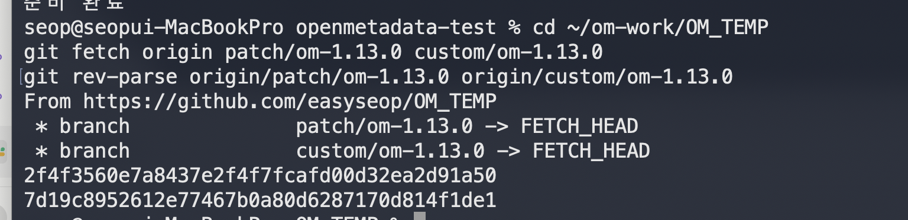
> <sub>실제로 이렇게 나옵니다. 맨 아래 두 줄이 위 기대값과 같습니다</sub>

### 두 명령이 하는 일이 다릅니다

| 명령 | 하는 일 |
|---|---|
| `git fetch` | GitHub 서버에서 갈래 **두 개를 내 컴퓨터로 받아옵니다.** 아직 아무것도 확인하지 않습니다 |
| `git rev-parse` | 받아온 두 갈래가 **지금 정확히 어느 코드를 가리키는지** 번호로 찍어 봅니다. 이게 확인입니다 |

`fetch` 는 받아만 오고 **작업 중인 파일은 건드리지 않습니다.** 그래서 바로
다음 6번의 결과가 여전히 비어 있게 나옵니다. 받아온 내용은 `origin/...` 이라는
별도 이름에 보관되며, 명령에 `origin/` 이 붙는 이유가 그것입니다.

### 왜 갈래를 두 개나 받나

하나만으로는 "어디까지가 우리가 한 것인지" 계산할 수 없기 때문입니다.

| 갈래 | 내용 |
|---|---|
| `patch/om-1.13.0` | **공식 OpenMetadata 1.13.0 그대로.** 우리 기능이 하나도 없음 |
| `custom/om-1.13.0` | 그 위에 **우리 기능 7개를 얹은 것.** 이것이 행내 전용 코드 |

```text
공식 OpenMetadata 1.13.0
  = patch/om-1.13.0 (2f4f3560e7…)
        │
        ├─ 기능 001 얹음
        ├─ 기능 002 얹음
        │   ⋮  (변경 기록 8건)
        └─ 기능 007 후속
              = custom/om-1.13.0 (7d19c89526…)

     custom (공식 + 우리 것)
   −  patch (공식만)
   ─────────────────────────
   =  우리가 손댄 것 111개
```

### 왜 굳이 번호를 찍어 보나

**갈래 이름은 움직이기 때문입니다.** `custom/om-1.13.0` 이라는 이름은 그대로여도,
누가 새 코드를 올리면 그 이름이 가리키는 **실제 코드가 바뀝니다.** 이름은
팻말이고 번호가 실물입니다.

이 시연의 모든 숫자 — `111`, `834`, `e490ed82dd…` — 는 **저 두 번호에서
출발했을 때만** 유효합니다. 그래서 시작 전에 못 박아 두고, 나중에 "그 숫자
어디서 나온 거냐"는 질문에 되짚어 갈 기준으로 씁니다.

> **값이 다르게 나오면 멈추십시오.** 원격 갈래가 그 사이 움직였다는 뜻이고,
> 뒤따르는 숫자가 문서와 맞지 않게 됩니다. 캡처해서 문의해 주십시오.

이 확인은 **예행연습 스크립트도 0단계에서 똑같이 합니다.** 5번을 건너뛰어도
스크립트가 잡아내며, 다르면 이렇게 멈춥니다.

```
중단: 1.13.0 공식 기준 branch 이(가) 기대와 다릅니다. 실제=... 기대=2f4f3560e7...
```

5번을 따로 둔 것은 **캡처 때문**입니다. 스크립트 출력보다 이 화면이 발표에
쓰기 깔끔합니다.

## 6. 작업 폴더가 깨끗한지

```bash
# 아직 기록하지 않은 변경을 한 줄씩 보여줍니다 (--porcelain 은 짧게 출력하라는 뜻)
git status --porcelain
```

**아무것도 안 나와야 합니다.**

### 왜 이걸 보나

`git status --porcelain` 은 **아직 기록하지 않은 변경**을 한 줄씩 보여줍니다.
아무 줄도 안 나온다는 것은, 지금 폴더의 내용이 5번에서 못 박은 그 코드와
정확히 같다는 뜻입니다.

여기서 뭔가 나온다면 두 가지 중 하나입니다.

| 나오는 것 | 뜻 |
|---|---|
| `M 파일이름` | 누군가 그 파일을 고쳐 놓고 기록하지 않았음 |
| `?? 파일이름` | 원래 없던 파일이 들어와 있음 |

어느 쪽이든 **5번에서 확인한 코드와 지금 폴더의 내용이 다르다**는 뜻입니다.
그 상태로 진행하면 검사 대상이 아닌 파일이 결과에 섞여 들어가고, 나중에
"이 파일은 왜 들어갔느냐"에 답할 수 없게 됩니다.

그래서 예행연습 스크립트도 0단계에서 같은 검사를 하고, 비어 있지 않으면
아예 시작하지 않습니다.

```
중단: 제품 저장소에 커밋하지 않은 변경이 있습니다. 정리 후 다시 실행하십시오
```

무엇이 남아 있는지 보려면 `--porcelain` 을 빼고 실행하면 자세히 나옵니다.

```bash
git status
```

---

# 2부 · GitHub 화면 캡처

브라우저에서 찍습니다. **창을 1400px 이상으로 넓혀 주십시오.** 좁으면
GitHub이 화면 요소를 감춥니다. 숫자가 보이는 윗부분만 있으면 되고,
파일 목록까지 내려가지 않으셔도 됩니다.

## G1. 갈래 두 개가 실제로 있다

```
github.com/easyseop/OM_TEMP/branches
```

`patch/om-1.13.0` 과 `custom/om-1.13.0` 이 목록에 보이면 됩니다.

`custom/om-1.13.0` 줄의 **`Ahead 8`** 도 함께 나오면 더 좋습니다. 우리 기능
8건이 공식 코드 위에 얹혀 있다는 것을 GitHub이 직접 센 값입니다.

> 📸 **G1**
>
> 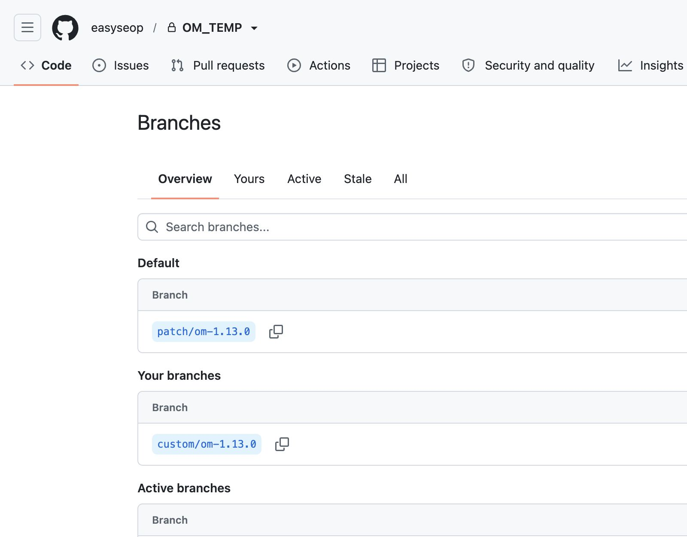
> <sub>실제로 이렇게 나옵니다. `patch/om-1.13.0` 가 Default, `custom/om-1.13.0` 가 Ahead 8</sub>

## G2. 우리가 손댄 파일이 111개다 ★

```
github.com/easyseop/OM_TEMP/compare/patch/om-1.13.0...custom/om-1.13.0
```

화면 위쪽 **`8 commits`** 와 **`111 files changed`** 가 핵심입니다.

> 📸 **G2** — 발표에서 "이 숫자는 GitHub이 세어준 것"이라고 말할 수 있는 근거
>
> 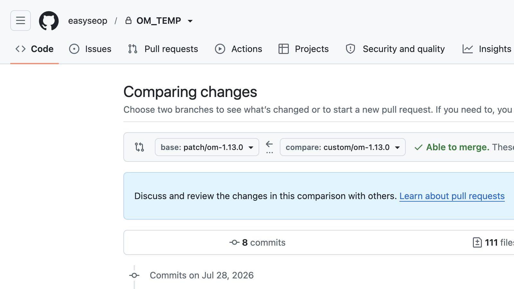
> <sub>실제로 이렇게 나옵니다. `8 commits` · `111 files changed` · `1 contributor`</sub>

> ⚠️ **오른쪽 초록색 `Create pull request` 버튼을 누르지 마십시오.**
> 두 갈래를 합치자는 요청이 저장소에 실제로 만들어집니다. 우리는 보기만
> 하는 중입니다. 실수로 누르셨으면 만들어진 페이지에서 `Close pull request`
> 로 닫으면 되고, 그것만으로 코드가 바뀌지는 않습니다.

### 왼쪽·오른쪽 방향이 맞는지

```
base: patch/om-1.13.0        ← 기준점 (공식 코드만)
compare: custom/om-1.13.0    ← 비교 대상 (공식 + 우리 기능)
```

GitHub은 **기준점에는 없고 비교 대상에만 있는 것**을 보여줍니다. 그래서 이
방향이면 결과가 곧 **우리가 더한 것**입니다. 뒤집으면 같은 111개가 나오지만
"빼는 것"으로 표시돼 읽기 헷갈립니다.

### 아래 기록 목록도 같이 보십시오

5번에서 터미널로 확인한 것과 같은 기록입니다. GitHub은 7자리, 예행연습
스크립트는 10자리로 보여줄 뿐 같은 것입니다.

| GitHub 화면 | 5번 터미널 |
|---|---|
| `add InstanceCode customization` · `4df83b3` | `4df83b311f` |
| `add QueryReport customization` · `68ebed4` | `68ebed4801` |
| `add Data Assertions customization` · `57ee1b3` | `57ee1b3b23` |
| `add bank column view customization` · `274f2b7` | `274f2b79b4` |

주소가 열리지 않으면 갈래 이름의 `/` 때문일 수 있습니다. 그때는
저장소에서 **Compare** 버튼을 누르고 드롭다운으로 왼쪽 `patch/om-1.13.0`,
오른쪽 `custom/om-1.13.0` 을 고르십시오. 결과는 같습니다.

## G3. 기능별 변경 기록 8건

```
github.com/easyseop/OM_TEMP/commits/custom/om-1.13.0
```

> 📸 **G3** — 목록 전체. **맨 아래 줄까지 나오게** 찍으십시오.
>
> 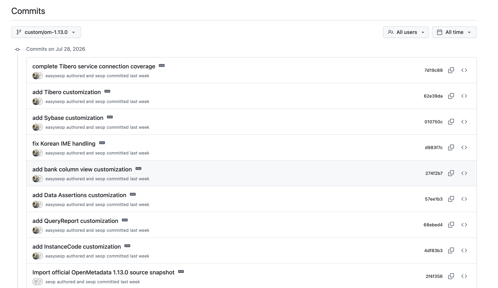
> <sub>실제로 이렇게 나옵니다. 맨 아래 `Import official OpenMetadata 1.13.0 source snapshot` 이 출발점이고 그 위에 8건이 쌓여 있습니다</sub>

### 맨 아래 줄이 출발점입니다

목록 맨 아래에 `Import official OpenMetadata 1.13.0 source snapshot` ·
`2f4f356` 이 있습니다. 이것이 5번에서 확인한 `2f4f3560e7…`, 곧 **공식 코드만
있는 출발점**입니다. 그 위로 우리 기능 8건이 쌓여 있습니다.

```text
7d19c89  complete Tibero service connection coverage   ← 맨 위 = custom/om-1.13.0
62e39da  add Tibero customization
010750c  add Sybase customization
d983f7c  fix Korean IME handling                         우리 기능 8건
274f2b7  add bank column view customization
57ee1b3  add Data Assertions customization
68ebed4  add QueryReport customization
4df83b3  add InstanceCode customization
─────────────────────────────────────────
2f4f356  Import official OpenMetadata 1.13.0 snapshot  ← 맨 아래 = 출발점(공식)
```

5번에서 터미널로 설명한 구조가 **이 한 화면에 다 들어 있습니다.** 발표에서
"공식 코드 위에 우리 기능을 쌓았다"를 말할 때 이 그림 하나면 됩니다.

## G3b. 이름표가 붙은 실제 화면 ★

목록에서 아무 기록이나 눌러 상세 화면을 엽니다. **두 개를 골라 주십시오.**

```
github.com/easyseop/OM_TEMP/commit/4df83b3     ← 큰 기능
github.com/easyseop/OM_TEMP/commit/d983f7c     ← 작은 기능
```

**보여야 할 것:** 제목 아래의 `Customization-ID:` 줄과 `N files changed`

> 📸 **G3b-1**, **G3b-2**
>
> 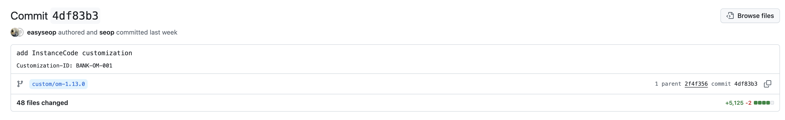
> <sub>큰 기능 — `Customization-ID: BANK-OM-001`, `48 files changed`</sub>
>
> 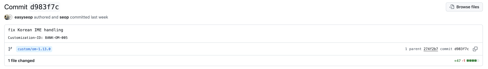
> <sub>작은 기능 — `Customization-ID: BANK-OM-005`, `1 file changed`</sub>

### 왜 이게 중요한가

```
add InstanceCode customization
Customization-ID: BANK-OM-001      ← 이 한 줄
```

이 줄이 **"이 변경은 어느 기능의 작업인가"를 코드에 직접 새겨 넣은 것**입니다.
검사기는 이 줄을 읽어 등록표와 대조합니다. 줄이 없거나 두 개면 검사가 즉시
멈춥니다. 이 시스템 전체가 이 한 줄 위에 서 있습니다.

### 크기가 다른 둘을 고르는 이유

| 기록 | 기능 | 바꾼 파일 |
|---|---|---|
| `4df83b3` | BANK-OM-001 기준코드 | **48개** |
| `d983f7c` | BANK-OM-005 한글 입력 | **1개** |

같은 "기능 하나"인데 규모가 48배 차이납니다. **기능마다 크기가 제각각이어도
똑같이 이름표 하나로 관리된다**는 것을 보여주는 대비입니다.

참고로 8건 전체의 파일 수는 다음과 같습니다.

```text
BANK-OM-001  48개    BANK-OM-005   1개
BANK-OM-002  55개    BANK-OM-006  18개
BANK-OM-003  25개    BANK-OM-007   8개
BANK-OM-004  33개    BANK-OM-007   2개 (후속)
```

`4df83b3` 화면의 `1 parent 2f4f356` 도 함께 나오면 좋습니다. 첫 기능이
**출발점 바로 위에 얹혀 있다**는 증거입니다.

## G4. 공식 1.13.1이 실제로 배포돼 있다

```
github.com/open-metadata/OpenMetadata/releases/tag/1.13.1-release
```

**보여야 할 것:** 제목 `1.13.1-release` 와 그 아래 줄의 **`afcb2d2`**

> 📸 **G4**
>
> 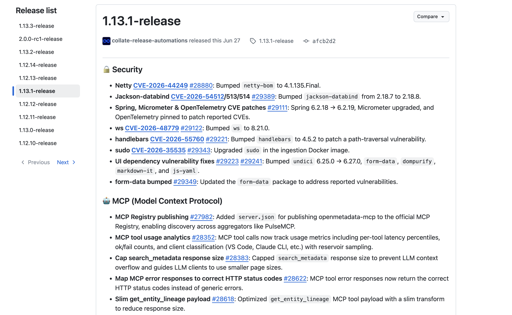
> <sub>실제로 이렇게 나옵니다. 제목 옆 `afcb2d2` 가 터미널이 대조하는 번호입니다</sub>

`afcb2d2` 는 3부 구간 2에서 터미널이 확인하는 `afcb2d2cd7e7c28f1d0ce…` 와
같은 번호입니다. **우리가 받아온 것이 공식이 낸 바로 그것**이라는 연결이
이 한 화면에 있습니다.

> **새 버전이 나온 것을 시스템이 알아서 탐지하지는 않습니다.**
> 어느 버전으로 올릴지는 **사람이 정해서 적어 넣습니다.** 자동으로 하는 것은
> 그다음부터입니다 — 지목한 버전을 공식에서 받아오고, 번호가 맞는지 대조하고,
> 우리 기능에 미치는 영향을 계산하는 일. 발표 중 "그럼 새 버전이 나오면
> 자동으로 알려주나요?"라는 질문이 나오면 이렇게 답하시면 됩니다.

## G5. 공식이 바꾼 파일이 834개다 ★

```
github.com/open-metadata/OpenMetadata/compare/1.13.0-release...1.13.1-release
```

화면 위쪽 탭에 있는 **`Files changed 834`** 가 핵심입니다. 그 왼쪽의
`Commits 168` 은 공식이 두 버전 사이에 쌓은 변경 기록 수입니다 — 우리 쪽
8건과 대비됩니다.

> 📸 **G5** — G2의 111과 나란히 놓고 "축이 다른 두 숫자"를 설명하는 데 씁니다
>
> 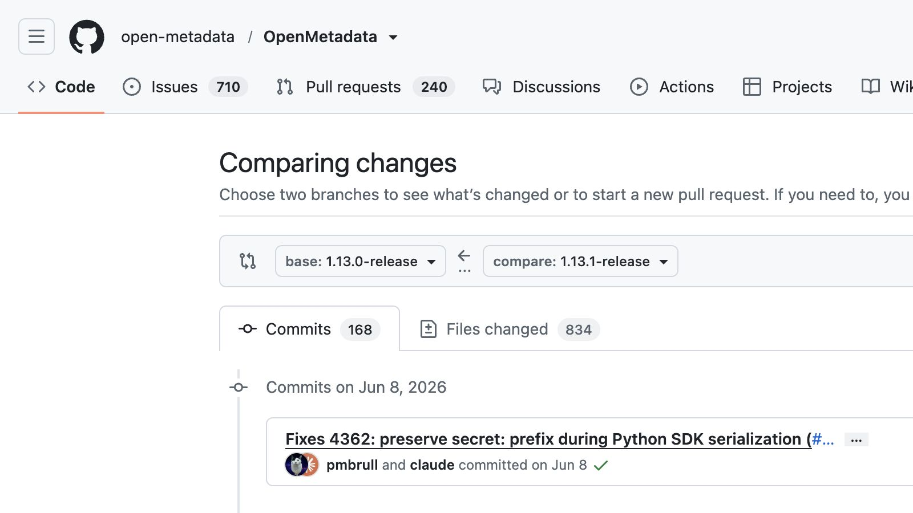
> <sub>실제로 이렇게 나옵니다. `Commits 168` · `Files changed 834`</sub>

## G6. 검사 기준은 어디에 적혀 있나

> **여기서 이야기가 한 번 바뀝니다.** G1~G5 는 모두 *코드가 어떻게 생겼는가*
> 였고, 저장소도 두 곳(제품·공식)뿐이었습니다. 그런데 코드만 봐서는 "이 파일이
> 없어지면 안 되는 것인지" 알 수 없습니다. 그 판단 기준을 **미리 적어 둔 곳**이
> 세 번째 저장소이고, 다음 화면이 그 실물입니다.

```
github.com/easyseop/openmetadata-test/blob/claude/markdown-file-feedback-26933w/harness/registrations/om-temp-1.13.0/manifests/BANK-OM-001.yaml#L56-L58
```

주소 끝의 `#L56-L58` 을 **빠뜨리지 마십시오.** 이걸 붙여야 115줄짜리 파일에서
필요한 부분만 노랗게 강조된 채 열립니다.

> ⚠️ **`Raw` 버튼을 누르지 마십시오.** 누르면 GitHub 화면 없이 원문 글씨만
> 나와서 발표에 쓸 수 없습니다. 주소를 그대로 열면 됩니다.

**보여야 할 것:** `changed_paths` 목록의 끝부분과, 강조된
`required_changed_paths` 두 줄

> 📸 **G6** — 115줄이라 위·중간·아래 세 장으로 나눠 찍습니다.
>
> 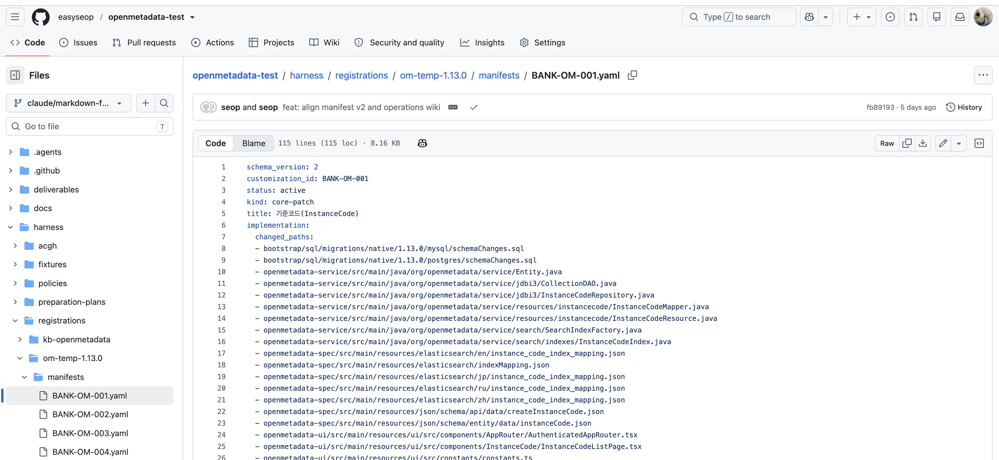
> <sub>1~26줄. 머리말 6줄과 `changed_paths` 시작</sub>
>
> 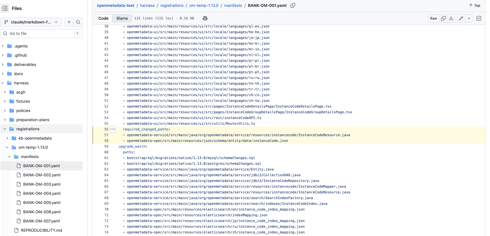
> <sub>56~58줄이 노랗게 강조된 부분. 이 화면이 G6의 핵심입니다</sub>
>
> 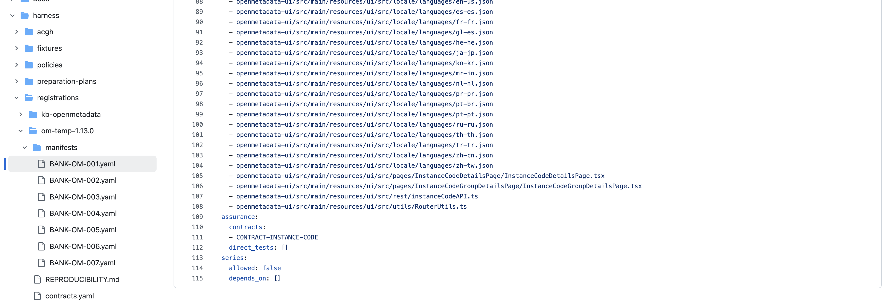
> <sub>88~115줄. `upgrade_watch` 끝과 `assurance`·`series`</sub>

### 이 파일 한 장의 구조

`BANK-OM-001.yaml` 은 115줄이고, 크게 **네 구역**으로 나뉩니다.

| 줄 | 구역 | 뜻 | 개수 |
|---|---|---|---|
| 1~6 | 머리말 | 번호·제목·종류 | — |
| 7~55 | `changed_paths` | **이 기능이 손댄 파일 전부** | 48개 |
| 56~58 | `required_changed_paths` | 그중 **없어지면 안 되는 것** | 2개 |
| 59~108 | `upgrade_watch.paths` | **공식이 바꾸면 확인해야 할 것** | 49개 |
| 109~115 | 꼬리말 | 정상 판정 조건, 연결 관계 | — |

세 번째 구역이 3부 구간 3에서 본 `48개 중 22개` 같은 숫자의 출처입니다.

### 48개를 갈라 보면

`changed_paths` 48개는 성격이 두 가지로 나뉩니다. **공식 1.13.0에 그 파일이
원래 있었는지**로 갈라집니다.

```text
BANK-OM-001 기준코드(InstanceCode) 기능 · 48개

  ┌─ 원래 있던 공식 파일을 고친 것 ······ 32개
  │     ├─ 번역 문구 파일 ················ 19개
  │     └─ 그 외 ························ 13개
  │           Entity.java, CollectionDAO.java,
  │           constants.ts, RouterUtils.ts …
  │
  └─ 원래 없던 파일을 새로 만든 것 ······· 16개
        InstanceCodeResource.java,
        InstanceCodeRepository.java,
        instanceCode.json,
        InstanceCodeListPage.tsx …
```

파일 이름만 봐도 갈립니다. **`InstanceCode…` 라는 이름이 붙은 것은 새로 만든
것**입니다. 공식 OpenMetadata에는 "기준코드"라는 개념 자체가 없으니 그런
이름의 파일도 없었습니다.

새 기능 하나를 넣으려면 **새 파일을 만드는 것만으로는 안 됩니다.** 만든 것을
기존 프로그램이 알아보게 해 줘야 합니다.

| 고친 기존 파일 | 왜 고쳐야 했나 |
|---|---|
| `Entity.java` | 프로그램에 "기준코드라는 종류가 있다"고 등록 |
| `CollectionDAO.java` | 데이터베이스에서 읽고 쓰는 통로를 연결 |
| `RouterUtils.ts` · `AuthenticatedAppRouter.tsx` | 화면 주소를 새 페이지에 연결 |
| `constants.ts` · `entity.enum.ts` | 이름·상수 목록에 항목 추가 |
| `schemaChanges.sql` | 데이터베이스에 표를 새로 만드는 명령 추가 |
| `ko-kr.json` 등 번역 19개 | 화면에 나올 문구를 언어별로 추가 |

번역 파일이 19개나 되는 것은 OpenMetadata가 19개 언어를 지원하기 때문입니다.
한 기능을 넣으면 언어마다 문구를 한 줄씩 넣게 됩니다.

### 흔한 오해 — "required = 우리가 새로 만든 것" 이 아닙니다

BANK-OM-001만 보면 그렇게 보입니다. 강조된 두 줄이 마침 둘 다 새로 만든
파일이기 때문입니다.

```yaml
required_changed_paths:
- …/instancecode/InstanceCodeResource.java     ← 새로 만든 파일
- …/json/schema/entity/data/instanceCode.json  ← 새로 만든 파일
```

**그러나 규칙이 아닙니다.** 다른 기능을 보면 반대입니다.

| 기능 | 손댄 파일 | 새로 만든 것 | `required` 로 지목한 것 |
|---|---|---|---|
| BANK-OM-001 기준코드 | 48개 | 16개 | 새로 만든 파일 2개 |
| BANK-OM-002 조회리포트 | 55개 | 18개 | 새로 만든 파일 2개 |
| BANK-OM-003 데이터점검 | 25개 | 3개 | 새로 만든 파일 2개 |
| **BANK-OM-004 컬럼보기** | 33개 | **0개** | **기존 공식 파일 1개** |
| **BANK-OM-005 한글입력** | 1개 | **0개** | **기존 공식 파일 1개** |
| BANK-OM-006 Sybase 연결 | 18개 | 3개 | 새로 만든 파일 1개 |
| BANK-OM-007 Tibero 연결 | 10개 | 3개 | 새로 만든 파일 1개 |

BANK-OM-004와 005는 **새로 만든 파일이 하나도 없습니다.** 원래 있던 공식
코드만 고친 기능입니다. 그래도 "없어지면 안 되는 것"은 있어야 하니, 기존
파일을 지목해 뒀습니다.

두 항목의 실제 차이는 이렇습니다.

| | `changed_paths` | `required_changed_paths` |
|---|---|---|
| 누가 정하나 | **기계** — Git 기록에서 그대로 읽음 | **사람** — 담당자가 판단해 지목 |
| 무엇이 들어가나 | 손댄 파일 **전부** | 그중 골라낸 **일부** |
| 신규/기존 | 섞여 있음 | 섞여 있음 (기능마다 다름) |

그래서 5부의 `plan` 이 `required_changed_paths` 를 자동으로 못 정하고 사람에게
묻는 것입니다. **"이게 없으면 이 기능은 죽은 것"** 은 코드를 읽어서 나오는
사실이 아니라 업무 판단이기 때문입니다.

### 그럼 왜 목록을 둘로 나누나 — 판정이 다릅니다

업그레이드 뒤 검사기는 **두 목록에 똑같은 검사 두 가지**를 합니다.

| 검사 | 묻는 것 |
|---|---|
| 파일이 있는가 | 새 코드에 그 파일이 남아 있나 |
| 공식과 내용이 다른가 | 우리가 넣은 변경이 아직 살아 있나 |

두 번째가 중요합니다. **파일이 남아 있어도 내용이 공식과 똑같아졌다면
우리 변경은 사라진 것**이기 때문입니다. 업그레이드하면서 공식 코드로
덮여 버린 경우가 여기 해당합니다.

같은 검사인데, **어느 목록에 있느냐에 따라 결과가 갈립니다.**

| 발견한 것 | `changed_paths` 에만 있는 파일 | `required_changed_paths` 에 있는 파일 |
|---|---|---|
| 파일이 사라짐 | `expected_path_missing`<br>**확인 필요** (종료코드 2) | `required_path_missing`<br>**중단** (종료코드 1) |
| 내용이 공식과 같아짐 | `expected_state_not_distinct`<br>**확인 필요** (종료코드 2) | `required_state_not_distinct`<br>**중단** (종료코드 1) |

- **확인 필요** — 사람이 보고 "괜찮다" 하면 넘어갑니다.
- **중단** — 사람이 승인해도 이 단계에서는 통과시킬 수 없습니다.

### "파일이 사라짐" 이 실제로 일어나나

**일어납니다.** 공식이 1.13.0 → 1.13.1 로 가면서 한 일을 세어 보면 이렇습니다.

| | 파일 수 |
|---|---|
| 새로 추가 | 137개 |
| 내용 수정 | 694개 |
| **삭제** | **2개** |
| **이름 변경** | **1개** |

파일이 없어지는 것은 특별한 사고가 아니라 **공식이 버전을 올릴 때 늘 하는
일**입니다. 정리하거나 다른 폴더로 옮기면서 생깁니다.

다만 **이번에는 우리와 겹치지 않았습니다.** OpenMetadata 가 없앤 3개는 우리가 손댄
111개에 하나도 포함되지 않습니다. 그래서 3부 실행에서 이 경고가 나오지
않았습니다. 다음 버전에서도 그러리라는 보장은 없습니다.

없어지는 경로는 파일 성격에 따라 다릅니다.

| 어떤 파일 | 없어지는 경우 |
|---|---|
| 공식 파일을 고친 것 (68개) | **공식이 그 파일을 지우거나 옮김.** 우리가 고칠 대상 자체가 사라진 것 |
| 우리가 새로 만든 것 (43개) | 공식은 이 파일을 모르므로 지울 수 없음. **우리 기능을 새 코드 위에 다시 얹는 데 실패**했다는 뜻 |

### 두 경우를 똑같이 잡나

**심각도는 같고, 표시되는 이름이 다릅니다.**

| 상황 | 표시 | 판정 |
|---|---|---|
| 파일이 아예 없다 | `…_path_missing` | 목록에 따라 확인 필요 / 중단 |
| 파일은 있는데 공식과 내용이 같다 | `…_state_not_distinct` | 〃 |

둘 다 결론은 하나입니다 — **새 코드에 우리 변경이 없다.** 그래서 판정을
다르게 둘 이유가 없습니다.

이름을 나눈 것은 **어디를 봐야 하는지가 다르기 때문**입니다.

- `path_missing` → 공식 저장소에서 그 파일이 어디로 갔는지 찾습니다
- `state_not_distinct` → 우리 변경이 왜 덮였는지 그 파일 안을 봅니다

한 파일에 두 이름이 동시에 나오지는 않습니다. 파일이 없으면 내용을 비교할
수 없으니, **먼저 있는지 보고 있을 때만 내용을 비교합니다.**

### 왜 이렇게 나눴나

**둘 중 하나만 두면 안 되기 때문입니다.**

`required` 만 두면 — BANK-OM-001에서 검사받는 파일이 48개가 아니라 **2개**가
됩니다. 나머지 46개는 통째로 사라져도 아무도 모릅니다.

`changed_paths` 만 두고 전부 중단 기준으로 삼으면 — **업그레이드가 사실상
불가능해집니다.** BANK-OM-001의 48개 중 19개가 번역 문구 파일인데, 공식이
같은 자리에 비슷한 문구를 넣기만 해도 "내용이 같아졌다"로 멈춥니다. 기능은
멀쩡한데 말입니다.

그래서 **전부 보되, 멈추는 것은 핵심만**으로 나눴습니다.

```text
changed_paths 48개  ← 하나도 놓치지 않고 전부 본다
    └─ required 2개  ← 이 둘만 사라지면 즉시 멈춘다
```

BANK-OM-001로 예를 들면 이렇습니다.

| 파일 | 어디 속하나 | 사라지면 |
|---|---|---|
| `ko-kr.json` (한글 문구) | `changed_paths` 만 | 확인 필요 — 문구는 다시 넣으면 됨 |
| `constants.ts` (상수 추가) | `changed_paths` 만 | 확인 필요 |
| `InstanceCodeResource.java` | **`required`** | **중단** — 기준코드 기능의 입구 |
| `instanceCode.json` | **`required`** | **중단** — 기준코드의 정의 자체 |

담당자가 고른 2개는 **"이게 없으면 기준코드 기능이라고 부를 수 없는 것"**
입니다. 나머지 46개는 있으면 좋지만 없어도 기능이 죽지는 않습니다. 그
구분이 코드에는 없고 업무에만 있어서, 사람이 지목하는 것입니다.

> 이 동작은 시험으로 고정돼 있습니다 —
> `harness/tests/test_survival.py` 의
> `test_required_path_missing_blocks`,
> `test_required_path_identical_to_upstream_blocks`,
> `test_non_required_expected_path_missing_requires_approval`,
> `test_non_required_expected_path_absorbed_by_upstream_requires_approval`.

### 그럼 등록표를 처음 만들 때 required 는 비어 있나

**아닙니다. 비워 둘 수 없습니다.** 새 기능에 번호를 발급할 때 사람이 반드시
적어 넣어야 하는 항목입니다.

새 BANK-OM 번호를 만들려면 `plan` 에 **입력 파일을 하나 더** 줍니다.

```bash
… plan … --new-id-input ~/om-work/new-id.yaml
```

그 파일에 아래 여덟 항목이 **모두** 있어야 합니다. 하나라도 빠지면
`INVALID_NEW_CUSTOMIZATION` 으로 막힙니다.

```yaml
BANK-OM-008:
  title: 예금 상품 코드                 # 기능 이름
  owner: 데이터관리부 홍길동             # 담당자
  owner_status: assigned              # assigned | pending
  criticality: high                   # low | medium | high | critical
  kind: core-patch                    # core-patch | extension | governance
  provenance: candidate-follow-up
  required_changed_paths:             # ★ 없어지면 안 되는 파일
  - openmetadata-spec/…/depositCode.json
  contracts:                          # 정상이라고 판단할 조건
  - CONTRACT-DEPOSIT-CODE
```

> `contracts` 에 적는 이름은 **`contracts.yaml` 에 이미 등록돼 있어야 하고**,
> 그쪽에도 이 번호가 적혀 있어야 합니다. 한쪽만 적으면
> `lacks reverse binding` 으로 막힙니다. 양쪽이 서로를 가리켜야 "이 기능은
> 이 조건으로 판정한다"가 성립하기 때문입니다.

기계가 채우는 것과 사람이 채우는 것이 정확히 갈립니다.

| 항목 | 누가 | 근거 |
|---|---|---|
| `changed_paths` | **기계** | Git 기록에서 그대로 읽음 |
| `upgrade_watch.paths` | **기계** | `changed_paths` 중 공식에도 있는 것 |
| `required_changed_paths` | **사람** | 코드에 없는 판단 |
| `title` · `owner` · `criticality` | **사람** | 〃 |
| `contracts` | **사람** | 〃 |

`kind: core-patch` 인 기능은 `required_changed_paths` 가 **빈 목록이어도
안 됩니다.** 최소 한 개는 지목해야 등록표 자체가 읽히지 않고 오류로 멈춥니다.

```
core-patch must declare at least one required_changed_paths entry
```

지금 등록된 7개는 **전부 `core-patch`** 이고, 그래서 전부 1개 이상을
가지고 있습니다.

적어 넣는 경로는 **`changed_paths` 안에 있는 것이어야** 합니다. 손대지도
않은 파일을 "없어지면 안 된다"고 지목할 수는 없기 때문입니다. 벗어나면
이렇게 막힙니다.

```
required path not covered by current changed scope: '…'
```

### 이미 있는 기능에 파일이 새로 늘어났을 때도 묻습니다

번호를 새로 만들 때만이 아닙니다. 기존 기능이 **전에 없던 파일을 건드리면**
`plan` 이 그 파일 하나하나에 대해 다시 묻습니다.

```
REQUIRED_PATH_DECISION
새 변경 파일이 빠질 때 기능이 소실되는지 판단하고
required_changed_paths 추가 여부를 확인해야 합니다.
```

**정리하면 — `required` 는 처음에도 사람이 정하고, 파일이 늘어날 때마다
다시 사람에게 묻습니다.** 기계가 이 값을 스스로 채우는 경로는 없습니다.

### 등록표 7장을 합치면 G2의 111이 됩니다

| | 값 |
|---|---|
| 등록표 7장의 `changed_paths` 를 그냥 더하면 | 190개 |
| 같은 파일을 여러 기능이 함께 손댄 것을 하나로 세면 | **111개** |
| G2의 GitHub 비교 화면 | **111 files changed** |

**정확히 맞습니다.** 등록표에 적힌 파일 목록과 GitHub이 직접 센 파일 목록이
한 개도 어긋나지 않습니다. 이것이 "등록표가 실제 코드와 맞다"는 뜻입니다.

190과 111의 차이 79개는 **여러 기능이 같은 파일을 함께 만졌기** 때문입니다.
예를 들어 번역 파일 `ko-kr.json` 하나에 네 기능이 각자 문구를 넣었습니다.

중복을 제거한 111개를 다시 갈라 보면 이렇게 됩니다.

```text
우리가 손댄 파일 111개
  ├─ 원래 있던 공식 파일을 고친 것 ······ 68개
  └─ 원래 없던 파일을 새로 만든 것 ······ 43개
```

발표에서는 이렇게 말씀하시면 됩니다 —

> "우리가 손댄 파일은 111개고, 그중 43개는 새로 만든 것, 68개는 공식 코드를
> 고친 것입니다. **고친 68개가 업그레이드 때 충돌하는 부분**입니다. 새로
> 만든 43개는 OpenMetadata 에 없는 파일이라 충돌할 일이 없습니다."

이 68개가 3부 구간 5에서 실제로 충돌이 나는 파일들입니다.

---

# 3부 · 예행연습 실행

## 무엇을 예행연습하는 것인가

**상황을 이렇게 놓고 시작합니다.**

> 우리는 공식 OpenMetadata **1.13.0** 위에 행내 기능 7개를 얹어 쓰고 있습니다.
> 오늘 공식이 **1.13.1** 을 냈습니다. 이제 올려야 합니다.

이 스크립트는 그 업그레이드를 **실제로 한 번 해 봅니다.** 공식 1.13.1을
받아 와서, 그 위에 우리 기능 8건을 **처음부터 다시 얹어** 새 코드 덩어리를
만듭니다. 이렇게 만들어진 것을 **후보**라고 부릅니다.

```text
     공식 1.13.0 ──── 우리 기능 8건 ────► 지금 쓰는 코드
          │
          │  공식이 834개 파일을 바꿈
          ▼
     공식 1.13.1 ──── 우리 기능 8건 ────► 후보  ← 이걸 만드는 것
                       (다시 얹기)
```

## 무엇을 확인하려는 것인가

네 가지입니다.

| | 확인하는 것 | 어디서 나오나 |
|---|---|---|
| 1 | 공식이 바꾼 834개가 **우리 기능 어디에 닿는가** | 구간 3 |
| 2 | 우리 기능 8건이 새 코드 위에 **실제로 다시 얹히는가** | 구간 5 |
| 3 | 얹다가 충돌한 곳이 **자동으로 풀리는 종류인가** | 구간 5 |
| 4 | 이 결과가 **누가 돌려도 같은가** | 4부 |

네 번째가 이 시연의 결론입니다. "우리가 해 보니 되더라"가 아니라 "누가
해도 같은 결과가 나온다"를 말할 수 있어야 하기 때문입니다.

## 무엇은 확인하지 않는가

**여기서 확인하는 것은 "코드를 읽어서 알 수 있는 것"까지입니다.**

| 확인하지 않는 것 | 언제 하나 |
|---|---|
| 프로그램이 빌드되는가 | 별도 단계 |
| 화면이 뜨고 기능이 실제로 도는가 | 별도 단계 |
| 등록표를 새 코드에 맞추는 것 | 5부 — 사람 승인이 필요해서 뺐습니다 |

## 무엇을 건드리지 않는가

시연이라 걱정되실 수 있어 미리 적어 둡니다.

| | |
|---|---|
| 원격 저장소 (GitHub) | **아무것도 올리지 않습니다** |
| 등록 폴더 | 건드리지 않습니다 |
| OM_TEMP 의 기존 갈래 | 바꾸지 않습니다 |
| 만들어지는 곳 | `~/om-work/upgrade-rehearsal/` 새 폴더 안에만 |

되돌리려면 그 폴더를 지우면 됩니다. 0부 ① 의 세 줄이 그것입니다.

## 실행

**반드시 `openmetadata-test` 폴더에서** 실행합니다.

```bash
# ① 검사 도구가 있는 저장소로 이동합니다.
#    검사 대상(OM_TEMP)이 아니라 검사 도구 쪽에서 명령을 칩니다.
cd ~/om-work/openmetadata-test

# ② 예행연습을 실행합니다. 아래 한 줄이 세 부분으로 되어 있습니다.
#
#    PYTHON=./.venv/bin/python
#        1부 4번에서 만든 전용 파이썬을 쓰라는 뜻입니다.
#        컴퓨터에 원래 깔린 파이썬에는 필요한 준비물이 없어서 지정해 줍니다.
#
#    harness/tools/upgrade_rehearsal.sh
#        예행연습 스크립트. 검사 저장소 안에 들어 있습니다.
#
#    ~/om-work/OM_TEMP
#        검사할 제품 코드가 있는 폴더. 읽기만 하고 바꾸지 않습니다.
PYTHON=./.venv/bin/python harness/tools/upgrade_rehearsal.sh ~/om-work/OM_TEMP
```

화면이 6개 구간으로 흘러갑니다. 구간마다 캡처하십시오. 중간에 멈추면
맨 아래 **막혔을 때** 표를 보시면 됩니다.

## 구간 0 — 사전 점검

```
  OK  제품 저장소가 깨끗합니다
  OK  1.13.0 제품 원본 branch = 2f4f3560e7a8437e2f4f7fcafd00d32ea2d91a50
  OK  1.13.0 행내 branch = 7d19c8952612e77467b0a80d6287170d814f1de1
  OK  두 branch 사이 변경 파일 수 = 111
```

> 📸 **④**
>
> 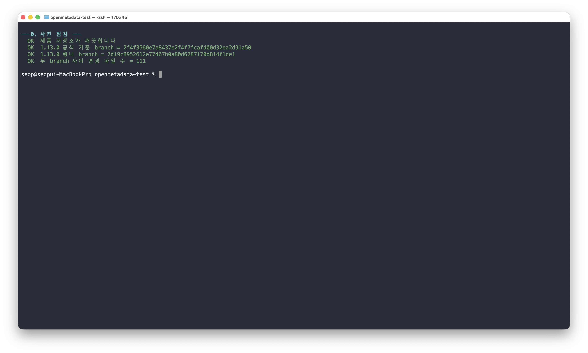
> <sub>실제로 이렇게 나옵니다 (2026-08-03 실행)</sub>

## 구간 1 — 기능별 변경 기록과 이름표

```
4df83b311f | BANK-OM-001 | add InstanceCode customization
68ebed4801 | BANK-OM-002 | add QueryReport customization
57ee1b3b23 | BANK-OM-003 | add Data Assertions customization
274f2b79b4 | BANK-OM-004 | add bank column view customization
d983f7c540 | BANK-OM-005 | fix Korean IME handling
010750c514 | BANK-OM-006 | add Sybase customization
62e39da8be | BANK-OM-007 | add Tibero customization
7d19c89526 | BANK-OM-007 | complete Tibero service connection coverage
  OK  변경 기록 8건 모두 이름표가 정확히 하나입니다
```

> 📸 **⑤**
>
> 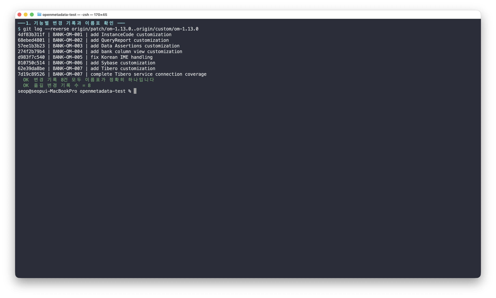
> <sub>실제로 이렇게 나옵니다 (2026-08-03 실행)</sub>

## 구간 2 — OpenMetadata 배포본 받기

```
  OK  OpenMetadata 1.13.0 기록 번호 = f329dd4a7e47134a2bd5a06af6181b0ee527ddd9
  OK  OpenMetadata 1.13.1 기록 번호 = afcb2d2cd7e7c28f1d0ce60538c60a96f4eb9dc9
```

> 📸 **⑥**
>
> 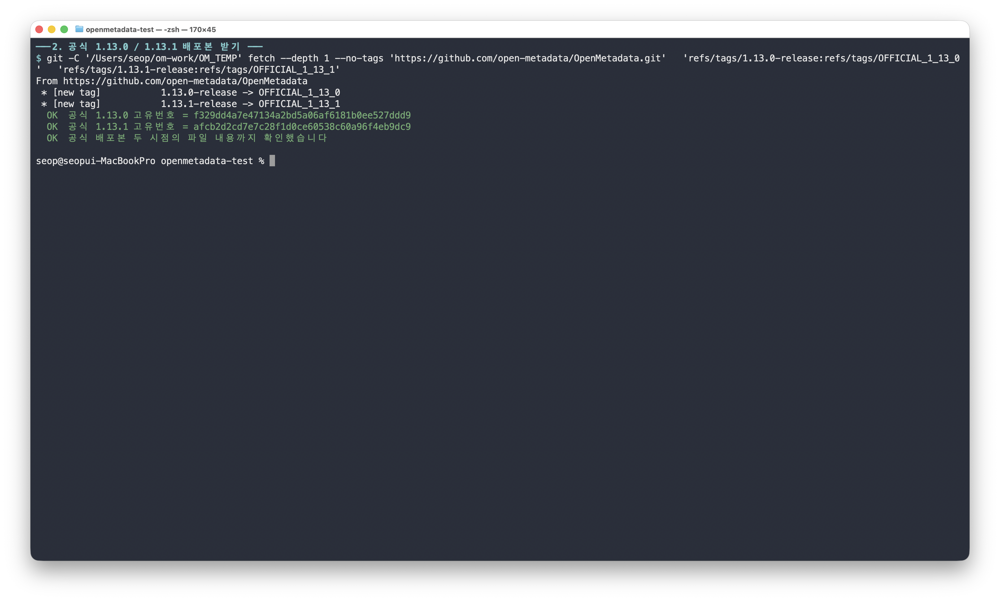
> <sub>실제로 이렇게 나옵니다 (2026-08-03 실행)</sub>

## 구간 3 — 적용 전 영향 확인 ★

**이 구간이 이 시연에서 가장 설명이 필요한 부분입니다.** 화면에 JSON이
길게 쏟아지는데, 읽는 법만 알면 어렵지 않습니다.

> 📸 **⑦** — 화면이 길어서 위·아래 두 장으로 나눠 찍습니다. 아래 설명마다
> 해당 부분을 다시 붙여 두었으니 **보면서 읽으시면 됩니다.**

> 화면의 `공식`·`upstream`·`OFFICIAL_1_13_0` 은 모두 같은 것을 가리킵니다 —
> **우리가 손대지 않은 OpenMetadata 제품 원본**입니다. 나머지 말은 문서
> 맨 앞 **「이 문서에서 쓰는 말」** 표에 있습니다.

### 한 줄로 말하면

> **OpenMetadata가 1.13.0 → 1.13.1로 가면서 바꾼 834개 중, 우리가 감시
> 목록에 적어 둔 파일이 몇 개나 걸렸는지 세어 주는 것**입니다.

### 숫자가 어디서 나온 것인지부터

화면에는 숫자가 여러 개 나오는데 **출처가 다릅니다.** 이걸 구분하지 않으면
헷갈립니다.

| 숫자 | 무엇을 센 것 | 누가 센 것 | 미리 확인해 둔 값 |
|---|---|---|---|
| **834** | OpenMetadata 1.13.0 → 1.13.1 사이 파일 차이 | 검사기 | **G5** 화면 `Files changed 834` — 같음 ✓ |
| **111** (구간 0) | 우리가 손댄 파일 수 | 검사기 | **G2** 화면 `111 files changed` — 같음 ✓ |
| **8** (구간 1) | 우리 변경 기록 수 | 검사기 | **G2** `8 commits`, **G3** 목록 — 같음 ✓ |
| **48** (분모) | BANK-OM-001 감시 목록의 크기 | **등록표에 적힌 값** | **G6-3** 화면 `upgrade_watch.paths` — 같음 ✓ |
| **22** | 감시 목록 48개 중 이번에 바뀐 것 | 검사기 | **미리 알 수 없는 값** — 이번에 처음 나옵니다 |

앞의 네 개는 **2부에서 GitHub 화면으로 이미 확인한 값**입니다. 터미널이
같은 숫자를 다시 뱉는지 대조하는 용도입니다. 하나라도 다르면 그 자리에서
멈춥니다.

**마지막 22가 이 구간에서 새로 나오는 유일한 정보입니다.** 나머지는 다
"아까 본 그 숫자가 맞다"는 확인이고, 22는 "그래서 이번 업그레이드가 우리
기능에 이만큼 닿는다"는 답입니다.

> **감시 목록은 어느 등록 폴더에서 읽나** — 구간 3은
> `harness/registrations/om-temp-1.13.1` 을 읽습니다. G6에서 브라우저로
> 열어 본 것은 `om-temp-1.13.0` 쪽이었습니다. **지금은 두 폴더의 감시
> 목록이 같아서** 48이라는 숫자가 양쪽에서 똑같이 나옵니다.

### 지금은 아직 합치기 전입니다 — 그래서 감시 목록만 나옵니다

**맞습니다.** 이 시점에는 새 코드 덩어리(후보)가 아직 없습니다. 비교할 수
있는 것이 **목록 두 개**뿐입니다.

```text
등록표의 감시 목록          OpenMetadata 가 바꾼 파일
   (48개)         ∩            (834개)         =  22개
```

파일 내용을 비교한 것이 아니라 **파일 이름이 겹치는지만 본 것**입니다.
그래서 여기 숫자는 "닿았다"이지 **"깨졌다"가 아닙니다.**

무엇을 언제 알 수 있는지 순서로 보면 이렇습니다.

| 시점 | 알 수 있는 것 | 어디서 |
|---|---|---|
| **합치기 전** (지금) | 감시 목록에 **닿았는가** | **구간 3** |
| 합치는 중 | 실제로 **충돌하는가** (충돌) | 구간 5 |
| 합친 뒤 | 우리 변경이 **살아남았는가** (소실) | **이 예행연습 다음 단계** |

세 번째가 앞에서 본 `required_changed_paths` 검사입니다. 후보가 만들어진
뒤라야 "파일이 있는가 / 내용이 아직 다른가"를 볼 수 있으므로, 이
예행연습에는 들어 있지 않습니다.

**그래서 구간 3에서 22개가 걸렸다고 걱정하실 필요가 없습니다.** 22개가
걸린 채로도 구간 5에서 충돌이 하나도 안 날 수 있고, 실제로 이번에는
자동으로 다 풀렸습니다.

### 화면 맨 아래부터 보십시오 — `upstream`

```json
"upstream": {
  "base": "OFFICIAL_1_13_0",
  "target": "OFFICIAL_1_13_1",
  "changed_path_count": 834
}
```

| 이름 | 뜻 |
|---|---|
| `base` | 비교 **출발점**. 지금 우리가 깔고 쓰는 OpenMetadata 1.13.0 |
| `target` | **올라갈** OpenMetadata 1.13.1 |
| `changed_path_count` | 그 사이에 바뀐 파일 수. **우리 기능과 무관하게 제품 쪽에서 일어난 변경** |

> 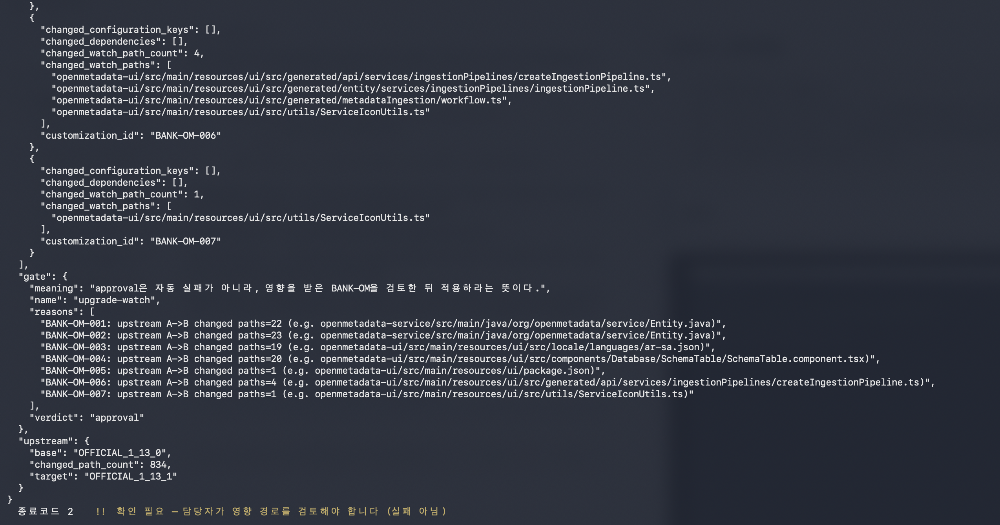
> <sub>화면 맨 아래. `upstream` 세 줄과 그 위의 `gate` 가 여기 있습니다</sub>

G5 화면의 `Files changed 834` 와 같은 숫자입니다. GitHub이 센 값과 우리
터미널이 센 값이 일치한다는 뜻입니다.

### `affected_customizations` — 기능별로 몇 개가 걸렸나

```json
{
  "customization_id": "BANK-OM-001",
  "changed_watch_path_count": 22,
  "changed_watch_paths": [ … 22개 나열 … ],
  "changed_configuration_keys": [],
  "changed_dependencies": []
}
```

| 이름 | 뜻 |
|---|---|
| `customization_id` | 어느 기능인지 |
| `changed_watch_paths` | 그 기능의 감시 목록(`upgrade_watch.paths`)에 적힌 파일 중, **이번 업그레이드에서 실제로 바뀐 것** |
| `changed_watch_path_count` | 그 개수 |
| `changed_configuration_keys` | **설정값 이름** 단위 감시 결과 (아래 설명) |
| `changed_dependencies` | **라이브러리 이름** 단위 감시 결과 (아래 설명) |

**영향을 받은 기능만 목록에 올라옵니다.** 하나도 안 걸린 기능은 아예 나오지
않습니다. 이번에는 7개가 모두 걸렸습니다.

> 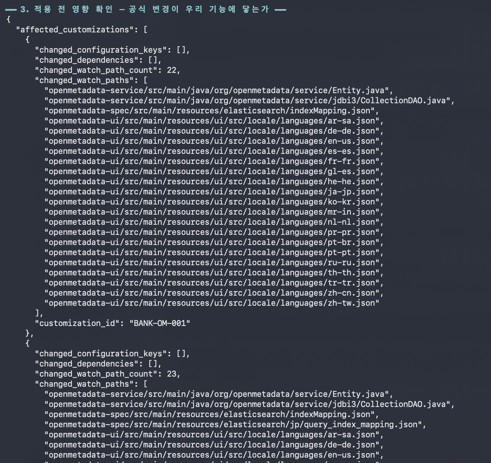
> <sub>맨 위 `BANK-OM-001` 항목. `changed_watch_path_count: 22` 아래로
> 걸린 파일 22개가 그대로 나열됩니다</sub>

### 22라는 숫자를 어떻게 읽나

`22` 는 **그 기능이 지켜보는 파일 중 이번에 바뀐 것의 개수**입니다.
분모를 함께 놓아야 뜻이 보입니다.

| 기능 | 감시 목록 (등록표에 적힌 값) | 이번에 바뀐 것 (검사기가 센 값) |
|---|---|---|
| BANK-OM-001 기준코드 | 48개 | **22개** |
| BANK-OM-002 조회리포트 | 56개 | **23개** |
| BANK-OM-003 데이터점검 | 27개 | **19개** |
| BANK-OM-004 컬럼보기 | 34개 | **20개** |
| BANK-OM-005 한글입력 | 2개 | **1개** |
| BANK-OM-006 Sybase | 19개 | **4개** |
| BANK-OM-007 Tibero | 11개 | **1개** |

**이 표가 이 구간의 쓸모입니다.** 제품 쪽에서 834개가 바뀌었지만, 기준코드
기능 담당자가 실제로 봐야 할 것은 **22개**입니다. 834개를 다 뒤질 필요가
없도록 좁혀 주는 것이 이 검사의 목적입니다.

왼쪽 열은 **우리가 미리 적어 둔 값**이고, 오른쪽 열은 **검사기가 이번에
센 값**입니다. 왼쪽이 비어 있으면 오른쪽도 0이 됩니다 — 아래 `[]` 두
항목이 바로 그 경우입니다.

BANK-OM-005(한글 입력)는 감시 목록이 2개뿐인데 그중 1개가 걸렸습니다.
`package.json` 입니다. 코드를 한 줄도 안 건드려도 **딸려 쓰는 라이브러리
버전이 바뀌면** 한글 입력이 깨질 수 있어서 넣어 둔 것이고, 이번에 실제로
바뀌었습니다. 감시 목록을 왜 파일 단위로 넓게 잡는지 보여주는 사례입니다.

### `[]` 로 비어 있는 두 항목은 무엇인가

파일 단위 말고 **더 좁게** 보는 두 축이 준비돼 있습니다.

| 항목 | 무엇을 보나 | 어떻게 |
|---|---|---|
| `changed_configuration_keys` | **설정값 이름** | 이번에 바뀐 `.yaml`·`.json`·`.toml` 파일의 변경 내용 안에 우리가 등록한 설정 이름이 나오는지 |
| `changed_dependencies` | **라이브러리 이름** | 이번에 바뀐 `package.json`·`pom.xml` 의 변경 내용 안에 우리가 등록한 라이브러리 이름이 나오는지 |

**지금 둘 다 비어 있는 이유는 우리가 아무것도 등록하지 않았기 때문입니다.**
등록표 7장 어디에도 `upgrade_watch.configuration_keys` 와
`upgrade_watch.dependencies` 항목 자체가 없습니다.

> **"안 걸렸다"가 아니라 "안 보고 있다"입니다.** 기능은 만들어져 있지만
> 입력이 비어서 그 축의 감시는 사실상 꺼져 있는 상태입니다. 예를 들어
> BANK-OM-005 가 `undici` 라이브러리 버전을 감시하고 싶다면 등록표에
> 그 이름을 적어야 하고, 지금은 적혀 있지 않습니다. 발표에서 이 부분을
> 물으면 **"파일 단위 감시는 돌고 있고, 설정값·라이브러리 단위는 아직
> 우리가 입력을 채우지 않았다"** 고 답하시면 됩니다.

### `gate` — 판정

```json
"gate": {
  "name": "upgrade-watch",
  "verdict": "approval",
  "reasons": [ "BANK-OM-001: upstream A->B changed paths=22 (e.g. …Entity.java)", … ],
  "meaning": "approval은 자동 실패가 아니라, 영향을 받은 BANK-OM을 검토한 뒤 적용하라는 뜻이다."
}
```

| 이름 | 뜻 |
|---|---|
| `name` | 어느 검사인지. `upgrade-watch` = "이번 업그레이드가 우리 감시 목록에 닿았나" |
| `verdict` | 판정. `pass` / `approval` / `block` / `analysis_error` 중 하나 |
| `reasons` | 사람이 읽을 한 줄 요약. 기능별 건수와 **대표 파일 하나**(`e.g.`) |
| `meaning` | 판정의 뜻을 결과 파일에 그대로 박아 둔 것 |

> 
> <sub>`gate` 의 `reasons` 일곱 줄과 `verdict: approval`, 그리고 맨 아래
> 종료코드 2</sub>

`reasons` 의 `A->B` 는 `upstream.base -> upstream.target`, 즉 1.13.0 → 1.13.1
입니다. `e.g.` 뒤의 파일은 **예시 하나**일 뿐이고 전체 목록은 위쪽
`changed_watch_paths` 에 있습니다.

`meaning` 을 굳이 결과 파일에 넣어 둔 이유가 있습니다. 나중에 이 파일만
따로 보는 사람이 `approval` 을 실패로 오해하지 않도록 하기 위해서입니다.

### 종료코드 2

```
  종료코드 2    !!  확인 필요 — 담당자가 영향 경로를 검토해야 합니다 (실패 아님)
```

| 판정 | 종료코드 | 뜻 |
|---|---|---|
| `pass` | 0 | 감시 목록에 걸린 것이 하나도 없음 |
| `block` | 1 | 안전하게 진행할 수 없음 |
| **`approval`** | **2** | **걸린 것이 있으니 사람이 보고 진행** ← 지금 이것 |
| `analysis_error` | 3 | 판단 자체가 불가능. 통과로 보면 안 됨 |

**`확인 필요`는 실패가 아닙니다.** 기계가 판단할 수 없어 사람에게 넘긴
상태입니다. 통과·실패 두 가지가 아니라 중간 상태를 따로 두는 이유를
보여주는 화면입니다.

> 이 검사는 **자동으로 막지 않습니다.** 그 파일이 바뀌었다고 해서 우리
> 기능이 깨진다는 뜻은 아니기 때문입니다. 번역 파일에 다른 언어
> 문구 한 줄이 추가된 것일 수도 있습니다. 그래서 "봐야 한다"까지만
> 말하고 판단은 사람에게 남깁니다.


## 구간 4 — 작업 폴더 만들기

화면에는 명령 두 줄과 결과 한 줄만 지나갑니다.

```
$ git -C ~/om-work/OM_TEMP worktree add -q -b rehearsal/patch-1.13.1 …/tree OFFICIAL_1_13_1
$ git -C …/tree switch -q -c rehearsal/custom-1.13.1
  OK  작업 폴더: ~/om-work/upgrade-rehearsal/tree
```

**공식 1.13.1 을 그대로 펼쳐 놓은 빈 작업장을 만드는 단계**입니다. 우리
기능은 아직 하나도 없습니다. 구간 5 가 여기에 얹습니다.

| 하는 일 | 뜻 |
|---|---|
| `worktree add` | 같은 저장소에서 **별도 폴더**를 하나 더 엽니다. 원래 폴더는 그대로 둔 채 작업할 수 있습니다 |
| `switch -c` | 그 폴더에서 작업할 **새 갈래 이름**을 만듭니다 |

> 캡처는 따로 필요 없습니다. 확인할 값이 없고 다음 구간으로 바로 넘어갑니다.
> 다만 **`이미 있습니다` 로 멈춘다면** 지난 실행 흔적이 남은 것이므로
> 0부 ① 의 정리 세 줄을 먼저 실행하십시오.

## 구간 5 — 기능을 하나씩 옮겨 얹기 ★

### 먼저 — 여기서 무슨 일이 일어나나

구간 4에서 **OpenMetadata 1.13.1 을 그대로 펼쳐 놓은 빈 작업 폴더**를
만들었습니다. 우리 기능은 하나도 없는 상태입니다.

구간 5는 그 위에 **우리 변경 기록 8건을 한 건씩 다시 올립니다.** 그때
쓰는 명령이 `git cherry-pick` 입니다.

```
$ git cherry-pick 4df83b311f   # BANK-OM-001
  !!  BANK-OM-001  충돌한 파일 18개 — 충돌 해결 도구를 실행합니다
    resolved …/locale/languages/ar-sa.json: BANK-OM leaf changes=9
    resolved …/locale/languages/de-de.json: BANK-OM leaf changes=9
     ⋮  (18줄)
  OK  BANK-OM-001  충돌 18개 중 18개 해결 · 항목 162개 되살림
     ⋮
$ git cherry-pick d983f7c540   # BANK-OM-005
  OK  BANK-OM-005  충돌 없음
```

### 왜 `cherry-pick` 을 쓰나 — 그림으로

우리 코드는 **기록 8건에 이름표가 하나씩 붙은 모양**으로 관리됩니다.
그 모양을 새 원본 위에서도 그대로 유지하려고 `cherry-pick` 을 씁니다.

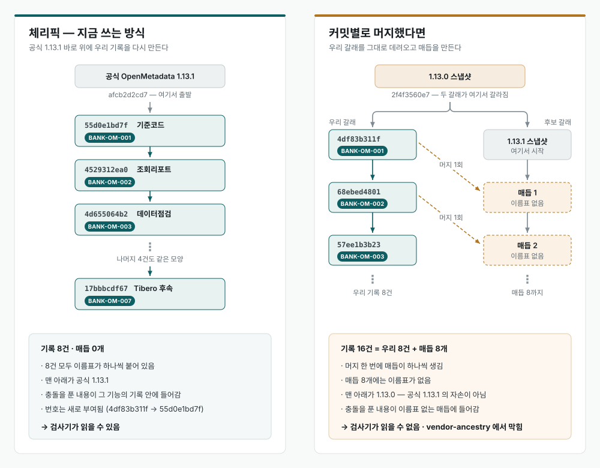

왼쪽은 공식 1.13.1 위에 **곧게 8건**, 각 기록에 이름표가 있습니다.
오른쪽은 1.13.0 에서 두 갈래가 갈라지고, 머지할 때마다 **이름표 없는
매듭**이 하나씩 생겨 16건이 됩니다.

<details markdown="1">
<summary><b>더 알아보기 — 머지와 무엇이 어떻게 다른가 (펼치기)</b></summary>

#### 왜 하필 `cherry-pick` 인가

**우리 기능이 "파일 묶음"이 아니라 "변경 기록 8건"으로 관리되기 때문입니다.**

기억하실 것은 2부 G3 화면입니다. 우리 코드는 이렇게 쌓여 있습니다.

```text
OpenMetadata 1.13.0 원본
    │
    ├─ 4df83b311f  BANK-OM-001 기준코드      ← 기록 1건 = 기능 1개
    ├─ 68ebed4801  BANK-OM-002 조회리포트
    │      ⋮
    └─ 7d19c89526  BANK-OM-007 후속
```

**기록 한 건이 기능 하나에 대응하고, 그 기록에 이름표(`Customization-ID`)가
붙어 있습니다.** 이 구조를 유지한 채로 새 원본 위에 옮겨야 합니다.

`cherry-pick` 은 **"저 기록 한 건이 한 일을 여기에도 똑같이 해라"** 는
명령입니다.

> **한 줄로 먼저 답하면** — `cherry-pick` 은 **파일을 지키려고** 쓰는 것이
> 아닙니다. 머지해도 최종 파일 내용은 똑같이 나옵니다(아래에서 실측으로
> 확인했습니다). **"기록 8건 · 이름표 1개씩"이라는 모양을 지키려고** 씁니다.
> 검사기가 후보를 그 모양으로 읽기 때문입니다.

#### 머지해도 충돌은 똑같이 납니다 — 그게 이유가 아닙니다

**실제로 머지를 해 보고 세었습니다.**

| 방법 | 충돌한 파일 |
|---|---|
| `cherry-pick` 8건 (지금 방식) | 18개 |
| `merge` 한 번 | **18개 — 똑같습니다** |

같은 파일들이고 개수도 같습니다. **충돌을 줄이려고 `cherry-pick` 을 쓰는
것이 아닙니다.** 최종 파일 내용도 항목 단위로 비교하면 18개 파일 모두
같았습니다(키 순서만 다름).

#### 진짜 이유는 결과물의 모양입니다

머지를 실제로 끝내 놓고 기록을 들여다보면 차이가 보입니다.

```text
[ 머지한 경우 ]
  1c52b42904  Merge …                       이름표 = (없음)   ← 충돌 해결분 19개 파일이 여기
  7d19c89526  complete Tibero coverage      이름표 = BANK-OM-007
  62e39da8be  add Tibero customization      이름표 = BANK-OM-007
      ⋮
```

**충돌을 푼 결과가 이름표 없는 머지 기록 하나에 전부 뭉쳐 들어갑니다.**
번역 파일 19개를 누가 왜 그렇게 고쳤는지, 어느 기능 것인지 되짚을 수가
없습니다.

```text
[ cherry-pick 한 경우 ]
  <새 번호>  add InstanceCode customization  이름표 = BANK-OM-001  ← 001 의 해결분은 여기
  <새 번호>  add QueryReport customization   이름표 = BANK-OM-002  ← 002 의 해결분은 여기
      ⋮  (8건, 전부 이름표 하나씩)
```

**충돌 해결분이 그 기능의 기록 안에 들어갑니다.** 요약표가 기능별로
`18 / 162`, `18 / 198` 처럼 나오는 것도 이 덕분입니다. 머지하면 "어딘가에서
18개 충돌" 한 줄로 끝납니다.

#### 검사기가 그 구조를 요구합니다

이것이 결정적입니다. 뒤에 오는 검사기는 후보를 이렇게 봅니다.

```bash
git rev-list OFFICIAL_1_13_1..HEAD     # 기록 8건이 나와야 함
# 그리고 각 기록에 Customization-ID 가 정확히 하나
```

머지한 결과는 이름표 없는 기록이 섞여 있어 **"이 변경은 어느 기능 것인가"에
답할 수 없습니다.** 우리 시스템 전체가 그 한 줄 위에 서 있는데, 머지는
그 대응을 깨뜨립니다.

| | `cherry-pick` | `merge` |
|---|---|---|
| 충돌한 파일 | 18개 | 18개 (같음) |
| 최종 파일 내용 | 같음 | 같음 (키 순서만 다름) |
| 후보의 기록 | **8건, 전부 이름표 하나씩** | 9건, **그중 하나는 이름표 없음** |
| 충돌 해결분의 소속 | **해당 기능의 기록 안** | 이름표 없는 머지 기록 |
| 검사기가 읽을 수 있나 | **예** | 아니오 |

> 참고로 우리 저장소의 1.13.0 은 공식 저장소에서 **내용만 떠 온
> 스냅샷**이라 공식 이력과 조상이 이어져 있지 않습니다. 그래서 공식
> 1.13.1 태그에 대고 바로 머지하면 `refusing to merge unrelated histories`
> 로 아예 거부되고, 억지로 붙이면 **734개**가 충돌합니다. 위의 18개는
> 우리 저장소 안에 1.13.1 스냅샷을 먼저 만들어 조상을 이어 준, 머지에
> 가장 유리한 조건에서 나온 값입니다.

#### "커밋 번호별로 머지하면 되지 않나" — 해 봤습니다

가장 그럴듯한 대안이라 실제로 8번 머지해 보았습니다.

**먼저, 공식 1.13.1 태그에 대고 커밋 하나를 머지하면 시작조차 못 합니다.**

```
$ git merge 4df83b311f
fatal: refusing to merge unrelated histories
```

우리 1.13.0 은 공식에서 **내용만 떠 온 스냅샷**이라 공식 이력과 조상이
이어져 있지 않기 때문입니다. 그래서 우리 저장소 안에 1.13.1 스냅샷을 먼저
만들어 조상을 이어 준 뒤 — **머지에 가장 유리한 조건에서** — 8번 머지한
결과가 이렇습니다.

| | `cherry-pick` 8번 | `merge` 8번 |
|---|---|---|
| 최종 파일 내용 | `e490ed82dd…` | **`e490ed82dd…` — 똑같습니다** |
| 후보의 기록 수 | **8건** | **16건** |
| 이름표가 있는 기록 | 8건 (전부) | 8건 |
| **이름표 없는 기록** | **0건** | **8건** |
| 후보가 공식 1.13.1 에서 출발하나 | **예** | **아니오** |
| 후보 이력에 1.13.0 이 딸려 오나 | **아니오** | **예** |

**파일 내용은 한 글자도 다르지 않습니다.** 말씀하신 대로 결과물만 보면
커밋별 머지로도 됩니다.

#### 8건이 어떻게 16건이 되나 — 실제 기록입니다

`git merge` 는 **명령 한 번에 기록을 하나 새로 만듭니다.** 두 줄기를 잇는
매듭이고, 이름이 `Merge commit '...'` 입니다. 8번 머지했으니 매듭도 8개
생깁니다.

```text
[ 커밋별로 8번 머지한 결과 — git log --graph ]

*   08dbbd0530 Merge commit '7d19c89526' into try/each   ← 매듭 8
|\
| * 7d19c89526 complete Tibero service connection coverage
* | b0ceb77f99 Merge commit '62e39da8be' into try/each   ← 매듭 7
|\|
| * 62e39da8be add Tibero customization
* | 3f92bc5c1b Merge commit '010750c514' into try/each   ← 매듭 6
|\|
| * 010750c514 add Sybase customization
        ⋮   (같은 모양이 반복)
* | 59678fd35d Merge commit '4df83b311f' into try/each   ← 매듭 1
|\|
| * 4df83b311f add InstanceCode customization
* | b63242d7a7 Import official OpenMetadata 1.13.1 source snapshot
|/
* 2f4f3560e7 Import official OpenMetadata 1.13.0 source snapshot  ← 여기로 이어짐
```

**추가되는 것은 `Merge commit …` 8개입니다.** 우리 기록 8건은 그대로 있고,
그 위에 매듭이 8개 얹혀 16건이 됩니다. 그리고 맨 아래를 보시면 두 줄기가
`2f4f3560e7` **1.13.0 스냅샷에서 갈라져 나온 것**으로 남습니다.

같은 명령을 체리픽 결과에 대고 찍으면 이렇습니다.

```text
[ 체리픽 결과 — git log --graph ]

* 17bbbcdf67 complete Tibero service connection coverage
* fa17da1620 add Tibero customization
* 2505217935 add Sybase customization
* 2990ea7244 fix Korean IME handling
* 423c29ca37 add bank column view customization
* 4d655064b2 add Data Assertions customization
* 4529312ea0 add QueryReport customization
* 55d0e1bd7f add InstanceCode customization
* afcb2d2cd7 chore(release): Prepare Branch for `1.13.1`   ← 공식 1.13.1
```

**한 줄로 곧게 8건이고, 매듭이 없고, 맨 아래가 공식 1.13.1 입니다.**

두 방식이 기록을 다루는 방법이 다릅니다.

| | 우리 기록 8건을 | 매듭 | 맨 아래 |
|---|---|---|---|
| `cherry-pick` | **복사해서 새 번호로 다시 만듦**<br>`4df83b311f` → `55d0e1bd7f` | 없음 | 공식 1.13.1 |
| `merge` | **원본을 그대로 데려옴**<br>`4df83b311f` 그대로 | **8개 생김** | 1.13.0 스냅샷 |

문제는 아래 세 줄입니다.

1. **머지할 때마다 이름표 없는 기록이 하나씩 더 생깁니다.** 8번 머지하면
   8건이 붙어 후보 기록이 16건이 됩니다. 충돌을 푼 내용은 그 이름표 없는
   기록 쪽에 들어갑니다.
2. **후보가 공식 1.13.1 에서 출발하지 않게 됩니다.** 우리 스냅샷에서
   출발한 것이 되어, "이 후보는 공식 1.13.1 을 바탕으로 만들었다"를
   Git 으로 증명할 수 없습니다.
3. **1.13.0 이력이 후보에 딸려 옵니다.** 머지는 커밋 하나만 가져오는 것이
   아니라 **그 커밋의 조상 전부**를 붙이기 때문입니다. `4df83b311f` 의
   조상에는 `2f4f3560e7 Import official OpenMetadata 1.13.0 source snapshot`
   이 들어 있습니다.

> **오해하기 쉬운 곳입니다.** "1.13.0 이 딸려 온다"는 것은 **파일이 섞여
> 들어온다는 뜻이 아닙니다.** 위 표의 첫 줄대로 최종 파일 내용은 양쪽이
> 완전히 같습니다. 딸려 오는 것은 **계보뿐**입니다 — 후보의 조상 목록에
> `2f4f3560e7 Import official OpenMetadata 1.13.0 source snapshot` 이
> 들어가고, 그 결과 후보가 공식 1.13.1 의 자손이 아니게 됩니다.
> **파일은 멀쩡한데 족보가 섞이는 것**입니다.

검사기 8종 중 `vendor-ancestry` 가 정확히 이것을 봅니다.

> 승인된 공식 target 이 후보의 조상이어야 한다 — 아니면 `block`

커밋별 머지 결과는 이 조건에서 걸립니다.

#### 매듭이 무엇이고, 조상이 왜 문제인가

**매듭은 두 갈래를 잇는 기록입니다.** 보통 기록은 부모가 하나인데, 매듭은
**부모가 둘**입니다 — 후보 갈래의 직전 상태와, 방금 데려온 우리 기록.
이어 붙였다는 사실 자체가 하나의 기록으로 남는 것이고, **충돌을 푼 내용도
그 안에 들어갑니다.**

조상 문제는 두 가지로 갈립니다. 둘 다 Git 으로 확인한 값입니다.

| 확인한 것 | 체리픽 | 커밋별 머지 |
|---|---|---|
| 후보의 조상에 **1.13.0 스냅샷**이 있나 | 아니오 | **예** |
| 후보의 조상에 **공식 1.13.1 커밋**(`afcb2d2cd7`)이 있나 | **예** | **아니오** |

**두 번째 줄이 진짜 문제입니다.** 머지를 하려면 우리 저장소 안에 1.13.1
스냅샷을 **직접 만들어야** 했습니다. 그 순간 후보는 우리가 만든 커밋에서
출발한 것이 되고, **공식이 낸 그 커밋에서 출발했다는 사실을 Git 이 더는
보증해 주지 못합니다.**

> "이 후보는 공식 1.13.1 을 바탕으로 만들었습니다" 를 **말이 아니라 Git
> 으로 증명할 수 있느냐** — 이것이 `vendor-ancestry` 게이트가 보는 것입니다.

#### 검사기 말고 운영에서도 문제가 되나

**됩니다.** 검사기가 없어도 남는 문제가 있습니다.

**① 기능 하나만 빼기가 어려워집니다.**

체리픽 결과에서는 한 줄이면 됩니다. 실제로 해 본 결과입니다.

```
$ git revert <BANK-OM-005 기록>
 1 file changed, 1 insertion(+), 47 deletions(-)
```

머지 결과에서는 그 기능의 변경이 **원래 기록과 매듭 두 곳에 흩어져**
있습니다. 매듭을 되돌리려면 어느 부모 쪽으로 되돌릴지 사람이 지정해야
하고(`git revert -m`), 매듭 안에 어느 기능의 해결분이 들어 있었는지 먼저
읽어 봐야 합니다. **"한글 입력 기능만 빼 주세요" 라는 흔한 요청이
조사 작업이 됩니다.**

**② 문제가 생겼을 때 누구에게 물을지 알 수 없습니다.**

번역 파일 한 줄이 이상하다고 할 때, 체리픽 결과는 그 줄을 만든 기록에
`Customization-ID: BANK-OM-001` 이 붙어 있어 담당자가 바로 나옵니다.
머지 결과는 `Merge commit …` 이 나오고, 작성자는 그날 머지를 실행한
사람입니다. **기능 담당자를 찾으려면 매듭 안을 열어 봐야 합니다.**

**③ 승인 근거로 쓰기 어렵습니다.**

"이 변경은 어느 업무 기능 때문에, 누가 넣었나" 에 답해야 하는데 매듭에는
이름표가 없습니다. 코드는 멀쩡히 돌아가도 **설명할 수가 없습니다.**

**④ 다음 회차마다 쌓입니다.**

1.13.2 로 올릴 때 같은 일을 또 합니다. 체리픽은 매번 공식 새 버전 위에
8건을 다시 세우므로 항상 8건입니다. 머지는 회차마다 매듭이 8개씩 더해져
이력이 계속 두꺼워지고, **"우리가 손댄 것만" 골라내기가 회차마다 어려워집니다.**

> 정리하면 — 검사기는 이 문제들을 **미리 잡아 주는 장치**이지, 검사기
> 때문에 생기는 문제가 아닙니다. 검사기를 꺼도 ①~④ 는 그대로 남습니다.

세 번째로 — **파일을 덮는 것이 아닙니다.** `cherry-pick` 은 **"우리가 바꾼
부분만"** 다시 적용하므로 새 원본이 그 파일에 한 일은 남습니다. 같은 파일을
양쪽이 다 건드렸을 때만 git 이 "어느 쪽을 남길지 모르겠다"며 멈춥니다.

#### 특정 파일만 골라서 올리는 것인가 — 아닙니다

**`cherry-pick` 은 파일을 고르지 않습니다.** 그 변경 기록이 바꾼 파일
**전부**를 한꺼번에 적용합니다.

BANK-OM-001을 실제로 세어 본 값입니다.

| | 파일 수 |
|---|---|
| 원래 기록 `4df83b311f` 이 바꾼 파일 | **48개** |
| `cherry-pick` 이 적용을 시도한 파일 | **48개 전부** |
| 그중 조용히 들어간 것 | **30개** |
| 그중 충돌해서 멈춘 것 | **18개** |
| 옮겨진 뒤 후보에서 그 기록이 바꾼 파일 | **48개** |

**들어가고 안 들어가고가 갈린 게 아닙니다.** 48개 전부 들어갑니다.
갈리는 것은 **"자동으로 되느냐, 멈추느냐"** 입니다.

```text
cherry-pick 4df83b311f   ← 파일 48개 전부를 대상으로 시작
      │
      ├─ 30개  새 버전이 안 건드린 파일 → 그냥 들어감
      │
      └─ 18개  새 버전도 건드린 파일   → git 이 멈춤
                    │
                    └─ 충돌 해결 도구가 이 18개만 항목 단위로 처리
      │
cherry-pick --continue   ← 48개 전부가 담긴 기록 1건으로 마무리
```


**마무리된 뒤에도 기록은 여전히 1건입니다.** 실제로 후보에서 확인한 값은
이렇습니다.

```
$ git log -1 --format='%s%n%b' <옮겨진 기록>
add InstanceCode customization
Customization-ID: BANK-OM-001

$ git show --stat --name-only <옮겨진 기록> | wc -l
48
```

이름표도 그대로 따라왔습니다. **"기록 1건 = 기능 1개"** 구조가 새 원본
위에서도 유지된다는 것이 `cherry-pick` 을 쓰는 이유입니다.

#### 잠깐 — "항목"은 기능이 아닙니다

여기서 **항목**이라는 말이 자주 나오는데, BANK-OM 번호와는 전혀 다른
단위입니다. 크기 순서로 보면 이렇습니다.

```text
기능        BANK-OM-001 기준코드                   ← 번호 1개
  └ 변경 기록   4df83b311f                          ← 커밋 1건
      └ 파일       ko-kr.json 등 48개               ← 여기까지가 git 이 보는 단위
          └ 항목       label.instance-code = "인스턴스 코드"
                       label.code-group    = "Code Group"
                          ⋮  ko-kr.json 안에 9개    ← 충돌 해결 도구가 보는 단위
```

| 단위 | 예 | 개수 |
|---|---|---|
| 기능 | BANK-OM-001 | 1 |
| 변경 기록 | `4df83b311f` | 1건 |
| 파일 | `ko-kr.json` | 48개 |
| **항목** | **`label.instance-code`** | **`ko-kr.json` 안에만 9개** |

**항목은 파일 안의 줄 하나에 가깝습니다.** "같은 항목을 양쪽이 고쳤다"는
것은 "기능이 겹쳤다"가 아니라 **"`label.instance-code` 라는 이름 하나를
새 버전도 쓰고 우리도 썼다"** 는 뜻입니다.

#### 우리 것으로 덮어쓰는 것 아닌가

**아닙니다.** 여기가 가장 오해하기 쉬운 부분이라 실제 파일로 보여드립니다.

`cherry-pick` 은 **파일을 통째로 가져오지 않습니다.** 그 기록이 만든
**변경분만** 새 파일에 다시 적용합니다.

한국어 문구 파일 `ko-kr.json` 하나를 실제로 세어 본 값입니다.

| | 항목 수 |
|---|---|
| 새 버전(1.13.1)이 이 파일에서 바꾼 항목 | **118개** |
| BANK-OM-001이 이 파일에 넣은 항목 | **9개** |
| **겹치는 항목** | **0개** |

겹치는 것이 하나도 없으므로 결과는 **118개 그대로 + 우리 9개 추가**입니다.
새 버전이 한 일은 하나도 지워지지 않습니다.

우리가 넣은 9개는 이런 이름들입니다.

```text
label.instance-code          = 인스턴스 코드
label.instance-code-plural   = 인스턴스 코드
label.code-group             = Code Group
label.code-name              = Code Name
label.code-value             = Code Value
label.sort-order             = Sort Order
   ⋮
```

**기준코드 기능에만 쓰는 이름들입니다.** 새 버전이 이 이름을 건드릴 일이
없습니다. 그래서 겹치지 않습니다.

그럼 왜 "충돌했다"고 나오나 — **git 은 같은 파일에 양쪽이 손댔다는
것까지만 보고 내용은 안 보기 때문입니다.** 파일 단위로는 충돌했지만 항목
단위로는 안 겹칩니다. 그 안을 열어 보고 항목 단위로 판단하는 것이 정리
도구가 하는 일입니다.

#### 그럼 사람이 봐야 하는 경우는

**겹칠 때입니다.** 그때는 자동으로 아무 쪽도 고르지 않고 **멈춥니다.**

| 상황 | 어떻게 되나 |
|---|---|
| 항목이 안 겹침 | 자동으로 우리 항목만 끼워 넣음 |
| **같은 항목을 양쪽이 고침** | **멈춤** — 어느 쪽을 남길지 사람이 결정 |
| **JSON이 아닌 파일이 충돌** | **멈춤** — 자동 처리 대상이 아님 |

멈출 때 나오는 화면입니다.

```
    …/ko-kr.json: overlapping leaf changes: ['label.instance-code']
중단: BANK-OM-001: 새 버전과 우리가 같은 항목을 고쳤습니다. 어느 쪽을 남길지는
    자동으로 정할 수 없으므로 코드 담당자가 직접 결정해야 합니다.
    위 overlapping leaf changes 줄에 그 항목 이름이 있습니다.
```

```
중단: BANK-OM-001: JSON 이외 파일이 충돌했습니다. 자동 해결 대상이 아니므로
    코드 담당자가 직접 해결해야 합니다
```

**"우리 것으로 덮어쓴다"도, "우리 커밋을 고친다"도 자동으로 하지 않습니다.**
그건 업무 판단이라 사람 몫입니다. 이번 실행에서는 겹친 것이 하나도 없어서
8건 모두 자동으로 넘어갔습니다.

> **자동으로 넘어간 것도 그냥 믿고 끝내지는 않습니다.** 후보가 만들어진
> 뒤 검사기가 "우리 변경이 새 코드에 실제로 살아 있는가"를 다시 봅니다
> (앞의 `required_changed_paths` 검사). 여기 자동 처리는 **후보를 만드는
> 단계**이고, 판정은 그다음입니다.

#### `cherry-pick` 은 고를 수 있는 선택지가 아닙니다

헷갈리기 쉬운 부분이라 분명히 해 두겠습니다.

> **`cherry-pick` 은 충돌이 났을 때 꺼내 드는 수단이 아닙니다.**
> 8건 **전부에 무조건** 씁니다. 충돌이 안 나도 씁니다.

우리 기능을 새 원본 위에 다시 올리는 **방법 자체**가 `cherry-pick` 입니다.
실제로 이번 실행에서도 BANK-OM-005·006·007 네 건은 충돌이 하나도 없었지만
똑같이 `cherry-pick` 으로 올렸습니다.

**선택은 그 안에서 충돌이 났을 때 생깁니다.**

```text
변경 기록 8건 전부  →  cherry-pick  (무조건)
                          │
              ┌───────────┴───────────┐
        충돌 없음                   충돌 발생
     그대로 올라감          ┌────────┴────────┐
                     항목 안 겹침        항목 겹침 / JSON 아님
                    자동으로 처리            ★ 멈춤 ★
                                        여기서 사람이 고릅니다
```

멈췄을 때 사람이 고를 수 있는 것은 세 가지입니다.

| 고르는 것 | 무슨 뜻인가 | 뒤따르는 일 |
|---|---|---|
| **우리 것을 남긴다** | 우리 기능이 새 버전 동작보다 우선 | 새 버전이 그 항목에 한 개선은 포기 |
| **새 버전을 따른다** | 새 버전 동작을 받아들인다 | **우리 변경 기록을 고쳐야 합니다.** 손댄 파일이 달라지므로 등록표도 다시 맞춰야 합니다 (5부의 `plan → 승인 → apply`) |
| **둘을 합친다** | 양쪽을 살리는 코드를 새로 쓴다 | 위와 같이 기록·등록표 갱신 |

**어느 쪽도 기계가 정하지 않습니다.** "새 버전을 따른다"는 곧 **행내
커스터마이징을 하나 바꾸는 일**이고, 그건 코드 담당자와 업무 담당자가
결정할 문제입니다.

> 정리하면 — `cherry-pick` 은 **"기록 단위로 옮긴다"는 방식**이고, 덮어쓸지
> 말지는 그 방식 안에서 충돌이 났을 때 비로소 생기는 **별개의 질문**입니다.
> 이번 실행에서는 그 질문이 한 번도 나오지 않았습니다.


</details>

### 충돌한 18개는 무엇인가 — 감시 목록 안에 들어 있습니다

**맞습니다.** 구간 3에서 본 감시 목록과 이어집니다. BANK-OM-001 기준으로
세어 보면 이렇게 포개집니다.

```text
감시 목록 48개                    등록표에 "바뀌면 알려 달라"고 적어 둔 파일
   └─ 이번에 바뀐 것 22개          구간 3에서 나온 숫자
        └─ 실제로 충돌한 것 18개   구간 5에서 나온 숫자
```

| | 개수 | 어디서 |
|---|---|---|
| 감시 목록 | 48개 | 등록표 `upgrade_watch.paths` |
| 그중 이번에 바뀐 것 | 22개 | **구간 3** |
| 그중 실제로 충돌한 것 | 18개 | **구간 5** |

**충돌한 18개는 모두 감시 목록 안에 있습니다.** 셋이 정확히 포함 관계입니다.

바뀌었는데도 충돌하지 않은 4개는 이렇습니다.

```text
Entity.java · CollectionDAO.java · en-us.json · indexMapping.json
```

**같은 파일이라도 서로 다른 줄을 고쳤기 때문**입니다. 새 버전은 위쪽을,
우리는 아래쪽을 고쳤다면 git 이 알아서 둘 다 넣습니다.

### 왜 사람이 보고 판단하지 않나

**판단할 만한 화면이 아니기 때문입니다.** 실제 충돌 표시를 열어 보면
이렇게 되어 있습니다.

```text
2번째 줄   <<<<<<< HEAD
             … 새 버전의 문구 3,422개 …
2376번째 줄  =======
             … 우리 쪽 문구 3,347개 …
5555번째 줄  >>>>>>> 4df83b311f (add InstanceCode customization)
```

**파일 하나가 통째로 충돌 처리됩니다.** 3,300줄이 넘는 문구 목록 두 벌이
나란히 붙어 있고, 실제로 다른 것은 그중 아홉 줄입니다. 사람이 눈으로
찾을 수 있는 형태가 아닙니다.

충돌 해결 도구가 하는 일이 바로 그 비교입니다.

| 사람 눈 | 도구 |
|---|---|
| 3,300줄 두 벌을 통짜로 봄 | **항목(이름-값) 단위로 갈라서 봄** |
| 어느 항목이 겹치는지 알기 어려움 | 겹치는 항목이 **하나라도 있으면 멈춤** |

### 그럼 사람의 판단은 어디에 있나

**생략하지 않았습니다. 두 군데에 있습니다.**

| 언제 | 무엇을 판단하나 | 어디 |
|---|---|---|
| **충돌 전** | 감시 목록에 걸린 22개를 담당자가 검토 | **구간 3** — 그래서 `확인 필요`(종료코드 2)로 끝납니다 |
| **충돌 중** | 같은 항목을 양쪽이 고쳤으면 **멈추고 사람에게** | 구간 5 — 이번에는 한 번도 안 멈췄습니다 |
| 그 뒤 | 우리 변경이 살아남았는지 다시 확인 | **5부** `customization-survival` |

**겹치지 않는 항목을 끼워 넣는 일에는 판단할 것이 없습니다.** 두 값 중
하나를 고르는 상황이 아니라, 새 버전 문구는 그대로 두고 **우리 문구만
추가로 넣는 것**이기 때문입니다. 고를 일이 생기면 도구가 멈춥니다.

### 충돌을 직접 보고 싶다면

예행연습 폴더를 건드리지 않고 **따로** 재현해 볼 수 있습니다.

```bash
# ① 충돌만 재현할 임시 작업장 (예행연습과 별개 폴더)
git -C ~/om-work/OM_TEMP worktree add -b demo/conflict \
  ~/om-work/conflict-demo OFFICIAL_1_13_1

cd ~/om-work/conflict-demo

# ② 기능 하나만 얹어 봅니다 — 여기서 충돌이 납니다
git cherry-pick 4df83b311f

# ③ 충돌한 파일 목록 (18개가 나옵니다)
git diff --name-only --diff-filter=U

# ④ 충돌 표시가 파일 어디에 있는지
F=openmetadata-ui/src/main/resources/ui/src/locale/languages/ko-kr.json
grep -n '^<<<<<<<\|^=======\|^>>>>>>>' $F

# ⑤ 우리가 넣으려는 항목만 뽑아 보기
git diff :2:$F :3:$F | grep '^+' | grep 'instance-code\|code-group\|sort-order'
```

**그런데 ④⑤ 는 파일 이름과 항목 이름을 미리 알아야 합니다.** 그럴 필요
없이 **충돌 지점만 뽑아 주는 도구**가 있습니다.

```bash
# 검사 저장소에서 실행합니다. 읽기만 하고 아무것도 고치지 않습니다.
cd ~/om-work/openmetadata-test
./.venv/bin/python harness/tools/show_conflict_points.py \
  --repo ~/om-work/conflict-demo \
  --file openmetadata-ui/src/main/resources/ui/src/locale/languages/ko-kr.json
```

**이렇게 나옵니다.**

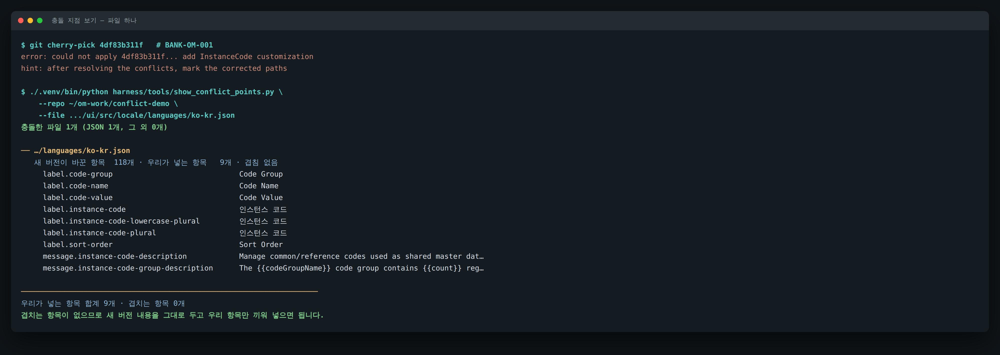
<sub>충돌로 멈춘 직후 그대로 실행한 화면. 3,383줄이 통째로 충돌했지만
실제로 넣을 것은 9개 항목이고 겹침은 0개입니다</sub>

**`--file` 을 빼면 18개 전체**를 훑습니다. 마지막에 합계가 나옵니다.

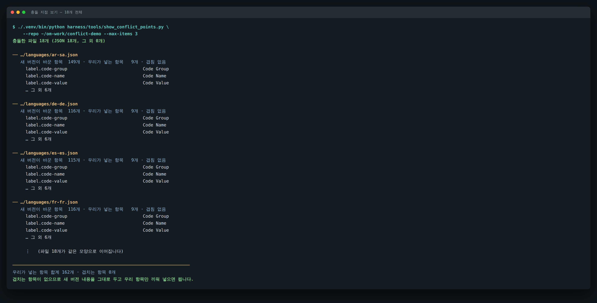
<sub>`--max-items 3` 으로 파일마다 세 줄만 보이게 한 것입니다.
마지막 줄의 합계 162개 · 겹침 0개가 요약표의 `되살린항목` 과 같은 값입니다</sub>

**이 한 장이 이 절의 결론입니다.** 3,383줄이 통째로 충돌했지만 실제 쟁점은
9개 항목이고, 그중 새 버전과 겹치는 것은 **하나도 없습니다.** 겹치는 항목이
있으면 `← 겹침` 표시가 붙고 마지막 줄이 **"코드 담당자가 어느 쪽을 남길지
정해야 합니다"** 로 바뀝니다.

> 📸 **⑨-3** — 발표에 쓰기 가장 좋은 화면입니다.

**④ 에서 나오는 화면**

```
2:<<<<<<< HEAD
2376:=======
5555:>>>>>>> 4df83b311f (add InstanceCode customization)
```

**⑤ 에서 나오는 화면**

```
+    "code-group": "Code Group",
+    "instance-code": "인스턴스 코드",
+    "instance-code-lowercase-plural": "인스턴스 코드",
+    "instance-code-plural": "인스턴스 코드",
+    "sort-order": "Sort Order",
+    "instance-code-description": "Manage common/reference codes used as ...",
```

**이 두 화면을 나란히 놓으면** — 통짜로 충돌한 3,300줄 안에서 실제로
문제되는 것은 저 몇 줄뿐이라는 것이 보입니다.

> 📸 **⑨-1**, **⑨-2** — 발표에서 "충돌이 났다는 게 무슨 뜻이냐"는 물음이
> 나오면 이 두 장을 쓰시면 됩니다.

**다 보셨으면 정리하십시오.**

```bash
cd ~
git -C ~/om-work/OM_TEMP worktree remove --force ~/om-work/conflict-demo
git -C ~/om-work/OM_TEMP branch -D demo/conflict
```

### 웹(GitHub)에서 보는 법

**충돌은 합치려고 시도할 때 생기므로, GitHub 도 합쳐 볼 대상이 있어야
보여 줍니다.** 비교 화면(`compare`)에는 안 나옵니다. **Pull request 를
만들어야** 나옵니다.

시연용으로 임시 갈래 하나를 올리면 볼 수 있습니다.

```bash
# ① OM_TEMP 안에 1.13.1 내용만 담은 임시 갈래를 만듭니다
#    (1.13.0 스냅샷의 자식으로 만들어야 GitHub 이 비교할 기준을 갖습니다)
git -C ~/om-work/OM_TEMP worktree add -b demo/web-conflict \
  ~/om-work/web-conflict origin/patch/om-1.13.0
cd ~/om-work/web-conflict
git read-tree -u --reset OFFICIAL_1_13_1
git add -A
git commit -m "demo: OpenMetadata 1.13.1 source snapshot (시연용 임시)"

# ② 원격에 올립니다 — 이름에 demo/ 를 붙여 임시임을 표시합니다
git push -u origin demo/web-conflict
```

```bash
# ③ 비교할 쪽도 올립니다 — 갈래 전체가 아니라 기록 하나만
git -C ~/om-work/OM_TEMP push origin 4df83b311f:refs/heads/demo/one-commit
```

그다음 브라우저에서 **Pull request 를 만듭니다.**

```
github.com/easyseop/OM_TEMP/compare/demo/web-conflict...demo/one-commit
```

| 고를 것 | 값 |
|---|---|
| base (기준) | `demo/web-conflict` |
| compare (비교) | `demo/one-commit` |

**`Create pull request` 를 누르십시오.** (합치는 것이 아니라 만드는 것입니다.)

### 왜 갈래 전체가 아니라 기록 하나인가

충돌 개수는 어느 쪽이든 **18개로 같습니다.** 충돌하는 네 기능이 모두 같은
번역 파일 18개를 손대기 때문입니다. 다른 것은 **화면이 얼마나 복잡한가**
입니다.

| 무엇을 비교하나 | PR 의 커밋 | PR 의 바뀐 파일 | 충돌 |
|---|---|---|---|
| **기록 하나** (`4df83b311f` BANK-OM-001) | **1건** | **48개** | 18개 |
| 갈래 전체 (`custom/om-1.13.0`) | 8건 | 111개 | 18개 |

**기록 하나로 하면 화면이 절반 이하로 줄고, 커밋 목록에 기능 하나만
보입니다.** 발표에서 "이 기능 하나를 얹으려니 파일 18개가 충돌했다"를
그대로 말할 수 있습니다.

> **왜 하필 첫 번째 기록인가** — 나중 기록을 고르면 그 앞의 기록들이
> 조상으로 딸려 와 PR 에 같이 들어갑니다. BANK-OM-002 를 고르면 2건,
> BANK-OM-004 를 고르면 4건이 됩니다. **커밋 1건짜리 PR 이 되는 것은
> 첫 번째 기록뿐입니다.**

### 볼 수 있는 화면 세 가지

| | 화면 | 무엇이 보이나 |
|---|---|---|
| **W1** | PR 만들기 화면 | `Can't automatically merge` 라는 회색 표시 |
| **W2** | 만들어진 PR 아래쪽 | **`This branch has conflicts that must be resolved`** 와 **충돌 파일 18개 목록** |
| **W3** | `Resolve conflicts` 버튼을 누른 화면 | `<<<<<<<` `=======` `>>>>>>>` 표시가 그대로 보이는 편집기 |

**W2 가 발표에 가장 좋습니다.** 충돌한 파일 18개가 이름과 함께 나열되고,
그 목록이 터미널의 `충돌한 파일 18개` 와 같다는 것을 나란히 보여줄 수
있습니다.

### W3 에서 충돌 지점 찾는 법 — 스크롤하지 마십시오

**편집기 안에서도 볼 수 있습니다.** 다만 이 파일은 2번째 줄부터 5,555번째
줄까지가 **하나의 통짜 충돌**이라, `Prev / Next` 로 넘겨 갈 "다음 충돌"이
없습니다. 위아래로 굴리면 문구 목록만 3,300줄 지나갑니다.

**브라우저 찾기(`Ctrl+F` / `⌘F`)로 바로 가시면 됩니다.**

| 찾을 말 | 어디로 가나 |
|---|---|
| `instance-code` | 우리가 넣는 항목들 (`>>>>>>>` 쪽) |
| `=======` | 새 버전 쪽과 우리 쪽의 경계 |
| `<<<<<<<` | 충돌 시작 (2번째 줄) |

`instance-code` 로 찾으면 **우리가 넣는 9개 항목이 모여 있는 자리**로
바로 갑니다. 그 화면이 W3 에서 캡처할 만한 유일한 지점입니다.

> **편집기가 아예 안 열릴 수도 있습니다.** 파일이 218KB · 3,383줄이라
> GitHub 이 "너무 커서 웹에서 해결할 수 없다"고 할 가능성이 있습니다.
> 실제로 열리는지는 PR 을 만들어 봐야 알 수 있습니다. 안 열리면
> W2(파일 18개 목록)까지만 캡처하시면 됩니다.

### 웹에서 되는 것과 안 되는 것

| | 웹에서 | 어떻게 |
|---|---|---|
| 무엇이 충돌했나 (파일 18개) | **됨** | W2 — PR 화면 |
| 우리가 넣는 9개 항목 | **됨** | W3 에서 `Ctrl+F instance-code`, 또는 아래 blame 주소 |
| 새 버전이 바꾼 118개 항목 | **됨** | 공식 compare 화면에서 파일 검색 |
| **겹치는 항목이 0개라는 계산** | **안 됨** | 계산이라 어느 화면에도 없습니다 → `show_conflict_points.py` |

**push 없이 지금 바로** 우리 9개 항목만 보시려면 이 주소가 가장 빠릅니다.

```
github.com/easyseop/OM_TEMP/blame/4df83b311f/openmetadata-ui/src/main/resources/ui/src/locale/languages/ko-kr.json#L305
```

| 줄 | 항목 |
|---|---|
| `#L305` | `"code-group": "Code Group"` |
| `#L1075` | `"instance-code": "인스턴스 코드"` |
| `#L1946` | `"sort-order": "Sort Order"` |

왼쪽에 `add InstanceCode customization` 이 붙어 있는 줄이 우리가 넣은
것입니다. 갈래 이름 대신 **기록 번호**를 쓴 것은 `custom/om-1.13.0` 의
`/` 때문에 주소가 헷갈리기 때문입니다.

> **W3 는 안 열릴 수도 있습니다.** 충돌 파일이 218KB · 3,383줄이라 GitHub
> 이 "너무 커서 웹에서 해결할 수 없다"고 할 수 있습니다. 그때는 W2 까지만
> 캡처하시면 됩니다. 앞의 터미널 방법(④⑤)이 그 안을 보여주는 몫을 합니다.

### ⚠️ 하지 말아야 할 것과 정리

> **`Merge pull request` 를 누르지 마십시오.** 이 PR 은 화면을 보기 위한
> 것이고, 합치면 임시 갈래에 실제로 반영됩니다.

캡처가 끝나면 정리합니다.

```bash
# ① 브라우저에서 PR 을 Close (Merge 아님)
# ② 원격 임시 갈래 두 개 삭제
git -C ~/om-work/OM_TEMP push origin --delete demo/web-conflict demo/one-commit

# ③ 로컬 정리
cd ~
git -C ~/om-work/OM_TEMP worktree remove --force ~/om-work/web-conflict
git -C ~/om-work/OM_TEMP branch -D demo/web-conflict
```

> 📸 **W1** · **W2** · **W3**

> **5부를 하고 나면 임시 갈래가 필요 없습니다.** 5부에서 `patch/om-1.13.1`
> 을 정식으로 올리므로, 그 뒤에는 `patch/om-1.13.1` 을 base 로 같은 PR 을
> 만들면 됩니다. 지금 보시려는 것이면 위 임시 갈래를 쓰십시오.

### 요약표

마지막에 요약표가 나옵니다. **아래와 똑같이 나와야 합니다.**

```
  기능           원본기록       충돌파일   해결파일   되살린항목
  BANK-OM-001    4df83b311f           18         18          162
  BANK-OM-002    68ebed4801           18         18          198
  BANK-OM-003    57ee1b3b23           18         18           90
  BANK-OM-004    274f2b79b4           18         18          162
  BANK-OM-005    d983f7c540            0          0            0
  BANK-OM-006    010750c514            0          0            0
  BANK-OM-007    62e39da8be            0          0            0
  BANK-OM-007    7d19c89526            0          0            0
```

### 어느 열끼리 비교하는 것인가

**앞의 두 열만 서로 비교하시면 됩니다.** 둘 다 파일 개수이고, **같아야
합니다.**

| 열 | 단위 | 보는 법 |
|---|---|---|
| 충돌파일 | 파일 개수 | 몇 개가 충돌했나 |
| 해결파일 | 파일 개수 | 그중 몇 개를 해결했나 — **충돌파일과 같아야 함** |
| 되살린항목 | **항목 개수** | 단위가 다릅니다. 비교 대상이 아닙니다 |

`18 = 18` 이면 **충돌을 하나도 남기지 않고 해결했다**는 뜻입니다.
하나라도 남으면 그 자리에서 멈추므로 다음 기능으로 넘어가지 않습니다.

세 번째 열은 **참고용 상세**입니다. 파일 안에서 실제로 몇 줄을 손봤는지
보여줄 뿐이고, 앞의 두 열과 맞춰 볼 숫자가 아닙니다.

| 단위 | BANK-OM-001 의 경우 |
|---|---|
| 파일 | 18개가 충돌하고 18개를 해결 |
| 항목 | 그 18개 파일 안에서 파일당 9개씩, 합계 **162개** |

BANK-OM-001은 화면 문구 9개를 19개 언어에 넣은 기능입니다. 그중 18개
언어 파일을 새 버전도 건드려서 충돌했고, **파일마다 우리 문구 9개씩을
되살려** 넣은 것입니다.

```text
ko-kr.json  (충돌한 파일 1개)
   ├─ "기준코드"        ← 되살린 항목 1
   ├─ "기준코드 그룹"    ← 되살린 항목 2
   │      ⋮
   └─ 9번째 문구        ← 되살린 항목 9
       ×  18개 언어 파일  =  162개
```

기능별로 항목 수가 다른 것도 같은 이유입니다 — BANK-OM-002는 파일당
11개(18×11=198), BANK-OM-003은 5개(18×5=90)를 넣었습니다.

> **왜 덮어쓰지 않고 "되살린다"고 하나** — 충돌한 번역 파일은 새 버전 것을
> 그대로 두고, **우리가 넣었던 항목만 도로 끼워 넣습니다.** 새 버전이 그
> 파일에 추가한 다른 언어 문구는 그대로 살아 있습니다. 양쪽이 **같은 항목**을
> 건드렸다면 이 자동 처리를 하지 않고 멈춥니다.

> 📸 **⑧** — 요약표 전체
>
> **숫자가 다르면 캡처해서 알려주십시오.** 원격 갈래가 움직였다는
> 뜻이므로 원인부터 확인해야 합니다.
>
> 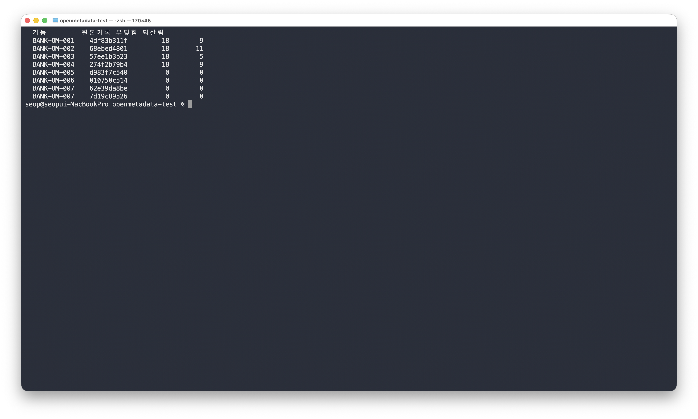
> <sub>2026-08-03 실행. 이 캡처는 세는 방식을 고치기 전 것이라 오른쪽 열이
> 9 · 11 · 5 · 9 (파일 하나의 값)로 찍혀 있습니다. 지금 실행하면 162 ·
> 198 · 90 · 162 로 나옵니다 — 아래 설명을 보십시오</sub>

> **이 캡처의 숫자가 문서와 다른 이유** — 예전 스크립트는 충돌 해결 도구가 낸
> 18줄 중 **첫 줄만 읽어서** 파일 하나의 항목 수(9)를 합계인 것처럼
> 찍었습니다. 세는 방식을 고쳐 지금은 합계(162)가 나옵니다. **만들어진
> 코드는 그대로입니다** — 4부의 확인값 `e490ed82dd…` 가 고치기 전과 후에
> 똑같이 나오는 것으로 확인했습니다. 바뀐 것은 화면에 찍히는 숫자뿐입니다.

## 구간 6 — 후보 확인

```
  검사 후보 기록 번호 : (실행할 때마다 다른 값)
  OK  옮겨진 변경 기록 수 = 8
  OK  공식 1.13.1 대비 변경 파일 수 = 111
━━ 예행연습 완료 ━━
```

> 📸 **⑨**
>
> 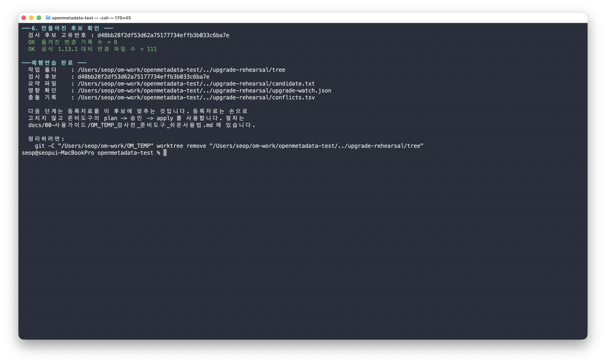
> <sub>실제로 이렇게 나옵니다 (2026-08-03 실행)</sub>

---

# 4부 · 남과 같은 결과인지 확인 ★★

여기가 **“내부적으로 해보니 됐어요”와 “누구나 같은 결과가 나옵니다”를
가르는 지점**입니다.

```bash
# 만들어진 후보 폴더의 '파일 내용 전체'를 번호 하나로 요약해 찍습니다.
#   -C <폴더>     그 폴더에서 실행하라는 뜻
#   HEAD^{tree}   지금 상태의 파일 내용 (만든 시각은 빼고)
git -C ~/om-work/upgrade-rehearsal/tree rev-parse HEAD^{tree}
```

**아래 값이 나오면 성공입니다.**

```
e490ed82dd9cfe58833b2050a233aae7496541ab
```

> 📸 **⑩** — 이 화면 하나가 발표 전체의 근거입니다.
>
> 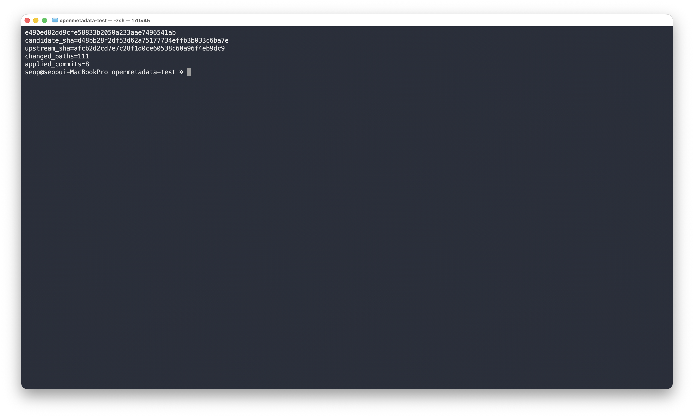
> <sub>실제로 이렇게 나옵니다 (2026-08-03 실행)</sub>

## 기록 번호가 저와 다른 것은 정상입니다

```bash
# 이번 실행에서 만들어진 후보의 정보를 그대로 출력합니다
cat ~/om-work/upgrade-rehearsal/candidate.txt
```

여기 적힌 `candidate_sha` 는 **실행할 때마다 달라집니다.** 변경 기록 번호에는
만든 시각이 섞여 들어가기 때문입니다.

| | 같아야 하나 | 이유 |
|---|---|---|
| `candidate_sha` (기록 번호) | ✗ 달라도 정상 | 만든 시각이 섞임 |
| `tree` 번호 (파일 내용) | **✓ 같아야 함** | 결과물이 한 글자도 다르지 않음 |

발표에서는 이렇게 말씀하시면 됩니다 —
**“번호는 매번 다르지만 내용은 똑같습니다. 그래서 누가 돌려도 같은 결과입니다.”**

---

# 5부 · 예행연습 다음 — 원격에 올리고 검사기 돌리기

> **여기부터는 예행연습이 아닙니다.** 4부까지는 내 컴퓨터 안에서만 도는
> 일이었고, 여기서부터 **원격 저장소에 실제로 올립니다.** 시연 당일
> 순서대로 하실 수 있도록 적어 둡니다.

## 왜 올려야 하나

검사기는 **원격에 있는 갈래를 기준으로** 검사합니다. 내 컴퓨터에만 있는
후보는 다른 사람이 확인할 수 없기 때문입니다. 지금 그 갈래가 원격에 없어서
**검사기가 판단 자체를 못 하는 상태**입니다.

## 1. 후보를 원격에 올리기

```bash
cd ~/om-work/upgrade-rehearsal/tree

# 지금 폴더의 후보를 제품 저장소에 새 갈래 두 개로 올립니다
git push origin HEAD:refs/heads/custom/om-1.13.1
git push origin OFFICIAL_1_13_1:refs/heads/patch/om-1.13.1
```

| 올리는 갈래 | 내용 |
|---|---|
| `patch/om-1.13.1` | OpenMetadata 1.13.1 그대로 (우리 기능 없음) |
| `custom/om-1.13.1` | 그 위에 우리 기능 8건을 얹은 후보 |

1.13.0 때와 **같은 이름 규칙**입니다. 검사기가 이 두 갈래를 짝지어 봅니다.

> ⚠️ **원격에 쓰는 첫 단계입니다.** 여기부터는 되돌리기가 간단하지
> 않으므로, 4부의 확인값 `e490ed82dd…` 가 나온 것을 보고 진행하십시오.

## 2. 등록자료 검사 5종

```bash
cd ~/om-work/openmetadata-test
git -C ~/om-work/OM_TEMP fetch origin patch/om-1.13.1 custom/om-1.13.1

./.venv/bin/python harness/registrations/om-temp-1.13.0/validate_registration_bundle.py \
  --repo ~/om-work/OM_TEMP \
  --registration harness/registrations/om-temp-1.13.1
```

| 붙인 값 | 뜻 |
|---|---|
| `--repo` | 검사할 제품 코드 폴더 |
| `--registration` | 대조할 1.13.1 등록 폴더 |

**나와야 할 것 — 5개 항목이 모두 `pass`**

| 검사 | 확인값 |
|---|---|
| Manifest 구조와 작성 규칙 | 7개 Manifest |
| Registry·Manifest·Contract 연결 | 7개 BANK-OM |
| Git 전체 변경 목록 | 111개 경로 |
| 공용 파일 소유정보 | 37개 공용 경로 |
| 필수 테스트 코드 존재 | 9개 Python pytest |

> 📸 **⑪**

## 3. 소스 게이트 8종

```bash
./.venv/bin/python harness/run_source_candidate_gates.py \
  --repo ~/om-work/OM_TEMP \
  --harness harness \
  --registration harness/registrations/om-temp-1.13.1 \
  --layout harness/registrations/om-temp-1.13.1/repository-layout.yaml \
  --sensitive-zones harness/registrations/om-temp-1.13.1/sensitive-zones.yaml
```

**나와야 할 것 — 8개가 모두 `pass`**

| 게이트 | 무엇을 보나 |
|---|---|
| `vendor-ancestry` | 후보가 공식 1.13.1 의 자손인가 |
| `customization-survival` | **우리 변경이 새 코드에 살아남았는가** |
| `required-test-implementations` | 필수 테스트가 실제로 있는가 |
| `commit-invariants` | 변경 기록의 형태 규칙 |
| `id-invariants` | 이름표 규칙 |
| `drift` | 등록표와 코드가 어긋났는가 |
| `sensitive-zones` | 손대면 안 되는 구역을 건드렸는가 |
| `exact-scope-history` | 손댄 범위가 등록표와 정확히 같은가 |

> 📸 **⑫**

두 번째 `customization-survival` 이 **G6 에서 본 `required_changed_paths`
를 실제로 확인하는 검사**입니다. 앞에서 설명한 "파일이 있는가 / 내용이
아직 다른가" 두 가지를 여기서 봅니다.

## 4. 결과 확인

```bash
cat harness/registrations/om-temp-1.13.1/registration-validation-results.json
cat harness/registrations/om-temp-1.13.1/source-gate-results.json
```

소스 게이트 결과 안에 **후보의 파일 내용 번호**가 함께 적힙니다.

```json
"candidate": {
  "tree_sha": "e490ed82dd9cfe58833b2050a233aae7496541ab"
}
```

**4부에서 확인하신 값과 같아야 합니다.** 같으면 "이 검사 결과는 내가 만든
그 후보에 대한 것"이 성립합니다. 4부의 확인값이 왜 중요한지가 여기서
드러납니다.

> 📸 **⑬** — 이 화면이 이 시연의 마지막입니다.

## 그래도 배포해도 된다는 뜻은 아닙니다

여기까지 전부 통과해도 확인된 것은 **코드를 읽어서 알 수 있는 것**까지입니다.

| 남은 것 | 상태 |
|---|---|
| 전체 프로그램 빌드 | 별도 |
| 실제 서버에서 화면·기능 시험 | 별도 |
| 운영 배포 승인 | 별도 |

---

# 6부 · 등록표는 어떻게 만들어지나 (선택)

> **5부까지가 시연의 본체입니다.** 여기는 "그 등록표는 누가 어떻게 만드느냐"는
> 질문이 나왔을 때 펼치는 부분입니다. 발표에서 건너뛰어도 앞의 결론은
> 그대로입니다.

G6 에서 본 `BANK-OM-001.yaml` 같은 파일을 **등록표(Manifest)** 라고 부릅니다.
기능 하나가 어느 파일을 건드리는지, 그중 무엇이 없어지면 안 되는지를 적어 둔
문서입니다. 검사기는 코드가 아니라 **이 문서를 기준으로** 판정합니다.

## 손으로 고치는 것이 금지돼 있습니다

등록표는 검사의 기준입니다. 기준을 사람이 자유롭게 고칠 수 있으면 검사는
의미가 없어집니다. 그래서 **세 단계로 나눠 놓았습니다.**

```text
plan  ──────►  담당자 승인  ──────►  apply
(조사)          (사람 판단)          (반영)

읽기만 함        질문에 답함         승인한 그대로만 씀
아무것도         등록 폴더를         제안이 조금이라도
안 바꿈          안 건드림           바뀌면 거부
```

| 단계 | 하는 일 | 등록 폴더를 바꾸나 |
|---|---|---|
| `plan` | Git 사실을 계산해 **제안서**를 만듦 | **아니오** |
| 승인 | 사람이 질문에 답하고 승인서를 씀 | 아니오 |
| `apply` | 승인서와 제안서가 정확히 맞을 때만 반영 | **예** |

기계가 하는 것은 **Git에서 읽을 수 있는 사실**뿐입니다 — 어느 변경 기록이
어느 파일을 바꿨는가. 기계가 하지 않는 것은 **업무 판단**입니다 — 그중
무엇이 없어지면 안 되는가, 담당자는 누구인가.

## 1. plan — 조사만 합니다

검사 저장소 최상위에서 실행합니다.

```bash
cd ~/om-work/openmetadata-test

./.venv/bin/python harness/prepare_registration.py plan \
  --repo ~/om-work/OM_TEMP \
  --registration harness/registrations/om-temp-1.13.0 \
  --patch-ref origin/patch/om-1.13.0 \
  --custom-ref origin/custom/om-1.13.0 \
  --product-version 1.13.0 \
  --output ~/om-work/plan-out
```

| 붙인 값 | 뜻 |
|---|---|
| `--repo` | 읽을 제품 코드 폴더 |
| `--registration` | 대조할 등록 폴더 |
| `--patch-ref` | 공식 코드만 있는 갈래 |
| `--custom-ref` | 우리 기능까지 있는 갈래 |
| `--product-version` | 어느 버전의 등록인지 |
| `--output` | 조사 결과를 쌓을 **바깥** 폴더 |

**실제 출력입니다.**

```json
{
  "analysis_error_count": 0,
  "blocked_count": 0,
  "change_count": 0,
  "output": "/Users/…/om-work/plan-out",
  "proposal_digest": "sha256:488e95b2b836b22906bee57f4c133ca7e3ee829da1a479bc51a71908456fb059",
  "review_count": 5,
  "status": "REVIEW_REQUIRED"
}
```

> 📸 **⑭**

> **지문(`proposal_digest`)이 위와 달라도 정상입니다.** 이 값은 등록표·담당자
> 목록 같은 입력 파일의 현재 내용을 요약한 것이라, 그중 하나라도 바뀌면
> 달라집니다. 같아야 하는 것은 지문이 아니라 **`patch SHA`·`custom SHA` 두
> 개**입니다. 지문은 "승인한 그 제안과 지금 반영하려는 제안이 같은가"를
> 대조하는 데만 씁니다.

**종료코드는 2 입니다.** 실패가 아닙니다. 3부 구간 3에서 본 것과 같은 뜻으로,
**사람이 답할 질문이 남았다**는 표시입니다.

| 상태 | 종료코드 | 뜻 |
|---|---|---|
| `READY` | 0 | 질문 없음. 바로 승인으로 |
| `REVIEW_REQUIRED` | 2 | **사람이 답할 질문이 있음** ← 지금 이것 |
| `BLOCKED` | 1 | 안전하게 반영할 수 없음. 원인을 고치고 다시 |
| `ANALYSIS_ERROR` | 3 | 판단 자체가 불가능. **통과로 보면 안 됨** |

### plan 이 정말 아무것도 안 바꿨는지 확인

```bash
# 조사 후 검사 저장소에 바뀐 것이 있는지 봅니다
git -C ~/om-work/openmetadata-test status --porcelain
```

**아무것도 안 나옵니다.** 조사 결과는 전부 `--output` 으로 지정한 바깥
폴더에만 쌓입니다. "조사는 읽기 전용"이라는 말이 문서상의 약속이 아니라
이 한 줄로 확인된다는 점이 요점입니다.

### 생기는 파일

```bash
# 조사 결과로 어떤 파일들이 생겼는지 봅니다
ls ~/om-work/plan-out
```

| 파일 | 내용 |
|---|---|
| `summary.md` | 사람이 먼저 읽는 한 장짜리 요약 |
| `review-required.yaml` | **담당자가 답해야 할 질문 목록** |
| `proposal.yaml` | 제안 전문. 다음 단계의 입력 |
| `proposal-digest.txt` | 제안 내용의 지문(digest) |
| `commit-inventory.yaml` | 변경 기록별로 어느 파일을 바꿨는지 |
| `current-diff-paths.txt` | 지금 두 갈래의 파일 차이 |
| `diff.patch` | 등록표가 어떻게 바뀌는지. **이번엔 0바이트** |
| `proposed-registration/` | 바뀔 등록표 원본. **이번엔 비어 있음** |

마지막 두 개가 비어 있는 것이 이번 결과의 핵심입니다. **자동 변경 0건** —
기계가 고칠 것은 하나도 없고, 남은 것은 전부 사람이 답할 질문이라는 뜻입니다.

## 2. 질문 읽기 — 기계가 답하지 않는 것

```bash
cat ~/om-work/plan-out/summary.md                  # 한 장짜리 요약부터 봅니다
head -30 ~/om-work/plan-out/review-required.yaml   # 담당자가 답할 질문 목록 앞 30줄
```

이번에 나온 질문 5건입니다.

| 번호 | 기능 | 파일 수 | 질문 |
|---|---|---|---|
| `REVIEW-0001` | BANK-OM-001 | 16개 | 공식에 없는 행내 전용 파일을 계속 지켜볼 것인가 |
| `REVIEW-0002` | BANK-OM-002 | 18개 | 〃 |
| `REVIEW-0003` | BANK-OM-003 | 3개 | 〃 |
| `REVIEW-0004` | BANK-OM-006 | 3개 | 〃 |
| `REVIEW-0005` | BANK-OM-007 | 3개 | 〃 |

> 📸 **⑮**

### 왜 이건 기계가 못 정하나

이 파일들은 **공식 OpenMetadata 에는 없고 우리만 만든 것**입니다. 공식이
바꿀 리 없는 파일이니 감시 목록에서 빼도 되고, 그래도 남겨 두는 편이 안전할
수도 있습니다.

**어느 쪽도 코드를 읽어서는 알 수 없습니다.** 그 기능을 운영에서 어떻게 쓰는지
아는 사람만 답할 수 있습니다. 그래서 기계가 임의로 정하지 않고 멈춰 서서
묻습니다.

## 3. 승인서 쓰기

빈 서식을 받습니다. `--proposal` 에는 **폴더가 아니라 `proposal.yaml` 파일**을
줍니다.

```bash
./.venv/bin/python harness/prepare_registration.py approval-template \
  --proposal ~/om-work/plan-out/proposal.yaml \
  --output ~/om-work/approval.yaml
```

| 붙인 값 | 뜻 |
|---|---|
| `--proposal` | 방금 만든 제안서 **파일** (폴더가 아닙니다) |
| `--output` | 여기에 빈 승인서를 만들어 줍니다 |

```yaml
schema_version: 1
proposal_digest: sha256:488e95b2b836b22906bee57f4c133ca7e3ee829da1a479bc51a71908456fb059
approved_by: REPLACE_WITH_APPROVER_ID
approved_at: REPLACE_WITH_RFC3339_TIME
decisions:
- finding_id: REVIEW-0001
  decision: accept_proposal
  reason: REPLACE_WITH_REVIEW_REASON
  …
```

`REPLACE_WITH_…` 세 자리를 채웁니다.

| 자리 | 채우는 값 | 예 |
|---|---|---|
| `approved_by` | 승인자 ID | `hong.gildong` |
| `approved_at` | 승인 시각 (시차 포함) | `2026-08-03T14:00:00+09:00` |
| `reason` | **질문별 판단 사유** | `운영 중 사용 중인 화면이라 감시 유지` |

> **사유는 질문마다 따로 씁니다.** 다섯 건에 같은 문장을 붙여 넣는 것은
> 형식상 통과하지만, 나중에 "왜 그렇게 정했느냐"에 답할 근거가 없어집니다.
> 이 승인서가 그대로 감사 기록으로 남습니다.

> **시각은 시차까지 적어야 합니다.** `2026-08-03T14:00` 처럼 `+09:00` 이
> 없으면 거부됩니다. 어느 지역 시간인지 모르면 승인 시점이 특정되지
> 않기 때문입니다.

## 4. 채우지 않으면 어떻게 되나

서식 그대로 반영을 시도해 봅니다.

```bash
./.venv/bin/python harness/prepare_registration.py apply \
  --repo ~/om-work/OM_TEMP \
  --registration harness/registrations/om-temp-1.13.0 \
  --proposal ~/om-work/plan-out/proposal.yaml \
  --approval ~/om-work/approval.yaml
```

| 붙인 값 | 뜻 |
|---|---|
| `--repo` | 갈래가 승인 때와 그대로인지 다시 확인 |
| `--registration` | 실제로 반영할 등록 폴더 |
| `--proposal` | 승인받은 바로 그 제안서 |
| `--approval` | 채워 넣은 승인서 |

```json
{
  "code": "POLICY_REFUSED",
  "message": "approval still contains placeholder approver",
  "status": "BLOCKED"
}
```

**종료코드 1 로 막힙니다.** 등록 폴더는 그대로입니다.

발표에서 보여줄 값어치가 있는 화면입니다. "승인 절차가 형식적인 것 아니냐"는
물음에 **빈 승인서로는 실제로 반영이 안 된다**는 것을 그 자리에서 보여줄 수
있습니다.

> 📸 **⑯**

`apply` 가 거부하는 경우는 이것 말고도 있습니다.

| 상황 | 왜 막나 |
|---|---|
| 승인서의 지문이 제안서와 다름 | 승인한 제안이 아닌 다른 것을 반영하려는 것 |
| 두 갈래가 그 사이 움직임 | 승인 시점과 코드가 달라짐 |
| 등록표·담당자 목록이 그 사이 바뀜 | 승인자가 본 기준이 아님 |
| 질문에 빠짐없이 답하지 않음 | 답하지 않은 판단이 남음 |
| 다른 사람이 같은 폴더에 반영 중 | 동시에 쓰면 결과가 섞임 |

**"승인한 그 순간의 상태가 아니면 반영하지 않는다"** — 한 줄로 이겁니다.

## 5. 제대로 채우면

```json
{
  "status": "APPLIED",
  "approved_by": "hong.gildong",
  "patch_sha": "2f4f3560e7a8437e2f4f7fcafd00d32ea2d91a50",
  "custom_head_sha": "7d19c8952612e77467b0a80d6287170d814f1de1",
  "proposal_digest": "sha256:488e95b2b836b22906bee57f4c133ca7e3ee829da1a479bc51a71908456fb059",
  "written_files": ["commit-inventory.yaml", "current-diff-paths.txt"]
}
```

`written_files` 가 **실제로 쓴 파일 전부**입니다. 승인서에 없는 파일은
쓰지 않습니다.

> **시연으로 여기까지 해 보셨다면 되돌려 두십시오.** `apply` 는 등록 폴더에
> 실제로 파일을 씁니다.
>
> ```bash
> cd ~/om-work/openmetadata-test
> git status --porcelain          # 무엇이 생겼는지 먼저 확인
> git checkout -- harness/registrations/
> git clean -f harness/registrations/
> ```

## 등록표 안에는 무엇이 적혀 있나

`BANK-OM-005`(한글 입력 보정) 전문입니다. 가장 짧아서 전체가 한눈에 들어옵니다.

```yaml
customization_id: BANK-OM-005
status: active
kind: core-patch
title: 한글 입력 조합 보정
implementation:
  changed_paths:                     # 이 기능이 손댄 파일 전부
  - …/SchemaEditor/SchemaEditor.tsx
  required_changed_paths:            # 그중 없어지면 안 되는 것
  - …/SchemaEditor/SchemaEditor.tsx
upgrade_watch:
  paths:                             # 공식이 바꾸면 확인해야 할 것
  - …/ui/package.json
  - …/SchemaEditor/SchemaEditor.tsx
assurance:
  contracts:
  - CONTRACT-KOREAN-IME              # 정상이라고 판단할 조건
```

세 줄만 구분하시면 됩니다.

| 항목 | 뜻 | 없으면 |
|---|---|---|
| `changed_paths` | 이 기능이 **손댄 파일 전부** | 범위를 알 수 없음 |
| `required_changed_paths` | 그중 **하나라도 사라지면 실패** | 기능이 조용히 지워져도 통과함 |
| `upgrade_watch.paths` | 이 파일이 바뀌면 **확인 필요** | 3부 구간 3의 `48개 중 22개` 같은 숫자가 안 나옴 |

3부 구간 3에서 본 `BANK-OM-001 … 22` 는 **여기 `upgrade_watch.paths` 에
적힌 48개 중 이번 업그레이드가 22개를 건드렸다**는 뜻입니다. 그 48이
어디서 나온 숫자인지가 이 화면에 있습니다.

> 구간 5 요약표의 `18` 과 헷갈리지 마십시오. 그쪽은 **실제로 합칠 때
> 충돌한 파일 수**이고, 여기 22는 **합치기 전에 이름만 대조해 본 수**입니다.

`package.json` 이 감시 목록에 있는 이유도 같습니다. 코드를 직접 고치지
않아도 **딸려 쓰는 라이브러리 버전이 바뀌면** 한글 입력이 깨질 수 있기
때문입니다.

## 더 자세한 절차

새 기능에 번호를 새로 발급하거나 등록표를 처음부터 쓰는 절차는 이 문서 범위
밖입니다.

| 자료 | 다루는 것 |
|---|---|
| [`OM_TEMP 검사 전 준비도구 쉬운 사용법`](OM_TEMP_검사전_준비도구_쉬운사용법.md) | 역할별로 누가 무엇을 하는지, 상태값 읽는 법 |
| [`OM_TEMP Manifest 작성 단계별 가이드`](OM_TEMP_Manifest_작성_단계별_가이드.md) | 항목 하나하나를 정하는 기준 |
| [`BANK-OM 등록 정책`](../02-설계/bank_om_registration_policy.md) | 번호 발급 규칙과 저장소 역할 |

---

# 막혔을 때

| 화면에 나오는 말 | 원인 | 대처 |
|---|---|---|
| `제품 저장소에 커밋하지 않은 변경이 있습니다` | OM_TEMP에 손댄 파일이 있음 | `git -C ~/om-work/OM_TEMP status` 로 확인 후 정리 |
| `검사 저장소 루트에서 실행하십시오` | 폴더를 잘못 잡음 | `cd ~/om-work/openmetadata-test` 후 재실행 |
| `... 이(가) 기대와 다릅니다` | 원격 갈래가 움직임 | 캡처해서 문의 |
| `python 의존성 부족` | 준비 4단계 안 함 | 4단계 재실행 |
| `... 이(가) 이미 있습니다` | 이전 실행 흔적이 남음 | 아래 정리 명령 |
| `JSON 이외 파일이 충돌했습니다` | 프로그램 파일이 충돌 | **자동 처리 대상이 아닙니다.** 캡처 후 개발자에게 |
| `... 의 파일 내용을 읽지 못했습니다` | 공식 배포본을 온전히 받지 못함 | 화면에 함께 나오는 `--refetch` 명령을 실행한 뒤 재시도 |

## 다시 돌리기 전 정리

맨 위 **0부 ①** 의 세 줄과 같습니다.

---

# 여기까지가 어디까지인가

예행연습이 하는 일은 **검사할 후보 코드를 만드는 데까지**입니다.

| | 상태 |
|---|---|
| 공식 새 버전 위에 기능 7개를 다시 얹기 | 이 문서로 완료 |
| 등록표를 새 코드에 맞추기 | **사람 승인 필요** — 자동화하지 않음 |
| 전체 프로그램 빌드 | 별도 |
| 실제 서버에서 화면·기능 시험 | 별도 |
| 운영 배포 승인 | 별도 |

등록표를 맞추는 절차는 손으로 고치는 것이 금지되어 있고, 반드시
`조사 → 담당자 승인 → 반영` 3단계를 거칩니다. 사람 승인이 중간에 들어가야
하므로 예행연습 스크립트에 넣지 않았습니다. **그 3단계를 실제로 돌려 본
기록이 6부**에 있습니다.

## 함께 보는 자료

| 자료 | 용도 |
|---|---|
| `assets/업그레이드시연/` | 이 순서를 실제로 돌려 찍은 캡처와 실행 로그 |
| `OM_TEMP_검사전_준비도구_쉬운사용법.md` | 5부의 절차를 역할별로 나눠 설명한 것 |
| `OM_TEMP_1.13.0_1.13.1_업그레이드_실행_가이드.md` | 충돌 상세와 배경 설명 |

---

**이 예행연습을 모두 통과해도 배포해도 된다는 뜻이 아닙니다.**
확인한 것은 “코드를 읽어서 알 수 있는 것”까지입니다.
