# OM_TEMP 검사 전 사전환경 설정 가이드

> 대상 코드: `easyseop/OM_TEMP`의 `custom/om-1.13.0`
> 검사 설정 위치: `easyseop/openmetadata-test/harness/registrations/om-temp-1.13.0/`

## 이 자료가 필요한 이유

이 문서는 전체 가이드에서 검사기 원리를 설명한 다음에 읽습니다. 다만 실제 작업 순서는 반대가 아닙니다. **검사기를 실행하기 전에 이 기준자료를 먼저 준비해야 합니다.** 검사기 설명을 먼저 읽는 이유는 각 자료가 어느 검사에 사용되는지 이해한 뒤 설정할 수 있게 하기 위해서입니다.

검사기는 Git의 실제 코드만 읽는 것이 아니라, 어떤 BANK-OM을 검사하고 어떤 파일·동작을 정상으로 판단할지 정한 기준자료와 비교합니다. 이 자료는 검사 전에 준비할 Manifest와 검사 기준자료, 로컬 OM_TEMP 연결 방법을 실제 1.13.0 예시로 설명합니다.

## 언제 만들고 언제 갱신하나

| 구분 | 최초 커스터마이징 등록 | 공식 버전 업그레이드 | 매 검사 실행 |
|---|---|---|---|
| Manifest·Registry·Contract | 최초 작성 | 기존 자료를 복사해 새 코드 기준으로 검토·갱신 | 확정본을 읽음 |
| 공용 파일 소유정보 | 실제 diff의 중복 경로를 계산해 작성 | 새 버전 diff로 다시 계산·검토 | 확정본을 읽음 |
| 전체 변경 목록 | Git에서 생성 | 새 버전 branch 사이에서 다시 생성 | 실제 Git diff와 비교 |
| Patch-lock | patch-replay를 쓸 때만 작성 | 재적용 커밋이 바뀌면 새 리비전 작성 | 선택한 전략에서만 읽음 |

따라서 이 자료들은 검사 때마다 버리는 임시 파일이 아닙니다. 최초 등록자료는 계속 관리하고, 버전에 따라 달라지는 Git SHA·경로 목록만 새 버전 기준으로 다시 생성하거나 갱신합니다.

## 먼저 구분할 두 식별값

| 이름 | 의미 | 이 문서에서의 예 |
|---|---|---|
| BANK-OM ID | 사람이 발급하는 업무 기능 번호 | `BANK-OM-005` |
| Git commit SHA | Git이 한 번의 코드 저장에 자동 부여하는 값 | `d983f7c...` |

Manifest는 **BANK-OM ID마다 한 파일**을 만듭니다. 같은 기능을 후속 보완하면 BANK-OM-007처럼 Git commit SHA는 여러 개가 될 수 있지만 Manifest는 하나입니다.

## 사전환경 설정 순서

1. **Manifest 등록** — 커밋별 실제 변경 파일을 BANK-OM ID에 연결합니다.
2. **검사 기준자료 등록** — Registry·Contract·공용 파일·전체 변경 목록을 준비합니다.
3. **로컬 검사 대상 연결** — 검사기가 읽을 OM_TEMP repository와 기준 SHA를 확인합니다.

강조 캡처는 위치를 빠르게 찾기 위한 **설명용 사본**입니다. GitHub 화면 자체를 확인해야 할 때는 같은 항목의 **원본 캡처** 또는 GitHub commit 링크를 사용합니다.

## 1. Manifest 등록

각 BANK-OM 제목을 펼치면 실제 GitHub commit, 기능 단위로 묶은 이유, Manifest 초안 전체를 확인할 수 있습니다.

<details>
<summary><strong>BANK-OM-001 · 기준코드(InstanceCode)</strong></summary>

### 실제 GitHub 커밋

- Git commit SHA: `4df83b311f1ec38156c9b992f34607b22224db85`
- 커밋 제목: `add InstanceCode customization`
- 이 커밋에서 변경한 파일: 48개
- [GitHub에서 실제 커밋 열기](https://github.com/easyseop/OM_TEMP/commit/4df83b311f1ec38156c9b992f34607b22224db85)

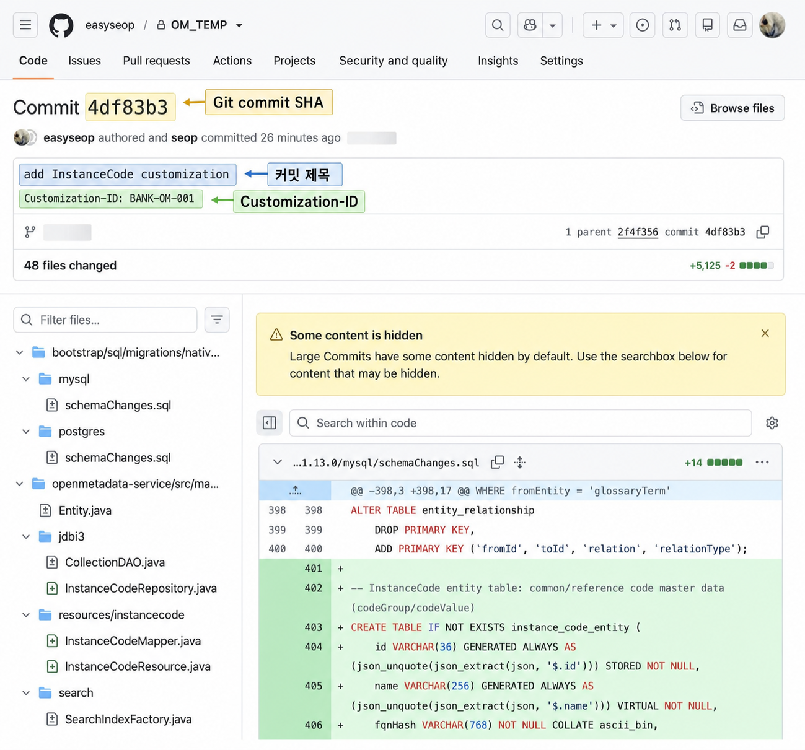

<details>
<summary>강조 표시가 없는 원본 캡처 보기</summary>

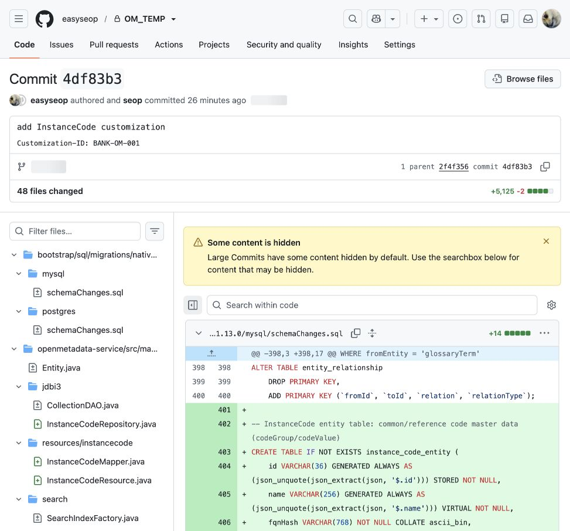

</details>

### 왜 하나의 BANK-OM 기능으로 보았나

InstanceCode라는 새 데이터 유형을 정의하고, 저장·검색·API·화면 연결까지 한 번에 추가한 변경입니다. 파일은 여러 개지만 모두 InstanceCode 기능을 동작시키기 위한 한 묶음이므로 BANK-OM-001 하나로 관리합니다.

<details>
<summary><strong>BANK-OM-001 Manifest 초안 전체 보기</strong></summary>

```yaml
schema_version: 1
customization_id: BANK-OM-001
status: active
kind: core-patch
title: 기준코드(InstanceCode)
implementation:
  allowed_changed_paths:
  - bootstrap/sql/migrations/native/1.13.0/mysql/schemaChanges.sql
  - bootstrap/sql/migrations/native/1.13.0/postgres/schemaChanges.sql
  - openmetadata-service/src/main/java/org/openmetadata/service/Entity.java
  - openmetadata-service/src/main/java/org/openmetadata/service/jdbi3/CollectionDAO.java
  - openmetadata-service/src/main/java/org/openmetadata/service/jdbi3/InstanceCodeRepository.java
  - openmetadata-service/src/main/java/org/openmetadata/service/resources/instancecode/InstanceCodeMapper.java
  - openmetadata-service/src/main/java/org/openmetadata/service/resources/instancecode/InstanceCodeResource.java
  - openmetadata-service/src/main/java/org/openmetadata/service/search/SearchIndexFactory.java
  - openmetadata-service/src/main/java/org/openmetadata/service/search/indexes/InstanceCodeIndex.java
  - openmetadata-spec/src/main/resources/elasticsearch/en/instance_code_index_mapping.json
  - openmetadata-spec/src/main/resources/elasticsearch/indexMapping.json
  - openmetadata-spec/src/main/resources/elasticsearch/jp/instance_code_index_mapping.json
  - openmetadata-spec/src/main/resources/elasticsearch/ru/instance_code_index_mapping.json
  - openmetadata-spec/src/main/resources/elasticsearch/zh/instance_code_index_mapping.json
  - openmetadata-spec/src/main/resources/json/schema/api/data/createInstanceCode.json
  - openmetadata-spec/src/main/resources/json/schema/entity/data/instanceCode.json
  - openmetadata-ui/src/main/resources/ui/src/components/AppRouter/AuthenticatedAppRouter.tsx
  - openmetadata-ui/src/main/resources/ui/src/components/InstanceCode/InstanceCodeListPage.tsx
  - openmetadata-ui/src/main/resources/ui/src/constants/constants.ts
  - openmetadata-ui/src/main/resources/ui/src/context/PermissionProvider/PermissionProvider.interface.ts
  - openmetadata-ui/src/main/resources/ui/src/enums/Explore.enum.ts
  - openmetadata-ui/src/main/resources/ui/src/enums/entity.enum.ts
  - openmetadata-ui/src/main/resources/ui/src/enums/search.enum.ts
  - openmetadata-ui/src/main/resources/ui/src/generated/api/data/createInstanceCode.ts
  - openmetadata-ui/src/main/resources/ui/src/generated/entity/data/instanceCode.ts
  - openmetadata-ui/src/main/resources/ui/src/locale/languages/ar-sa.json
  - openmetadata-ui/src/main/resources/ui/src/locale/languages/de-de.json
  - openmetadata-ui/src/main/resources/ui/src/locale/languages/en-us.json
  - openmetadata-ui/src/main/resources/ui/src/locale/languages/es-es.json
  - openmetadata-ui/src/main/resources/ui/src/locale/languages/fr-fr.json
  - openmetadata-ui/src/main/resources/ui/src/locale/languages/gl-es.json
  - openmetadata-ui/src/main/resources/ui/src/locale/languages/he-he.json
  - openmetadata-ui/src/main/resources/ui/src/locale/languages/ja-jp.json
  - openmetadata-ui/src/main/resources/ui/src/locale/languages/ko-kr.json
  - openmetadata-ui/src/main/resources/ui/src/locale/languages/mr-in.json
  - openmetadata-ui/src/main/resources/ui/src/locale/languages/nl-nl.json
  - openmetadata-ui/src/main/resources/ui/src/locale/languages/pr-pr.json
  - openmetadata-ui/src/main/resources/ui/src/locale/languages/pt-br.json
  - openmetadata-ui/src/main/resources/ui/src/locale/languages/pt-pt.json
  - openmetadata-ui/src/main/resources/ui/src/locale/languages/ru-ru.json
  - openmetadata-ui/src/main/resources/ui/src/locale/languages/th-th.json
  - openmetadata-ui/src/main/resources/ui/src/locale/languages/tr-tr.json
  - openmetadata-ui/src/main/resources/ui/src/locale/languages/zh-cn.json
  - openmetadata-ui/src/main/resources/ui/src/locale/languages/zh-tw.json
  - openmetadata-ui/src/main/resources/ui/src/pages/InstanceCodeDetailsPage/InstanceCodeDetailsPage.tsx
  - openmetadata-ui/src/main/resources/ui/src/pages/InstanceCodeGroupDetailsPage/InstanceCodeGroupDetailsPage.tsx
  - openmetadata-ui/src/main/resources/ui/src/rest/instanceCodeAPI.ts
  - openmetadata-ui/src/main/resources/ui/src/utils/RouterUtils.ts
  required_changed_paths:
  - openmetadata-service/src/main/java/org/openmetadata/service/resources/instancecode/InstanceCodeResource.java
  - openmetadata-spec/src/main/resources/json/schema/entity/data/instanceCode.json
upgrade_watch:
  paths:
  - bootstrap/sql/migrations/native/1.13.0/mysql/schemaChanges.sql
  - bootstrap/sql/migrations/native/1.13.0/postgres/schemaChanges.sql
  - openmetadata-service/src/main/java/org/openmetadata/service/Entity.java
  - openmetadata-service/src/main/java/org/openmetadata/service/jdbi3/CollectionDAO.java
  - openmetadata-service/src/main/java/org/openmetadata/service/jdbi3/InstanceCodeRepository.java
  - openmetadata-service/src/main/java/org/openmetadata/service/resources/instancecode/InstanceCodeMapper.java
  - openmetadata-service/src/main/java/org/openmetadata/service/resources/instancecode/InstanceCodeResource.java
  - openmetadata-service/src/main/java/org/openmetadata/service/search/SearchIndexFactory.java
  - openmetadata-service/src/main/java/org/openmetadata/service/search/indexes/InstanceCodeIndex.java
  - openmetadata-spec/src/main/resources/elasticsearch/en/instance_code_index_mapping.json
  - openmetadata-spec/src/main/resources/elasticsearch/indexMapping.json
  - openmetadata-spec/src/main/resources/elasticsearch/jp/instance_code_index_mapping.json
  - openmetadata-spec/src/main/resources/elasticsearch/ru/instance_code_index_mapping.json
  - openmetadata-spec/src/main/resources/elasticsearch/zh/instance_code_index_mapping.json
  - openmetadata-spec/src/main/resources/json/schema/api/data/createInstanceCode.json
  - openmetadata-spec/src/main/resources/json/schema/entity/data/instanceCode.json
  - openmetadata-ui/src/main/resources/ui/src/components/AppRouter/AuthenticatedAppRouter.tsx
  - openmetadata-ui/src/main/resources/ui/src/components/InstanceCode/InstanceCodeListPage.tsx
  - openmetadata-ui/src/main/resources/ui/src/constants/constants.ts
  - openmetadata-ui/src/main/resources/ui/src/context/PermissionProvider/PermissionProvider.interface.ts
  - openmetadata-ui/src/main/resources/ui/src/enums/Explore.enum.ts
  - openmetadata-ui/src/main/resources/ui/src/enums/entity.enum.ts
  - openmetadata-ui/src/main/resources/ui/src/enums/search.enum.ts
  - openmetadata-ui/src/main/resources/ui/src/generated/api/data/createInstanceCode.ts
  - openmetadata-ui/src/main/resources/ui/src/generated/entity/data/instanceCode.ts
  - openmetadata-ui/src/main/resources/ui/src/locale/languages/ar-sa.json
  - openmetadata-ui/src/main/resources/ui/src/locale/languages/de-de.json
  - openmetadata-ui/src/main/resources/ui/src/locale/languages/en-us.json
  - openmetadata-ui/src/main/resources/ui/src/locale/languages/es-es.json
  - openmetadata-ui/src/main/resources/ui/src/locale/languages/fr-fr.json
  - openmetadata-ui/src/main/resources/ui/src/locale/languages/gl-es.json
  - openmetadata-ui/src/main/resources/ui/src/locale/languages/he-he.json
  - openmetadata-ui/src/main/resources/ui/src/locale/languages/ja-jp.json
  - openmetadata-ui/src/main/resources/ui/src/locale/languages/ko-kr.json
  - openmetadata-ui/src/main/resources/ui/src/locale/languages/mr-in.json
  - openmetadata-ui/src/main/resources/ui/src/locale/languages/nl-nl.json
  - openmetadata-ui/src/main/resources/ui/src/locale/languages/pr-pr.json
  - openmetadata-ui/src/main/resources/ui/src/locale/languages/pt-br.json
  - openmetadata-ui/src/main/resources/ui/src/locale/languages/pt-pt.json
  - openmetadata-ui/src/main/resources/ui/src/locale/languages/ru-ru.json
  - openmetadata-ui/src/main/resources/ui/src/locale/languages/th-th.json
  - openmetadata-ui/src/main/resources/ui/src/locale/languages/tr-tr.json
  - openmetadata-ui/src/main/resources/ui/src/locale/languages/zh-cn.json
  - openmetadata-ui/src/main/resources/ui/src/locale/languages/zh-tw.json
  - openmetadata-ui/src/main/resources/ui/src/pages/InstanceCodeDetailsPage/InstanceCodeDetailsPage.tsx
  - openmetadata-ui/src/main/resources/ui/src/pages/InstanceCodeGroupDetailsPage/InstanceCodeGroupDetailsPage.tsx
  - openmetadata-ui/src/main/resources/ui/src/rest/instanceCodeAPI.ts
  - openmetadata-ui/src/main/resources/ui/src/utils/RouterUtils.ts
assurance:
  contracts:
  - CONTRACT-INSTANCE-CODE
  direct_tests: []
series:
  allowed: false
  depends_on: []
```

</details>

</details>

<details>
<summary><strong>BANK-OM-002 · 쿼리 리포트(QueryReport)</strong></summary>

### 실제 GitHub 커밋

- Git commit SHA: `68ebed4801715f0c30b8a1a614572183fa6097b8`
- 커밋 제목: `add QueryReport customization`
- 이 커밋에서 변경한 파일: 55개
- [GitHub에서 실제 커밋 열기](https://github.com/easyseop/OM_TEMP/commit/68ebed4801715f0c30b8a1a614572183fa6097b8)

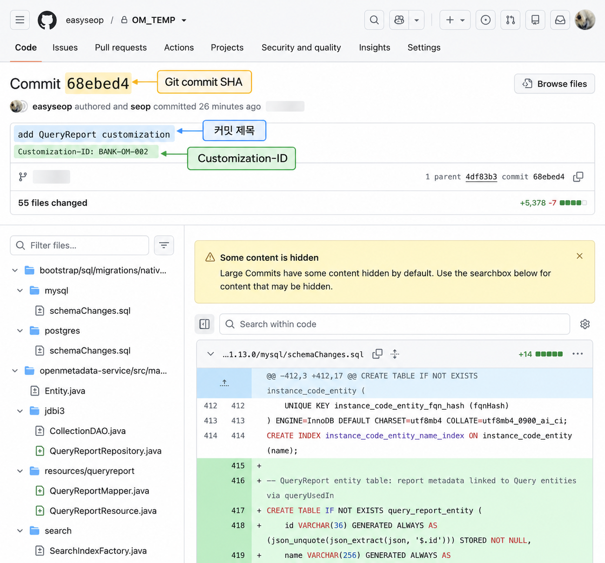

<details>
<summary>강조 표시가 없는 원본 캡처 보기</summary>

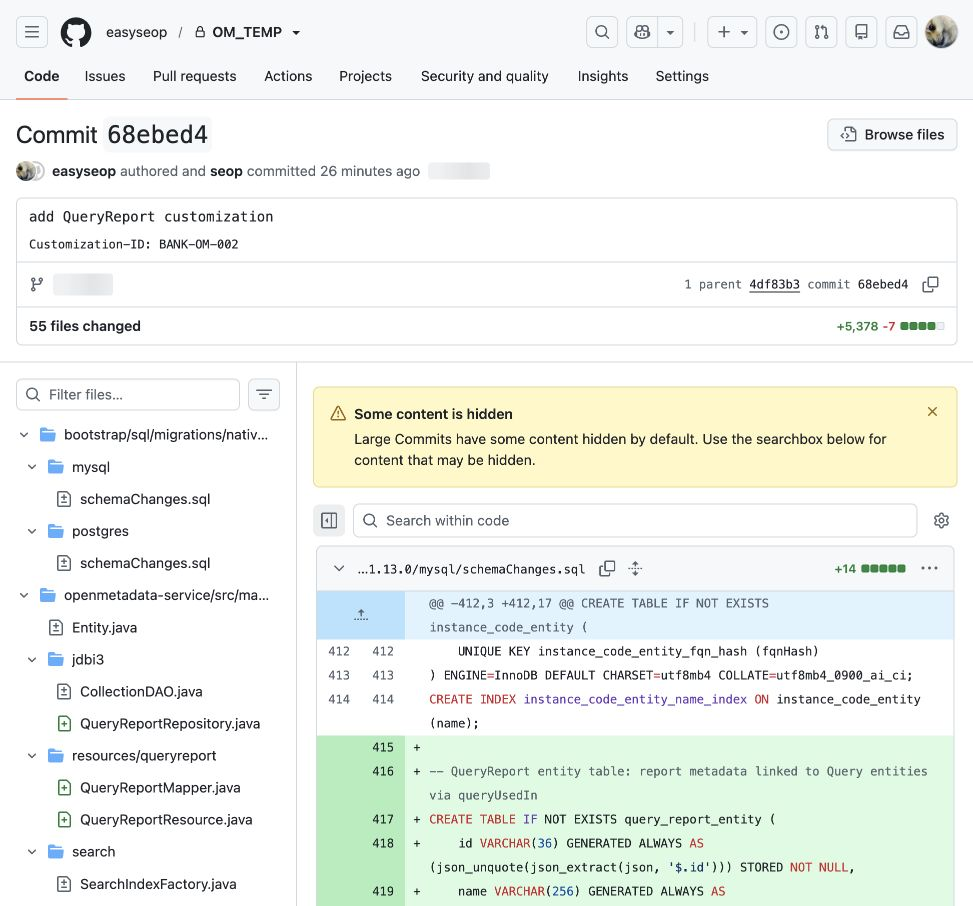

</details>

### 왜 하나의 BANK-OM 기능으로 보았나

QueryReport 데이터 유형, 저장소, API, 검색과 화면 연결을 함께 추가한 변경입니다. BANK-OM-001과 같은 공용 파일도 수정하지만, diff 안의 QUERY_REPORT 연결은 별도 업무 기능이므로 BANK-OM-002로 분리합니다.

<details>
<summary><strong>BANK-OM-002 Manifest 초안 전체 보기</strong></summary>

```yaml
schema_version: 1
customization_id: BANK-OM-002
status: active
kind: core-patch
title: 쿼리 리포트(QueryReport)
implementation:
  allowed_changed_paths:
  - bootstrap/sql/migrations/native/1.13.0/mysql/schemaChanges.sql
  - bootstrap/sql/migrations/native/1.13.0/postgres/schemaChanges.sql
  - openmetadata-service/src/main/java/org/openmetadata/service/Entity.java
  - openmetadata-service/src/main/java/org/openmetadata/service/jdbi3/CollectionDAO.java
  - openmetadata-service/src/main/java/org/openmetadata/service/jdbi3/QueryReportRepository.java
  - openmetadata-service/src/main/java/org/openmetadata/service/resources/queryreport/QueryReportMapper.java
  - openmetadata-service/src/main/java/org/openmetadata/service/resources/queryreport/QueryReportResource.java
  - openmetadata-service/src/main/java/org/openmetadata/service/search/SearchIndexFactory.java
  - openmetadata-service/src/main/java/org/openmetadata/service/search/indexes/QueryReportIndex.java
  - openmetadata-spec/src/main/resources/elasticsearch/en/query_index_mapping.json
  - openmetadata-spec/src/main/resources/elasticsearch/en/query_report_index_mapping.json
  - openmetadata-spec/src/main/resources/elasticsearch/indexMapping.json
  - openmetadata-spec/src/main/resources/elasticsearch/jp/query_index_mapping.json
  - openmetadata-spec/src/main/resources/elasticsearch/jp/query_report_index_mapping.json
  - openmetadata-spec/src/main/resources/elasticsearch/ru/query_index_mapping.json
  - openmetadata-spec/src/main/resources/elasticsearch/ru/query_report_index_mapping.json
  - openmetadata-spec/src/main/resources/elasticsearch/zh/query_index_mapping.json
  - openmetadata-spec/src/main/resources/elasticsearch/zh/query_report_index_mapping.json
  - openmetadata-spec/src/main/resources/json/schema/api/data/createQueryReport.json
  - openmetadata-spec/src/main/resources/json/schema/entity/data/queryReport.json
  - openmetadata-ui/src/main/resources/ui/src/components/AppRouter/AuthenticatedAppRouter.tsx
  - openmetadata-ui/src/main/resources/ui/src/components/QueryReport/QueryReportListPage.tsx
  - openmetadata-ui/src/main/resources/ui/src/components/QueryReport/QueryReportQueryEditor/QueryReportQueryEditor.component.tsx
  - openmetadata-ui/src/main/resources/ui/src/constants/constants.ts
  - openmetadata-ui/src/main/resources/ui/src/context/PermissionProvider/PermissionProvider.interface.ts
  - openmetadata-ui/src/main/resources/ui/src/enums/Explore.enum.ts
  - openmetadata-ui/src/main/resources/ui/src/enums/entity.enum.ts
  - openmetadata-ui/src/main/resources/ui/src/enums/search.enum.ts
  - openmetadata-ui/src/main/resources/ui/src/generated/api/data/createQueryReport.ts
  - openmetadata-ui/src/main/resources/ui/src/generated/entity/data/queryReport.ts
  - openmetadata-ui/src/main/resources/ui/src/locale/languages/ar-sa.json
  - openmetadata-ui/src/main/resources/ui/src/locale/languages/de-de.json
  - openmetadata-ui/src/main/resources/ui/src/locale/languages/en-us.json
  - openmetadata-ui/src/main/resources/ui/src/locale/languages/es-es.json
  - openmetadata-ui/src/main/resources/ui/src/locale/languages/fr-fr.json
  - openmetadata-ui/src/main/resources/ui/src/locale/languages/gl-es.json
  - openmetadata-ui/src/main/resources/ui/src/locale/languages/he-he.json
  - openmetadata-ui/src/main/resources/ui/src/locale/languages/ja-jp.json
  - openmetadata-ui/src/main/resources/ui/src/locale/languages/ko-kr.json
  - openmetadata-ui/src/main/resources/ui/src/locale/languages/mr-in.json
  - openmetadata-ui/src/main/resources/ui/src/locale/languages/nl-nl.json
  - openmetadata-ui/src/main/resources/ui/src/locale/languages/pr-pr.json
  - openmetadata-ui/src/main/resources/ui/src/locale/languages/pt-br.json
  - openmetadata-ui/src/main/resources/ui/src/locale/languages/pt-pt.json
  - openmetadata-ui/src/main/resources/ui/src/locale/languages/ru-ru.json
  - openmetadata-ui/src/main/resources/ui/src/locale/languages/th-th.json
  - openmetadata-ui/src/main/resources/ui/src/locale/languages/tr-tr.json
  - openmetadata-ui/src/main/resources/ui/src/locale/languages/zh-cn.json
  - openmetadata-ui/src/main/resources/ui/src/locale/languages/zh-tw.json
  - openmetadata-ui/src/main/resources/ui/src/pages/QueryReportDetailsPage/QueryReportDetailsPage.tsx
  - openmetadata-ui/src/main/resources/ui/src/pages/QueryReportYearDetailsPage/QueryReportYearDetailsPage.tsx
  - openmetadata-ui/src/main/resources/ui/src/rest/queryAPI.ts
  - openmetadata-ui/src/main/resources/ui/src/rest/queryReportAPI.ts
  - openmetadata-ui/src/main/resources/ui/src/utils/QueryReportUtils.ts
  - openmetadata-ui/src/main/resources/ui/src/utils/RouterUtils.ts
  required_changed_paths:
  - openmetadata-service/src/main/java/org/openmetadata/service/resources/queryreport/QueryReportResource.java
  - openmetadata-spec/src/main/resources/json/schema/entity/data/queryReport.json
upgrade_watch:
  paths:
  - bootstrap/sql/migrations/native/1.13.0/mysql/schemaChanges.sql
  - bootstrap/sql/migrations/native/1.13.0/postgres/schemaChanges.sql
  - openmetadata-service/src/main/java/org/openmetadata/service/Entity.java
  - openmetadata-service/src/main/java/org/openmetadata/service/jdbi3/CollectionDAO.java
  - openmetadata-service/src/main/java/org/openmetadata/service/jdbi3/QueryReportRepository.java
  - openmetadata-service/src/main/java/org/openmetadata/service/jdbi3/QueryRepository.java
  - openmetadata-service/src/main/java/org/openmetadata/service/resources/queryreport/QueryReportMapper.java
  - openmetadata-service/src/main/java/org/openmetadata/service/resources/queryreport/QueryReportResource.java
  - openmetadata-service/src/main/java/org/openmetadata/service/search/SearchIndexFactory.java
  - openmetadata-service/src/main/java/org/openmetadata/service/search/indexes/QueryReportIndex.java
  - openmetadata-spec/src/main/resources/elasticsearch/en/query_index_mapping.json
  - openmetadata-spec/src/main/resources/elasticsearch/en/query_report_index_mapping.json
  - openmetadata-spec/src/main/resources/elasticsearch/indexMapping.json
  - openmetadata-spec/src/main/resources/elasticsearch/jp/query_index_mapping.json
  - openmetadata-spec/src/main/resources/elasticsearch/jp/query_report_index_mapping.json
  - openmetadata-spec/src/main/resources/elasticsearch/ru/query_index_mapping.json
  - openmetadata-spec/src/main/resources/elasticsearch/ru/query_report_index_mapping.json
  - openmetadata-spec/src/main/resources/elasticsearch/zh/query_index_mapping.json
  - openmetadata-spec/src/main/resources/elasticsearch/zh/query_report_index_mapping.json
  - openmetadata-spec/src/main/resources/json/schema/api/data/createQueryReport.json
  - openmetadata-spec/src/main/resources/json/schema/entity/data/queryReport.json
  - openmetadata-ui/src/main/resources/ui/src/components/AppRouter/AuthenticatedAppRouter.tsx
  - openmetadata-ui/src/main/resources/ui/src/components/QueryReport/QueryReportListPage.tsx
  - openmetadata-ui/src/main/resources/ui/src/components/QueryReport/QueryReportQueryEditor/QueryReportQueryEditor.component.tsx
  - openmetadata-ui/src/main/resources/ui/src/constants/constants.ts
  - openmetadata-ui/src/main/resources/ui/src/context/PermissionProvider/PermissionProvider.interface.ts
  - openmetadata-ui/src/main/resources/ui/src/enums/Explore.enum.ts
  - openmetadata-ui/src/main/resources/ui/src/enums/entity.enum.ts
  - openmetadata-ui/src/main/resources/ui/src/enums/search.enum.ts
  - openmetadata-ui/src/main/resources/ui/src/generated/api/data/createQueryReport.ts
  - openmetadata-ui/src/main/resources/ui/src/generated/entity/data/queryReport.ts
  - openmetadata-ui/src/main/resources/ui/src/locale/languages/ar-sa.json
  - openmetadata-ui/src/main/resources/ui/src/locale/languages/de-de.json
  - openmetadata-ui/src/main/resources/ui/src/locale/languages/en-us.json
  - openmetadata-ui/src/main/resources/ui/src/locale/languages/es-es.json
  - openmetadata-ui/src/main/resources/ui/src/locale/languages/fr-fr.json
  - openmetadata-ui/src/main/resources/ui/src/locale/languages/gl-es.json
  - openmetadata-ui/src/main/resources/ui/src/locale/languages/he-he.json
  - openmetadata-ui/src/main/resources/ui/src/locale/languages/ja-jp.json
  - openmetadata-ui/src/main/resources/ui/src/locale/languages/ko-kr.json
  - openmetadata-ui/src/main/resources/ui/src/locale/languages/mr-in.json
  - openmetadata-ui/src/main/resources/ui/src/locale/languages/nl-nl.json
  - openmetadata-ui/src/main/resources/ui/src/locale/languages/pr-pr.json
  - openmetadata-ui/src/main/resources/ui/src/locale/languages/pt-br.json
  - openmetadata-ui/src/main/resources/ui/src/locale/languages/pt-pt.json
  - openmetadata-ui/src/main/resources/ui/src/locale/languages/ru-ru.json
  - openmetadata-ui/src/main/resources/ui/src/locale/languages/th-th.json
  - openmetadata-ui/src/main/resources/ui/src/locale/languages/tr-tr.json
  - openmetadata-ui/src/main/resources/ui/src/locale/languages/zh-cn.json
  - openmetadata-ui/src/main/resources/ui/src/locale/languages/zh-tw.json
  - openmetadata-ui/src/main/resources/ui/src/pages/QueryReportDetailsPage/QueryReportDetailsPage.tsx
  - openmetadata-ui/src/main/resources/ui/src/pages/QueryReportYearDetailsPage/QueryReportYearDetailsPage.tsx
  - openmetadata-ui/src/main/resources/ui/src/rest/queryAPI.ts
  - openmetadata-ui/src/main/resources/ui/src/rest/queryReportAPI.ts
  - openmetadata-ui/src/main/resources/ui/src/utils/QueryReportUtils.ts
  - openmetadata-ui/src/main/resources/ui/src/utils/RouterUtils.ts
assurance:
  contracts:
  - CONTRACT-QUERY-REPORT
  direct_tests: []
series:
  allowed: false
  depends_on: []
```

</details>

</details>

<details>
<summary><strong>BANK-OM-003 · 데이터 검증 결과(Data Assertions)</strong></summary>

### 실제 GitHub 커밋

- Git commit SHA: `57ee1b3b23d644f13e0c1716f0810ddf962e5264`
- 커밋 제목: `add Data Assertions customization`
- 이 커밋에서 변경한 파일: 25개
- [GitHub에서 실제 커밋 열기](https://github.com/easyseop/OM_TEMP/commit/57ee1b3b23d644f13e0c1716f0810ddf962e5264)

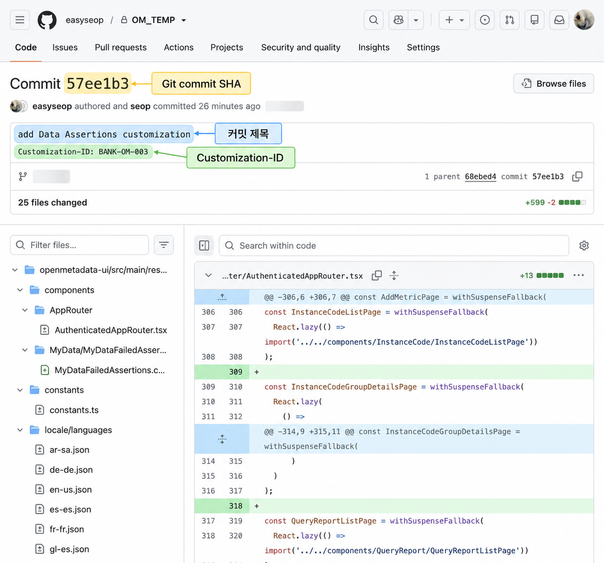

<details>
<summary>강조 표시가 없는 원본 캡처 보기</summary>

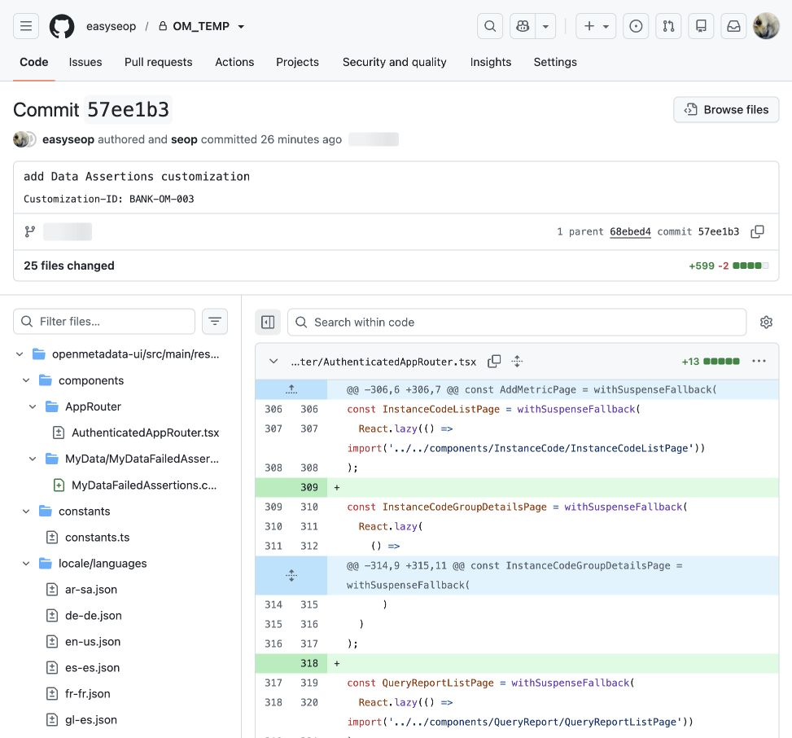

</details>

### 왜 하나의 BANK-OM 기능으로 보았나

데이터 검증 결과를 조회하는 전용 화면, API 호출, 경로와 메뉴를 함께 추가한 변경입니다. 이 화면 흐름을 한 기능으로 보고 BANK-OM-003으로 등록합니다.

<details>
<summary><strong>BANK-OM-003 Manifest 초안 전체 보기</strong></summary>

```yaml
schema_version: 1
customization_id: BANK-OM-003
status: active
kind: core-patch
title: 데이터 검증 결과(Data Assertions)
implementation:
  allowed_changed_paths:
  - openmetadata-ui/src/main/resources/ui/src/components/AppRouter/AuthenticatedAppRouter.tsx
  - openmetadata-ui/src/main/resources/ui/src/components/MyData/MyDataFailedAssertions/MyDataFailedAssertions.component.tsx
  - openmetadata-ui/src/main/resources/ui/src/constants/constants.ts
  - openmetadata-ui/src/main/resources/ui/src/locale/languages/ar-sa.json
  - openmetadata-ui/src/main/resources/ui/src/locale/languages/de-de.json
  - openmetadata-ui/src/main/resources/ui/src/locale/languages/en-us.json
  - openmetadata-ui/src/main/resources/ui/src/locale/languages/es-es.json
  - openmetadata-ui/src/main/resources/ui/src/locale/languages/fr-fr.json
  - openmetadata-ui/src/main/resources/ui/src/locale/languages/gl-es.json
  - openmetadata-ui/src/main/resources/ui/src/locale/languages/he-he.json
  - openmetadata-ui/src/main/resources/ui/src/locale/languages/ja-jp.json
  - openmetadata-ui/src/main/resources/ui/src/locale/languages/ko-kr.json
  - openmetadata-ui/src/main/resources/ui/src/locale/languages/mr-in.json
  - openmetadata-ui/src/main/resources/ui/src/locale/languages/nl-nl.json
  - openmetadata-ui/src/main/resources/ui/src/locale/languages/pr-pr.json
  - openmetadata-ui/src/main/resources/ui/src/locale/languages/pt-br.json
  - openmetadata-ui/src/main/resources/ui/src/locale/languages/pt-pt.json
  - openmetadata-ui/src/main/resources/ui/src/locale/languages/ru-ru.json
  - openmetadata-ui/src/main/resources/ui/src/locale/languages/th-th.json
  - openmetadata-ui/src/main/resources/ui/src/locale/languages/tr-tr.json
  - openmetadata-ui/src/main/resources/ui/src/locale/languages/zh-cn.json
  - openmetadata-ui/src/main/resources/ui/src/locale/languages/zh-tw.json
  - openmetadata-ui/src/main/resources/ui/src/pages/DataAssertionsPage/DataAssertionsPage.tsx
  - openmetadata-ui/src/main/resources/ui/src/pages/MyDataPage/MyDataPage.component.tsx
  - openmetadata-ui/src/main/resources/ui/src/rest/dataAssertionsAPI.ts
  required_changed_paths:
  - openmetadata-ui/src/main/resources/ui/src/pages/DataAssertionsPage/DataAssertionsPage.tsx
  - openmetadata-ui/src/main/resources/ui/src/rest/dataAssertionsAPI.ts
upgrade_watch:
  paths:
  - openmetadata-spec/src/main/resources/json/schema/tests/testCase.json
  - openmetadata-ui/src/main/resources/ui/src/components/AppRouter/AuthenticatedAppRouter.tsx
  - openmetadata-ui/src/main/resources/ui/src/components/MyData/MyDataFailedAssertions/MyDataFailedAssertions.component.tsx
  - openmetadata-ui/src/main/resources/ui/src/constants/constants.ts
  - openmetadata-ui/src/main/resources/ui/src/generated/tests/testCase.ts
  - openmetadata-ui/src/main/resources/ui/src/locale/languages/ar-sa.json
  - openmetadata-ui/src/main/resources/ui/src/locale/languages/de-de.json
  - openmetadata-ui/src/main/resources/ui/src/locale/languages/en-us.json
  - openmetadata-ui/src/main/resources/ui/src/locale/languages/es-es.json
  - openmetadata-ui/src/main/resources/ui/src/locale/languages/fr-fr.json
  - openmetadata-ui/src/main/resources/ui/src/locale/languages/gl-es.json
  - openmetadata-ui/src/main/resources/ui/src/locale/languages/he-he.json
  - openmetadata-ui/src/main/resources/ui/src/locale/languages/ja-jp.json
  - openmetadata-ui/src/main/resources/ui/src/locale/languages/ko-kr.json
  - openmetadata-ui/src/main/resources/ui/src/locale/languages/mr-in.json
  - openmetadata-ui/src/main/resources/ui/src/locale/languages/nl-nl.json
  - openmetadata-ui/src/main/resources/ui/src/locale/languages/pr-pr.json
  - openmetadata-ui/src/main/resources/ui/src/locale/languages/pt-br.json
  - openmetadata-ui/src/main/resources/ui/src/locale/languages/pt-pt.json
  - openmetadata-ui/src/main/resources/ui/src/locale/languages/ru-ru.json
  - openmetadata-ui/src/main/resources/ui/src/locale/languages/th-th.json
  - openmetadata-ui/src/main/resources/ui/src/locale/languages/tr-tr.json
  - openmetadata-ui/src/main/resources/ui/src/locale/languages/zh-cn.json
  - openmetadata-ui/src/main/resources/ui/src/locale/languages/zh-tw.json
  - openmetadata-ui/src/main/resources/ui/src/pages/DataAssertionsPage/DataAssertionsPage.tsx
  - openmetadata-ui/src/main/resources/ui/src/pages/MyDataPage/MyDataPage.component.tsx
  - openmetadata-ui/src/main/resources/ui/src/rest/dataAssertionsAPI.ts
assurance:
  contracts:
  - CONTRACT-DATA-ASSERTIONS
  direct_tests: []
series:
  allowed: false
  depends_on: []
```

</details>

</details>

<details>
<summary><strong>BANK-OM-004 · 은행 컬럼 확장 표시</strong></summary>

### 실제 GitHub 커밋

- Git commit SHA: `274f2b79b424e01537a7f2253c33aeecb43aaac4`
- 커밋 제목: `add bank column view customization`
- 이 커밋에서 변경한 파일: 33개
- [GitHub에서 실제 커밋 열기](https://github.com/easyseop/OM_TEMP/commit/274f2b79b424e01537a7f2253c33aeecb43aaac4)

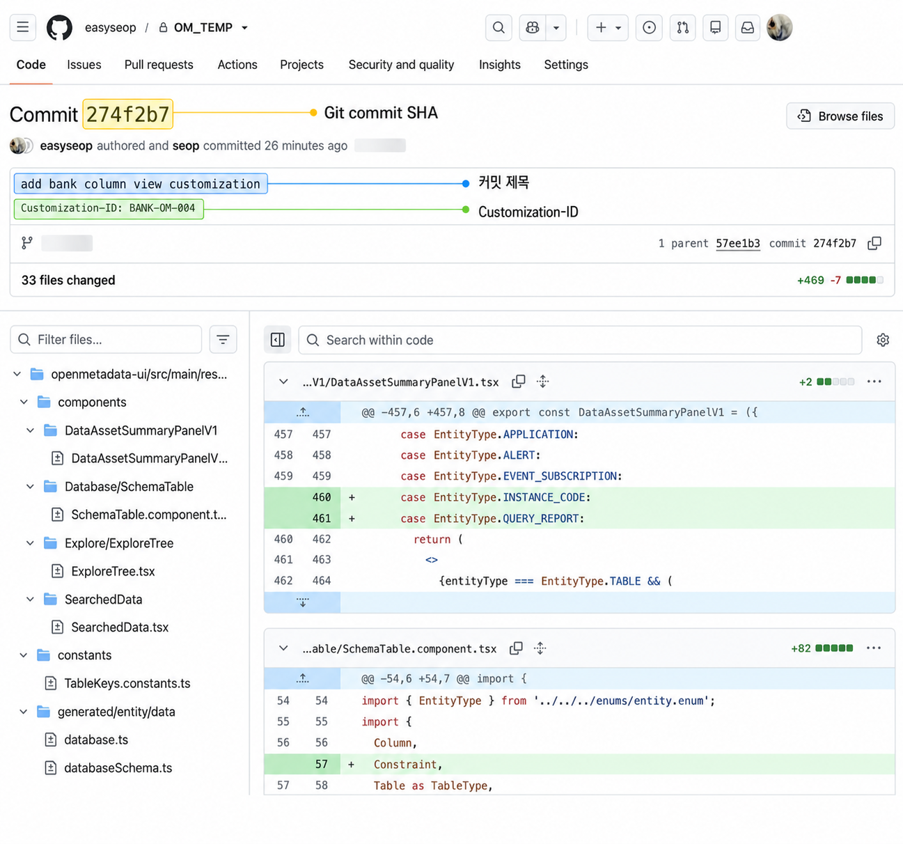

<details>
<summary>강조 표시가 없는 원본 캡처 보기</summary>

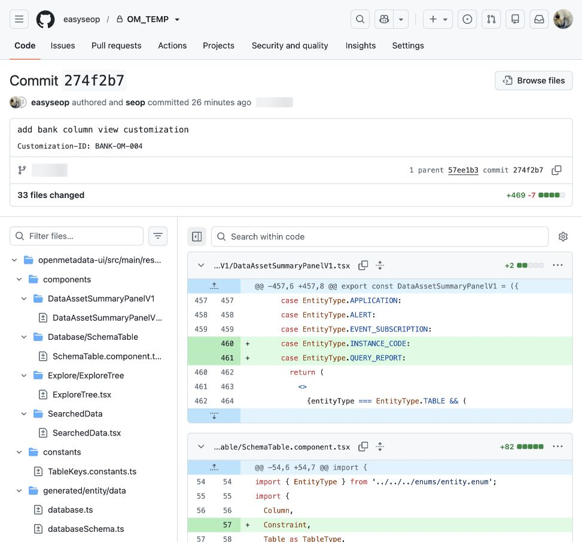

</details>

### 왜 하나의 BANK-OM 기능으로 보았나

테이블 컬럼 화면에 은행용 표시 항목과 관련 타입·문구를 추가한 변경입니다. 화면에 보이는 결과와 이를 전달하는 타입 변경을 함께 BANK-OM-004로 관리합니다.

<details>
<summary><strong>BANK-OM-004 Manifest 초안 전체 보기</strong></summary>

```yaml
schema_version: 1
customization_id: BANK-OM-004
status: active
kind: core-patch
title: 은행 컬럼 확장 표시
implementation:
  allowed_changed_paths:
  - openmetadata-ui/src/main/resources/ui/src/components/DataAssetSummaryPanelV1/DataAssetSummaryPanelV1.tsx
  - openmetadata-ui/src/main/resources/ui/src/components/Database/SchemaTable/SchemaTable.component.tsx
  - openmetadata-ui/src/main/resources/ui/src/components/Explore/ExploreTree/ExploreTree.tsx
  - openmetadata-ui/src/main/resources/ui/src/components/SearchedData/SearchedData.tsx
  - openmetadata-ui/src/main/resources/ui/src/constants/TableKeys.constants.ts
  - openmetadata-ui/src/main/resources/ui/src/generated/entity/data/database.ts
  - openmetadata-ui/src/main/resources/ui/src/generated/entity/data/databaseSchema.ts
  - openmetadata-ui/src/main/resources/ui/src/generated/entity/data/storedProcedure.ts
  - openmetadata-ui/src/main/resources/ui/src/generated/entity/data/table.ts
  - openmetadata-ui/src/main/resources/ui/src/interface/search.interface.ts
  - openmetadata-ui/src/main/resources/ui/src/locale/languages/ar-sa.json
  - openmetadata-ui/src/main/resources/ui/src/locale/languages/de-de.json
  - openmetadata-ui/src/main/resources/ui/src/locale/languages/en-us.json
  - openmetadata-ui/src/main/resources/ui/src/locale/languages/es-es.json
  - openmetadata-ui/src/main/resources/ui/src/locale/languages/fr-fr.json
  - openmetadata-ui/src/main/resources/ui/src/locale/languages/gl-es.json
  - openmetadata-ui/src/main/resources/ui/src/locale/languages/he-he.json
  - openmetadata-ui/src/main/resources/ui/src/locale/languages/ja-jp.json
  - openmetadata-ui/src/main/resources/ui/src/locale/languages/ko-kr.json
  - openmetadata-ui/src/main/resources/ui/src/locale/languages/mr-in.json
  - openmetadata-ui/src/main/resources/ui/src/locale/languages/nl-nl.json
  - openmetadata-ui/src/main/resources/ui/src/locale/languages/pr-pr.json
  - openmetadata-ui/src/main/resources/ui/src/locale/languages/pt-br.json
  - openmetadata-ui/src/main/resources/ui/src/locale/languages/pt-pt.json
  - openmetadata-ui/src/main/resources/ui/src/locale/languages/ru-ru.json
  - openmetadata-ui/src/main/resources/ui/src/locale/languages/th-th.json
  - openmetadata-ui/src/main/resources/ui/src/locale/languages/tr-tr.json
  - openmetadata-ui/src/main/resources/ui/src/locale/languages/zh-cn.json
  - openmetadata-ui/src/main/resources/ui/src/locale/languages/zh-tw.json
  - openmetadata-ui/src/main/resources/ui/src/utils/EntityUtilClassBase.ts
  - openmetadata-ui/src/main/resources/ui/src/utils/EntityUtils.interface.ts
  - openmetadata-ui/src/main/resources/ui/src/utils/EntityUtils.tsx
  - openmetadata-ui/src/main/resources/ui/src/utils/SearchClassBase.ts
  required_changed_paths:
  - openmetadata-ui/src/main/resources/ui/src/components/Database/SchemaTable/SchemaTable.component.tsx
upgrade_watch:
  paths:
  - openmetadata-spec/src/main/resources/json/schema/entity/data/table.json
  - openmetadata-ui/src/main/resources/ui/src/components/DataAssetSummaryPanelV1/DataAssetSummaryPanelV1.tsx
  - openmetadata-ui/src/main/resources/ui/src/components/Database/SchemaTable/SchemaTable.component.tsx
  - openmetadata-ui/src/main/resources/ui/src/components/Explore/ExploreTree/ExploreTree.tsx
  - openmetadata-ui/src/main/resources/ui/src/components/SearchedData/SearchedData.tsx
  - openmetadata-ui/src/main/resources/ui/src/constants/TableKeys.constants.ts
  - openmetadata-ui/src/main/resources/ui/src/generated/entity/data/database.ts
  - openmetadata-ui/src/main/resources/ui/src/generated/entity/data/databaseSchema.ts
  - openmetadata-ui/src/main/resources/ui/src/generated/entity/data/storedProcedure.ts
  - openmetadata-ui/src/main/resources/ui/src/generated/entity/data/table.ts
  - openmetadata-ui/src/main/resources/ui/src/interface/search.interface.ts
  - openmetadata-ui/src/main/resources/ui/src/locale/languages/ar-sa.json
  - openmetadata-ui/src/main/resources/ui/src/locale/languages/de-de.json
  - openmetadata-ui/src/main/resources/ui/src/locale/languages/en-us.json
  - openmetadata-ui/src/main/resources/ui/src/locale/languages/es-es.json
  - openmetadata-ui/src/main/resources/ui/src/locale/languages/fr-fr.json
  - openmetadata-ui/src/main/resources/ui/src/locale/languages/gl-es.json
  - openmetadata-ui/src/main/resources/ui/src/locale/languages/he-he.json
  - openmetadata-ui/src/main/resources/ui/src/locale/languages/ja-jp.json
  - openmetadata-ui/src/main/resources/ui/src/locale/languages/ko-kr.json
  - openmetadata-ui/src/main/resources/ui/src/locale/languages/mr-in.json
  - openmetadata-ui/src/main/resources/ui/src/locale/languages/nl-nl.json
  - openmetadata-ui/src/main/resources/ui/src/locale/languages/pr-pr.json
  - openmetadata-ui/src/main/resources/ui/src/locale/languages/pt-br.json
  - openmetadata-ui/src/main/resources/ui/src/locale/languages/pt-pt.json
  - openmetadata-ui/src/main/resources/ui/src/locale/languages/ru-ru.json
  - openmetadata-ui/src/main/resources/ui/src/locale/languages/th-th.json
  - openmetadata-ui/src/main/resources/ui/src/locale/languages/tr-tr.json
  - openmetadata-ui/src/main/resources/ui/src/locale/languages/zh-cn.json
  - openmetadata-ui/src/main/resources/ui/src/locale/languages/zh-tw.json
  - openmetadata-ui/src/main/resources/ui/src/utils/EntityUtilClassBase.ts
  - openmetadata-ui/src/main/resources/ui/src/utils/EntityUtils.interface.ts
  - openmetadata-ui/src/main/resources/ui/src/utils/EntityUtils.tsx
  - openmetadata-ui/src/main/resources/ui/src/utils/SearchClassBase.ts
assurance:
  contracts:
  - CONTRACT-BANK-COLUMN-VIEW
  direct_tests: []
series:
  allowed: false
  depends_on: []
```

</details>

</details>

<details>
<summary><strong>BANK-OM-005 · 한글 입력 조합 보정</strong></summary>

### 실제 GitHub 커밋

- Git commit SHA: `d983f7c540d3fa1fe56ca91adef3f37374890f77`
- 커밋 제목: `fix Korean IME handling`
- 이 커밋에서 변경한 파일: 1개
- [GitHub에서 실제 커밋 열기](https://github.com/easyseop/OM_TEMP/commit/d983f7c540d3fa1fe56ca91adef3f37374890f77)

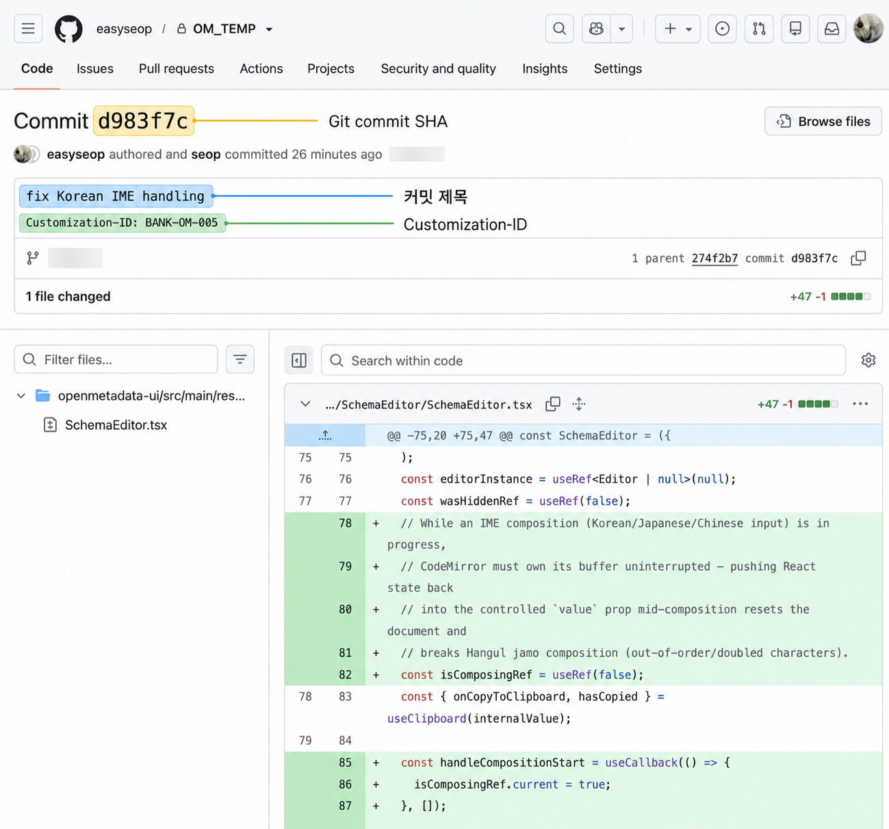

<details>
<summary>강조 표시가 없는 원본 캡처 보기</summary>

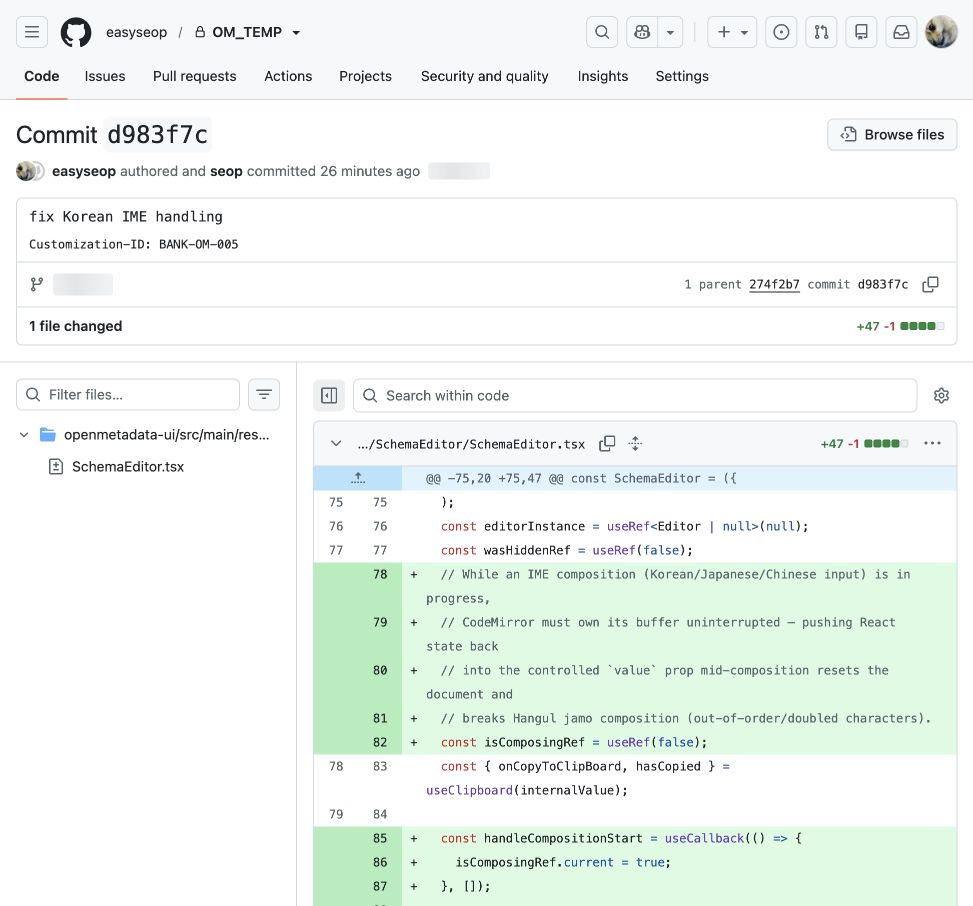

</details>

### 왜 하나의 BANK-OM 기능으로 보았나

SchemaEditor.tsx 한 파일에서 한글 조합 시작·종료 처리를 추가한 변경입니다. 변경 범위가 가장 작고 기능 경계도 분명해, 실제 diff 전체가 Manifest 하나로 등록되는 대표 사례로 사용합니다.

<details>
<summary><strong>대표 사례: 변경 코드 전체 보기</strong></summary>

이 커밋의 변경은 `SchemaEditor.tsx` 한 파일뿐입니다. 아래 네 장은 한 GitHub diff 화면을 위에서 아래 순서로 나눈 것으로, 초록색 줄은 추가 코드이고 빨간색 줄은 삭제 코드입니다.

#### 전체 diff 1/4

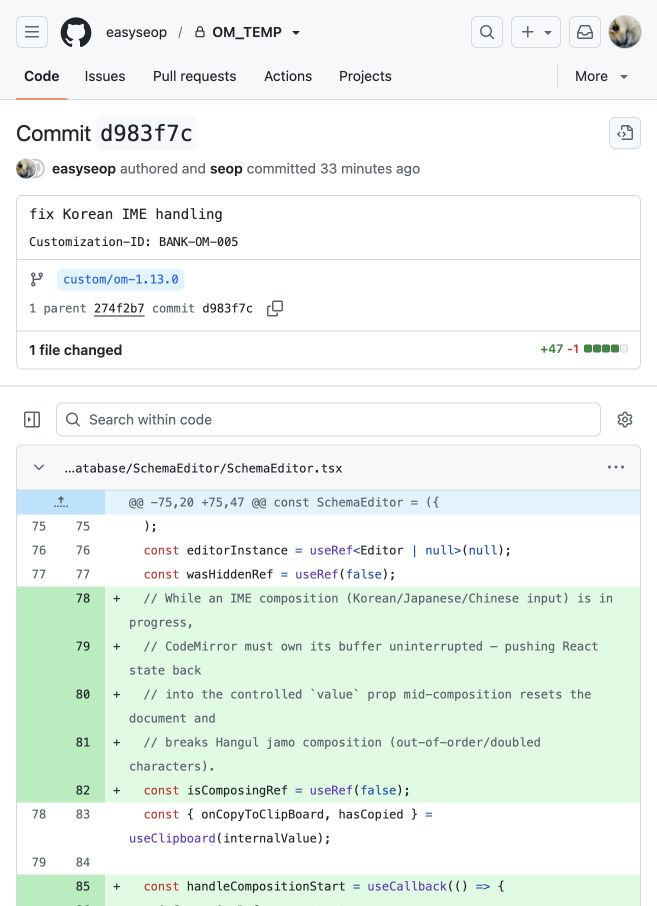

#### 전체 diff 2/4

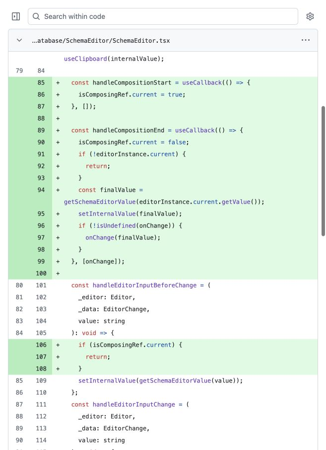

#### 전체 diff 3/4

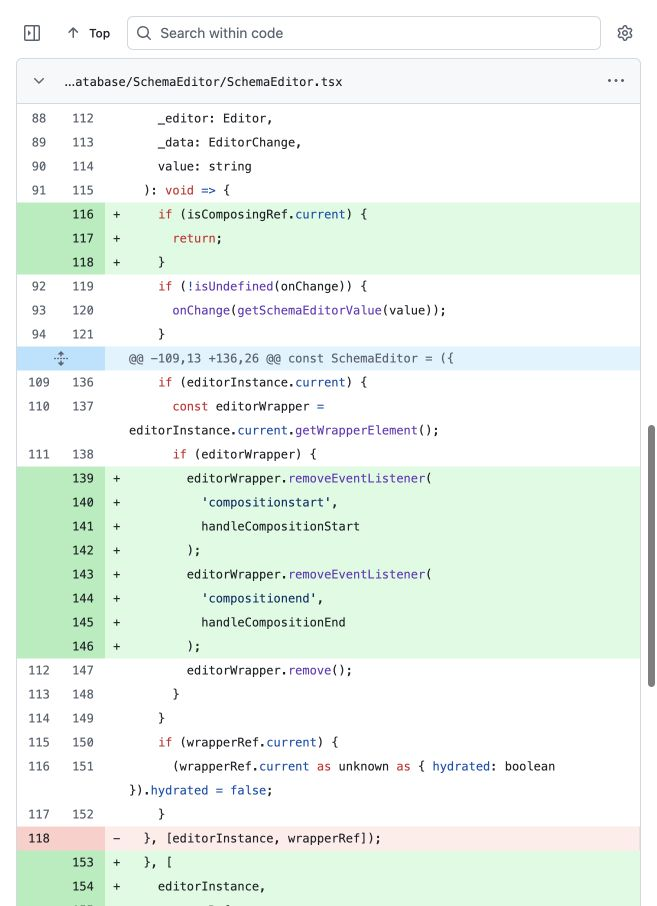

#### 전체 diff 4/4

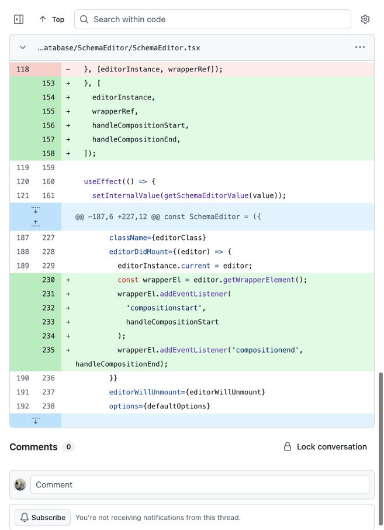

이 전체 diff에서 바뀐 파일 경로는 하나이므로 Manifest의 `allowed_changed_paths`도 한 경로입니다. 같은 파일이 한글 입력 보정의 핵심 구현이므로 `required_changed_paths`에도 같은 경로를 등록했습니다.

</details>

<details>
<summary><strong>BANK-OM-005 Manifest 초안 전체 보기</strong></summary>

```yaml
schema_version: 1
customization_id: BANK-OM-005
status: active
kind: core-patch
title: 한글 입력 조합 보정
implementation:
  allowed_changed_paths:
  - openmetadata-ui/src/main/resources/ui/src/components/Database/SchemaEditor/SchemaEditor.tsx
  required_changed_paths:
  - openmetadata-ui/src/main/resources/ui/src/components/Database/SchemaEditor/SchemaEditor.tsx
upgrade_watch:
  paths:
  - openmetadata-ui/src/main/resources/ui/package.json
  - openmetadata-ui/src/main/resources/ui/src/components/Database/SchemaEditor/SchemaEditor.tsx
assurance:
  contracts:
  - CONTRACT-KOREAN-IME
  direct_tests: []
series:
  allowed: false
  depends_on: []
```

</details>

</details>

<details>
<summary><strong>BANK-OM-006 · Sybase 연결 유형</strong></summary>

### 실제 GitHub 커밋

- Git commit SHA: `010750c514e9bbb7a765414ded3b161b1f5eb621`
- 커밋 제목: `add Sybase customization`
- 이 커밋에서 변경한 파일: 18개
- [GitHub에서 실제 커밋 열기](https://github.com/easyseop/OM_TEMP/commit/010750c514e9bbb7a765414ded3b161b1f5eb621)

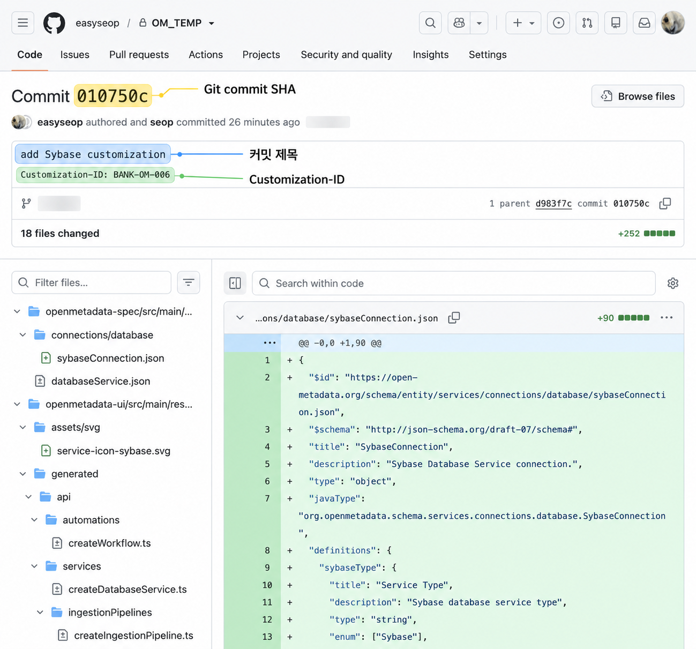

<details>
<summary>강조 표시가 없는 원본 캡처 보기</summary>

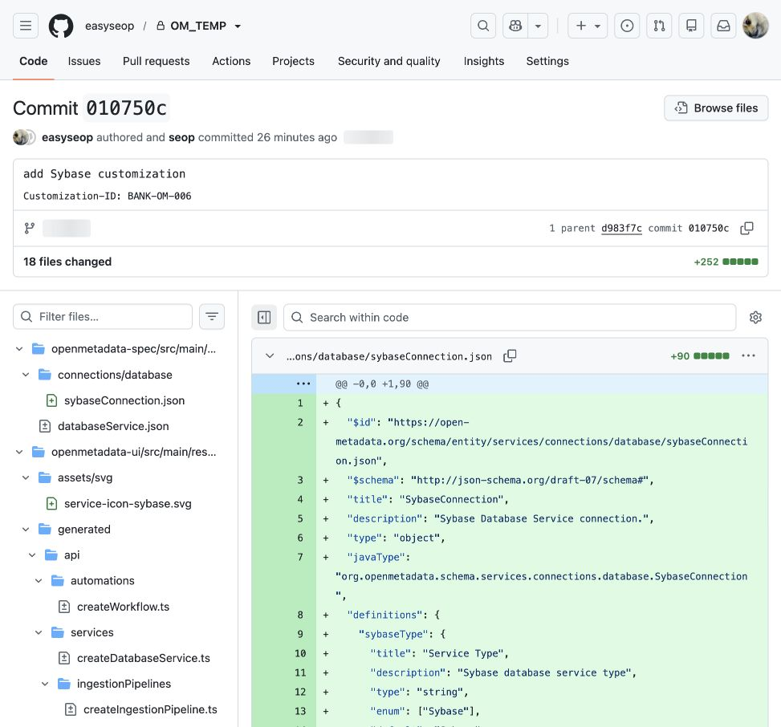

</details>

### 왜 하나의 BANK-OM 기능으로 보았나

Sybase 연결 스키마, 생성 타입, 아이콘과 연결 선택 로직을 함께 추가한 변경입니다. 하나의 DB 연결 유형을 완성하는 파일들을 BANK-OM-006으로 묶습니다.

<details>
<summary><strong>BANK-OM-006 Manifest 초안 전체 보기</strong></summary>

```yaml
schema_version: 1
customization_id: BANK-OM-006
status: active
kind: core-patch
title: Sybase 연결 유형
implementation:
  allowed_changed_paths:
  - openmetadata-spec/src/main/resources/json/schema/entity/services/connections/database/sybaseConnection.json
  - openmetadata-spec/src/main/resources/json/schema/entity/services/databaseService.json
  - openmetadata-ui/src/main/resources/ui/src/assets/svg/service-icon-sybase.svg
  - openmetadata-ui/src/main/resources/ui/src/generated/api/automations/createWorkflow.ts
  - openmetadata-ui/src/main/resources/ui/src/generated/api/services/createDatabaseService.ts
  - openmetadata-ui/src/main/resources/ui/src/generated/api/services/ingestionPipelines/createIngestionPipeline.ts
  - openmetadata-ui/src/main/resources/ui/src/generated/entity/automations/testServiceConnection.ts
  - openmetadata-ui/src/main/resources/ui/src/generated/entity/automations/workflow.ts
  - openmetadata-ui/src/main/resources/ui/src/generated/entity/services/connections/database/sybaseConnection.ts
  - openmetadata-ui/src/main/resources/ui/src/generated/entity/services/connections/serviceConnection.ts
  - openmetadata-ui/src/main/resources/ui/src/generated/entity/services/databaseService.ts
  - openmetadata-ui/src/main/resources/ui/src/generated/entity/services/ingestionPipelines/ingestionPipeline.ts
  - openmetadata-ui/src/main/resources/ui/src/generated/metadataIngestion/testSuitePipeline.ts
  - openmetadata-ui/src/main/resources/ui/src/generated/metadataIngestion/workflow.ts
  - openmetadata-ui/src/main/resources/ui/src/utils/DatabaseServiceUtils.test.tsx
  - openmetadata-ui/src/main/resources/ui/src/utils/DatabaseServiceUtils.tsx
  - openmetadata-ui/src/main/resources/ui/src/utils/ServiceIconUtils.ts
  - openmetadata-ui/src/main/resources/ui/src/utils/ServiceUtils.tsx
  required_changed_paths:
  - openmetadata-spec/src/main/resources/json/schema/entity/services/connections/database/sybaseConnection.json
upgrade_watch:
  paths:
  - openmetadata-spec/src/main/resources/json/schema/entity/services/connections/database/sybaseConnection.json
  - openmetadata-spec/src/main/resources/json/schema/entity/services/connections/serviceConnection.json
  - openmetadata-spec/src/main/resources/json/schema/entity/services/databaseService.json
  - openmetadata-ui/src/main/resources/ui/src/assets/svg/service-icon-sybase.svg
  - openmetadata-ui/src/main/resources/ui/src/generated/api/automations/createWorkflow.ts
  - openmetadata-ui/src/main/resources/ui/src/generated/api/services/createDatabaseService.ts
  - openmetadata-ui/src/main/resources/ui/src/generated/api/services/ingestionPipelines/createIngestionPipeline.ts
  - openmetadata-ui/src/main/resources/ui/src/generated/entity/automations/testServiceConnection.ts
  - openmetadata-ui/src/main/resources/ui/src/generated/entity/automations/workflow.ts
  - openmetadata-ui/src/main/resources/ui/src/generated/entity/services/connections/database/sybaseConnection.ts
  - openmetadata-ui/src/main/resources/ui/src/generated/entity/services/connections/serviceConnection.ts
  - openmetadata-ui/src/main/resources/ui/src/generated/entity/services/databaseService.ts
  - openmetadata-ui/src/main/resources/ui/src/generated/entity/services/ingestionPipelines/ingestionPipeline.ts
  - openmetadata-ui/src/main/resources/ui/src/generated/metadataIngestion/testSuitePipeline.ts
  - openmetadata-ui/src/main/resources/ui/src/generated/metadataIngestion/workflow.ts
  - openmetadata-ui/src/main/resources/ui/src/utils/DatabaseServiceUtils.test.tsx
  - openmetadata-ui/src/main/resources/ui/src/utils/DatabaseServiceUtils.tsx
  - openmetadata-ui/src/main/resources/ui/src/utils/ServiceIconUtils.ts
  - openmetadata-ui/src/main/resources/ui/src/utils/ServiceUtils.tsx
assurance:
  contracts:
  - CONTRACT-SYBASE-CONNECTOR
  direct_tests: []
series:
  allowed: false
  depends_on: []
```

</details>

</details>

<details>
<summary><strong>BANK-OM-007 · Tibero 연결 유형</strong></summary>

### 최초 커밋

- Git commit SHA: `62e39da8be65c3ff259802c1cd35f4b0c8baa333`
- 커밋 제목: `add Tibero customization`
- 이 커밋에서 변경한 파일: 8개
- [GitHub에서 실제 커밋 열기](https://github.com/easyseop/OM_TEMP/commit/62e39da8be65c3ff259802c1cd35f4b0c8baa333)

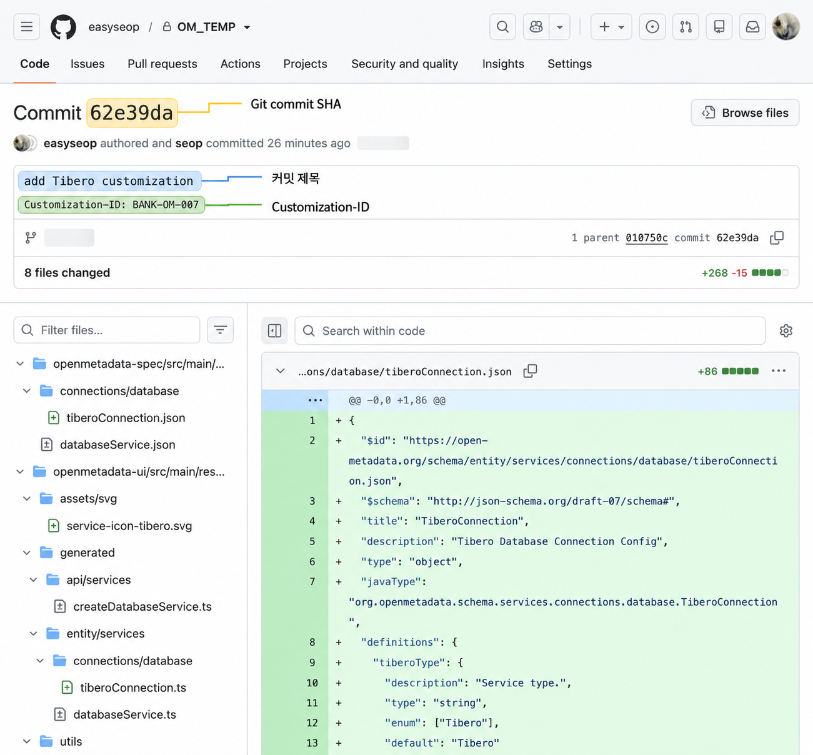

<details>
<summary>강조 표시가 없는 원본 캡처 보기</summary>

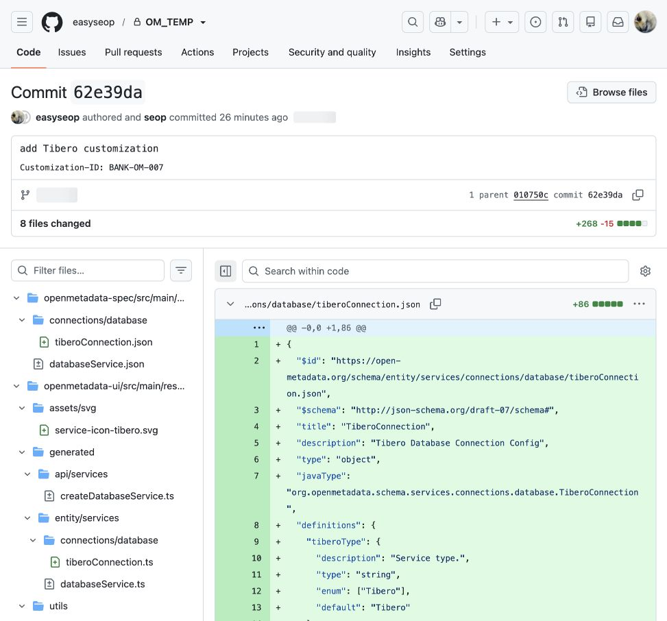

</details>

### 후속 보완 커밋

- Git commit SHA: `7d19c8952612e77467b0a80d6287170d814f1de1`
- 커밋 제목: `complete Tibero service connection coverage`
- 이 커밋에서 변경한 파일: 2개
- [GitHub에서 실제 커밋 열기](https://github.com/easyseop/OM_TEMP/commit/7d19c8952612e77467b0a80d6287170d814f1de1)

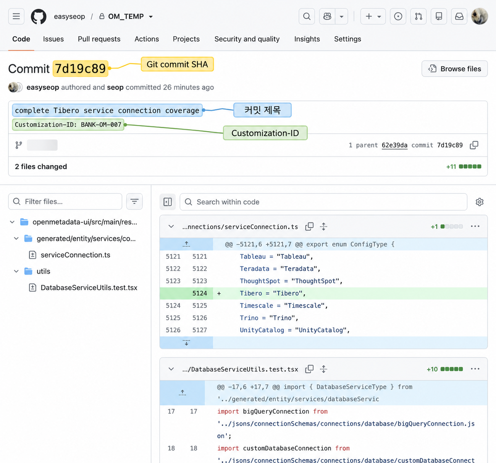

<details>
<summary>강조 표시가 없는 원본 캡처 보기</summary>

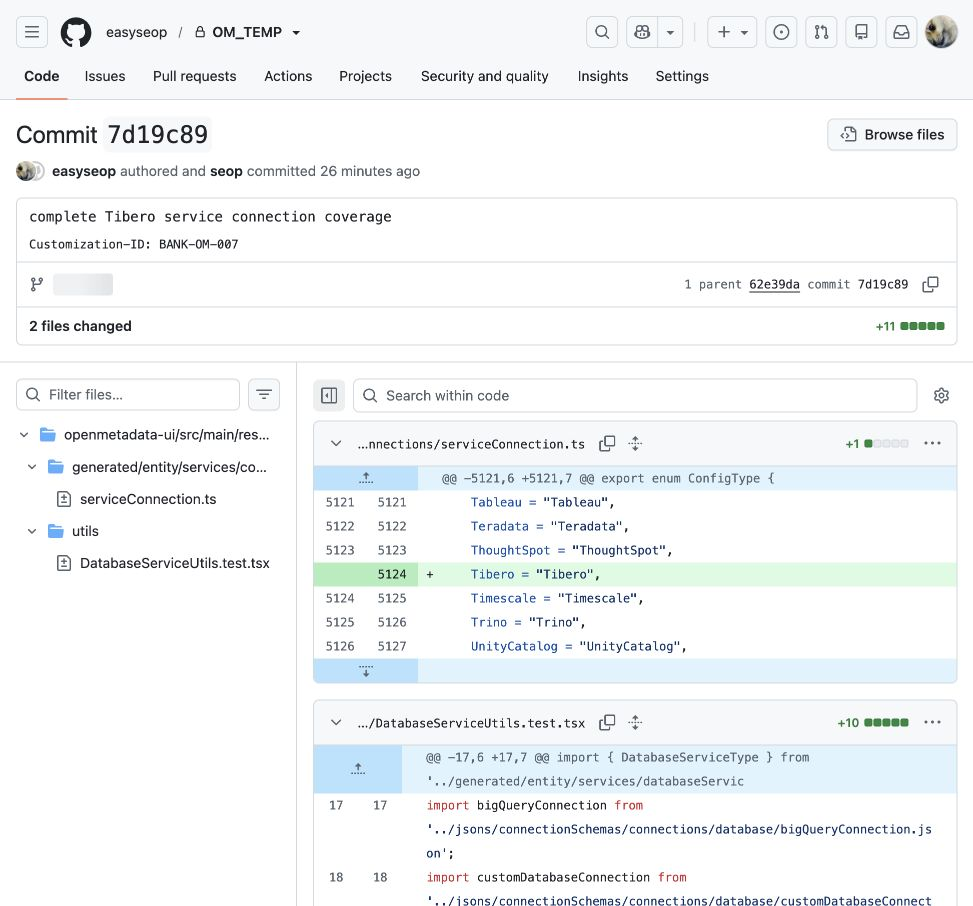

</details>

### 왜 하나의 BANK-OM 기능으로 보았나

두 커밋 모두 Tibero 연결 유형 하나를 완성합니다. 최초 8개 파일은 allowed_changed_paths에, 후속 커밋에서 처음 추가된 2개 파일은 candidate_additional_paths에 등록합니다. Git commit SHA는 두 개지만 업무 기능 ID와 Manifest는 BANK-OM-007 하나입니다.

<details>
<summary><strong>BANK-OM-007 Manifest 초안 전체 보기</strong></summary>

```yaml
schema_version: 1
customization_id: BANK-OM-007
status: active
kind: core-patch
title: Tibero 연결 유형
implementation:
  allowed_changed_paths:
  - openmetadata-spec/src/main/resources/json/schema/entity/services/connections/database/tiberoConnection.json
  - openmetadata-spec/src/main/resources/json/schema/entity/services/databaseService.json
  - openmetadata-ui/src/main/resources/ui/src/assets/svg/service-icon-tibero.svg
  - openmetadata-ui/src/main/resources/ui/src/generated/api/services/createDatabaseService.ts
  - openmetadata-ui/src/main/resources/ui/src/generated/entity/services/connections/database/tiberoConnection.ts
  - openmetadata-ui/src/main/resources/ui/src/generated/entity/services/databaseService.ts
  - openmetadata-ui/src/main/resources/ui/src/utils/DatabaseServiceUtils.tsx
  - openmetadata-ui/src/main/resources/ui/src/utils/ServiceIconUtils.ts
  candidate_additional_paths:
  - openmetadata-ui/src/main/resources/ui/src/generated/entity/services/connections/serviceConnection.ts
  - openmetadata-ui/src/main/resources/ui/src/utils/DatabaseServiceUtils.test.tsx
  required_changed_paths:
  - openmetadata-spec/src/main/resources/json/schema/entity/services/connections/database/tiberoConnection.json
upgrade_watch:
  paths:
  - openmetadata-spec/src/main/resources/json/schema/entity/services/connections/database/tiberoConnection.json
  - openmetadata-spec/src/main/resources/json/schema/entity/services/connections/serviceConnection.json
  - openmetadata-spec/src/main/resources/json/schema/entity/services/databaseService.json
  - openmetadata-ui/src/main/resources/ui/src/assets/svg/service-icon-tibero.svg
  - openmetadata-ui/src/main/resources/ui/src/generated/api/services/createDatabaseService.ts
  - openmetadata-ui/src/main/resources/ui/src/generated/entity/services/connections/database/tiberoConnection.ts
  - openmetadata-ui/src/main/resources/ui/src/generated/entity/services/connections/serviceConnection.ts
  - openmetadata-ui/src/main/resources/ui/src/generated/entity/services/databaseService.ts
  - openmetadata-ui/src/main/resources/ui/src/utils/DatabaseServiceUtils.test.tsx
  - openmetadata-ui/src/main/resources/ui/src/utils/DatabaseServiceUtils.tsx
  - openmetadata-ui/src/main/resources/ui/src/utils/ServiceIconUtils.ts
assurance:
  contracts:
  - CONTRACT-TIBERO-CONNECTOR
  direct_tests: []
series:
  allowed: true
  depends_on: []
```

</details>

</details>

### Manifest 네 목록을 읽는 기준

| 항목 | 이 초안에 들어간 기준 | 검사에서 쓰는 방식 |
|---|---|---|
| `allowed_changed_paths` | 최초 BANK-OM 커밋이 실제 변경한 모든 파일 | 목록 밖 파일을 같은 ID로 변경하면 차단하고, 목록 안 파일이 검사 대상 custom branch의 최종 코드에서 실제로 달라지지 않으면 검토를 요구 |
| `required_changed_paths` | 기능이 적용됐음을 판단하는 핵심 구현 파일 | 파일이 없거나 공식 원본과 같아지면 기능이 빠진 것으로 보고 차단 |
| `candidate_additional_paths` | 같은 ID의 후속 커밋에서 처음 추가된 파일 | 사전 등록 없이 확장한 변경과 승인된 후속 변경을 구분 |
| `upgrade_watch.paths` | 공식 버전 변경 비교 검사가 확인할 경로 | 공식 새 버전에서 해당 경로가 바뀌면 자동 통과하지 않고 재검토를 요구 |

공식 버전 변경 비교 검사(검사기 내부 이름 `T42`)는 이전 버전과 새 버전의 OpenMetadata에서 지정 경로가 바뀌었는지 확인하는 검사입니다. `upgrade_watch.paths`에는 현재 T42 구현에 맞춰 해당 ID의 변경 범위 전체와 직접 수정하지 않았지만 기능이 의존하는 공식 파일을 함께 넣었습니다. 따라서 watch에 있다고 해서 그 파일을 이 커밋이 반드시 수정했다는 뜻은 아닙니다.

## 2. 검사 기준자료 등록

아래 자료는 모두 `openmetadata-test`에 보관합니다. Git이 자동으로 만들 수 있는 값과 사람이 결정해야 하는 기준을 구분해 등록합니다. OM_TEMP 1.13.0의 실제 자료를 이미 생성했으며, 아래에는 각 자료의 역할과 실제 등록 결과를 함께 표시합니다.

<details>
<summary><strong>2-1. Registry · 검사할 BANK-OM 목록과 연결정보</strong></summary>

**의미:** 어떤 BANK-OM이 활성 상태이고 어느 Manifest·Contract를 읽을지 검사기에 알려주는 목록입니다.

**생성·갱신 시점:** 첫 BANK-OM 등록 때 만들고, ID 추가·폐기·중요도 변경 또는 검사 대상 버전과 SHA가 바뀔 때 갱신합니다. 임시 파일이 아닙니다.

**이번 등록 결과:** `customization-registry.yaml`에 BANK-OM-001~007 7개를 등록했습니다. 기능 담당자는 아직 정하지 않았으므로 `owner_status: pending`이며, 이 상태는 배포 승인 전 반드시 보완해야 합니다.

```yaml
entries:
  - customization_id: BANK-OM-005
    title: 한글 입력 조합 보정
    status: active
    criticality: medium
    manifest: manifests/BANK-OM-005.yaml
    contracts: [CONTRACT-KOREAN-IME]
```

**실제 사용:** 검사기는 이 항목을 읽고 BANK-OM-005 Manifest와 CONTRACT-KOREAN-IME가 모두 존재하고 서로 같은 ID를 가리키는지 확인합니다. 연결 파일이 없거나 ID가 서로 다르면 입력 묶음을 읽을 수 없어 검사를 시작하지 않습니다.

</details>

<details>
<summary><strong>2-2. Contracts · 기능이 정상이라는 동작 기준</strong></summary>

**의미:** 파일이 남아 있다는 사실을 넘어 기능이 실제로 어떻게 동작해야 정상인지 정의합니다. Git만으로는 업무 정상 조건을 정할 수 없으므로 사람이 기능 담당자와 합의해 작성합니다.

**생성·갱신 시점:** 최초 기능 등록 때 만들고, OpenMetadata 버전이 바뀌어도 업무 요구가 같으면 재사용합니다. 기능 기준이나 test가 바뀔 때만 갱신합니다.

**이번 등록 결과:** `contracts.yaml`에 Contract 7개와 필수 Python pytest 9개를 연결했습니다.

```yaml
- id: CONTRACT-KOREAN-IME
  invariant: 한글 입력 중 자모가 중복·역전·소실되지 않는다.
  required_tests:
    - tests/bank/contracts/test_korean_ime.py::test_hangul_composition_roundtrip
  customization_ids: [BANK-OM-005]
```

**실제 사용:** 필수 테스트 코드 존재 검증은 `required_tests`에 적은 `파일 경로::test 함수명`이 검사 저장소에 실제 Python pytest 코드로 있는지 확인합니다. Java JUnit·TypeScript test 확인은 추가 개발 대상입니다.

**필수 여부와 검사 결과:** 현재 전체 소스 검사에서는 `active` 상태의 BANK-OM마다 Contract가 하나 이상 있어야 하고, 각 Contract의 `required_tests`에도 test가 하나 이상 있어야 합니다. 따라서 선택사항이 아닙니다. Contract 연결, test 경로 또는 test 함수가 없으면 `BLOCK`입니다. 다만 이 검증의 `PASS`는 test 코드가 존재한다는 뜻일 뿐이며, test 실행 성공은 후속 실행 검사에서 별도로 확인합니다.

</details>

<details>
<summary><strong>2-3. 공용 파일 소유정보 · 한 파일을 함께 변경한 ID</strong></summary>

**의미:** 여러 BANK-OM이 같은 파일을 정상적으로 변경했다는 사실과 실제 소유 ID를 기록합니다.

**생성·갱신 시점:** Manifest들의 실제 변경 경로를 비교해 중복 경로를 자동 제안한 뒤, 각 commit diff에서 ID별 코드가 실제로 있는지 사람이 확인합니다. 업그레이드 버전마다 다시 계산·검토합니다.

**이번 등록 결과:** `shared-path-owners.yaml`에 37개 공용 경로를 등록했습니다.

```yaml
openmetadata-service/src/main/java/org/openmetadata/service/Entity.java:
  - BANK-OM-001  # INSTANCE_CODE
  - BANK-OM-002  # QUERY_REPORT

openmetadata-spec/src/main/resources/json/schema/entity/services/databaseService.json:
  - BANK-OM-006  # Sybase
  - BANK-OM-007  # Tibero
```

**실제 사용:** 검사기는 공용 파일을 한 ID의 단독 소유로 잘못 판단하지 않고, 등록된 모든 ID가 해당 경로를 실제로 변경했는지 확인합니다. 등록되지 않은 중복 소유는 담당 ID를 결정할 수 없으므로 재구성 검사가 `ANALYSIS ERROR`로 중단됩니다.

</details>

<details>
<summary><strong>2-4. 전체 변경 목록 · patch와 custom 사이의 111개 경로</strong></summary>

**의미:** `patch/om-1.13.0`과 `custom/om-1.13.0` 사이에서 최종적으로 달라진 모든 파일 경로입니다.

**생성·갱신 시점:** 검사 대상 commit이 확정된 뒤 Git으로 생성하며, 업그레이드 버전마다 다시 생성합니다. 사람이 111개를 직접 작성하지 않습니다.

**이번 등록 결과:** 공식 1.13.0과 BANK-OM-007 최초 커밋까지의 diff를 기준으로 `source-diff-paths.txt`에 111개 경로를 생성했습니다. BANK-OM-007 후속 커밋은 이미 목록에 있던 두 공용 파일을 다시 수정했으므로 최종 경로 수도 111개입니다.

```text
openmetadata-service/src/main/java/org/openmetadata/service/Entity.java
openmetadata-ui/src/main/resources/ui/src/components/Database/SchemaEditor/SchemaEditor.tsx
openmetadata-spec/src/main/resources/json/schema/entity/services/connections/database/tiberoConnection.json
```

**실제 사용:** 실제 전체 변경 111개와 모든 Manifest의 변경 범위를 양방향으로 비교합니다. 어느 Manifest에도 등록되지 않은 실제 변경이나, Manifest에만 있고 실제 diff에는 없는 경로가 있으면 등록자료 검증이 실패합니다.

</details>

<details>
<summary><strong>2-5. Patch-lock · 커밋 재적용을 선택할 때만 사용하는 순서표</strong></summary>

**의미:** patch-replay 방식으로 커스터마이징 커밋을 다시 적용할 때 사용할 정확한 SHA와 순서를 고정합니다.

**생성·갱신 시점:** 모든 전략의 필수 사전자료가 아닙니다. vendor-merge 소스 검사에서는 선택사항이며, patch-replay·복구·재현 시연을 할 때 커밋 순서가 확정된 후 만듭니다.

```yaml
patch_series:
  - id: BANK-OM-007
    revision: 1
    source_commits:
      - 62e39da8be65c3ff259802c1cd35f4b0c8baa333
      - 7d19c8952612e77467b0a80d6287170d814f1de1
```

**실제 사용:** 재적용 도구는 62e39da 다음에 7d19c89를 적용합니다. 잠금에 없는 SHA나 순서 변경은 동일한 재현으로 인정하지 않습니다. 설계상 OM_TEMP 첫 vendor-merge 소스 검사에서는 Patch-lock 부재만으로 차단하지 않습니다.

</details>

<details>
<summary><strong>2-6. 실제 생성 명령과 사전검증 결과</strong></summary>

첫 명령은 Git diff에서 자동 계산할 수 있는 Registry 뼈대, 공용 경로와 111개 목록을 만듭니다. Contract의 정상 조건과 담당자는 사람이 검토해야 하므로 자동 생성값을 그대로 배포 승인으로 사용하지 않습니다.

```bash
./.venv/bin/python \
  harness/registrations/om-temp-1.13.0/generate_registration_bundle.py \
  --repo ../om-temp-1.13.0-custom

./.venv/bin/python \
  harness/registrations/om-temp-1.13.0/validate_registration_bundle.py \
  --repo ../om-temp-1.13.0-custom \
  --output harness/registrations/om-temp-1.13.0/registration-validation-results.json
```

| 확인 항목 | 실제 결과 | 무엇을 확인했나 |
|---|---|---|
| Manifest 구조와 작성 규칙 | PASS · 7개 | 필수 항목과 경로 규칙이 맞는지 |
| Registry·Manifest·Contract 연결 | PASS · 7개 ID | 세 자료가 같은 BANK-OM을 가리키는지 |
| Git 전체 변경 목록 | PASS · 111개 경로 | 저장한 목록과 실제 Git diff가 같은지 |
| 공용 파일 소유정보 | PASS · 37개 경로 | 중복 경로의 모든 BANK-OM이 등록됐는지 |
| 필수 테스트 코드 존재 | PASS · 9개 | 등록한 Python test 파일과 함수가 실제로 있는지 |

이 PASS는 **검사 입력자료가 서로 일치한다**는 뜻입니다. 아직 test 실행 성공이나 배포 승인을 뜻하지 않습니다.

</details>

## 3. 로컬 검사 대상 연결

<details>
<summary><strong>3-1. OM_TEMP repository 준비와 branch 확인</strong></summary>

**의미:** 검사기는 GitHub 화면을 원격으로 읽는 것이 아니라 로컬 Git repository의 commit·diff·파일을 직접 검사합니다.

**최초 준비:** 다른 노트북에서는 한 번 clone합니다. 이미 받은 뒤에는 `git fetch`로 갱신합니다. 현재 노트북에는 `work/om-temp-1.13.0-custom`에 OM_TEMP 원격 branch도 fetch되어 있으므로 다시 clone하지 않습니다.

```bash
git clone https://github.com/easyseop/OM_TEMP.git
cd OM_TEMP
git fetch origin patch/om-1.13.0 custom/om-1.13.0
git rev-parse origin/patch/om-1.13.0
git rev-parse origin/custom/om-1.13.0
```

**검사 연결:** 검사 실행기의 `--repo`에 이 로컬 경로를 전달합니다. 검사기는 여기서 BANK-OM commit, Customization-ID, 111개 diff와 최종 파일 내용을 읽습니다.

</details>

<details>
<summary><strong>3-2. 공식 1.13.0과 OM_TEMP patch 기준 연결 주의사항</strong></summary>

OM_TEMP는 공식 OpenMetadata 전체 Git 이력을 복사하지 않고 공식 1.13.0 파일 상태를 독립 commit으로 가져왔습니다. 따라서 다음 세 값을 구분해야 합니다.

```text
공식 OpenMetadata 1.13.0 commit: f329dd4a...
OM_TEMP patch/om-1.13.0 commit: 2f4f3560...
두 commit의 동일한 Git tree: da56c24d...
```

원격 OM_TEMP commit은 공식 commit과 계보가 연결되지 않아 그대로는 이력 검사를 통과할 수 없습니다. 그래서 공식 `f329dd4a...`에서 시작해 같은 BANK-OM 변경을 순서대로 적용한 로컬 검사 branch를 만들었습니다. 로컬 검사 대상 commit `63820f88...`의 최종 tree는 원격 custom `7d19c895...`의 tree와 같으므로, 코드 내용은 유지하면서 공식 이력과 연결된 상태로 검사합니다.

</details>

## 4. 실제 소스 검사 실행

```bash
./.venv/bin/python harness/run_source_candidate_gates.py \
  --repo ../om-temp-1.13.0-custom \
  --harness harness \
  --registration harness/registrations/om-temp-1.13.0 \
  --layout harness/registrations/om-temp-1.13.0/repository-layout.yaml \
  --sensitive-zones harness/registrations/om-temp-1.13.0/sensitive-zones.yaml \
  --output harness/registrations/om-temp-1.13.0/source-gate-results.json
```

| 검사명 | 무엇을 확인했나 | 실제 결과 |
|---|---|---|
| 공식 기준 이력 포함 | 공식 1.13.0에서 시작한 후보인지 | PASS |
| 커스터마이징 생존 | 7개 BANK-OM의 핵심 파일과 Contract 연결이 남았는지 | PASS |
| 필수 테스트 코드 존재 | 9개 Python test 파일·함수가 실제로 있는지 | PASS |
| 커밋 작성 규칙 | 각 공식 코드 변경 커밋에 BANK-OM ID가 하나씩 있는지 | PASS |
| ID 연결 규칙 | 미등록 ID나 잘못 나뉜 후속 커밋이 없는지 | PASS |
| 변경 범위 | 각 커밋이 자기 Manifest에 등록된 파일만 바꿨는지 | PASS |
| 민감 경로 | 보안·설정·DB 변경 경로의 별도 정책을 위반하지 않았는지 | PASS |
| 커밋별 실제 경로 일치 | ID별 실제 변경 파일과 Manifest 목록이 정확히 같은지 | PASS |

이번 결과는 **1.13.0 코드 구조와 변경 이력에 대한 소스 검사 PASS**입니다. OpenMetadata 전체 build, Contract test 실제 실행, 담당자 지정, 1.13.1 업그레이드와 운영 배포 승인은 아직 별도 단계입니다.

## 현재 상태

- BANK-OM-001~007 Manifest 초안 7개 생성 완료
- 실제 Git commit의 변경 파일 목록을 초안에 반영 완료
- 현재 Manifest 스키마 및 기본 의미 검사 7개 통과
- Registry 7개, Contract 7개·필수 test 9개, 공용 경로 37개, 전체 경로 111개 생성 완료
- 공식 1.13.0 이력을 보존한 로컬 검사 branch 구성 완료
- 소스 검사 8종 PASS 및 JSON 결과 저장 완료
- 기능 담당자(owner)는 아직 미지정이므로 배포 준비 상태는 완료가 아님
- OM_TEMP 전체 코드 build, 업무 동작 test, 1.13.1 업그레이드 비교는 아직 실행 전
- 따라서 현재 결과는 **소스 검사 통과**이며 배포 승인 결과가 아님
