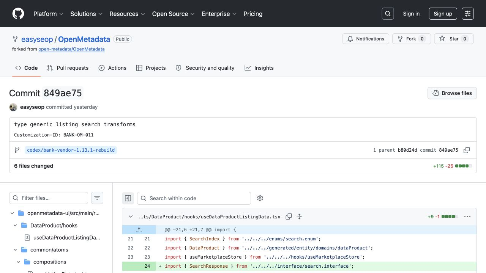
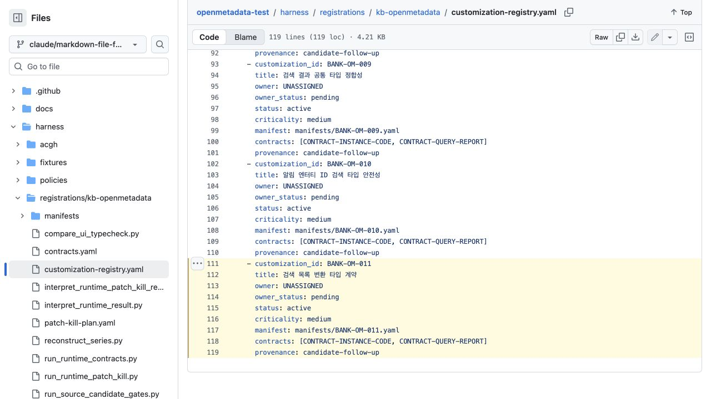
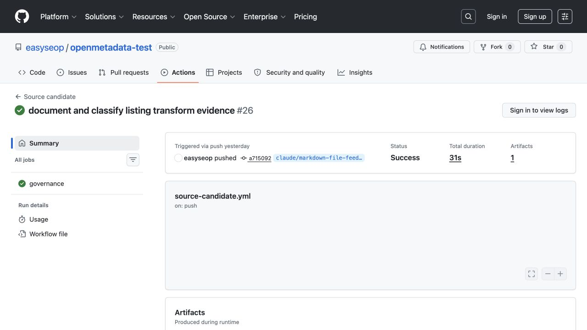
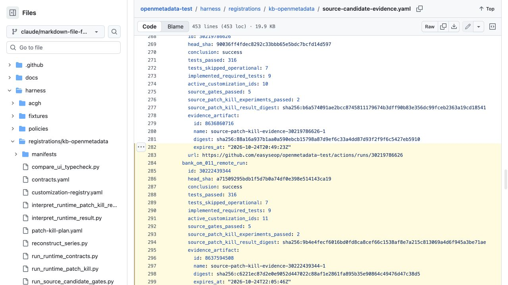
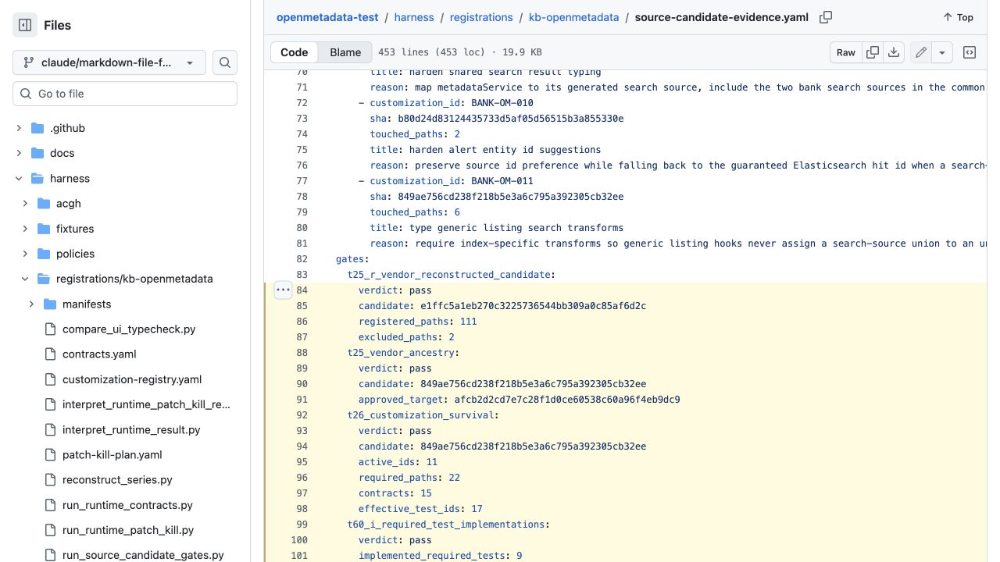
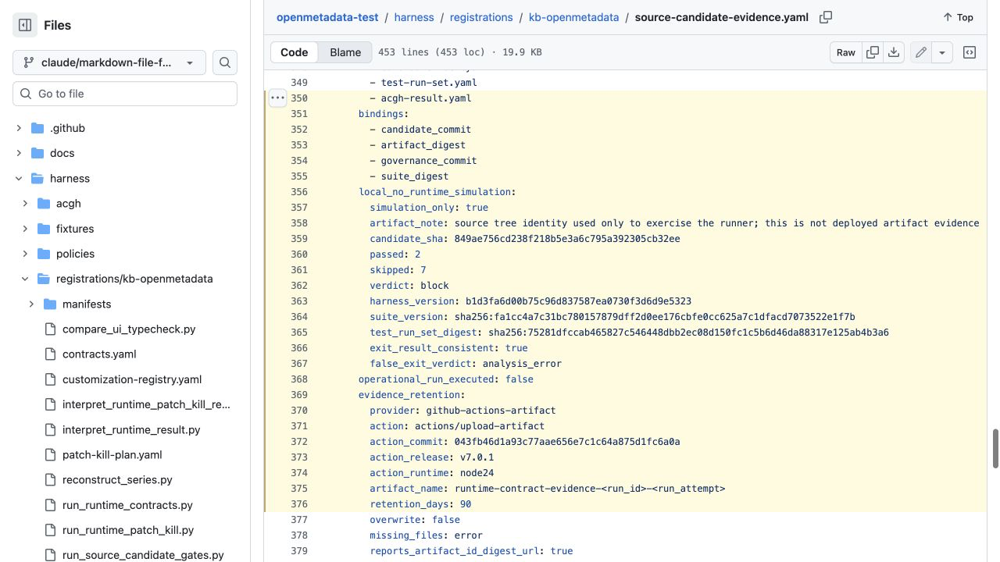
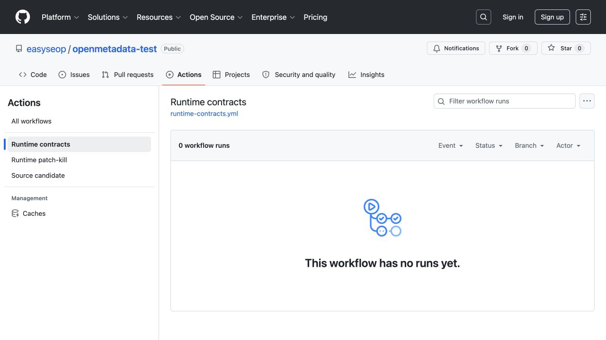
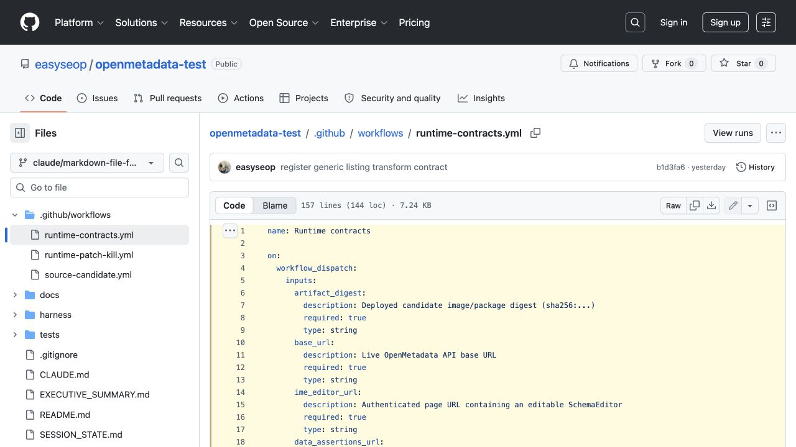
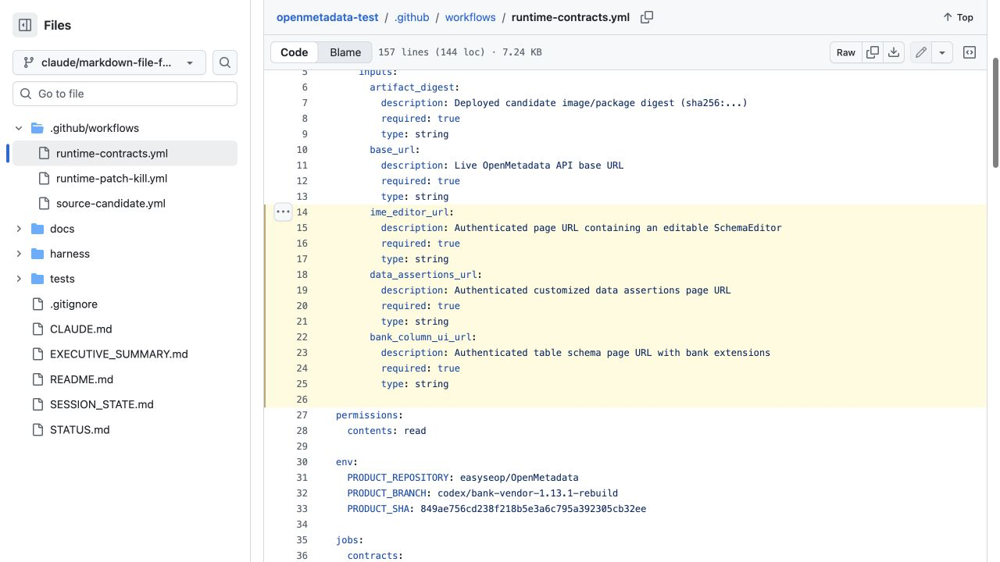
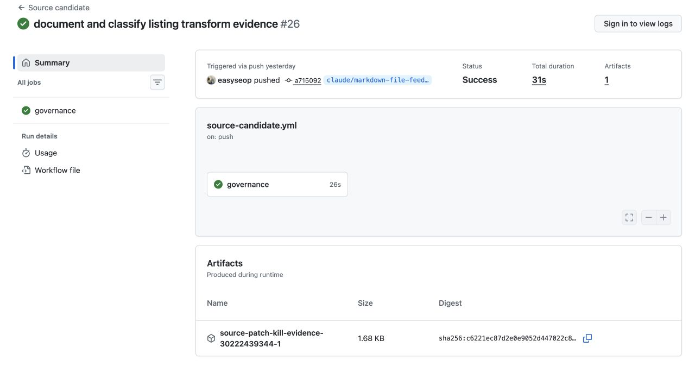

# 비개발자용 OpenMetadata 시연·테스트 가이드

> 대상: 개발 경험이 없는 업무 담당자, 데이터 오너, 승인자, 운영자
>
> 예상 시간: GitHub 확인 시연 10분 / 실제 환경 시연 30~60분
>
> 현재 제품 후보: `849ae756cd238f218b5e3a6c795a392305cb32ee`
>
> 현재 결론: **소스 검사는 성공했지만 실제 환경 시연은 아직 실행하지 않았다.**

이 문서는 명령어를 입력하지 않고 GitHub 화면에서 현재 결과를 확인하고, 테스트
환경이 준비되면 운영자와 함께 실제 기능 검사를 실행하는 방법을 설명한다.

> 아래 이미지는 설명용 모형이 아니라 2026-07-27에 실제 GitHub 저장소에서
> 캡처한 화면이다. 공개 화면으로 캡처해 토큰·비밀번호·행내 URL은 포함하지 않았다.

## 1. 가장 먼저 알아둘 것

시연은 두 종류다.

| 구분 | 지금 가능한가 | 확인하는 것 | 확인하지 못하는 것 |
|---|---:|---|---|
| A. GitHub 확인 시연 | 가능 | 11개 맞춤 변경의 등록·누락 여부, 소스 검사 결과 | 실제 서버·화면에서의 동작 |
| B. 실제 환경 시연 | 환경 준비 후 가능 | API 4개, 연결 기능 2개, 브라우저 화면 3개의 실제 동작 | 실제 업그레이드·최종 배포 승인 전체 |

GitHub에 초록색 체크가 보여도 “운영 배포 가능”이라는 뜻은 아니다. 현재 초록색
결과에는 실제 환경이 없어 실행하지 못한 검사 7개가 남아 있다.

## 2. 실제 업그레이드 전체 순서

질문한 순서는 거의 맞다. 다만 우리 방식은 공식 새 버전에 커스터마이징을 매번
복사하는 방식이 아니다. **커스터마이징이 들어 있는 vendor 브랜치에 승인한 공식
새 버전을 병합**하고, 충돌과 필요한 보강을 처리한다.

```text
현재 OpenMetadata + 행내 커스터마이징
        ↓
업그레이드할 공식 OpenMetadata 버전·SHA 고정
        ↓
공식 새 버전을 행내 vendor 브랜치에 병합
        ↓
충돌 해결 + 새 버전에 필요한 행내 보강
        ↓
검사할 제품 후보(candidate) 확정
        ↓
① 소스 검사: 11개 등록·누락·커밋 규칙 확인
        ↓
② 동일 후보를 격리 테스트 환경에 배포
        ↓
③ 실제 API·연결·화면 검사 9개
        ↓
④ 실제 업그레이드(T90)·동일 산출물 승격(T91)·내부망 검증(T94)
        ↓
최종 결과와 증거
```

짧게 말하면 다음 순서다.

> **커스터마이징 포함 현재 버전 → 공식 버전 업그레이드 병합 → 충돌 해결·필요
> 보강 → 제품 후보 확정 → 소스 검사 → 테스트 환경 배포 → 실제 기능 검사 →
> 업그레이드·승격·내부망 검증 → 결과**

현재는 **제품 후보 확정과 소스 검사까지 완료**됐고, 테스트 환경 배포 이후 단계는
아직 실행하지 않았다.

### 2.1 커스터마이징 한 건에 들어가야 하는 것

코드만 고치면 커스터마이징 등록이 끝나는 것이 아니다. 아래 항목이 한 묶음으로
있어야 업그레이드 후 누락 여부를 검사할 수 있다.

| 들어갈 것 | 쉬운 뜻 | 실제 예시 |
|---|---|---|
| `BANK-OM` ID | 맞춤 변경의 고유 이름표 | `BANK-OM-011` |
| 제목·상태·종류 | 무엇을 바꿨고 현재 사용하는지 | 검색 목록 변환 타입 계약·`active`·`core-patch` |
| owner·승인 경로 | 누가 기능과 결과를 책임지는지 | 현재 `UNASSIGNED`라 배포 전 지정 필요 |
| `allowed_changed_paths` | 이 기능이 바꿔도 된다고 승인한 파일 범위 | BANK-OM-011의 UI 파일 6개 |
| `required_changed_paths` | 병합 후 반드시 남아 있어야 하는 핵심 파일 | BANK-OM-011의 핵심 UI·테스트 파일 6개 |
| `upgrade_watch.paths` | 공식 새 버전에서 바뀌면 다시 검토할 의존 파일 | 목록 hook·공통 검색 hook |
| 업무 contract | 새 버전에서도 깨지면 안 되는 업무 동작 | InstanceCode·QueryReport 계약 |
| 필수 테스트 | contract를 실제로 확인할 테스트 파일·함수 | API·브라우저 selector |
| series·의존 ID | 같은 ID의 후속 변경 허용 여부와 선행 기능 | `depends_on: BANK-OM-010` |
| commit 꼬리표 | 제품 코드 변경을 ID와 연결하는 이름표 | `Customization-ID: BANK-OM-011` |

`BANK-OM-011`을 예로 들면 다음이 모두 있어야 한다.

```text
제품 commit           849ae756...
commit 꼬리표         Customization-ID: BANK-OM-011
필수 변경 파일        6개
감시 파일             6개
연결 contract         InstanceCode, QueryReport
선행 ID               BANK-OM-010
상태                  active
owner                 UNASSIGNED (아직 해결 필요)
```

### 2.2 병합 후 검사기는 무엇을 검사하는가

공식 버전을 vendor 브랜치에 병합한 뒤 아래 검사기를 순서대로 실행한다.

| 검사기 | 아주 쉽게 말하면 | 통과하면 알 수 있는 것 | 현재 결과 |
|---|---|---|---|
| 후보 잠금·T24 | “정확히 어느 코드가 검사 대상인가?” | candidate SHA·tree·digest가 고정됨 | `849ae756...` 고정 |
| T25 | “승인한 공식 새 버전이 정말 들어갔나?” | 공식 `1.13.1-release` target이 candidate 이력에 있음 | `pass` |
| T26 | “등록한 커스터마이징이 병합 후에도 남았나?” | active 11개 ID의 필수 파일·contract가 candidate에 있음 | `pass` |
| T30 | “제품 commit마다 BANK-OM 이름표가 정확히 하나인가?” | 이름표 없음·여러 개·원본과 정책 혼합 변경을 막음 | `pass` |
| T31 | “같은 ID의 후속 변경과 의존 순서가 정상인가?” | series 누락·ID 재사용·순환 의존을 막음 | `pass` |
| T60-I | “필수라고 적은 테스트가 실제로 존재하나?” | 없는 테스트를 검사했다고 착각하지 않음 | 9/9 `pass` |
| T61 patch-kill | “커스터마이징을 빼면 테스트가 정말 실패하나?” | 껍데기 테스트가 아니라 기능을 잡는 테스트임 | Sybase·Tibero만 source 입증, runtime 3개 남음 |
| T62 Runtime contracts | “실제 배포본에서 API·화면이 맞고, 그 결과가 같은 후보에 묶였나?” | API 4·연결 2·브라우저 3, 총 9개 실제 결과를 확인 | 아직 실행 0회 |
| T63 UI 기준선 | “은행 코드가 공식 원본보다 UI 타입 오류를 새로 늘렸나?” | 신규 path/code 오류 증가 여부를 공식 원본과 비교 | 신규 0, 사람 `approval` 필요 |
| T90 | “실제 데이터로 업그레이드 12단계가 성공했나?” | DB·검색·ingestion·권한을 포함한 업그레이드 근거 | 미실행 |
| T91 | “검사한 바로 그 파일을 배포했나?” | image·package·Helm digest 바꿔치기를 막음 | 미실행 |
| T94 | “내부망 반입 파일이 서명한 파일과 같은가?” | 오프라인 반입 중 변조·누락을 막음 | 미실행 |

따라서 현재 결과를 한 문장으로 읽으면 다음과 같다.

> **공식 1.13.1과 등록된 커스터마이징 11개가 제품 후보에 함께 들어간 것은
> 소스 검사로 확인했지만, 실제 배포 환경의 API·화면 검사와 업그레이드·승격·
> 내부망 검증은 아직 하지 않았다.**

## 3. 준비물

### A. GitHub 확인 시연

- GitHub에 로그인할 수 있는 계정
- `easyseop/OpenMetadata`와 `easyseop/openmetadata-test`를 볼 수 있는 권한
- 이 문서

터미널, 개발 프로그램, 테스트 서버는 필요 없다.

### B. 실제 환경 시연

아래 준비는 테스트 환경 운영자와 개발자가 담당한다. 비개발자가 값을 추측해서
입력하면 안 된다.

- 제품 후보 `849ae756...`로 만든 이미지 또는 패키지가 배포된 격리 테스트 환경
- 배포 산출물의 실제 `sha256:...` 값
- 테스트용 OpenMetadata 주소와 로그인 상태
- 테스트용 Query, 실패한 Data Assertion, 행내 확장 컬럼이 있는 테이블
- GitHub `openmetadata-runtime` 환경 승인 권한

토큰, 비밀번호, 브라우저 로그인 정보는 문서나 채팅에 붙여 넣지 않는다.

## 4. A 시연 — 지금 혼자 해보는 10분 확인

### 1단계: 제품 후보 확인

1. [제품 후보 커밋 `849ae756`](https://github.com/easyseop/OpenMetadata/commit/849ae756cd238f218b5e3a6c795a392305cb32ee)을 연다.
2. 화면 상단 커밋 제목이 `type generic listing search transforms`인지 확인한다.
3. 설명에서 `Customization-ID: BANK-OM-011`을 확인한다.

이 화면은 최신 보강 내용이 제품 소스에 별도 이름표로 기록됐다는 근거다.



화면에서 다음 세 곳만 본다.

1. 왼쪽 위 `Commit 849ae75`
2. 가운데 `Customization-ID: BANK-OM-011`
3. 그 아래 제품 브랜치 `codex/bank-vendor-1.13.1-rebuild`

### 2단계: 맞춤 변경 11개 확인

1. [맞춤 변경 등록부](https://github.com/easyseop/openmetadata-test/blob/claude/markdown-file-feedback-26933w/harness/registrations/kb-openmetadata/customization-registry.yaml)를 연다.
2. 브라우저 찾기 기능으로 `BANK-OM-011`을 검색한다.
3. `status: active`와 `owner: UNASSIGNED`를 확인한다.
4. 위쪽 목록에 `BANK-OM-001`부터 `BANK-OM-011`까지 있는지 확인한다.

`active`는 현재 후보에서 지켜야 하는 변경이라는 뜻이다. `UNASSIGNED`는 담당
조직이 아직 정해지지 않았다는 뜻이므로, 배포 전 해결해야 할 항목이다.



노란 부분에서 `BANK-OM-011`, `owner: UNASSIGNED`, `status: active`를 확인한다.
이 화면은 기능이 등록됐다는 근거이면서, 담당자 지정은 아직 남았다는 근거다.

### 3단계: 자동 검사 결과 확인

1. [성공한 Source candidate 실행 `30222439344`](https://github.com/easyseop/openmetadata-test/actions/runs/30222439344)을 연다.
2. 실행 화면에 초록색 성공 표시가 있는지 확인한다.
3. 실행 요약에서 다음 숫자를 확인한다.

| 확인 항목 | 기대값 |
|---|---:|
| 자동검사 통과 | 316 |
| 실제 환경이 없어 건너뜀 | 7 |
| 등록된 맞춤 변경 | 11 |
| 구현된 필수 테스트 | 9 |
| 소스 게이트 통과 | 5 |
| 소스 patch-kill 실험 통과 | 2 |

초록색은 “등록과 소스 누락 검사가 성공했다”는 뜻이다. `7 skipped`가 있으므로
실제 환경 검사가 끝났다는 뜻은 아니다.



이 화면에서는 초록색 체크, `Status Success`, `Artifacts 1`을 확인한다.



노란 부분의 다음 줄이 실제 숫자 근거다.

- `conclusion: success`
- `tests_passed: 316`
- `tests_skipped_operational: 7`
- `implemented_required_tests: 9`
- `active_customization_ids: 11`

### 4단계: 후보와 검사 결과가 같은지 확인

1. [후보 증거 파일](https://github.com/easyseop/openmetadata-test/blob/claude/markdown-file-feedback-26933w/harness/registrations/kb-openmetadata/source-candidate-evidence.yaml)을 연다.
2. `commit_sha:` 뒤의 값이
   `849ae756cd238f218b5e3a6c795a392305cb32ee`인지 확인한다.
3. 아래 항목을 검색해 `verdict: pass`인지 확인한다.
   - `t25_vendor_ancestry`
   - `t26_customization_survival`
   - `t30_commit_invariants`
   - `t31_id_invariants`
4. `operational_run_executed: false`도 확인한다.

마지막 값이 `false`인 것은 오류를 숨긴 것이 아니라, 실제 환경 실행이 아직
없다는 사실을 정직하게 기록한 것이다.



노란 부분에서 T25와 T26의 `verdict: pass`, 현재 후보 `849ae756...`,
`active_ids: 11`을 확인한다. 화면 아래로 더 내려가면 T30과 T31도 `pass`다.



이 화면은 특히 중요하다. `passed: 2`, `skipped: 7`, `verdict: block`,
`operational_run_executed: false`이므로 **소스 확인은 성공했지만 실제 환경
검사는 끝나지 않았다**고 읽는다.

### 5단계: 남은 차단 항목 확인

1. [`STATUS.md`](../../STATUS.md)를 연다.
2. `Important production blockers` 절을 찾는다.
3. 담당자 미지정, 실제 API·브라우저 검사 미실행, 릴리스 산출물 없음 등이
   남아 있는지 확인한다.

### A 시연 합격표

아래 다섯 항목을 모두 확인하면 “현재 소스 후보 확인 시연”은 성공이다.

- [ ] 제품 후보가 `849ae756...`이다.
- [ ] `BANK-OM-001`~`BANK-OM-011` 11개가 등록돼 있다.
- [ ] 실행 `30222439344`가 초록색이다.
- [ ] T25·T26·T30·T31이 모두 `pass`다.
- [ ] 실제 환경 미실행과 배포 차단 항목을 숨기지 않고 설명했다.

## 5. A 시연 때 그대로 읽을 발표 멘트

> 공식 OpenMetadata 1.13.1을 바탕으로 은행 맞춤 변경 11개를 별도 이름표로
> 관리하고 있습니다. 현재 제품 후보는 849ae756이며, 이 후보에 맞춤 변경이
> 등록되고 남아 있는지 확인하는 소스 검사는 성공했습니다. 다만 초록색 결과 중
> 7개 검사는 실제 환경이 없어 건너뛴 상태입니다. 따라서 오늘 확인한 것은 소스
> 관리 방식이 작동한다는 것이고, 운영 배포 승인은 아닙니다. 다음 단계는 같은
> 후보를 테스트 환경에 배포해 실제 API와 화면 검사 9개를 모두 실행하는 것입니다.

## 6. B 시연 — 테스트 환경에서 실제 기능 검사

이 단계는 테스트 환경 운영자가 준비를 완료한 뒤 진행한다.

현재 실제 화면은 아래와 같다.



가운데 `0 workflow runs`와 `This workflow has no runs yet.`가 현재 상태다.
이 캡처는 공개 로그아웃 화면이므로 `Run workflow` 버튼이 보이지 않는다. GitHub에
로그인하고 이 저장소의 Actions 실행 권한이 있는 계정으로 열면 오른쪽에
`Run workflow` 버튼이 나타난다.

### 1단계: 운영자가 미리 설정할 값

GitHub 저장소의 `openmetadata-runtime` 환경에 다음 값을 설정한다.

| 종류 | 이름 | 쉬운 뜻 |
|---|---|---|
| Secret | `OPENMETADATA_AUTH_TOKEN` | 테스트 API 로그인 토큰 |
| Secret | `BANK_BROWSER_STORAGE_STATE_B64` | 테스트 화면 로그인 상태 |
| Variable | `BANK_CONTRACT_QUERY_ID` | 연결 검사에 쓸 테스트 Query |
| Variable | `BANK_FAILED_ASSERTION_FQN` | 실패 상태인 테스트 항목 |
| Variable | `BANK_COLUMN_TABLE_FQN` | 행내 확장 컬럼이 있는 테이블 |
| Variable | `BANK_COLUMN_NAME` | 확인할 컬럼 이름 |

Secret 값은 시연 화면, 실행 요약, 캡처 이미지에 노출하지 않는다.

### 2단계: 실행 화면 열기

1. [Runtime contracts 실행 화면](https://github.com/easyseop/openmetadata-test/actions/workflows/runtime-contracts.yml)을 연다.
2. 오른쪽의 **Run workflow**를 누른다.
3. 브랜치는 `claude/markdown-file-feedback-26933w`를 선택한다.
4. 아래 다섯 값을 운영자에게 받아 입력한다.

| 입력칸 | 넣을 값 | 주의 |
|---|---|---|
| `artifact_digest` | 배포 산출물의 실제 `sha256:...` | 커밋 SHA가 아니라 이미지·패키지 digest |
| `base_url` | 테스트 OpenMetadata API 기본 주소 | 운영 환경 주소 사용 금지 |
| `ime_editor_url` | 수정 가능한 SchemaEditor 화면 | 테스트 계정으로 접근 가능해야 함 |
| `data_assertions_url` | 맞춤 Data Assertions 화면 | 실패 항목이 보여야 함 |
| `bank_column_ui_url` | 행내 확장 컬럼이 보이는 스키마 화면 | 지정 컬럼이 보여야 함 |

실제 workflow에 정의된 첫 번째 입력 부분은 다음과 같다.



이 화면에서 `artifact_digest`, `base_url`, `ime_editor_url`이 모두
`required: true`인 것을 확인한다.



두 번째 캡처에서 `ime_editor_url`, `data_assertions_url`,
`bank_column_ui_url`과 고정 제품 후보 `PRODUCT_SHA: 849ae756...`를 확인한다.

5. **Run workflow**를 누른다.
6. `openmetadata-runtime` 승인 요청이 나타나면 환경·후보·digest가 맞는지
   운영 승인자가 확인한 뒤 승인한다.

`Run workflow` 버튼이 보이지 않으면 저장소 실행 권한이 없는 것이다. 권한을
가진 운영자에게 실행을 요청한다.

### 3단계: 검사되는 실제 기능

한 번의 실행으로 필수 selector 9개가 모두 실행된다.

| 기능 | 실제로 확인하는 내용 |
|---|---|
| InstanceCode | 생성·조회·수정·검색 후 값이 유지되고 테스트 데이터를 정리함 |
| QueryReport | 테스트 Query와의 연결이 생성·수정 뒤에도 유지됨 |
| Data Assertions API | 실패 상태, 오너, 테이블·컬럼 정보가 일치함 |
| Data Assertions 화면 | API에서 본 실패 항목·오너가 화면 행에도 보임 |
| 은행 컬럼 API | 순번, 제약조건, 행내 확장 정보 3종이 존재함 |
| 은행 컬럼 화면 | API의 행내 확장 값이 화면의 같은 컬럼 행에 표시됨 |
| 한글 입력 | 편집기에 `한글`을 조합 입력해도 중복·소실되지 않음 |
| Sybase | 연결 스키마·서비스 선택 정보가 일치함 |
| Tibero | 연결 스키마·서비스 선택 정보가 일치함 |

### 4단계: 결과 판정

1. 실행이 끝나면 **Summary**를 연다.
2. 9개 selector가 모두 실행됐는지 확인한다.
3. 최종 판정이 `pass`인지 확인한다.
4. `skip`, `block`, `analysis_error`, 실패가 하나라도 있으면 시연 실패로
   기록하고 배포를 승인하지 않는다.

| 결과 | 의미 | 조치 |
|---|---|---|
| `pass` | 이번 실제 환경 계약은 충족 | 증거 보관 후 다음 검증으로 이동 |
| `skip` | 필요한 URL·데이터·로그인이 없어 미실행 | 준비값 보완 후 다시 실행 |
| `block` | 필수 조건 또는 기능이 충족되지 않음 | 원인 수정 전 중지 |
| `analysis_error` | 검사 자체의 결과를 믿을 수 없음 | 환경·검사 복구 후 다시 실행 |

### 5단계: 증거 내려받기

1. 실행 화면 아래 **Artifacts**를 찾는다.
2. `runtime-contract-evidence-실행번호-재시도번호`를 내려받는다.
3. 압축 파일에 아래 세 파일이 있는지 확인한다.
   - `candidate-lock.yaml`
   - `test-run-set.yaml`
   - `acgh-result.yaml`
4. 실행 URL, artifact ID, artifact digest, 실행 일시, 승인자를 인수인계
   기록에 남긴다.
5. GitHub 보존 기간은 90일이므로 만료 전에 행내 장기 증거 저장소로 이관한다.

소스 검사에서 실제로 만들어진 artifact 표의 모양은 다음과 같다. Runtime
contracts가 성공하면 이름만 `runtime-contract-evidence-실행번호-재시도번호`로
달라지고, 같은 위치에서 내려받는다.



## 7. 사람이 화면을 보며 확인하는 보조 시연

자동 검사가 끝난 뒤 참석자에게 화면을 보여주려면 운영자가 제공한 테스트 URL을
사용한다. 자동 검사 결과를 대신하는 절차가 아니라 이해를 돕는 보조 시연이다.

- Data Assertions 화면에서 실패 상태, 오너, 테이블, 컬럼을 함께 보여준다.
- 테이블 스키마 화면에서 지정 컬럼의 행내 확장 정보 3종을 보여준다.
- 편집 화면에서 한글을 조합 입력하고 `한글`이 정확히 남는지 보여준다.
- Database Service 생성 화면에서 Sybase와 Tibero 선택 항목을 보여준다.
- InstanceCode와 QueryReport는 화면 유무와 관계없이 자동 API 결과를 정본으로
  설명한다.

시연 중 만든 데이터는 테스트가 자동 정리하는지 결과에서 확인하고, 별도 수동
데이터를 만들었다면 운영자의 테스트 데이터 정리 절차를 따른다.

## 8. 어디까지 성공이라고 말할 수 있나

| 완료한 시연 | 말해도 되는 것 | 아직 말하면 안 되는 것 |
|---|---|---|
| A만 성공 | “소스 등록·누락 검사가 성공했다” | “기능 테스트가 끝났다” |
| A+B 성공 | “고정 후보의 실제 기능 계약 9개가 통과했다” | “운영 배포 승인 완료” |
| T90·T91·T94까지 성공 | “실제 업그레이드·동일 산출물 승격·내부망 검증 근거가 있다” | 별도 조직 승인 없는 최종 완료 선언 |

실제 운영 배포 완료를 선언하려면 이 문서의 B 시연 외에도 실제 업그레이드
12단계(T90), 검증한 동일 산출물 승격(T91), 서명된 내부망 반입 검증(T94), 조직
승인이 필요하다.

## 9. 자주 막히는 경우

| 증상 | 가장 흔한 원인 | 해결 |
|---|---|---|
| 링크가 404로 보임 | 로그인 또는 저장소 읽기 권한 없음 | GitHub 로그인·권한 확인 |
| `Run workflow` 버튼이 없음 | Actions 실행 권한 없음 | 운영자에게 실행 요청 |
| 승인을 기다리는 상태로 멈춤 | `openmetadata-runtime` 환경 승인 대기 | 지정 승인자가 환경·digest 확인 후 승인 |
| 7개가 `skip`됨 | 실제 URL·토큰·fixture가 없음 | 운영 준비값 설정 후 재실행 |
| 브라우저 검사만 실패 | 로그인 상태 만료 또는 잘못된 화면 URL | 테스트 계정 재로그인 상태와 URL 갱신 |
| digest 오류 | 커밋 SHA를 입력했거나 배포 산출물과 불일치 | 실제 배포 이미지·패키지의 `sha256` 재확인 |

## 10. 시연 결과 기록지

```text
시연 일시:
시연자:
참석자:
제품 후보: 849ae756cd238f218b5e3a6c795a392305cb32ee
GitHub 확인 실행: 30222439344
Runtime contracts 실행 URL:
배포 산출물 digest:
9개 selector 결과:
증거 artifact ID / digest:
남은 skip·block·analysis_error:
최종 설명: 소스 확인 완료 / 실제 환경 계약 완료 / 배포 차단 유지
```

민감한 URL, 토큰, 비밀번호, 브라우저 로그인 정보는 이 기록지에 적지 않는다.
