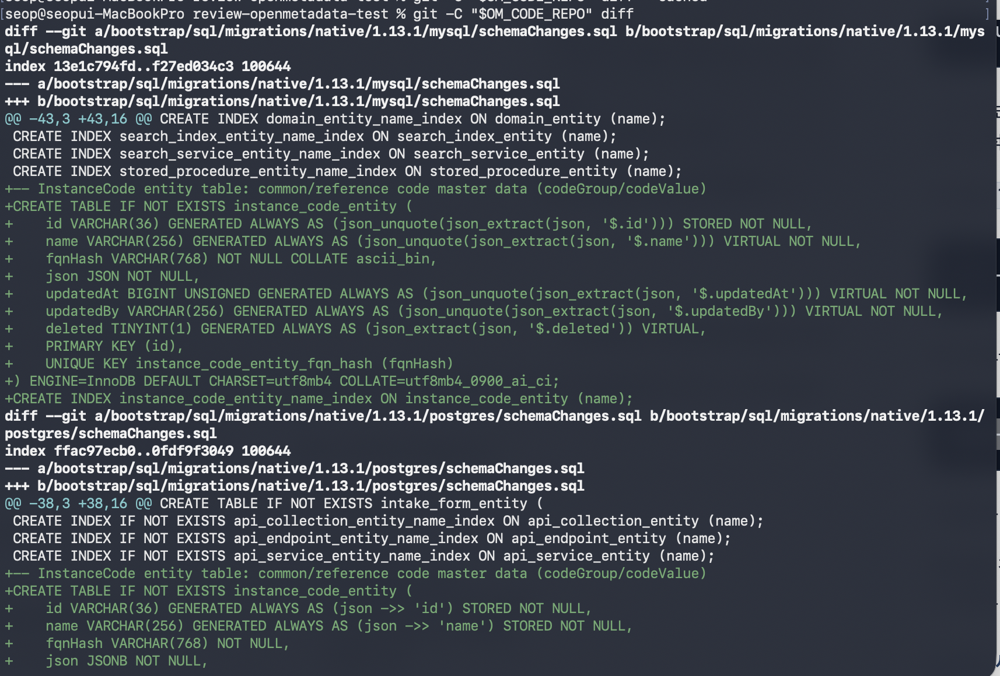
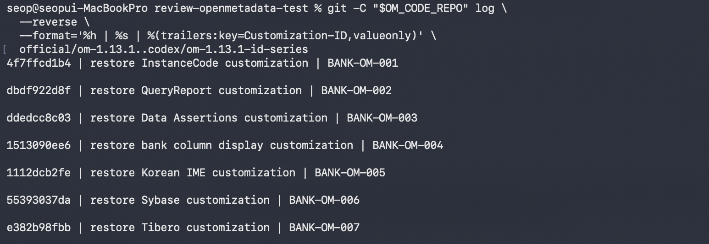
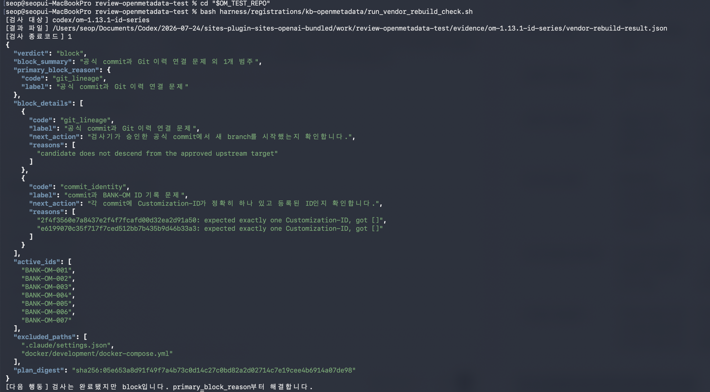
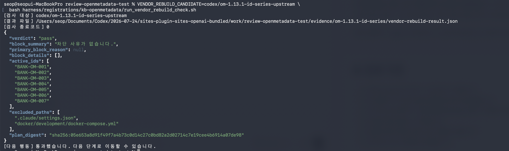
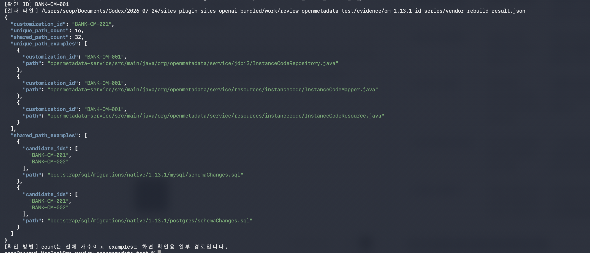

# OM_TEMP 1.13.1 BANK-OM ID별 커밋 후보 브랜치 구성 가이드

**전체 순서:** 4/11 · [전체 목차](./OM_TEMP_1.13.1_1.13.2_예행연습_전체목차.html)

> 문서 성격: 111개 커스터마이징 변경을 `BANK-OM-001`~`007`의 Git commit으로 나누는 실행 가이드  
> 시작 조건: 113개 변경 파일 중 111개 등록, 2개 제외, 공용 파일 37개 다중 ID 연결 결정 완료  
> 종료점: 공식 1.13.1에서 시작하고 BANK-OM ID가 하나씩 기록된 7개 commit 후보 branch 준비  
> 이 문서에서 하지 않는 일: 새 BANK-OM ID 자동 발급, Manifest·Registry·Contract 승인, 원격 push, 1.13.2 병합

**문서 이동:** [← 이전 — 113개 변경 파일과 BANK-OM ID 연결](./OM_TEMP_1.13.1_113개_변경파일_기능분류_가이드.html) · [다음 — 코드 정리 및 등록 준비 →](./OM_TEMP_1.13.1_코드정리_및_등록준비_가이드.html)

## 공통 경로 설정

이 페이지의 명령을 실행할 터미널에서 검사기 저장소로 이동한 뒤 공통 경로를 불러옵니다. 다른 컴퓨터에서는 clone 위치만 바꾸면 됩니다.

```bash
cd <검사기-저장소-clone-경로>
```

```bash
source harness/rehearsal_env.sh
```

`OM_TEST_REPO`는 검사기 저장소, `OM_CODE_REPO`는 OpenMetadata 코드 작업 폴더, `KB_SOURCE_REPO`는 실제 커스터마이징 원본 폴더를 가리킵니다. 새 터미널을 열면 다시 실행합니다.

## 단계 연결 요약

| 구분 | 내용 |
|---|---|
| 이전 단계 | 111개 등록 경로가 어느 BANK-OM ID에 속하는지와 37개 공용 파일의 다중 연결을 결정했습니다. |
| 이번 단계 | 공식 1.13.1에서 새 후보 branch를 만들고, ID별 변경안을 한 번에 하나씩 생성·검토·승인·commit합니다. |
| 완료 결과 | `Customization-ID`가 정확히 하나씩 있는 7개 commit과 111개 최종 변경 경로가 준비됩니다. |

## 1. 먼저 구분할 두 식별값

| 값 | 누가 정하는가 | 이 단계에서 하는 일 |
|---|---|---|
| BANK-OM ID | 사용자가 업무 단위 기준으로 승인 | 기존 `BANK-OM-001`~`007` 중 하나를 각 commit에 기록 |
| Git commit SHA | Git이 commit 생성 시 자동 발급 | 사용자가 직접 입력하거나 미리 정하지 않음 |

예를 들어 사용자가 QueryReport 변경을 `BANK-OM-002`로 승인하면 commit 본문에는 `Customization-ID: BANK-OM-002`를 기록합니다. Git commit SHA는 commit 명령이 성공한 뒤 자동으로 생깁니다.

## 2. 사용 도구와 승인 경계

`harness/registrations/kb-openmetadata/reconstruct_series.py`는 기존 111개 경로 분류와 공용 경로 연결 순서를 읽어 한 BANK-OM ID의 변경안을 작업 폴더에 적용하는 보조 스크립트입니다.

| 구분 | 보조 스크립트 | 사용자 |
|---|---|---|
| ID별 변경 경로 제안 | 처리함 | 출력과 실제 diff 확인 |
| 공용 파일 코드 조각 제안 | 기존 경로·ID 규칙으로 적용 | 해당 코드가 ID에 맞는지 승인 |
| BANK-OM ID 결정 | 처리하지 않음 | 승인 또는 중단 |
| Git commit 생성 | 처리하지 않음 | 승인 후 명령 실행 |

**중단 조건:** 보조 스크립트가 제안한 diff에 다른 ID의 코드, 설명되지 않은 삭제, 등록 제외 파일이 포함되면 commit하지 않습니다.

## 3. 실행 전 확인

### 3-1. 제품 코드 저장소 작업 폴더

```bash
git -C "$OM_CODE_REPO" status --short
```

**정상 결과:** 빈 출력입니다. 출력이 있으면 기존 작업을 보존한 뒤 다시 시작합니다.

### 3-2. 기준 branch

```bash
git -C "$OM_CODE_REPO" rev-parse official/om-1.13.1
```

**현재 확인값:** `e6199070c35f717f7ced512bb7b435b9d46b33a3`

```bash
git -C "$OM_CODE_REPO" rev-parse custom/om-1.13.1
```

**현재 확인값:** `59dae915342eaa3bdca1f9571bfa2ba4533c9a6f`

값이 다르면 이 가이드의 기준 이후 코드가 바뀐 것이므로 111개 경로 분류를 다시 확인합니다.

## 4. 원본 비교용 worktree와 후보 branch 준비

이 절에서는 서로 다른 두 준비 결과를 만듭니다. 둘 다 YAML이나 결과 JSON 같은 단일 파일이 아닙니다.

| 준비 결과 | 실제로 생기는 것 | 5장에서 사용하는 방식 |
|---|---|---|
| 커스텀 코드 원본 폴더 | `custom/om-1.13.1` 전체 파일을 별도 경로에 펼친 Git worktree | 5-1 보조 스크립트가 이 폴더에서 BANK-OM 코드를 읽음 |
| ID별 commit 작성 branch | 공식 1.13.1 파일로 시작하는 `codex/om-1.13.1-id-series` branch | 5-1이 한 ID의 코드를 이 branch 작업 폴더에 적용하고, 사용자가 승인한 뒤 commit함 |

### 4-1. 현재 커스텀 코드의 파일 내용을 별도 폴더에 고정

```bash
git -C "$OM_CODE_REPO" worktree add --detach "${OM_CODE_REPO}-snapshot" custom/om-1.13.1
```

**이 명령으로 생기는 것:** `${OM_CODE_REPO}-snapshot`이라는 별도 폴더가 생기고, 그 안에 `custom/om-1.13.1`의 전체 파일이 펼쳐집니다. 이 폴더는 5-1 보조 스크립트가 커스터마이징 코드를 복사해 오는 원본입니다. 이 폴더 안에 별도의 보고서 파일이 생성되는 것은 아닙니다.

**확인 명령:**

```bash
git -C "$OM_CODE_REPO" worktree list
```

**정상 출력 예시:** 경로와 commit SHA는 컴퓨터마다 다르지만, 아래처럼 기본 작업 폴더와 `-snapshot` 폴더가 각각 한 줄씩 나옵니다.

```text
.../om-temp-real-1.13.1           59dae915 [custom/om-1.13.1]
.../om-temp-real-1.13.1-snapshot  59dae915 (detached HEAD)
```

두 번째 줄의 commit이 3-2에서 확인한 `custom/om-1.13.1` commit과 다르면 중단합니다.

**이미 폴더가 있다는 오류:** 아래 명령으로 등록된 worktree를 확인하고, 기존 폴더가 같은 `custom/om-1.13.1` commit을 가리키는지 확인합니다.

위의 `worktree list` 명령으로 기존 폴더가 같은 `custom/om-1.13.1` commit을 가리키는지 확인합니다.

### 4-2. 공식 1.13.1에서 후보 branch 생성

```bash
git -C "$OM_CODE_REPO" switch -c codex/om-1.13.1-id-series official/om-1.13.1
```

**이 명령으로 생기는 것:** `$OM_CODE_REPO` 작업 폴더가 새 `codex/om-1.13.1-id-series` branch로 전환됩니다. 이 branch는 아직 BANK-OM 변경이 하나도 없는 공식 1.13.1 파일 상태로 시작합니다. 별도의 산출물 파일은 생성되지 않습니다.

**확인 명령 1 — 현재 branch 이름:**

```bash
git -C "$OM_CODE_REPO" branch --show-current
```

**정상 출력:**

```text
codex/om-1.13.1-id-series
```

**확인 명령 2 — 아직 미커밋 변경이 없는지 확인:**

```bash
git -C "$OM_CODE_REPO" status --short
```

**정상 출력:** 빈 출력입니다. 이 시점에 파일 목록이 나오면 5-1을 실행하기 전에 기존 변경부터 확인합니다.

## 5. BANK-OM ID 하나를 적용하고 승인받는 반복 절차

아래 5-1~5-4를 `BANK-OM-001`부터 `BANK-OM-007`까지 한 ID씩 반복합니다. 여러 ID를 한꺼번에 적용한 뒤 승인하지 않습니다.

### 5-1. 한 BANK-OM ID의 코드를 작업 branch에 적용

먼저 검사기 저장소로 이동합니다.

```bash
cd "$OM_TEST_REPO"
```

아래 예시는 `BANK-OM-001`입니다. 다음 반복에서는 마지막 ID 값만 바꿉니다.

```bash
PYTHONPATH=harness ./.venv/bin/python \
  harness/registrations/kb-openmetadata/reconstruct_series.py \
  --product "$OM_CODE_REPO" \
  --snapshot "${OM_CODE_REPO}-snapshot" \
  --harness harness \
  --registration harness/registrations/kb-openmetadata \
  --id BANK-OM-001
```

이 명령은 `proposal.yaml` 같은 별도 변경안 파일을 만들지 않습니다. `${OM_CODE_REPO}-snapshot`에서 `BANK-OM-001`에 연결된 코드를 읽어 `$OM_CODE_REPO`의 실제 파일을 수정합니다. 아직 `git commit`은 하지 않으므로 Git에서는 **미커밋 변경**으로 보입니다.

**터미널 출력 예시:** 현재 등록자료 기준으로 `BANK-OM-001`은 전용 파일과 공용 파일을 합쳐 48개 경로를 처리합니다.

```text
BANK-OM-001: materialized 48 paths
openmetadata-service/src/main/java/org/openmetadata/service/Entity.java
openmetadata-service/src/main/java/org/openmetadata/service/jdbi3/CollectionDAO.java
...
```

첫 줄은 처리한 BANK-OM ID와 경로 수이고, 그 아래 줄들은 수정 대상으로 처리한 파일 경로입니다. 이 목록은 PASS 판정이나 검사 로그가 아닙니다. 실제 코드가 올바른지는 5-2의 Git diff로 확인해야 합니다.

**이미 정확히 적용된 상태에서 다시 실행한 경우:** 스크립트는 현재 미커밋 경로와 파일 내용을 깨끗한 `HEAD`에서 한 번 적용한 예상 결과와 비교합니다. 모두 같으면 오류 대신 아래 알림을 출력합니다.

```text
BANK-OM-001: ALREADY_MATERIALIZED (48 paths)
No files changed. Continue with step 5-2; do not rerun step 5-1.
```

이 출력이면 적용이 완료된 상태이므로 5-1을 다시 실행하지 않고 5-2로 이동합니다. 경로만 같고 파일 내용이 다르거나 일부 경로만 적용됐다면 `ALREADY_MATERIALIZED`로 처리하지 않고 불일치 원인과 함께 중단합니다.

| 5-1 출력 | 의미 | 다음 행동 |
|---|---|---|
| `materialized 48 paths`와 경로 목록 | 이번 실행에서 실제 파일 48개를 적용함 | 5-2에서 코드 검토 |
| `ALREADY_MATERIALIZED (48 paths)` | 이전 실행 결과가 예상 경로·내용과 완전히 같음 | 재실행하지 않고 5-2로 이동 |
| Python 오류 또는 `incomplete or different content` | 적용 도중 실패했거나 다른 변경이 섞임 | commit하지 말고 표시된 경로 확인 |

| 5-1 실행 후 생기는 것 | 위치 | 다음 사용 |
|---|---|---|
| 실제 코드 변경 | `$OM_CODE_REPO` 작업 폴더 | 5-2에서 Git diff로 검토 |
| 변경 경로 목록 | 현재 터미널 출력 | 예상하지 않은 파일이 포함됐는지 빠르게 확인 |
| Git commit | 아직 생성되지 않음 | 사용자 승인 후 5-4에서 생성 |

### 5-2. 미커밋 코드 변경을 네 단계로 확인

5-1의 긴 경로 목록 전체를 한 번에 해석할 필요는 없습니다. 먼저 파일 범위를 확인하고, 다음으로 변경 규모와 실제 코드를 봅니다. 마지막에는 새 파일까지 Git의 검토 대상에 올린 뒤 전체 변경을 다시 확인합니다.

| 순서 | 명령 | 여기서 확인할 내용 |
|---:|---|---|
| 1 | `git status --short` | `M`과 `??`를 포함한 전체 변경 파일 목록이 현재 BANK-OM ID의 예상 범위와 맞는지 확인합니다. |
| 2 | `git diff` | 공식 1.13.1에 이미 있던 파일이 어떤 코드로 수정됐는지 확인합니다. 아직 `??` 새 파일의 내용은 나오지 않습니다. |
| 3 | `git add -A` | 기존 수정 파일과 새 파일을 모두 승인 전 검토 대상으로 올립니다. 이 명령만으로 commit되지는 않습니다. |
| 4 | `git diff --cached` | 기존 수정 파일과 새 파일을 합친, 이번 BANK-OM ID의 commit 예정 코드 전체를 확인합니다. |

#### 5-2-1. 어떤 파일이 바뀌었는지 확인

```bash
git -C "$OM_CODE_REPO" status --short
```

**출력 예시:**

```text
 M openmetadata-service/src/main/java/org/openmetadata/service/Entity.java
 M openmetadata-service/src/main/java/org/openmetadata/service/jdbi3/CollectionDAO.java
?? openmetadata-service/src/main/java/org/openmetadata/service/resources/instancecode/InstanceCodeResource.java
```

| 표시 | 의미 |
|---|---|
| `M` | 공식 1.13.1에도 있던 파일의 내용이 수정됨 |
| `??` | 공식 1.13.1에는 없던 새 파일이 추가됨 |

이 명령으로는 어떤 코드가 추가됐는지 알 수 없습니다. 현재 BANK-OM ID와 무관한 경로나 등록 제외 파일이 섞였는지만 먼저 확인합니다.

**여기서는** `M`과 `??`의 파일 경로가 모두 현재 적용 중인 BANK-OM ID에 필요한 파일인지 확인하면 됩니다. 예상하지 않은 파일이 하나라도 있으면 다음 단계로 진행하지 않습니다.

경로만 다시 보고 싶으면 다음 명령을 사용합니다.

```bash
git -C "$OM_CODE_REPO" diff --name-only
```

새 파일(`??`)은 `git diff --name-only`에 아직 나오지 않을 수 있으므로 최종 파일 범위는 `status --short`와 함께 확인합니다.

#### 5-2-2. 파일별 변경 규모 확인

```bash
git -C "$OM_CODE_REPO" diff --stat
```

**출력 예시:**

```text
 .../org/openmetadata/service/Entity.java        |  2 ++
 .../service/jdbi3/CollectionDAO.java            | 12 ++++++++++++
 2 files changed, 14 insertions(+)
```

이 명령은 파일별 추가·삭제 줄 수만 요약합니다. 예상보다 대량 삭제가 있거나 한 파일이 지나치게 크게 바뀌었는지 찾는 용도이며, 업무 코드가 맞는지는 아직 판정하지 않습니다.

**여기서는** 파일 수와 추가·삭제 줄 수가 예상 범위인지 확인하면 됩니다. 특히 이유를 모르는 대량 삭제가 보이면 실제 코드 검토 전에 중단합니다.

#### 5-2-3. 실제 코드 내용 확인

전체 diff를 한꺼번에 출력하지 말고, 5-2-1에서 확인한 경로를 하나씩 넣어 봅니다.

```bash
git -C "$OM_CODE_REPO" diff -- <확인할-파일-경로>
```

예를 들어 공용 파일 `Entity.java`에서 `BANK-OM-001` 코드가 추가됐는지 확인합니다.

```bash
git -C "$OM_CODE_REPO" diff -- \
  openmetadata-service/src/main/java/org/openmetadata/service/Entity.java
```

```diff
+  public static final String INSTANCE_CODE = "instanceCode";
```

`+`는 이번 단계에서 추가된 줄, `-`는 삭제된 줄입니다. 위 예시에서는 `INSTANCE_CODE` 정의가 실제 코드로 추가됐는지 확인합니다. 주석이나 문자열에 이름만 적힌 경우에는 코드 정의로 승인하지 않습니다.

새 파일(`??`)은 아직 Git 추적 대상이 아니므로 다음 명령으로 파일 내용을 직접 확인합니다.

```bash
sed -n '1,220p' "$OM_CODE_REPO/<새-파일-경로>"
```

모든 경로를 확인한 뒤 전체 변경을 마지막으로 보고 싶을 때만 아래 명령을 사용합니다.

```bash
git -C "$OM_CODE_REPO" diff
```

**실제 `BANK-OM-001` 출력 화면 예시:**



이 화면에서는 다음 항목을 확인하면 됩니다.

| 화면의 표시 | 의미 | 여기서 확인할 내용 |
|---|---|---|
| `diff --git a/... b/...` | 지금부터 한 파일의 변경을 보여준다는 시작 표시 | 변경 파일이 MySQL 또는 PostgreSQL의 `schemaChanges.sql`인지 확인합니다. |
| 초록색 `+` | 공식 1.13.1 코드에 새로 추가되는 줄 | `instance_code_entity` 테이블과 인덱스 정의가 추가됐는지 확인합니다. |
| 색이 없는 줄 | 변경 위치를 이해하기 위해 함께 보여주는 기존 코드 | 삭제되거나 추가된 줄이 아니므로 내용이 보인다는 이유만으로 변경으로 계산하지 않습니다. |
| 다음 `diff --git` | 다음 파일의 변경 시작 | MySQL 확인이 끝난 뒤 PostgreSQL에도 같은 목적의 정의가 추가됐는지 확인합니다. |

이 예시에는 빨간색 `-` 삭제 줄이 없습니다. 실제 출력에 예상하지 않은 빨간색 삭제 줄이 보이면 승인하지 않고 어떤 기존 코드가 삭제되는지 먼저 확인합니다.

이 출력은 결과 파일이나 PASS/FAIL 로그가 아니라, 아직 commit하지 않은 실제 코드 변경 전체입니다.

**여기서는** 각 `+`·`-` 줄이 현재 BANK-OM ID의 기능을 구현하는 변경인지 확인하면 됩니다. 파일 이름만 맞는 것이 아니라 실제 코드 내용도 맞아야 합니다.

#### 5-2-4. 새 파일까지 포함한 commit 예정 코드 확인

다음 명령은 기존 수정 파일과 `??` 새 파일을 모두 Git의 **승인 전 검토 대상**에 올립니다.

```bash
git -C "$OM_CODE_REPO" add -A
```

이 명령은 commit이 아닙니다. 파일을 삭제하거나 원격 저장소에 올리지도 않습니다. 다음 명령에서 새 파일까지 포함한 전체 코드를 확인할 수 있도록 준비하는 단계입니다.

먼저 commit 예정 파일 목록을 확인합니다.

```bash
git -C "$OM_CODE_REPO" diff --cached --name-status
```

**여기서는** `M`과 `A`로 표시된 파일 목록이 5-2-1에서 확인한 범위와 같은지 확인하면 됩니다. `A`는 이번 commit에 새 파일로 포함될 예정이라는 뜻입니다.

변경 규모를 확인합니다.

```bash
git -C "$OM_CODE_REPO" diff --cached --stat
```

**여기서는** 새 파일까지 포함한 전체 파일 수와 추가·삭제 줄 수에 이상이 없는지 확인하면 됩니다.

마지막으로 실제 commit 예정 코드 전체를 확인합니다.

```bash
git -C "$OM_CODE_REPO" diff --cached
```

**여기서는** 기존 수정 파일과 새 파일의 실제 내용이 모두 현재 BANK-OM ID에 해당하는지 확인하면 됩니다. 이 결과가 승인되면 5-3으로 이동합니다.

사용자는 다음을 확인합니다.

- 표시된 변경이 현재 BANK-OM ID의 업무 기능에 속합니다.
- 공용 파일에는 현재 ID에 해당하는 코드 조각이 실제로 추가됐습니다.
- `.claude/settings.json`과 `docker/development/docker-compose.yml`이 포함되지 않았습니다.
- 다른 BANK-OM ID의 코드만 단독으로 섞이지 않았습니다.

| 확인 결과 | 다음 행동 |
|---|---|
| 경로와 실제 코드가 모두 현재 BANK-OM ID에 해당 | 5-3에서 승인 |
| 예상하지 않은 경로 또는 다른 ID 코드 발견 | commit하지 않고 문제 경로를 기록한 뒤 변경 수정 |
| 대량 삭제·빈 파일·이유를 모르는 변경 발견 | commit하지 않고 보조 스크립트 적용 원인을 확인 |

### 5-3. 사용자 결정

| 사용자 결정 | 다음 행동 |
|---|---|
| 승인 | 5-4의 commit 명령 실행 |
| 수정 필요 | 어떤 파일·코드 조각이 잘못됐는지 기록하고 변경안을 수정한 뒤 5-2부터 재확인 |
| 판단 불가 | commit하지 않고 해당 ID 담당자에게 확인 요청 |

### 5-4. 승인한 변경만 commit

5-2-4에서 검토한 staging 상태를 그대로 commit합니다. 승인 후 파일을 다시 수정했다면 commit하지 말고 5-2부터 다시 확인합니다.

> ★ **핵심 운영기준 — BANK-OM ID 추적 시작점**  
> 아래 commit부터 실제 코드 변경과 `BANK-OM-001`이 Git 이력으로 연결됩니다. 이후 Manifest 등록과 검사는 commit 본문의 `Customization-ID`를 읽어 어느 BANK-OM 변경인지 구분합니다. 따라서 제목만 기록하고 두 번째 `-m "Customization-ID: ..."`를 생략하면 안 됩니다.

`BANK-OM-001` 예시:

```bash
git -C "$OM_CODE_REPO" commit \
  -m "restore InstanceCode customization" \
  -m "Customization-ID: BANK-OM-001"
```

**산출물:** 사용자 승인 코드와 BANK-OM ID가 연결된 Git commit. Git commit SHA는 이 명령이 성공한 뒤 자동 생성됩니다.

**여기서는** commit 성공 메시지가 나온 뒤, 다음 명령에서 `Customization-ID: BANK-OM-001`이 실제 commit 본문에 남았는지 확인하면 됩니다.

```bash
git -C "$OM_CODE_REPO" show -s --format=fuller HEAD
```

**정상 확인 예시:**

```text
commit <자동으로 생성된 40자리 Git commit SHA>
...
    restore InstanceCode customization

    Customization-ID: BANK-OM-001
```

ID가 없거나 다른 ID가 표시되면 다음 BANK-OM ID를 적용하지 않습니다. 현재 commit의 ID 기록부터 바로잡은 뒤 다시 확인합니다.

## 6. 7개 ID의 적용 순서와 commit 제목

| 순서 | BANK-OM ID | 업무 기능 | commit 제목 예시 |
|---:|---|---|---|
| 1 | `BANK-OM-001` | InstanceCode | `restore InstanceCode customization` |
| 2 | `BANK-OM-002` | QueryReport | `restore QueryReport customization` |
| 3 | `BANK-OM-003` | Data Assertions | `restore Data Assertions customization` |
| 4 | `BANK-OM-004` | 은행 컬럼 확장 표시 | `restore bank column display customization` |
| 5 | `BANK-OM-005` | 한글 IME 보정 | `restore Korean IME customization` |
| 6 | `BANK-OM-006` | Sybase | `restore Sybase customization` |
| 7 | `BANK-OM-007` | Tibero | `restore Tibero customization` |

이 순서는 공용 파일을 단계적으로 완성하기 위해 기존 재구성 보조 스크립트가 사용한 순서입니다. 순서를 바꾸려면 공용 파일 37개의 ID별 적용 결과를 다시 검토해야 합니다.

### 6-1. BANK-OM-002~007 빠른 대화형 반복

`BANK-OM-001` commit과 5-4 확인을 끝낸 뒤에는 다음 명령 한 번으로 `BANK-OM-002`~`007`의 반복 절차를 순서대로 실행할 수 있습니다.

```bash
cd "$OM_TEST_REPO"
```

```bash
bash harness/registrations/kb-openmetadata/reconstruct_remaining_ids.sh
```

이 도구는 여섯 ID를 무조건 자동 commit하지 않습니다. 각 ID마다 다음 작업을 수행합니다.

1. 해당 ID 코드를 작업 branch에 적용합니다.
2. 변경 파일 목록, commit 예정 파일, 변경 규모와 전체 코드를 보여줍니다.
3. 사용자가 화면의 ID와 같은 값을 직접 입력한 경우에만 commit합니다.
4. commit 본문의 `Customization-ID`와 깨끗한 작업 폴더를 확인한 뒤 다음 ID로 이동합니다.

**승인 입력 예시:** `BANK-OM-002` 코드를 확인한 화면에서는 아래처럼 정확히 입력합니다.

```text
Commit only if the code above belongs to BANK-OM-002. Type the exact ID to approve: BANK-OM-002
```

Enter만 누르거나 다른 ID를 입력하면 commit하지 않고 중단합니다. 이 경우 검토 중이던 staged 변경은 보존되므로 `git diff --cached`로 다시 확인할 수 있습니다.

**중간에 중단된 뒤 다시 실행하는 경우:** 같은 명령을 다시 실행합니다. 도구는 마지막으로 commit된 `Customization-ID`를 읽어 다음 ID부터 시작합니다. 다음 ID가 이미 staging까지 끝난 상태라면 코드를 다시 적용하지 않고 기존 staged 변경을 다시 보여준 뒤 승인 입력을 기다립니다.

예를 들어 commit 이력에는 `BANK-OM-001`만 있고 `BANK-OM-002` 파일이 `M`·`A`로 표시된다면, `BANK-OM-002`가 적용·staging됐지만 아직 승인 commit 전이라는 뜻입니다. 이때 같은 반복 명령을 다시 실행하고 전체 코드를 확인한 뒤 `BANK-OM-002`를 입력합니다.

전체 diff 화면에서 `q`를 누르는 것은 반복 도구 종료가 아니라 **코드 보기 화면 종료**입니다. `q`를 누르면 같은 터미널에 승인 질문이 이어집니다. 초기 도구 버전에서 `q`가 전체 도구 종료로 처리된 경우에도 staged 변경은 보존되며, 같은 명령을 다시 실행하면 해당 ID의 검토부터 재개합니다.

> ★ **핵심 운영기준 — 빠른 반복에서도 ID별 승인은 생략하지 않음**  
> 명령은 한 번만 실행하지만 실제 코드는 ID별로 멈춰서 확인합니다. 한 ID의 commit과 `Customization-ID` 확인이 끝나야 다음 ID를 적용합니다.

## 7. 후보 branch 검증

### 7-1. 각 commit의 BANK-OM ID 확인

```bash
git -C "$OM_CODE_REPO" log \
  --reverse \
  --format='%h | %s | %(trailers:key=Customization-ID,valueonly)' \
  official/om-1.13.1..codex/om-1.13.1-id-series
```

**정상 결과:** 7개 줄이 나오고 각 줄에는 서로 대응하는 `BANK-OM-001`~`007`이 하나씩 표시됩니다.

**실제 7-1 실행 결과:**



이 화면에서는 각 줄을 다음 순서로 읽습니다.

| 위치 | 실제 예시 | 확인할 내용 |
|---|---|---|
| 왼쪽 | `4f7ffcd1b4` | Git이 commit에 자동으로 발급한 짧은 commit SHA입니다. 일곱 줄의 값이 서로 달라야 합니다. |
| 가운데 | `restore InstanceCode customization` | 해당 commit이 복원한 커스터마이징 기능의 제목입니다. |
| 오른쪽 | `BANK-OM-001` | commit 본문에 기록한 BANK-OM ID입니다. `001`부터 `007`까지 한 번씩 있어야 합니다. |

이 결과는 **일곱 BANK-OM ID가 각각 별도 commit으로 기록됐다는 사실**을 확인합니다. 각 기능이 실제로 정상 동작하는지는 이후 Contract test와 검사 결과로 별도로 확인합니다.

### 7-2. 최종 변경 경로 수 확인

```bash
git -C "$OM_CODE_REPO" diff \
  --name-only official/om-1.13.1 codex/om-1.13.1-id-series | wc -l
```

**정상 결과:** `111`

### 7-3. 등록 제외 파일 확인

```bash
git -C "$OM_CODE_REPO" diff \
  --name-status official/om-1.13.1 codex/om-1.13.1-id-series -- \
  .claude/settings.json docker/development/docker-compose.yml
```

**정상 결과:** 빈 출력입니다.

### 7-4. ID별로 재구성한 후보 branch 검증

이 검사는 공식 1.13.1에서 시작해 `BANK-OM-001`~`007` commit을 순서대로 적용한 후보 branch가 기존 은행 커스터마이징 코드를 빠짐없이 재현했는지 확인합니다. 서버를 실행하거나 화면 기능을 시험하는 검사는 아닙니다.

:::details 펼쳐보기 — 무엇을 검사하고 어떤 경우에 중단하는가

| 검사항목 | 검사기가 비교하는 것 | 중단하는 경우 예시 |
|---|---|---|
| 공식 코드 출발점 | 후보 branch의 Git 이력이 검사기에 등록된 공식 1.13.1 commit에서 시작하는지 확인 | 파일 내용은 같지만 공식 1.13.1 commit과 Git 이력이 연결되지 않음 |
| commit과 BANK-OM ID 연결 | 공식 1.13.1 이후의 각 기능 commit에 `Customization-ID`가 정확히 하나 있는지 확인 | ID 누락, 한 commit에 ID 두 개, 등록되지 않은 ID 사용 |
| ID별 변경 경로 | 각 commit이 해당 ID의 Manifest에 등록된 파일만 수정했는지 확인 | `BANK-OM-001` commit이 `BANK-OM-002` 전용 파일을 수정함 |
| 공용 파일 연결 | 공용 파일을 수정한 BANK-OM ID가 `shared-path-owners.yaml`의 연결과 일치하는지 확인 | 001·002 공용 파일인데 한 ID의 commit에서만 수정됨 |
| 전체 변경 파일 범위 | 공식 1.13.1과 후보 branch 사이의 최종 변경 경로가 등록 대상 111개와 일치하는지 확인 | 미등록 파일 추가, 등록 파일 누락, 제외 파일 변경 |
| 최종 파일 내용 | 등록 대상 파일은 기존 은행 커스터마이징 코드와 같고, 제외 파일은 공식 1.13.1과 같은지 확인 | commit은 모두 있지만 코드 일부가 누락되거나 제외 파일이 바뀜 |

예를 들어 `schemaChanges.sql`을 `BANK-OM-001`과 `BANK-OM-002`가 함께 수정했다면, 두 ID가 공용 경로 연결표에 모두 기록되어 있고 두 commit이 해당 파일을 수정했으며 최종 파일에 두 기능의 코드가 모두 남아 있어야 통과합니다.

이 검사는 Git 이력, ID, 변경 경로와 최종 파일 내용을 검증합니다. 서버 실행, 화면 동작, DB 기능과 업무 기능의 정상 여부는 이후 Contract test와 기능 검사에서 별도로 확인합니다.

:::

#### 7-4-1. 전체 검사 결과를 증거 파일로 저장

이 명령은 검사를 한 번 실행하고 전체 결과를 JSON 파일로 보관합니다. 화면에는 긴 결과를 모두 출력하지 않습니다.

```bash
cd "$OM_TEST_REPO"
```

아래 한 줄을 실행합니다. 실행 스크립트가 결과 폴더 생성, 검사, JSON 저장, 종료코드 해석과 핵심 사유 출력을 모두 처리합니다. 새 컴퓨터에 `evidence` 폴더가 없어도 자동으로 만듭니다.

```bash
bash harness/registrations/kb-openmetadata/run_vendor_rebuild_check.sh
```

이 검사는 `kb-openmetadata` 등록자료를 기준으로 제외 파일, commit별 ID, 한 ID 전용 경로와 여러 ID가 공유하는 경로를 분석합니다.

**산출물:** `evidence/om-1.13.1-id-series/vendor-rebuild-result.json`  
이 파일은 아래의 짧은 확인 명령이 읽는 **전체 검사 결과 원본**입니다. 같은 검사를 화면 확인용으로 여러 번 실행할 필요가 없습니다.

| 종료코드 | JSON의 `verdict` | 의미 |
|---|---|---|
| `0` | `pass` | 검사를 통과했습니다. |
| `1` | `block` | 검사는 정상 실행됐지만 차단 사유를 발견했습니다. JSON 생성 실패가 아닙니다. |
| `2` | `approval` | 자동 통과시키지 않고 담당자 판단이 필요합니다. |
| `3` | `analysis_error` | 입력 경로·Git object·등록파일 문제로 검사를 완료하지 못했습니다. |

> *참고 — 실행 스크립트는 `block`도 검사 완료 결과로 JSON에 저장합니다. 이때 마지막 종료코드는 `1`이지만 화면에 `primary_block_reason`과 다음 행동이 표시됩니다. `no such file or directory: evidence/...`가 나오는 이전 수동 명령은 더 이상 사용하지 않습니다.

#### 7-4-2. 저장된 전체 판정과 핵심 값 다시 확인

```bash
jq '{
  verdict: .gate.verdict,
  block_summary: .diagnosis.summary,
  primary_block_reason: .diagnosis.primary_category,
  block_details: .diagnosis.categories,
  active_ids: .plan.active_ids,
  excluded_paths: .plan.excluded_paths,
  plan_digest: .plan_digest
}' evidence/om-1.13.1-id-series/vendor-rebuild-result.json
```

7-4-1 마지막에 이미 같은 내용이 표시됩니다. 나중에 검사기를 다시 돌리지 않고 보관된 결과만 재확인할 때 이 명령을 사용합니다.

**최초 검사에서 확인한 실제 차단 결과:** 아래 화면은 처음 만든 후보 branch를 검사했을 때의 결과입니다. `verdict: block`이므로 이 시점에는 다음 등록 단계로 이동하지 않습니다.



| 결과 변수 | 이 화면에서 확인할 내용 | 최초 차단 화면의 해석 |
|---|---|---|
| `verdict` | 전체 진행 가능 여부 | `block`이므로 다음 등록 단계로 이동하지 않습니다. |
| `block_summary` | 발견한 차단 범주를 한 줄로 요약한 값 | 구조화된 현재 결과에서는 `공식 commit과 Git 이력 연결 문제`로 표시됩니다. |
| `primary_block_reason` | 먼저 해결해야 할 대표 원인 | `git_lineage`이면 검사 branch가 승인된 공식 1.13.1 commit에서 시작했는지 확인합니다. |
| `block_details` | 차단 원인별 상세 정보 | `blocking_cause`를 먼저 해결하고, `secondary_observation`은 재검사 후에도 남는지 확인합니다. |
| `active_ids` | 등록자료와 commit에서 검사기가 인식한 커스터마이징 ID | `BANK-OM-001`~`007`이 모두 있으면 일곱 ID를 빠뜨리지 않았다는 뜻입니다. 이것만으로 각 기능의 정상 동작까지 증명하지는 않습니다. |
| `excluded_paths` | 커스터마이징 등록 대상에서 제외하기로 한 파일 | `.claude/settings.json`, `docker/development/docker-compose.yml` 두 파일이 표시되어야 합니다. |
| `plan_digest` | 이번에 계산한 경로·ID 연결 계획 전체의 SHA-256 지문 | 같은 입력으로 같은 계획을 계산하면 같은 값이 나옵니다. 경로나 ID 연결이 바뀌면 값도 바뀝니다. 성공·실패 판정값이 아니라 **어느 분석 결과를 승인했는지 구분하는 값**입니다. |

아래 표는 **통과하지 못했을 때** `block_details[].code`를 해석하는 기준입니다.

| 차단 범주 코드 | 무엇이 잘못된 경우인가 | 대표 예시 |
|---|---|---|
| `git_lineage` | 검사 branch가 승인된 공식 commit에서 이어지지 않음 | 파일 내용은 같지만 공식 1.13.1 commit을 조상으로 갖지 않는 branch |
| `commit_identity` | commit에 BANK-OM ID가 없거나 둘 이상이거나 등록되지 않은 ID임 | `Customization-ID` 누락, 한 commit에 ID 두 개 기록 |
| `path_registration` | 실제 변경 경로가 등록한 111개 범위·제외 파일·공용 소유 ID와 다름 | 112번째 미등록 파일 추가, 등록된 파일 하나 누락, 제외 파일 변경 |
| `content_mismatch` | 경로는 맞지만 최종 파일 내용이 승인한 원본과 다름 | BANK-OM 코드 일부가 누락되거나 제외 파일이 공식 내용과 다름 |
| `analysis_input` | 검사에 필요한 Git object나 등록파일을 읽지 못함 | 잘못된 경로, 없는 commit, 오래된 inventory |
| `other` | 위 규칙으로 아직 분류하지 못한 새로운 사유 | 원문 `reasons`를 확인하고 검사기 분류 규칙 보완 필요 |

`block_details[].classification`은 다음처럼 읽습니다.

| 값 | 의미 | 처리 순서 |
|---|---|---|
| `blocking_cause` | 현재 검사에서 확인된 실제 차단 원인 | 해당 `next_action`을 수행하고 재검사합니다. |
| `secondary_observation` | 대표 원인 때문에 함께 나타난 확인 정보이며 아직 독립 문제로 확정하지 않음 | 대표 원인을 먼저 해결합니다. 재검사 후에도 남을 때만 별도 문제로 처리합니다. |

공식 Git 이력에서 시작하기 전의 차단 결과는 다음 두 범주로 구분됐습니다.

```text
대표 원인: git_lineage
└─ 공식 1.13.1 commit에서 검사 branch가 이어지지 않음

함께 표시된 확인 정보: commit_identity (secondary_observation)
└─ 공식 이력과 연결되지 않은 중간 복사 commit 2개에 Customization-ID가 없음
```

이 경우 `commit_identity` 두 건은 **문제로 확정된 항목이 아닙니다.** 각각을 BANK-OM commit으로 고치지 않습니다. 대표 원인인 `git_lineage`를 해결하면 검사 범위에서 중간 복사 commit이 빠지므로 두 사유도 함께 없어집니다. 계보를 고친 뒤에도 `commit_identity`가 다시 나오면 그때는 실제 commit ID 기록 문제로 판단합니다.

#### 7-4-3. 판정별 다음 행동

| 결과 | 의미 | 다음 행동 |
|---|---|---|
| `pass` | 기존 111개 기준과 일치 | 다음 코드 정리·등록 준비 단계로 이동 |
| `block` | Git 이력, 경로, ID 또는 파일 내용 중 하나 이상이 기준과 불일치 | `gate.reasons`에서 원인 종류를 먼저 구분하고 해당 절차로 해결한 뒤 7장 재실행 |
| `analysis_error` | 필요한 Git object나 등록 파일을 읽지 못함 | 입력 경로와 Git object를 복구한 뒤 재실행 |

> *참고 — 파일 내용과 Git 이력은 별개입니다. 처음 만든 `official/om-1.13.1`은 파일 내용만 공식 1.13.1과 같고, 공식 1.13.1 commit에서 이어진 Git 기록은 없었습니다. 아래는 이 초기 차단 원인과 해결 과정을 남긴 기록입니다. 최종 후보 branch는 공식 commit에서 다시 시작하여 검사를 통과했습니다.

처음 실행했을 때 표시된 대표 원인은 다음 문장이었습니다.

```text
candidate does not descend from the approved upstream target
```

쉬운 표현으로는 **“검사 branch가 검사기에 등록된 공식 1.13.1 commit에서 출발한 branch가 아니다”**라는 뜻입니다. 이어지는 두 `expected exactly one Customization-ID` 문장도 검사기가 중간의 복사 commit을 BANK-OM commit으로 잘못 읽으면서 생긴 같은 계보 문제입니다.

```text
확인된 사실
├─ BANK-OM-001~007 commit: 모두 존재
├─ 커스터마이징 변경 경로: 111개
├─ 제외 파일: 2개
└─ 차단 원인: 공식 1.13.1 commit에서 이어진 Git 이력 없음
```

#### 7-4-4. 초기 `block` 해결 및 재검사 — 수행 완료

실제로 적용한 해결 방법은 **검사기에 이미 승인된 공식 1.13.1 commit에서 새 branch를 만들고, 검토가 끝난 일곱 BANK-OM commit을 순서대로 옮기는 것**이었습니다. 기존 branch는 삭제하거나 강제로 고치지 않고 비교·복구용으로 보존했습니다.

먼저 미커밋 변경이 없는지 확인합니다.

```bash
git -C "$OM_CODE_REPO" status --short
```

**정상 결과:** 빈 출력. 내용이 나오면 commit 또는 별도 보관 전에는 아래 명령을 실행하지 않습니다.

공식 1.13.1 commit에서 새 branch를 만듭니다.

```bash
git -C "$OM_CODE_REPO" switch -c \
  codex/om-1.13.1-id-series-upstream \
  upstream-1.13.1-release
```

검토를 마친 일곱 BANK-OM commit을 같은 순서로 옮깁니다.

```bash
git -C "$OM_CODE_REPO" cherry-pick \
  4f7ffcd1b4 \
  dbdf922d8f \
  ddedcc8c03 \
  1513090ee6 \
  1112dcb2fe \
  55393037da \
  e382b98fbb
```

> ★ **핵심 운영기준 — 새 branch의 출발점만 바로잡음**  
> 이 cherry-pick은 코드를 다시 판단하거나 새로운 커스터마이징을 만드는 작업이 아닙니다. 이미 승인한 일곱 변경 commit을 **검사기가 승인한 공식 1.13.1 이력 위로 옮기는 작업**입니다. 충돌이 발생하면 자동 선택하지 말고 중단하여 해당 ID의 diff를 다시 확인합니다.

새 branch를 대상으로 다음 네 확인을 실행합니다. 기존 7-1~7-3의 branch 이름도 새 branch로 바뀌어야 하므로 아래 명령을 그대로 사용합니다.

**7-1 — 새 branch의 일곱 ID commit 확인**

```bash
git -C "$OM_CODE_REPO" log \
  --reverse \
  --format='%h | %s | %(trailers:key=Customization-ID,valueonly)' \
  upstream-1.13.1-release..codex/om-1.13.1-id-series-upstream
```

**정상 결과:** `BANK-OM-001`~`007`이 한 번씩 표시됩니다.

**7-2 — 새 branch의 최종 변경 경로 수 확인**

```bash
git -C "$OM_CODE_REPO" diff \
  --name-only \
  upstream-1.13.1-release \
  codex/om-1.13.1-id-series-upstream | wc -l
```

**정상 결과:** `111`

**7-3 — 제외 파일이 공식 내용과 같은지 확인**

```bash
git -C "$OM_CODE_REPO" diff \
  --name-status \
  upstream-1.13.1-release \
  codex/om-1.13.1-id-series-upstream -- \
  .claude/settings.json docker/development/docker-compose.yml
```

**정상 결과:** 빈 출력입니다.

**7-4 — 새 branch를 대상으로 재구성 검사**

```bash
VENDOR_REBUILD_CANDIDATE=codex/om-1.13.1-id-series-upstream \
  bash harness/registrations/kb-openmetadata/run_vendor_rebuild_check.sh
```

`run_vendor_rebuild_check.sh`가 `VENDOR_REBUILD_CANDIDATE` 값을 읽어 새 branch를 검사합니다. `--candidate`를 별도 명령처럼 입력하지 않습니다.

**재검사 실제 통과 결과:** 아래 화면은 `codex/om-1.13.1-id-series-upstream`을 검사한 최종 결과입니다.



| 확인값 | 최종 결과 | 의미 |
|---|---|---|
| 검사 대상 | `codex/om-1.13.1-id-series-upstream` | 공식 1.13.1 commit에서 다시 시작한 후보 branch를 검사했습니다. |
| 검사 종료코드 | `0` | 검사 프로그램이 정상 종료됐습니다. |
| `verdict` | `pass` | 다음 등록 단계로 이동할 수 있습니다. |
| `block_summary` | `차단 사유가 없습니다.` | 해결할 차단 원인이 남아 있지 않습니다. |
| `primary_block_reason` | `null` | 대표 차단 원인이 없습니다. |
| `block_details` | `[]` | 추가 차단 상세가 없습니다. |
| `active_ids` | `BANK-OM-001`~`007` | 일곱 커스터마이징 ID가 모두 인식됐습니다. |
| `excluded_paths` | 제외 파일 2개 | 제외하기로 한 두 파일이 그대로 유지됐습니다. |

공식 1.13.1에서 시작한 뒤 같은 일곱 commit을 옮기자 `active_ids` 7개, 변경 경로 111개, 제외 파일 2개가 유지됐고 `gate.verdict`가 `pass`로 바뀌었습니다.

#### 7-4-5. 추가 확인 — ID별 고유·공용 경로 분류

이 절은 재구성 검사의 PASS/BLOCK을 결정하는 필수 단계가 아닙니다. 재검사를 통과한 뒤 특정 BANK-OM ID에 연결된 고유 경로와 공용 경로를 확인할 때만 사용합니다.

```bash
bash harness/registrations/kb-openmetadata/show_vendor_rebuild_id_paths.sh BANK-OM-001
```

다른 ID를 확인할 때는 마지막 값만 `BANK-OM-002`~`BANK-OM-007`로 바꿉니다. 이 명령은 7-4-1에서 저장한 결과 파일을 읽으므로 결과 파일이 없으면 먼저 7-4-1을 실행합니다.



| 결과 변수 | 확인할 내용 |
|---|---|
| `customization_id` | 입력한 `BANK-OM-001`과 같은지 확인합니다. |
| `unique_path_count` | BANK-OM-001만 수정하는 전체 파일 수입니다. |
| `shared_path_count` | BANK-OM-001과 다른 ID가 함께 수정하는 전체 파일 수입니다. |
| `unique_path_examples` | BANK-OM-001 전용 경로의 일부 예시입니다. |
| `shared_path_examples` | BANK-OM-001 공용 경로의 일부 예시입니다. |
| `candidate_ids` | 해당 공용 파일을 함께 수정하는 BANK-OM ID 목록입니다. |

`examples`에는 화면 확인용 일부 경로만 표시됩니다. 전체 경로는 `vendor-rebuild-result.json`에 보관됩니다.

최종 실행에서 `pass`와 종료코드 `0`을 확인했으므로 8장의 완료 기준을 충족했습니다.

## 8. 완료 기준

- [x] 후보 branch가 공식 1.13.1에서 시작합니다.
- [x] 사용자가 각 ID의 실제 diff를 한 번씩 승인했습니다.
- [x] 7개 commit마다 `Customization-ID`가 정확히 하나 있습니다.
- [x] 최종 변경 경로가 111개입니다.
- [x] 등록 제외 파일 2개는 공식 내용과 같습니다.
- [x] 재구성 검사 결과를 보관했습니다.

완료 후 [코드 정리 및 등록 준비 가이드](./OM_TEMP_1.13.1_코드정리_및_등록준비_가이드.html)로 이동합니다. 후보 branch가 이미 두 제외 파일을 공식 상태로 유지하므로, 다음 가이드의 복원 단계는 **확인 결과가 빈 출력이면 별도 복원 commit 없이 통과**합니다.
