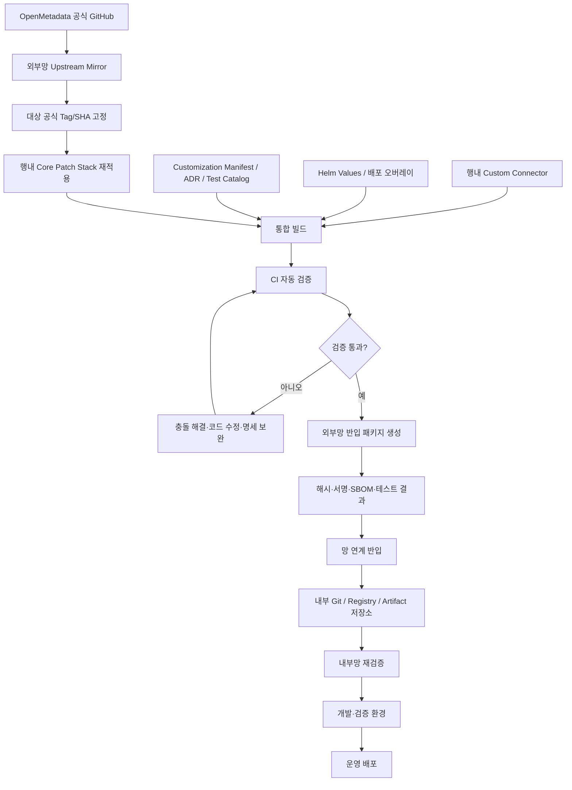

# OpenMetadata 업스트림 동기화 및 행내 커스터마이징 보존 설계서

> **문서 목적**  
> 외부망에서 OpenMetadata를 개발·검증한 뒤 내부망으로 반입하여 배포하는 환경에서,  
> 공식 OpenMetadata 버전이 변경될 때 행내 커스터마이징을 누락하지 않고 재현 가능하게 적용하기 위한  
> Git 저장소 구조, 패치 관리 방식, 기계 판독 가능한 커스터마이징 명세, 자동 테스트 및 반입 절차를 정의한다.
>
> **궁극적 목표**  
> 오픈소스 커스터마이징을 최소화하고, 필수 커스터마이징만 통제된 형태로 유지하여,  
> 공식 버전이 올라가더라도 커스터마이징을 즉시 재적용할 수 있게 함으로써  
> 버전 업그레이드 운영을 원활하게 만드는 것이 최종 목표다.
>
> **우선순위**  
> 1차 목표는 업스트림 동기화와 커스터마이징 재적용 체계(7~15장, Phase 1~4)의 구축이다.  
> 내부망 반입 패키지와 재검증(16장, 15장 단계 11~13, Phase 5)은  
> 1차 목표가 동작한 이후에 다루는 후속 단계다.
>
> **핵심 원칙**  
> `Git + 커스터마이징 명세 + 자동 테스트`가 배포의 통제 기준이며,  
> Claude나 LLM Wiki는 영향 분석과 문서 탐색을 지원하는 보조 수단으로 사용한다.

---

## 1. 배경

OpenMetadata 공식 버전은 지속적으로 변경된다. 행내에서는 외부망에서 공식 소스를 받아 개발·검증한 후, 보안 검토와 망 연계 절차를 거쳐 내부망으로 반입하고 운영 환경에 배포해야 한다.

이때 다음 문제가 발생할 수 있다.

1. 새 공식 버전을 적용하면서 기존 행내 커스터마이징 일부가 누락될 수 있다.
2. Git 충돌이 없더라도 행내 기능이 논리적으로 동작하지 않을 수 있다.
3. 특정 코드가 왜 수정되었고 어떤 요구사항과 테스트에 연결되는지 알기 어렵다.
4. 외부망에서 검증한 소스·컨테이너 이미지·Helm Chart와 내부망에 반입된 산출물이 다를 수 있다.
5. OpenMetadata 서버 코드뿐 아니라 DB 스키마, 검색 인덱스, Ingestion, 인증·권한, Helm 설정까지 함께 호환성을 확인해야 한다.
6. 담당자 변경 후 커스터마이징의 목적과 영향 범위가 사라질 수 있다.
7. LLM이 변경 영향을 설명할 수는 있어도 실제 패치 누락과 배포 가능 여부를 확정적으로 보장하지는 못한다.

따라서 단순히 `vendor` 브랜치에 새 버전을 merge하는 방식만으로는 충분하지 않다.

본 설계에서는 다음 네 가지를 결합한다.

```text
업스트림 미러
    +
최소 패치 스택
    +
기계 판독 가능한 커스터마이징 명세
    +
자동 테스트 및 릴리스 검증
```

---

## 2. 이 설계가 달성하려는 목적

### 2.1 기능적 목적

- OpenMetadata 공식 버전과 행내 배포 버전의 관계를 정확히 추적한다.
- 새 공식 버전 위에 기존 행내 커스터마이징을 빠짐없이 다시 적용한다.
- 각 커스터마이징의 목적, 담당자, 영향 파일, 테스트, 제거 조건을 추적한다.
- 업스트림 변경이 행내 커스터마이징에 미치는 영향을 자동 식별한다.
- 외부망에서 생성한 반입 산출물을 내부망에서 동일하게 검증한다.
- 업그레이드 실패 시 이전 행내 버전으로 복구할 수 있게 한다.

### 2.2 운영·통제 목적

- “어떤 코드가 왜 변경되었는가?”에 답할 수 있어야 한다.
- “이번 업그레이드에서 어떤 행내 기능이 영향을 받는가?”를 자동 또는 반자동으로 산출해야 한다.
- 커스터마이징 누락을 사람의 기억이 아니라 CI 실패로 검출해야 한다.
- 내부망 반입 시 소스, 이미지, 설정, 테스트 결과와 해시를 하나의 릴리스 단위로 관리해야 한다.
- LLM이 잘못 판단하더라도 실제 배포 승인에는 영향을 주지 않도록 결정적 검증 절차를 유지해야 한다.

### 2.3 비목적

다음 항목은 본 문서의 직접적인 범위가 아니다.

- 행내 망 연계 솔루션의 세부 사용법
- 보안 부서의 반입 승인 규정 자체
- OpenMetadata 업무 기능 상세 설계
- 특정 CI 제품의 설치 방법
- 특정 Kubernetes 배포 환경의 전체 구축 방법

다만 이러한 영역과 연결될 수 있도록 산출물과 통제 지점을 정의한다.

---

## 3. 핵심 설계 원칙

### 원칙 1. 공식 원본은 수정하지 않는다

공식 OpenMetadata Git 이력을 보존하는 저장소는 읽기 전용으로 운영한다.

```text
공식 OpenMetadata
    ↓
행내 업스트림 미러
```

업스트림 미러에는 행내 코드, 설정, 문서, 테스트를 추가하지 않는다.

### 원칙 2. 원본 수정보다 확장 방식을 우선한다

커스터마이징 적용 우선순위는 다음과 같다.

```text
1. 설정 변경
2. Helm Values 또는 배포 오버레이
3. 공식 확장 인터페이스
4. 별도 커넥터·어댑터·외부 서비스
5. 마지막 수단으로 OpenMetadata 코어 코드 수정
```

OpenMetadata는 Custom Connector를 별도 Python 패키지나 커스텀 Ingestion 이미지로 구성할 수 있으므로, 행내 전용 DB2·메인프레임·NDM 연계는 가능한 한 코어 포크가 아닌 확장 모듈로 분리한다.

### 원칙 3. 모든 커스터마이징에는 변하지 않는 ID가 있어야 한다

예:

```text
BANK-OM-001
BANK-OM-002
BANK-OM-003
```

이 ID가 다음을 연결한다.

```text
요구사항
  ↕
커스터마이징 명세
  ↕
Git 커밋
  ↕
영향 파일
  ↕
자동 테스트
  ↕
ADR·운영 문서
  ↕
적용 릴리스
```

커밋 SHA는 새 업스트림 위에 cherry-pick하거나 rebase하면 달라질 수 있으므로, 영구 식별자는 커밋 SHA가 아니라 `BANK-OM-xxx` ID로 사용한다.

### 원칙 4. 배포 가능 여부는 자동 테스트가 결정한다

Claude나 LLM Wiki가 “누락이 없어 보인다”고 판단해도 배포 조건이 충족되는 것은 아니다.

다음 조건은 CI가 결정적으로 검사해야 한다.

- 모든 필수 커스터마이징 ID가 새 패치 스택에 존재한다.
- 모든 코어 수정 커밋이 등록된 커스터마이징 ID를 가진다.
- 모든 필수 테스트가 성공했다.
- OpenMetadata DB 마이그레이션과 검색 인덱스 검증이 성공했다.
- 컨테이너 이미지와 반입 산출물의 Digest·해시가 일치한다.
- 승인되지 않은 외부 의존성이 존재하지 않는다.

### 원칙 5. 업스트림 분석과 운영 배포를 분리한다

모든 새 공식 릴리스를 자동 분석할 수는 있지만, 모든 릴리스를 즉시 운영에 반영할 필요는 없다.

```text
업스트림 새 릴리스
      ├─ 자동 영향 분석
      ├─ 보안 긴급 반영 여부 판단
      └─ 정기 업그레이드 후보 선정
```

즉, **분석은 빠르게 하고 운영 반영은 통제된 절차로 수행한다.**

---

## 4. 전체 아키텍처



### 4.1 Source of Truth

각 정보의 원본은 다음과 같이 구분한다.

| 정보 | Source of Truth |
|---|---|
| 공식 OpenMetadata 소스 | 업스트림 미러의 공식 Tag와 Commit SHA |
| 행내 코어 변경 | 행내 Core Patch 저장소의 커밋 |
| 커스터마이징 목적과 관계 | `customizations/*.yaml` |
| 배포 설정 | Helm Values·Kustomize·환경별 설정 저장소 |
| 테스트 존재 여부 | Test Catalog 및 테스트 코드 |
| 테스트 성공 여부 | CI 결과 |
| 반입 산출물 | `release-lock.yaml`, Digest, SHA256SUMS |
| 변경 의사결정 | ADR |
| 설명·질의응답 | Claude 또는 LLM Wiki |

LLM Wiki는 Source of Truth가 아니라 위 원본들을 사람이 이해하기 쉽게 종합하는 계층이다.

---

## 5. 권장 저장소 구성

초기에는 다음 세 개 저장소로 시작하는 것을 권장한다.

```text
1. openmetadata-upstream-mirror
2. openmetadata-bank-core
3. openmetadata-bank-platform
```

### 5.1 `openmetadata-upstream-mirror`

목적:

- 공식 OpenMetadata Git 이력을 그대로 보존한다.
- 외부 GitHub 상태와 행내에서 사용하는 기준 버전을 연결한다.
- 내부망으로 Git 이력을 전달할 수 있게 한다.

특징:

- Mirror 또는 Bare Repository 형태
- 행내 커밋 금지
- 공식 Tag 삭제·변경 금지
- 접근 권한 최소화
- 동기화 계정과 검토 계정 분리 권장

예:

```bash
git clone --mirror \
  https://github.com/open-metadata/OpenMetadata.git \
  openmetadata-upstream-mirror.git

cd openmetadata-upstream-mirror.git

git remote update --prune
git show-ref --tags
```

대상 공식 태그의 Commit SHA를 확인한다.

```bash
git rev-parse "refs/tags/<UPSTREAM_TAG>^{commit}"
```

주의:

- 태그 이름만 기록하지 않고 실제 Commit SHA를 함께 기록한다.
- 대상 태그가 이동하거나 다시 생성되는 상황을 검출할 수 있어야 한다.
- 외부망에서 동기화한 시각과 동기화 담당자를 로그로 남긴다.

### 5.2 `openmetadata-bank-core`

목적:

- OpenMetadata 원본 코드를 직접 수정해야 하는 최소 패치만 관리한다.
- 새 공식 버전 위에 행내 패치를 재적용한다.
- 각 공식 버전 대비 행내 패치 차이를 명확히 보여준다.

예시 구조:

```text
openmetadata-bank-core/
├── OpenMetadata 원본 소스
├── .bank/
│   ├── customizations/
│   ├── schemas/
│   ├── scripts/
│   └── test-catalog/
├── docs/
│   ├── adr/
│   ├── upgrade/
│   └── customization/
└── tests/
    ├── bank-unit/
    ├── bank-integration/
    └── bank-e2e/
```

가능하다면 OpenMetadata 원본 디렉터리에는 행내 관리 파일을 섞지 않는 것이 좋지만, 단일 저장소 정책상 필요한 경우 `.bank/` 또는 `bank-governance/` 같은 명확한 전용 디렉터리를 사용한다.

### 5.3 `openmetadata-bank-platform`

목적:

- OpenMetadata 코어 수정 없이 관리할 수 있는 행내 요소를 보관한다.
- 배포 환경과 확장 기능을 코어 포크에서 분리한다.

예시 구조:

```text
openmetadata-bank-platform/
├── connectors/
│   ├── bank_db2_connector/
│   ├── bank_ndm_connector/
│   └── bank_mainframe_connector/
├── adapters/
│   ├── auth-adapter/
│   └── network-adapter/
├── deploy/
│   ├── helm/
│   │   ├── base/
│   │   ├── dev/
│   │   ├── test/
│   │   └── prod/
│   ├── kustomize/
│   └── scripts/
├── config/
│   ├── common/
│   └── environments/
├── customizations/
├── schemas/
├── tests/
├── release/
└── docs/
```

### 5.4 커스터마이징 명세의 저장 위치와 ID 네임스페이스

커스터마이징 명세는 유형에 따라 저장 위치를 분리한다.

| 유형 | 저장 위치 |
|---|---|
| `core-patch` | `openmetadata-bank-core/.bank/customizations/` |
| `config`·`deployment`·`extension` | `openmetadata-bank-platform/customizations/` |

단, `BANK-OM-xxx` ID 네임스페이스는 두 저장소를 통틀어 단일하게 관리한다.

- ID 채번은 한 곳(예: bank-platform의 ID 대장 또는 이슈 트래커)에서만 수행한다.
- 동일 ID의 명세 파일이 두 저장소에 동시에 존재해서는 안 된다.
- 릴리스 CI는 두 저장소의 명세를 취합하여 저장소 간 중복 ID와 누락 ID를 검사한다.
- `release-lock.yaml`의 `customizations.active_ids`는 이 취합 결과를 기준으로 생성한다.

### 5.5 저장소를 더 분리해야 하는 경우

다음 상황에서는 별도 저장소를 고려한다.

- 커스텀 Connector 개발 팀과 플랫폼 운영 팀이 다르다.
- 배포 설정에 대한 접근 권한이 코드 접근 권한과 다르다.
- 행내 보안 모듈이 별도의 형상관리 규정을 따른다.
- OpenMetadata 업스트림 미러를 중앙 OSS 관리 조직이 운영한다.
- 여러 시스템이 동일한 OpenMetadata 확장 모듈을 사용한다.

---

## 6. 업스트림 미러 설계

### 6.1 목적

업스트림 미러는 단순 백업이 아니다. 다음을 보장해야 한다.

- 어떤 공식 소스를 기준으로 행내 버전을 만들었는지 증명
- 공식 태그와 Commit SHA 고정
- 외부 GitHub에 접속할 수 없는 내부망에서 Git 이력 제공
- 이전 버전과 신규 버전의 변경 내역 비교
- 라이선스 및 소스 추적성 확보

### 6.2 동기화 절차

```text
1. 외부 GitHub에 새 릴리스 또는 보안 패치 게시
2. 업스트림 미러 갱신
3. 공식 Tag와 Commit SHA 확인
4. 공식 릴리스 노트와 업그레이드 문서 수집
5. 대상 버전 후보 등록
6. 변경 파일 및 영향 분석 수행
7. 실제 업그레이드 여부 결정
```

예시 명령:

```bash
cd openmetadata-upstream-mirror.git

git remote update --prune

git rev-parse "refs/tags/<NEW_UPSTREAM_TAG>^{commit}"

git log \
  --oneline \
  "<OLD_UPSTREAM_TAG>..<NEW_UPSTREAM_TAG>"

git diff \
  --name-status \
  "<OLD_UPSTREAM_TAG>" \
  "<NEW_UPSTREAM_TAG>"
```

### 6.3 기준 버전 잠금 파일

`release-lock.yaml`은 해당 행내 릴리스가 무엇을 기준으로 구성되었는지 고정한다.

```yaml
schema_version: 1

release:
  product: openmetadata
  bank_version: "om-<UPSTREAM_VERSION>-bank.<REVISION>"
  status: candidate

upstream:
  repository: "open-metadata/OpenMetadata"
  tag: "<UPSTREAM_TAG>"
  commit_sha: "<UPSTREAM_COMMIT_SHA>"
  synchronized_at: "YYYY-MM-DDTHH:MM:SS+09:00"
  synchronized_by: "<USER_OR_SERVICE_ACCOUNT>"

source:
  bank_core_commit_sha: "<BANK_CORE_SHA>"
  bank_platform_commit_sha: "<BANK_PLATFORM_SHA>"

deployment:
  helm_chart_version: "<HELM_CHART_VERSION>"
  kubernetes_version: "<TARGET_KUBERNETES_VERSION>"

images:
  openmetadata_server:
    name: "<INTERNAL_OR_EXTERNAL_IMAGE_NAME>"
    digest: "sha256:<DIGEST>"
  ingestion:
    name: "<IMAGE_NAME>"
    digest: "sha256:<DIGEST>"
  custom_connector:
    name: "<IMAGE_NAME>"
    digest: "sha256:<DIGEST>"

customizations:
  active_ids:
    - BANK-OM-001
    - BANK-OM-002
    - BANK-OM-003

verification:
  sha256sums_file: "SHA256SUMS"
  sbom_directory: "sbom/"
  test_report_directory: "test-results/"
```

이 파일은 사람이 임의로 편집한 설명 문서가 아니라 CI가 생성하거나 검증하는 릴리스 통제 파일로 관리한다.

이미지 Digest와 테스트 결과는 빌드 이후에만 알 수 있으므로, 입력부와
출력부를 한 시점에 함께 작성할 수 없다. 따라서 두 단계로 생성한다.

```text
1. candidate 단계:
   upstream, source, customizations 등 입력부만 확정
   (images.digest, verification 항목은 비어 있음)

2. released 단계:
   빌드·검증 통과 후 CI가 images.digest와 verification 항목을 채우고
   status를 candidate → released로 변경하여 확정
```

### 6.4 내부망 전달용 Git Bundle

내부망에서 전체 Git 이력이 필요하다면 `git bundle`을 사용할 수 있다.

```bash
git bundle create \
  openmetadata-upstream.bundle \
  --all

git bundle verify \
  openmetadata-upstream.bundle
```

크기를 줄이려면 필요한 태그와 참조만 포함하는 별도 방식을 설계할 수 있으나, 초기에는 전체 이력 전달이 운영상 단순할 수 있다.

내부망에서는 다음과 같이 검증한다.

```bash
git bundle verify openmetadata-upstream.bundle

git clone \
  openmetadata-upstream.bundle \
  openmetadata-upstream
```

---

## 7. 커스터마이징 분류와 최소화 정책

### 7.1 커스터마이징 유형

| 유형 | 설명 | 예시 | 업그레이드 부담 |
|---|---|---|---|
| `config` | 공식 설정으로 처리 | 환경변수, 정책 설정 | 낮음 |
| `deployment` | 배포 오버레이 | Helm Values, Secret Mount | 낮음 |
| `extension` | 별도 확장 모듈 | Custom Connector, Adapter | 중간 |
| `core-patch` | OpenMetadata 원본 수정 | Java, UI, Schema 직접 수정 | 높음 |

### 7.2 판단 순서

새 요구사항이 생기면 다음 순서로 검토한다.

```text
Q1. 공식 설정만으로 가능한가?
    └─ 가능: config

Q2. Helm Values 또는 배포 오버레이로 가능한가?
    └─ 가능: deployment

Q3. Custom Connector·외부 Adapter·별도 Service로 분리 가능한가?
    └─ 가능: extension

Q4. OpenMetadata 공식 기능 개선으로 기여할 수 있는가?
    └─ 가능: Upstream PR 검토

Q5. 위 방식으로 해결할 수 없는가?
    └─ core-patch 승인 절차 수행
```

UI 변경은 특히 주의한다. OpenMetadata UI는 릴리스마다 구조 변경이 커서
UI core-patch는 업그레이드할 때마다 재작성될 가능성이 높다.
로고·테마·화면 문구 등은 공식 White-labeling·Custom Theme·Custom Logo
설정으로 해결할 수 있는지 먼저 확인하고, 코어 UI 수정은 마지막 수단으로
남긴다.

### 7.3 코어 패치 승인 조건

`core-patch`를 추가하려면 최소 다음 항목이 있어야 한다.

- 고유 Customization ID
- 요구사항 ID
- 명확한 필요 사유
- 공식 기능으로 해결할 수 없는 근거
- 수정 대상 파일과 모듈
- 담당 팀과 담당자
- 자동 테스트
- 업그레이드 영향 범위
- 제거 또는 공식 기능 대체 조건
- 보안·개인정보 영향 여부
- ADR

또한 `core-patch`는 원칙적으로 DB Schema 변경을 포함하지 않는다.
OpenMetadata는 버전 번호 기반 마이그레이션 체계를 사용하므로, 행내 패치가
자체 마이그레이션을 추가하면 다음 업스트림 버전의 마이그레이션 번호와
충돌할 수 있다. 불가피한 경우 행내 전용 테이블과 별도 마이그레이션
트랙으로 격리하고, 명세에 `data_migration.required: true`로 기록한 뒤
criticality를 `critical`로 취급한다.

### 7.4 패치 부채 관리

다음 지표를 정기적으로 확인한다.

```text
활성 Core Patch 개수
Core Patch 총 변경 라인 수
업스트림과 충돌한 패치 비율
담당자 없는 패치 개수
테스트 없는 패치 개수
공식 기능으로 대체 가능한 패치 개수
2개 이상 버전에서 계속 충돌하는 패치 개수
패치 평균 유지 기간
```

코어 패치가 증가할수록 업그레이드 비용이 비선형적으로 증가할 수 있으므로, 패치 수 자체를 관리 지표로 둔다.

---

## 8. 최소 패치 스택 설계

### 8.1 패치 스택 개념

행내 코어 변경은 공식 태그 위에 순서대로 쌓인 독립 커밋으로 관리한다.

```text
U0  OpenMetadata 공식 Tag
 |
 C1  [BANK-OM-001] 행내 SSO 토큰 매핑
 |
 C2  [BANK-OM-002] 필수 보안 헤더 적용
 |
 C3  [BANK-OM-003] 행내 UI 정책 적용
 |
 B0  행내 릴리스 Tag
```

### 8.2 브랜치와 태그 예시

```text
candidate/om-<UPSTREAM_VERSION>-bank.<REVISION>
release/om-<UPSTREAM_VERSION>-bank.<REVISION>
```

배포 완료 태그:

```text
om-<UPSTREAM_VERSION>-bank.<REVISION>
```

예시:

```text
candidate/om-1.x.y-bank.1
release/om-1.x.y-bank.1
om-1.x.y-bank.1
```

실제 조직의 Git 정책에 맞게 이름을 바꿀 수 있지만, 공식 버전과 행내 Revision을 동시에 식별할 수 있어야 한다.

### 8.3 커밋 규칙

하나의 논리적 커스터마이징을 가능하면 하나의 커밋으로 관리한다.

권장 커밋 메시지:

```text
[BANK-OM-001] 행내 SSO 토큰을 OpenMetadata 사용자로 매핑

행내 인증 게이트웨이에서 전달한 사용자 식별자를
OpenMetadata 사용자 및 팀 정보와 연결한다.

Customization-ID: BANK-OM-001
Requirement-ID: REQ-AUTH-017
Test-ID: TEST-SSO-001
Test-ID: TEST-SSO-002
Owner-Team: DATA-PLATFORM
```

금지 또는 지양 사항:

- 여러 커스터마이징을 하나의 커밋에 혼합
- 기능 변경과 대규모 포맷팅을 하나의 커밋에 혼합
- 자동 생성 파일을 불필요하게 포함
- 커스터마이징 ID 없이 원본 소스 수정
- 담당자 개인 이름만 기록하고 팀 소유권을 기록하지 않음
- 테스트 없이 인증·권한·DB 마이그레이션 코드를 변경

### 8.4 새 업스트림 버전에 패치 재적용

현재 상태:

```text
UPSTREAM_A
  + BANK-OM-001
  + BANK-OM-002
  + BANK-OM-003
  = BANK_RELEASE_A
```

신규 버전:

```text
UPSTREAM_B
  + BANK-OM-001 재적용
  + BANK-OM-002 재적용
  + BANK-OM-003 재적용
  = BANK_RELEASE_B
```

개념적인 명령:

```bash
git switch \
  --create "candidate/om-<B>-bank.1" \
  "<UPSTREAM_B_TAG>"

git cherry-pick "<BANK_OM_001_COMMIT>"
git cherry-pick "<BANK_OM_002_COMMIT>"
git cherry-pick "<BANK_OM_003_COMMIT>"
```

새 버전에서 커밋 SHA는 달라질 수 있지만 커스터마이징 ID는 유지한다.

#### 패치 정본(Canonical Source) 규칙

cherry-pick의 소스는 항상 **직전 행내 릴리스 브랜치의 최신 Revision**으로 고정한다.

```text
cherry-pick 소스 = release/om-<A>-bank.<최신 REVISION>
```

- 운영 중 패치 자체를 수정해야 하는 경우(핫픽스), 현재 릴리스 브랜치에서
  수정하고 Revision을 올려 배포한다. 예: `om-A-bank.1` → `om-A-bank.2`
- 다음 업스트림 버전(B) 작업 시에는 반드시 최신 Revision(`bank.2`)을
  cherry-pick 소스로 사용하여 핫픽스가 다음 버전으로 전파되게 한다.
- CI는 신규 candidate 브랜치의 각 패치가 직전 릴리스의 동일 ID 패치와
  내용이 다른 경우(`range-diff` 차이) 이를 보고서에 명시한다.

이 규칙이 없으면 "현재 유효한 BANK-OM-xxx 구현이 어디에 있는가"가
버전을 거듭할수록 모호해지고, 핫픽스가 다음 업그레이드에서 유실될 수 있다.

### 8.5 패치 시리즈 비교

이전 버전과 새 버전의 패치 스택을 비교한다.

```bash
git range-diff \
  "<UPSTREAM_A>..<BANK_RELEASE_A>" \
  "<UPSTREAM_B>..<BANK_RELEASE_B>"
```

확인 항목:

- 기존 커스터마이징이 새 패치 스택에도 존재하는가?
- 커밋이 누락되었는가?
- 패치 내용이 크게 달라졌는가?
- 한 개 패치가 여러 개로 분리되었는가?
- 새로운 행내 패치가 승인 없이 추가되었는가?

### 8.6 반복 충돌 처리

동일한 영역에서 반복적으로 비슷한 충돌이 발생하면 `git rerere`를 보조적으로 사용할 수 있다.

```bash
git config rerere.enabled true
```

주의:

- `rerere`는 이전 충돌 해결을 재사용할 뿐, 해결 결과가 논리적으로 올바른지는 보장하지 않는다.
- 자동 적용된 충돌 해결 결과도 코드 리뷰와 테스트가 필요하다.
- 충돌이 자주 발생하는 패치는 외부 확장 방식으로 재설계할 수 있는지 검토한다.

---

## 9. 기계 판독 가능한 커스터마이징 명세

### 9.1 목적

커스터마이징 명세는 단순 설명 문서가 아니다.

다음 질문에 자동으로 답할 수 있어야 한다.

- 현재 활성 커스터마이징은 무엇인가?
- 어떤 커스터마이징이 OpenMetadata 코어를 직접 수정하는가?
- 이 변경의 요구사항은 무엇인가?
- 어떤 파일이 업스트림에서 변경되면 영향 검토가 필요한가?
- 어떤 테스트가 반드시 수행되어야 하는가?
- 담당 조직은 어디인가?
- 어떤 조건에서 제거할 수 있는가?
- 어느 릴리스에 적용되었는가?

### 9.2 파일 구성

```text
customizations/
├── BANK-OM-001.yaml
├── BANK-OM-002.yaml
├── BANK-OM-003.yaml
└── README.md

schemas/
└── customization.schema.json
```

### 9.3 전체 예시

```yaml
schema_version: 1

id: BANK-OM-001
title: 행내 SSO 인증 연계
status: active

type: core-patch
criticality: high

summary: >
  행내 인증 게이트웨이에서 전달한 토큰 정보를
  OpenMetadata 사용자 및 팀 정보와 매핑한다.

requirement:
  id: REQ-AUTH-017
  description: >
    내부 사용자는 행내 통합 인증을 통해 OpenMetadata에 접근해야 한다.
  source_document: "docs/requirements/authentication.md"

rationale:
  reason: >
    현재 적용 대상 OpenMetadata 공식 버전의 기본 설정만으로는
    행내 인증 게이트웨이의 사용자 식별 규칙을 완전히 처리할 수 없다.
  alternatives_reviewed:
    - name: 기본 OIDC 설정
      result: rejected
      reason: 행내 전용 Claim 매핑 규칙 미지원
    - name: 외부 인증 Adapter
      result: deferred
      reason: 초기 도입 일정과 운영 복잡도 고려
  adr: "docs/adr/ADR-001-bank-sso.md"

owner:
  team: DATA-PLATFORM
  service: OPENMETADATA
  contact_group: openmetadata-admins

implementation:
  commit_trailer_id: BANK-OM-001
  modules:
    - openmetadata-service
    - openmetadata-ui
  affected_paths:
    - "openmetadata-service/**/Authentication*.java"
    - "openmetadata-service/**/Authorizer*.java"
    - "openmetadata-ui/**/Login*.tsx"
  affected_symbols:
    - "BankAuthenticationFilter"
    - "mapBankClaims"
  configuration_keys:
    - "BANK_SSO_ENABLED"
    - "BANK_SSO_USER_CLAIM"

dependencies:
  customizations:
    - BANK-OM-002
  external_components:
    - bank-auth-gateway

tests:
  required:
    - TEST-SSO-001
    - TEST-SSO-002
    - TEST-SSO-003
    - E2E-AUTH-001
  security_required:
    - SEC-AUTH-001

upgrade:
  review_on_upstream_path_change: true
  review_on_dependency_change: true
  full_regression_required: true
  special_checks:
    - 사용자 식별 Claim 매핑
    - 비활성 사용자 접근 차단
    - 팀 및 역할 동기화
    - 인증 실패 로그의 개인정보 마스킹

data_migration:
  required: false

rollback:
  supported: true
  procedure: "docs/rollback/BANK-OM-001.md"

retirement:
  target: >
    공식 인증 확장 기능 또는 별도 인증 Adapter로 대체할 수 있을 때 제거한다.
  upstream_issue: null
  upstream_pull_request: null

documentation:
  design: "docs/customization/BANK-OM-001.md"
  operation: "docs/operations/authentication.md"

audit:
  created_at: "YYYY-MM-DD"
  created_by: "<TEAM_OR_ACCOUNT>"
  last_reviewed_at: "YYYY-MM-DD"
```

### 9.4 필수 필드

최소 필수 필드는 다음과 같다.

```text
schema_version
id
title
status
type
criticality
summary
requirement.id
rationale.reason
owner.team
implementation.commit_trailer_id
implementation.affected_paths
tests.required
upgrade.review_on_upstream_path_change
retirement.target
```

### 9.5 상태 값

```text
draft
active
deprecated
retired
rejected
```

의미:

| 상태 | 의미 |
|---|---|
| `draft` | 설계 중이며 배포 대상 아님 |
| `active` | 현재 행내 릴리스에 반드시 존재해야 함 |
| `deprecated` | 제거 예정이지만 아직 운영에 필요 |
| `retired` | 공식 기능 또는 다른 구조로 대체되어 제거 |
| `rejected` | 검토 후 적용하지 않기로 결정 |

### 9.6 커밋 SHA를 영구 키로 사용하지 않는 이유

새 공식 버전에 동일한 변경을 다시 적용하면 커밋 SHA가 달라질 수 있다.

```text
공식 버전 A의 BANK-OM-001 커밋 SHA = aaa111
공식 버전 B의 BANK-OM-001 커밋 SHA = bbb222
```

따라서 관계는 다음처럼 관리한다.

```text
영구 ID:
BANK-OM-001

버전별 구현:
aaa111
bbb222
ccc333
```

`release-lock.yaml`에는 특정 릴리스의 실제 커밋 SHA를 기록할 수 있지만, 커스터마이징의 영구 식별자로 사용하지 않는다.

### 9.7 core-patch 이외 유형의 존재 검증

커밋-명세 양방향 검증(12.4절)은 `core-patch`에만 작동한다.
`config`·`deployment`·`extension` 유형은 대응하는 코어 커밋이 없으므로,
`active` 상태임에도 실제 릴리스에서 빠지는 것을 Git 이력만으로 검출할 수 없다.
예를 들어 Helm Values 한 줄이 실수로 되돌려져도 양방향 검증은 통과한다.

따라서 이 유형의 명세에는 존재 검증을 **선언형 verifier**로 선언하고 CI가 실행한다.

```yaml
verification:
  - type: helm_jsonpath_equals
    artifact: rendered-manifest.yaml
    expression: "$..env[?(@.name=='BANK_SSO_ENABLED')].value"
    expected: "true"
    description: 렌더링된 배포 산출물에 행내 설정 키가 존재하는지 확인
```

> **주의 (보안)**: shell 명령 문자열(`command:`)을 명세에 넣고 CI가 실행하는
> 방식은 금지한다 — 명세를 수정할 수 있는 누구나 CI 권한으로 임의 코드를
> 실행할 수 있게 되기 때문이다. 반드시 타입이 정해진 선언형 verifier
> (`yaml_value_equals`, `helm_jsonpath_equals`, `file_exists_in_image`,
> `python_import_succeeds` 등)만 사용한다.

- `active` 상태의 `config`·`deployment`·`extension` 명세에
  `verification.command`가 없으면 관리 지표에서 "테스트 없는 패치"와
  동일하게 집계한다.
- `extension` 유형은 이미지 또는 패키지 안에 해당 모듈이 포함되어
  있는지를 검증한다. 예: 이미지 내부에서 커스텀 Connector 패키지의
  import 성공 여부 확인

---

## 10. JSON Schema 예시

다음은 최소 검증을 위한 축약 예시다.

```json
{
  "$schema": "https://json-schema.org/draft/2020-12/schema",
  "title": "OpenMetadata Bank Customization",
  "type": "object",
  "required": [
    "schema_version",
    "id",
    "title",
    "status",
    "type",
    "criticality",
    "summary",
    "requirement",
    "owner",
    "implementation",
    "tests",
    "upgrade",
    "retirement"
  ],
  "properties": {
    "schema_version": {
      "type": "integer",
      "minimum": 1
    },
    "id": {
      "type": "string",
      "pattern": "^BANK-OM-[0-9]{3,}$"
    },
    "title": {
      "type": "string",
      "minLength": 3
    },
    "status": {
      "enum": [
        "draft",
        "active",
        "deprecated",
        "retired",
        "rejected"
      ]
    },
    "type": {
      "enum": [
        "config",
        "deployment",
        "extension",
        "core-patch"
      ]
    },
    "criticality": {
      "enum": [
        "low",
        "medium",
        "high",
        "critical"
      ]
    },
    "summary": {
      "type": "string",
      "minLength": 10
    },
    "requirement": {
      "type": "object",
      "required": [
        "id",
        "description"
      ],
      "properties": {
        "id": {
          "type": "string"
        },
        "description": {
          "type": "string"
        }
      }
    },
    "owner": {
      "type": "object",
      "required": [
        "team"
      ],
      "properties": {
        "team": {
          "type": "string"
        },
        "contact_group": {
          "type": "string"
        }
      }
    },
    "implementation": {
      "type": "object",
      "required": [
        "commit_trailer_id",
        "affected_paths"
      ],
      "properties": {
        "commit_trailer_id": {
          "type": "string"
        },
        "affected_paths": {
          "type": "array",
          "minItems": 1,
          "items": {
            "type": "string"
          }
        }
      }
    },
    "tests": {
      "type": "object",
      "required": [
        "required"
      ],
      "properties": {
        "required": {
          "type": "array",
          "minItems": 1,
          "items": {
            "type": "string"
          }
        }
      }
    },
    "upgrade": {
      "type": "object",
      "required": [
        "review_on_upstream_path_change"
      ],
      "properties": {
        "review_on_upstream_path_change": {
          "type": "boolean"
        },
        "full_regression_required": {
          "type": "boolean"
        }
      }
    },
    "retirement": {
      "type": "object",
      "required": [
        "target"
      ],
      "properties": {
        "target": {
          "type": "string"
        }
      }
    }
  },
  "additionalProperties": true
}
```

실제 적용 시에는 조직 표준과 필요한 필드를 반영해 강화한다.

---

## 11. 테스트 카탈로그 설계

커스터마이징 명세의 `TEST-SSO-001` 같은 ID가 실제 테스트와 연결되어야 한다.

예시:

```text
test-catalog/
├── TEST-SSO-001.yaml
├── TEST-SSO-002.yaml
├── TEST-INGESTION-001.yaml
└── TEST-UPGRADE-001.yaml
```

예시 파일:

```yaml
schema_version: 1

id: TEST-SSO-001
title: 정상 SSO 사용자 로그인
status: active
type: e2e
criticality: critical

purpose: >
  행내 인증 게이트웨이의 정상 사용자가 OpenMetadata에 로그인하고
  기대한 사용자 및 팀 권한을 받는지 확인한다.

related_customizations:
  - BANK-OM-001

preconditions:
  - 테스트 사용자가 인증 게이트웨이에 등록되어 있다.
  - OpenMetadata 테스트 환경에 대응 팀이 존재한다.

steps:
  - 인증 게이트웨이를 통해 OpenMetadata에 접속한다.
  - 사용자 프로필을 조회한다.
  - 팀과 역할 정보를 확인한다.
  - 권한이 필요한 화면과 제한 화면에 접근한다.

expected:
  - 로그인 성공
  - 사용자 식별자 일치
  - 팀 및 역할 일치
  - 허용되지 않은 기능 접근 차단

automation:
  enabled: true
  command: "pytest tests/e2e/test_bank_sso.py::test_valid_user"
  report: "junit"

owner:
  team: DATA-PLATFORM
```

---

## 12. CI/CD 파이프라인 설계

### 12.1 전체 단계


### 12.2 Stage 1: 공식 기준 검증

검사 항목:

- `release-lock.yaml`의 공식 Tag가 존재하는가?
- 기록된 Commit SHA가 실제 태그의 Commit SHA와 일치하는가?
- 행내 후보 브랜치가 해당 공식 Tag를 기준으로 만들어졌는가?
- 승인되지 않은 다른 업스트림 커밋이 섞이지 않았는가?

예:

```bash
EXPECTED_SHA="$(yq '.upstream.commit_sha' release-lock.yaml)"
ACTUAL_SHA="$(git rev-parse "${UPSTREAM_TAG}^{commit}")"

test "${EXPECTED_SHA}" = "${ACTUAL_SHA}"
```

### 12.3 Stage 2: 명세 Schema 검증

검사 항목:

- YAML 문법 오류
- JSON Schema 위반
- 중복 Customization ID
- 허용되지 않은 상태나 유형
- 담당자 누락
- 테스트 ID 누락
- `core-patch`인데 `affected_paths`가 없는 경우
- `active`인데 제거 조건이나 요구사항이 없는 경우

예시 도구:

```text
Python + jsonschema
yamllint
yq
조직 표준 Schema Validator
```

### 12.4 Stage 3: 커밋과 명세의 양방향 검증

#### 방향 A: 커밋 → 명세

공식 태그 이후의 모든 행내 코어 수정 커밋을 조회한다.

```bash
git log \
  --format="%H%n%B%n---END---" \
  "<UPSTREAM_TAG>..HEAD"
```

각 커밋의 `Customization-ID`를 추출한다.

검사:

```text
Customization-ID 없음
→ 실패

등록되지 않은 ID
→ 실패

retired 상태 ID를 신규 커밋이 사용
→ 실패
```

#### 방향 B: 명세 → 커밋

모든 `active` 또는 `deprecated` 상태의 `core-patch` 명세를 읽는다.

검사:

```text
현재 패치 스택에 해당 ID가 없음
→ 실패

동일 ID가 의도 없이 여러 커밋에서 중복
→ 경고 또는 실패

명세는 active인데 테스트 카탈로그에 필수 테스트 없음
→ 실패
```

#### 방향 C: 커밋 실제 변경 파일 → 명세 `affected_paths`

각 패치 커밋이 실제로 변경한 파일 목록을 구한다.

```bash
git show \
  --name-only \
  --format="" \
  "<PATCH_COMMIT_SHA>"
```

검사:

```text
커밋이 변경한 파일이 해당 ID의 affected_paths 패턴과 겹치지 않음
→ 실패 또는 경고 (명세 갱신 필요)
```

`affected_paths`는 사람이 관리하는 필드이므로 패치가 수정되면서 실제 변경
범위와 어긋날 수 있다. 이 불일치를 방치하면 Stage 4의 업스트림 영향 분석이
조용히 무력화되므로, 선언과 실제의 drift를 CI 실패로 만든다.

핵심은 다음이다.

> 커밋에 명세가 없어도 실패하고, 명세에 대응 커밋이 없어도 실패해야 하며,
> 명세의 영향 범위 선언이 실제 커밋 내용과 어긋나도 실패해야 한다.

### 12.5 Stage 4: 업스트림 변경 영향 분석

이전 공식 버전과 신규 공식 버전 사이의 변경 파일을 구한다.

```bash
git diff \
  --name-only \
  "<OLD_UPSTREAM_TAG>" \
  "<NEW_UPSTREAM_TAG>" \
  > upstream_changed_files.txt
```

각 커스터마이징의 `affected_paths`와 비교한다.

예:

```text
업스트림 변경 파일:
openmetadata-service/.../AuthenticationFilter.java

BANK-OM-001 affected_paths:
openmetadata-service/**/Authentication*.java

결과:
BANK-OM-001 = 영향 가능
```

자동 산출물:

```yaml
upgrade_impact:
  upstream_from: "<OLD>"
  upstream_to: "<NEW>"

  affected_customizations:
    - id: BANK-OM-001
      reason:
        - path_match
      changed_paths:
        - "openmetadata-service/.../AuthenticationFilter.java"
      required_tests:
        - TEST-SSO-001
        - TEST-SSO-002
        - E2E-AUTH-001

  unaffected_customizations:
    - BANK-OM-003

  manual_review_required:
    - BANK-OM-001
```

주의:

- 경로가 겹치지 않아도 API·DB Schema·의존성 변화로 영향을 받을 수 있다.
- `affected_paths` 비교는 최소 탐지 장치다.
- 의존성, 공개 API, 환경변수, Helm Values, DB Schema 변경도 별도 분석해야 한다.
- Claude는 경로 기반 결과를 읽고 의미적 영향 가능성을 추가 제안할 수 있다.
- 최종 승인 여부는 담당자 리뷰와 테스트가 결정한다.

### 12.6 Stage 5: 빌드 검증

검사:

- OpenMetadata 서버 빌드
- UI 빌드
- Ingestion 패키지 빌드
- 커스텀 Connector 빌드
- 컨테이너 이미지 빌드
- Helm Template 렌더링
- 내부망에서 사용할 의존성이 모두 고정되어 있는지 확인

버전이 고정되지 않은 의존성은 금지하는 것이 좋다.

```text
latest
*
범위가 지나치게 넓은 버전
실행 시점 다운로드
```

### 12.7 Stage 6: 단위·통합·E2E 테스트

테스트 범위:

```text
OpenMetadata 공식 테스트
행내 단위 테스트
행내 통합 테스트
행내 인증 테스트
행내 Connector 테스트
주요 API 회귀 테스트
UI 회귀 테스트
권한 및 정책 테스트
```

필수 테스트 선택 방식:

```text
모든 릴리스 공통 테스트
    +
영향받은 Customization의 required_tests
    +
보안 또는 DB 변경 시 강제 Full Regression
```

### 12.8 Stage 7: DB Migration 및 검색 인덱스 검증

OpenMetadata 업그레이드는 애플리케이션 빌드 성공만으로 충분하지 않다.

최소 다음 흐름을 자동화한다.

```text
현재 운영 기준 DB 백업본 복원
    ↓
신규 버전 Migration 실행
    ↓
Migration 성공 확인
    ↓
기본 엔티티 건수 대사
    ↓
검색 인덱스 생성 또는 재색인
    ↓
검색 결과 검증
    ↓
Ingestion Pipeline 재실행
    ↓
Lineage·Glossary·DQ·권한 확인
```

검증 항목 예시:

- Database Service 수
- Database·Schema·Table 수
- 사용자·팀·역할 수
- Glossary·Term 수
- Tag·Classification 수
- Lineage Edge 수
- Data Quality Test 수
- 주요 검색어의 결과 수
- 소유자·도메인·정책 유지 여부
- 주요 Ingestion Pipeline 실행 성공 여부

숫자가 반드시 완전히 동일해야 하는 항목과 버전 변경으로 달라질 수 있는 항목을 구분해 허용 기준을 정의한다.

### 12.9 Stage 8: 보안·라이선스·SBOM 검증

검사 항목:

- 컨테이너 이미지 취약점
- Maven·npm·Python 의존성 취약점
- 오픈소스 라이선스
- 금지 라이선스 포함 여부
- SBOM 생성
- 이미지 Digest
- 소스 Commit SHA
- 빌드 환경 및 도구 버전
- 행내 Secret 포함 여부
- 빌드 로그의 개인정보·인증정보 노출 여부

### 12.10 Stage 9: 릴리스 패키지 생성

CI가 검증 통과 후 반입 패키지를 생성한다.

```text
release/
├── manifest/
│   ├── release-lock.yaml
│   ├── customizations/
│   └── test-catalog/
├── git/
│   ├── openmetadata-upstream.bundle
│   ├── openmetadata-bank-core.bundle
│   └── openmetadata-bank-platform.bundle
├── images/
│   ├── image-list.txt
│   └── image-digests.txt
├── charts/
│   ├── openmetadata/
│   └── bank-values/
├── connectors/
├── sbom/
├── license/
├── security-results/
├── test-results/
├── migration/
│   ├── migration-plan.md
│   ├── validation-query.sql
│   └── rollback-plan.md
├── docs/
│   ├── upgrade-impact.md
│   └── release-note.md
├── SHA256SUMS
└── SIGNATURES/
```

### 12.11 패치 재적용 게이트 체인

패치 재적용(15장 단계 5)을 사람의 기억이 아니라 CI 게이트로 통제한다.

설계 원리는 하나다.

> 사람의 판단이 필요한 지점은 남기되, 그 판단을 **건너뛰지 못하게** 만든다.
> 게이트의 판정 자체는 exit code, 집합 비교, 카운터, 해시 일치라는
> 결정적 연산만으로 구성하며, LLM은 게이트 체인에 개입하지 않는다.

#### Gate 1. 재적용 게이트 — 모든 패치가 적용되었는가

패치 적용을 순수 함수로 만든다:
`f(순정 베이스, 순서 있는 패치 목록) = 결과물`.
입력이 같으면 결과가 항상 같으므로 재현 가능하다.

```bash
while read -r commit; do
  if ! git cherry-pick "${commit}"; then
    echo "FAIL: ${commit} 적용 중 충돌" >> reapply-report.txt
    git cherry-pick --abort
    exit 1
  fi
done < patch-order.txt
```

- `cherry-pick`은 충돌 시 비정상 종료 코드를 반환하므로
  성공·실패 자체가 게이트 판정이다.
- 실패 시 어느 Customization ID에서 멈췄는지 자동 보고된다.
- 충돌은 사람이 해결한 뒤 게이트를 재실행한다.

#### Gate 2. 완전성 게이트 — 적용 결과가 명세와 일치하는가

```text
명세의 active core-patch ID 집합
  == 브랜치 커밋의 Customization-ID trailer 집합

집합이 다르면 실패 (누락 ID와 미등록 ID를 각각 나열)
```

12.4절의 양방향 검증과 방향 C(affected_paths drift)를 이 게이트에서 수행한다.

#### Gate 3. rerere 사용 검출 게이트 — 자동 해결된 충돌이 리뷰를 거쳤는가

`git rerere`는 충돌 지점의 코드 패턴을 정규화한 해시를 키로
이전 해결책을 기계적으로 재생하는 캐시다. 판단이 아니라 재생이므로
결정적이지만, 그 해결이 여전히 논리적으로 옳은지는 보장하지 않는다.

따라서 rerere 자체는 게이트가 아니라 자동화 도구이며,
**rerere가 개입했다는 사실을 검출**하는 것이 게이트다.

```text
rerere가 해결책을 재생한 커밋 목록을 기록
→ 해당 ID의 required_tests 전체 실행 강제
→ 코드 리뷰 승인 없이는 candidate → release 승격 금지
```

단, 초기 도입 단계에서는 rerere 미사용을 기본값으로 권장한다.
패치가 적으면 충돌 자체가 드물어 자동 재생의 이득보다 검증 비용이
클 수 있고, 반복 충돌은 자동화 대상이 아니라 해당 패치를 확장
방식으로 재설계하라는 신호(Gate 4)로 취급해야 하기 때문이다.
rerere를 도입하지 않는 동안 이 게이트는 비활성으로 둔다.

#### Gate 4. 패치 부채 게이트 — 커스터마이징이 관리 한도 안인가

충돌 빈도를 결합도의 측정치로 사용한다. 어떤 패치가 버전마다 충돌한다는
것은 업스트림이 활발히 변경하는 코드에 행내 수정이 붙어 있다는 신호다.

```text
core-patch 커밋 수         > 상한 N          → 실패 또는 경고
core-patch 총 변경 라인 수  > 상한 L          → 경고
특정 ID의 연속 충돌 횟수    >= K (예: 2회)
  이고 재설계 검토 ADR 없음                   → 실패
```

충돌 이력은 Gate 1의 리포트를 릴리스마다
`docs/upgrade/<VERSION>/conflicts.json`으로 누적 저장하여 집계한다.

#### 게이트 체인 전체 흐름

```text
[자동]  Gate 1 재적용
          └ 충돌 → [사람] 해결 → Gate 1 재실행
[자동]  Gate 2 완전성 (ID 집합·drift 비교)
[자동]  Gate 3 rerere 검출 → 걸리면 [사람] 리뷰 + 필수 테스트 강제
[자동]  Gate 4 부채 상한
[자동]  이후 Stage 5~9 (빌드·테스트·Migration·보안·패키징)
```

사람이 등장하는 곳은 충돌 해결과 rerere·재설계 리뷰 두 곳뿐이며,
이는 판단이 필요한 본질적 작업이다. 게이트의 역할은 그 판단을
대신하는 것이 아니라 생략하지 못하게 막는 것이다.

---

## 13. CI 검증 로직 예시

아래는 개념을 설명하기 위한 간단한 Python 형태의 의사 구현이다.

```python
from __future__ import annotations

import re
import subprocess
from pathlib import Path

import yaml


CUSTOMIZATION_ID_PATTERN = re.compile(r"BANK-OM-\d{3,}")


def run_git(*args: str) -> str:
    result = subprocess.run(
        ["git", *args],
        check=True,
        text=True,
        capture_output=True,
    )
    return result.stdout


def load_customizations(directory: Path) -> dict[str, dict]:
    customizations: dict[str, dict] = {}

    for yaml_path in sorted(directory.glob("BANK-OM-*.yaml")):
        with yaml_path.open("r", encoding="utf-8") as file:
            data = yaml.safe_load(file)

        customization_id = data["id"]

        if customization_id in customizations:
            raise ValueError(
                f"중복 Customization ID: {customization_id}"
            )

        customizations[customization_id] = data

    return customizations


def extract_patch_ids(upstream_ref: str) -> set[str]:
    # 커밋 본문 전체를 정규식으로 스캔하면 본문에서 다른 ID를
    # 언급하기만 해도 해당 패치가 존재하는 것으로 오인되어
    # 실제 누락을 가릴 수 있다. 반드시 trailer만 파싱한다.
    log_text = run_git(
        "log",
        "--format=%(trailers:key=Customization-ID,valueonly)",
        f"{upstream_ref}..HEAD",
    )

    ids = {
        line.strip()
        for line in log_text.splitlines()
        if line.strip()
    }

    invalid_ids = {
        candidate
        for candidate in ids
        if not CUSTOMIZATION_ID_PATTERN.fullmatch(candidate)
    }

    if invalid_ids:
        raise ValueError(
            "형식이 잘못된 Customization-ID trailer: "
            + ", ".join(sorted(invalid_ids))
        )

    return ids


def validate_bidirectional_mapping(
    upstream_ref: str,
    customizations: dict[str, dict],
) -> None:
    patch_ids = extract_patch_ids(upstream_ref)

    active_core_patch_ids = {
        customization_id
        for customization_id, data in customizations.items()
        if data["status"] in {"active", "deprecated"}
        and data["type"] == "core-patch"
    }

    unknown_patch_ids = patch_ids - set(customizations)
    missing_patch_ids = active_core_patch_ids - patch_ids

    errors: list[str] = []

    if unknown_patch_ids:
        errors.append(
            "명세에 등록되지 않은 패치 ID: "
            + ", ".join(sorted(unknown_patch_ids))
        )

    if missing_patch_ids:
        errors.append(
            "현재 패치 스택에서 누락된 활성 패치 ID: "
            + ", ".join(sorted(missing_patch_ids))
        )

    if errors:
        raise RuntimeError("\n".join(errors))


def main() -> None:
    customizations = load_customizations(
        Path(".bank/customizations")
    )

    upstream_ref = "<UPSTREAM_TAG>"

    validate_bidirectional_mapping(
        upstream_ref=upstream_ref,
        customizations=customizations,
    )

    print("커스터마이징 양방향 검증 성공")


if __name__ == "__main__":
    main()
```

실제 구현에서는 다음을 추가한다.

- JSON Schema 검증
- 커밋별 Customization ID 존재 여부
- 한 커밋에 여러 ID가 들어간 경우 정책 검사
- `affected_paths` glob 비교
- 테스트 ID의 Test Catalog 존재 여부
- 담당 팀 유효성
- `retired` ID 사용 금지
- 이전 릴리스와 신규 릴리스의 ID 집합 비교
- 결과를 JSON·Markdown으로 동시 출력
- GitLab Merge Request 또는 GitHub Pull Request Comment 생성

---

## 14. OpenMetadata 전용 테스트 설계

### 14.1 서버 및 API

- 서버 정상 기동
- Health Check
- 주요 API 인증 성공
- 엔티티 생성·조회·수정·삭제
- 페이지네이션 및 검색
- 행내 연계 API 호환성
- 주요 Error Response 변경 여부

### 14.2 인증과 권한

- SSO 정상 사용자
- 비활성 사용자
- 잘못된 Claim
- 팀 매핑
- 역할 매핑
- 관리자 권한
- 읽기 전용 권한
- 비인가 접근 차단
- 세션 만료
- 로그아웃
- 감사 로그
- 개인정보 마스킹

### 14.3 Metadata Ingestion

- 공식 Connector
- 행내 Custom Connector
- DB2 메타데이터 수집
- 스키마·테이블·컬럼 수집
- 소유자·설명·Tag 수집
- Pipeline 실행 상태
- 실패 재시도
- 중복 수집
- 대량 자산 성능
- 네트워크 단절 후 복구

### 14.4 검색

- Elasticsearch 또는 OpenSearch 연결
- 색인 생성
- 재색인
- 주요 자산 검색
- 한글 검색
- Exact Match
- FQN 검색
- 권한에 따른 검색 결과 필터
- 대량 검색 성능

### 14.5 Lineage

- Table Lineage
- Column Lineage
- Pipeline Lineage
- 기존 Lineage 유지
- 신규 Lineage 반영
- 삭제된 자산의 관계 처리

### 14.6 Data Quality

- 기존 Test Definition 유지
- Test Case 유지
- 실행 결과 조회
- 실패·성공 상태
- 알림
- 업그레이드 전후 결과 비교
- 커스텀 품질 연계가 있다면 호환성 검증

### 14.7 Glossary·Classification·Domain

- Glossary 및 Term 유지
- Classification 및 Tag 유지
- Domain·Data Product 관계 유지
- 소유자와 전문가 정보 유지
- 정책과 분류 기반 접근 통제 유지

### 14.8 DB Migration

- 운영 기준 DB 백업 복원
- Migration 실행
- Migration 재실행의 안전성
- 실패 지점 식별
- 중간 실패 후 재시도
- 데이터 건수 대사
- 주요 관계 데이터 유지
- Rollback 가능성 검증

### 14.9 Kubernetes·Helm

- Helm Template 렌더링
- 잘못된 값 검출
- Secret 참조
- ConfigMap
- PVC
- Resource Limit
- Readiness·Liveness Probe
- Pod 재시작
- Rolling Upgrade
- Ingress·Proxy
- Network Policy
- 로그 수집
- 환경별 Values 차이 검증

### 14.10 롤백

롤백은 단순히 이전 이미지를 실행하는 것만 의미하지 않는다.

확인해야 할 항목:

```text
애플리케이션 이미지 롤백
Helm Release 롤백
DB Schema 롤백 또는 백업 복원
검색 인덱스 롤백 또는 재생성
Connector 버전 롤백
환경 설정 롤백
행내 연계 시스템 호환성
```

DB Schema가 전진 변경된 경우 이전 애플리케이션 이미지가 그대로 동작하지 않을 수 있으므로, 운영 전 실제 복구 훈련이 필요하다.

OpenMetadata는 다운그레이드 마이그레이션을 공식 지원하지 않으므로,
실질적인 DB 롤백 수단은 업그레이드 직전 백업의 복원이다.
백업 시점 이후 발생한 변경분의 손실 범위를 롤백 계획에 명시한다.

---

## 15. 신규 OpenMetadata 버전 업그레이드 절차

### 단계 1. 신규 공식 버전 접수

수집:

- 공식 Tag
- Commit SHA
- Release Note
- Upgrade Guide
- DB Migration 관련 변경
- 검색 인덱스 관련 변경
- Helm Chart 변경
- Ingestion·Connector 변경
- 보안 관련 변경
- 주요 Dependency 변경

### 단계 2. 업스트림 미러 갱신

```bash
git remote update --prune
git rev-parse "refs/tags/<NEW_TAG>^{commit}"
```

기록:

```text
동기화 시각
동기화 계정
공식 Tag
공식 Commit SHA
공식 릴리스 링크
기존 기준 버전
```

### 단계 3. 변경 영향 1차 분석

```bash
git diff \
  --name-status \
  "<OLD_TAG>" \
  "<NEW_TAG>"
```

분석:

- 행내 패치 대상 경로와 중첩
- 공개 API 변경
- DB Schema 변경
- Helm Values 변경
- 인증·권한 변경
- Connector Framework 변경
- Python·Java·Node Dependency 변경

### 단계 4. 신규 후보 브랜치 생성

```bash
git switch \
  --create "candidate/om-<NEW_VERSION>-bank.1" \
  "<NEW_TAG>"
```

### 단계 5. 활성 패치 재적용

적용 순서는 고정하는 것이 좋다.

예:

```text
1. 공통 기반 변경
2. 보안 관련 변경
3. 인증·권한
4. Backend 기능
5. UI
6. 테스트
```

각 패치를 cherry-pick하고 충돌을 해결한다.

### 단계 6. 패치 완전성 검증

검사:

- 이전 릴리스의 활성 ID 집합
- 신규 릴리스의 활성 ID 집합
- 신규 추가·제거·상태 변경
- `git range-diff`
- 명세와 커밋의 양방향 매핑

예상하지 않은 누락은 CI 실패로 처리한다.

### 단계 7. 충돌 해결 검토

충돌 해결 시 반드시 기록한다.

```text
어떤 업스트림 변경 때문에 충돌했는가?
기존 행내 로직을 그대로 유지했는가?
공식 기능으로 대체했는가?
패치 범위가 변경되었는가?
새 테스트가 필요한가?
해당 패치를 제거할 수 있는가?
```

결과를 `docs/upgrade/<VERSION>/conflicts.md`에 기록한다.

### 단계 8. 확장 모듈과 배포 설정 호환성 검증

- Custom Connector SDK 호환성
- Ingestion 이미지
- Python Dependency
- Helm Chart
- 환경변수
- Secret 구조
- Search Backend
- DB Driver
- 인증 Adapter
- 외부 API

### 단계 9. 전체 자동 테스트

CI Gate를 모두 수행한다.

### 단계 10. 외부망 릴리스 후보 생성

버전 예:

```text
OpenMetadata 공식 버전: <X.Y.Z>
행내 Revision: bank.1
최종 표시 버전: <X.Y.Z>-bank.1
```

### 단계 11. 반입 패키지 생성 및 승인

패키지와 함께 다음을 제출한다.

- 업스트림 기준
- 행내 패치 목록
- 영향 분석
- 테스트 결과
- SBOM
- 보안 결과
- 이미지 Digest
- 해시
- Migration Plan
- Rollback Plan
- 승인 내역

### 단계 12. 내부망 재검증

외부망에서 성공했다고 바로 운영에 배포하지 않는다.

내부망에서 다음을 다시 검증한다.

- Git Bundle SHA
- 소스 Commit
- 이미지 Digest
- Helm Chart 해시
- 설정 파일 해시
- 반입 산출물 누락
- 내부 Registry Push 후 Digest
- 내부 환경 기동
- 내부 인증·DB·Search 연결
- Smoke Test

### 단계 13. 개발·검증·운영 배포

환경별로 동일한 Release Lock을 사용하고 환경 설정만 분리한다.

```text
동일:
소스 SHA
이미지 Digest
Chart 버전
Customization ID 집합

환경별:
DB Endpoint
Search Endpoint
Secret
Resource
Ingress
운영 정책
```

---

## 16. 반입 패키지 및 무결성 설계

### 16.1 패키지 원칙

- 반입 단위는 파일 몇 개가 아니라 하나의 릴리스 세트다.
- 소스, 이미지, 설정, 명세, 테스트, 보안 결과가 함께 이동한다.
- 모든 파일은 해시 목록으로 검증한다.
- 컨테이너 이미지는 Tag만 믿지 않고 Digest로 고정한다.
- 내부망에서 다시 해시와 Digest를 확인한다.
- 해시 목록과 컨테이너 이미지에 서명을 적용한다. 서명은 선택이 아니라
  반입 요건이다. 이미지 서명은 cosign 등 표준 도구를 사용하고,
  가능하면 빌드 출처 증명(SLSA Provenance)도 함께 생성한다.
- 외부망에서 실행 시 자동 다운로드된 파일이 반입 목록에서 빠지지 않게 한다.

### 16.2 `SHA256SUMS` 생성

생성 순서를 고정한다. 서명 파일까지 해시 대상에 넣으면
"해시 생성 → 서명" 순서와 모순이 생기므로 `SIGNATURES/`는 해시 대상에서
제외하고, 대신 `SHA256SUMS` 파일 자체를 서명한다.

```text
1. SIGNATURES/ 를 제외한 전체 파일의 해시 목록 생성 → SHA256SUMS
2. SHA256SUMS 파일을 서명 → SIGNATURES/ 에 저장
```

```bash
find release \
  -type f \
  ! -name "SHA256SUMS" \
  ! -path "release/SIGNATURES/*" \
  -print0 \
  | sort -z \
  | xargs -0 sha256sum \
  > release/SHA256SUMS
```

검증은 역순으로 수행한다.

```bash
# 1. 서명 검증 (SHA256SUMS가 위조되지 않았는지)
# 2. 해시 검증 (개별 파일이 변조되지 않았는지)
cd release
sha256sum --check SHA256SUMS
```

운영체제에 따라 명령은 조정한다.

### 16.3 컨테이너 이미지 목록

```text
image-list.txt

openmetadata/server@sha256:...
openmetadata/ingestion@sha256:...
bank/openmetadata-connector@sha256:...
bank/openmetadata-auth-adapter@sha256:...
```

Tag는 사람이 보기 위한 보조 정보이고 실제 동일성 검증은 Digest를 사용한다.

---

## 17. 운영 역할과 책임

| 역할 | 주요 책임 |
|---|---|
| Upstream Curator | 공식 릴리스 확인, 미러 동기화, Tag·SHA 검증 |
| OpenMetadata Core Maintainer | 코어 패치 재적용, 충돌 해결, 코드 리뷰 |
| Extension Owner | Custom Connector·Adapter 호환성 |
| Platform Engineer | Helm, Kubernetes, 환경 설정 |
| Test Owner | 테스트 카탈로그, 자동화, 결과 검토 |
| Security Reviewer | 취약점, 라이선스, SBOM, 반입 보안 |
| Release Manager | Release Lock, 패키지 생성, 승인 흐름 |
| Internal Operator | 내부망 검증, 운영 배포, 모니터링, 롤백 |
| Customization Owner | 개별 `BANK-OM-xxx`의 목적·테스트·제거 조건 관리 |

### 17.1 승인 원칙 예시

```text
low:
담당 팀 리뷰 + CI 통과

medium:
담당 팀 리뷰 + 플랫폼 리뷰 + CI 통과

high:
담당 팀 리뷰 + 아키텍처 리뷰 + 보안 리뷰 + Full Regression

critical:
위 조건 + 운영 책임자 승인 + 롤백 훈련
```

---

## 18. 운영 지표

다음 지표를 릴리스마다 기록한다.

```text
공식 릴리스 발표 후 영향 분석 완료까지 걸린 시간
업스트림 버전과 행내 운영 버전의 차이
활성 커스터마이징 수
활성 Core Patch 수
업스트림 충돌 패치 수
누락 검출 건수
테스트 자동화 비율
업그레이드 실패 건수
롤백 발생 건수
담당자 미지정 커스터마이징 수
공식 기능으로 대체하여 제거한 패치 수
외부망과 내부망 Artifact Digest 불일치 건수
```

좋은 방향:

```text
Core Patch 감소
Extension 비율 증가
필수 테스트 자동화 증가
담당자 미지정 0건
Artifact 불일치 0건
업스트림 영향 분석 시간 감소
```

---

## 19. Claude와 LLM Wiki의 역할

### 19.1 Claude가 잘할 수 있는 일

Claude는 다음 자료를 읽고 영향 분석을 보조할 수 있다.

```text
공식 Release Note
공식 Upgrade Guide
git diff 결과
Customization YAML
Test Catalog
ADR
운영 장애 문서
기존 Upgrade Report
```

가능한 작업:

- 공식 변경사항 요약
- 변경 파일과 커스터마이징 후보 연결
- 영향을 받을 테스트 제안
- 충돌 해결 결과 리뷰
- 새 ADR 초안 작성
- Upgrade Report 초안 생성
- 빠진 문서나 테스트 후보 탐지
- 커스터마이징을 공식 기능으로 대체할 수 있는지 검토
- 담당자가 읽기 쉬운 설명 생성

### 19.2 Claude가 최종 결정하면 안 되는 일

- 패치가 100% 누락되지 않았다는 최종 판정
- 테스트를 생략해도 된다는 결정
- 보안 취약점 허용
- 이미지 Digest 불일치 허용
- DB Migration 성공 판정
- 운영 배포 승인
- Rollback 가능 여부 확정

이 항목은 Git, Schema Validator, CI, 테스트 결과와 승인 절차가 결정한다.

### 19.3 현재 단계에서 LLM Wiki가 필수는 아닌 이유

저장소 안의 `CLAUDE.md`, Customization YAML, ADR, 코드, 테스트를 Claude가 검색해서 읽는 방식은 주로 **Agentic Retrieval**이다.

관계가 다음처럼 이미 명시되어 있다면 별도 LLM Wiki가 없어도 상당한 분석이 가능하다.

```text
BANK-OM-001.yaml
  requirement.id
  affected_paths
  tests.required
  adr
  owner
```

이 자체가 기계 판독 가능한 관계 구조이기 때문이다.

LLM Wiki는 커스터마이징과 문서가 많아져 다음이 필요할 때 추가한다.

- 여러 저장소 간 관계 탐색
- 담당자·기능·테스트·장애 이력 통합
- 자연어 질의
- 조직 지식 장기 보존
- 신규 담당자 온보딩
- 버전 간 변경 역사 탐색

### 19.4 LLM Wiki를 추가할 경우의 관계

```text
Source of Truth
Git + YAML + Test Result + ADR
        ↓
LLM Wiki 생성·갱신
        ↓
사용자 질의
        ↓
Wiki 탐색 + 필요 시 원문 검색
        ↓
설명과 영향 분석
```

Wiki 페이지 예:

```text
[[BANK-OM-001 행내 SSO]]
  ├─ [[REQ-AUTH-017]]
  ├─ [[Authentication Module]]
  ├─ [[TEST-SSO-001]]
  ├─ [[ADR-001]]
  ├─ [[OpenMetadata X.Y.Z Upgrade]]
  └─ [[행내 인증 장애 대응]]
```

단, Wiki에 기록된 관계가 원본 YAML과 다르면 YAML을 기준으로 다시 생성해야 한다.

---

## 20. Claude용 저장소 지침 예시

저장소 루트에 `CLAUDE.md`를 두고 다음과 같이 사용할 수 있다.

```markdown
# OpenMetadata Bank Repository Instructions

## 목적

이 저장소는 공식 OpenMetadata를 행내 환경에 도입하기 위한
커스터마이징, 확장 모듈, 배포 설정 및 업그레이드 통제를 관리한다.

## 반드시 먼저 읽을 파일

1. `release-lock.yaml`
2. `.bank/customizations/*.yaml`
3. `.bank/test-catalog/*.yaml`
4. `docs/adr/*.md`
5. 대상 작업과 관련된 소스 및 테스트

## Source of Truth

- 공식 기준 버전: `release-lock.yaml`
- 커스터마이징 관계: `.bank/customizations/*.yaml`
- 테스트 관계: `.bank/test-catalog/*.yaml`
- 구현 코드: Git
- 테스트 성공 여부: CI 결과
- 의사결정: `docs/adr/*.md`

## 금지 사항

- Customization ID 없이 OpenMetadata 원본 코드를 수정하지 않는다.
- active core-patch의 커밋을 임의로 삭제하지 않는다.
- 테스트 실패를 문서 판단으로 무시하지 않는다.
- 확인하지 않은 내용을 사실처럼 작성하지 않는다.
- 업스트림 공식 기능과 행내 기능을 혼동하지 않는다.
- Secret, Token, Password를 코드나 문서에 기록하지 않는다.

## 코드 변경 전 수행할 일

1. 요구사항과 관련 Customization ID를 찾는다.
2. `affected_paths`와 관련 테스트를 확인한다.
3. 공식 설정 또는 확장 방식으로 해결할 수 있는지 검토한다.
4. 코어 수정이 필요하면 기존 ID 사용 여부 또는 신규 ID 필요 여부를 설명한다.
5. 변경 후 반드시 실행해야 할 테스트를 제시한다.

## 업그레이드 분석 출력 형식

1. 분석 기준
   - 이전 공식 Tag/SHA
   - 신규 공식 Tag/SHA
   - 행내 Release
2. 업스트림 주요 변경
3. 영향 가능 커스터마이징
4. 근거가 되는 파일·명세·문서
5. 필수 테스트
6. DB·검색·Helm·Ingestion 영향
7. 수동 검토 필요 사항
8. 확인하지 못한 사항
9. 권장 조치

## 중요한 판정 규칙

Claude의 분석은 참고 자료다.
패치 완전성, 테스트 성공, Artifact 동일성과 배포 가능 여부는
CI 및 승인 절차가 최종 결정한다.
```

---

## 21. Claude 테스트 시나리오

### 시나리오 1. 신규 버전 영향 분석

Claude에 제공:

```text
이전/신규 공식 버전의 git diff
release-lock.yaml
customizations/*.yaml
test-catalog/*.yaml
공식 Release Note
```

명령 예:

```text
신규 OpenMetadata 공식 버전으로 업그레이드하려고 한다.

release-lock.yaml과 모든 활성 커스터마이징 YAML을 먼저 읽어라.
그 다음 이전 공식 버전과 신규 공식 버전의 diff를 분석해라.

다음을 표로 정리해라.

- 영향을 받을 가능성이 있는 Customization ID
- 영향 근거 파일
- 의미적 영향 설명
- 반드시 실행할 Test ID
- 수동 코드 리뷰 대상
- DB Migration, Search, Helm, Ingestion 영향
- 확인하지 못한 사항

경로가 겹친다는 이유만으로 영향이 확정되었다고 표현하지 말고,
확정·가능성·무관을 구분해라.
```

기대 결과:

- 명세 기반으로 ID가 연결됨
- 근거 파일이 제시됨
- 테스트 ID가 누락되지 않음
- 추정과 사실이 구분됨
- 최종 배포 승인 표현을 하지 않음

### 시나리오 2. 커스터마이징 누락 탐지

명령 예:

```text
현재 공식 기준 Tag 이후의 모든 행내 커밋을 확인해라.
각 커밋의 Customization-ID를 추출하고,
customizations/*.yaml의 active core-patch ID와 비교해라.

다음을 구분해 출력해라.

1. 명세에는 있으나 커밋에 없는 ID
2. 커밋에는 있으나 명세에 없는 ID
3. retired 상태인데 사용 중인 ID
4. 필수 테스트가 없는 active ID
5. 담당 팀이 없는 ID

가능하면 실제 검증 스크립트도 제안하되,
텍스트 추론만으로 완료되었다고 판단하지 마라.
```

기대 결과:

- 양방향 비교
- YAML과 Git을 구분
- 자동화 스크립트 제안
- CI Gate 필요성 명시

### 시나리오 3. 코어 패치 제거 가능성 검토

명령 예:

```text
모든 active core-patch 커스터마이징을 검토해라.

각 항목에 대해 다음 우선순위로 대체 가능성을 분석해라.

1. 공식 설정
2. Helm 또는 배포 오버레이
3. Custom Connector 또는 외부 Adapter
4. 공식 Upstream 기여
5. 코어 패치 유지

각 결론의 근거와 확인이 필요한 공식 문서를 적어라.
공식 문서를 확인하지 못한 경우 추정이라고 표시해라.
```

### 시나리오 4. 충돌 해결 리뷰

명령 예:

```text
신규 업스트림 버전에 BANK-OM-001을 cherry-pick하는 과정에서
충돌을 해결했다.

다음을 비교해라.

- 이전 버전의 BANK-OM-001 구현
- 신규 업스트림 원본 구현
- 충돌 해결 후 구현
- BANK-OM-001.yaml
- 관련 Test Catalog

기존 요구사항이 유지되는지,
공식 로직을 실수로 제거하지 않았는지,
추가해야 할 테스트가 있는지 분석해라.
```

### 시나리오 5. 반입 패키지 감사

명령 예:

```text
release 디렉터리를 점검해라.

release-lock.yaml에 선언된 파일과 실제 산출물을 비교하고,
Git SHA, 이미지 Digest, Customization ID, 테스트 결과,
SBOM, Migration Plan, Rollback Plan의 누락 여부를 확인해라.

누락 항목을 중요도 순으로 정리하고,
자동 검증 가능한 항목과 사람의 승인이 필요한 항목을 구분해라.
```

---

## 22. End-to-End 예시

### 현재 상태

```text
공식 기준:
UPSTREAM_A

행내 활성 커스터마이징:
BANK-OM-001 행내 SSO
BANK-OM-002 보안 헤더
BANK-OM-003 UI 정책

행내 릴리스:
UPSTREAM_A-bank.3
```

### 신규 공식 버전

```text
UPSTREAM_B
```

업스트림 변경:

```text
AuthenticationFilter.java 변경
Search 관련 코드 변경
Helm Values 구조 일부 변경
UI 로그인 화면 변경
```

### 자동 영향 분석

```text
BANK-OM-001
- Authentication 경로 중첩
- Login UI 경로 중첩
- 영향 가능성 높음
- TEST-SSO-001, 002, 003, E2E-AUTH-001 실행

BANK-OM-002
- 직접 경로 중첩 없음
- Framework 또는 응답 Header 변경 여부 수동 검토
- SEC-HEADER-001 실행

BANK-OM-003
- Login UI 경로와 중첩
- UI 회귀 테스트 필요
```

### 패치 재적용

```text
BANK-OM-001:
충돌 발생 → 수동 해결

BANK-OM-002:
자동 적용

BANK-OM-003:
충돌 발생 → 공식 UI 구조에 맞게 재작성
```

### `range-diff` 검토

확인:

```text
BANK-OM-001 존재
BANK-OM-002 존재
BANK-OM-003 존재
예상하지 않은 신규 패치 없음
```

### 테스트

```text
빌드 성공
SSO Test 성공
UI Test 성공
DB Migration 성공
Search Reindex 성공
Custom Connector 성공
Helm Template 성공
Rollback 훈련 성공
```

### 릴리스

```text
UPSTREAM_B-bank.1
```

`release-lock.yaml`에 다음을 고정한다.

```text
공식 Tag/SHA
행내 Core SHA
Platform SHA
Customization ID 집합
이미지 Digest
Chart 버전
Test Result
SBOM
```

---

## 23. 단계별 도입 계획

### Phase 1. 현황 조사

산출물:

- 현재 OpenMetadata 기준 버전
- 현재 수정 파일 목록
- 행내 요구사항 목록
- 코어 패치와 설정 변경 구분
- 기존 테스트 목록
- 기존 배포 및 반입 방식
- 담당 팀 목록

완료 기준:

- 모든 현재 변경이 어떤 유형인지 분류됨
- 목적을 알 수 없는 변경이 식별됨
- 공식 원본과 행내 원본의 Diff가 생성됨

### Phase 2. ID와 명세 도입

산출물:

- `BANK-OM-xxx` ID
- `customizations/*.yaml`
- JSON Schema
- Test Catalog
- ADR
- Commit Trailer 정책

완료 기준:

- 모든 활성 코어 패치에 ID 존재
- 모든 활성 ID에 담당자와 테스트 존재
- YAML Schema 검증 자동화

### Phase 3. 패치 스택 및 CI

산출물:

- 버전별 패치 브랜치
- 커밋-명세 양방향 검증
- `range-diff` 보고서
- 업스트림 경로 영향 분석
- 빌드와 기본 회귀 테스트

완료 기준:

- 패치 누락 시 CI 실패
- 미등록 코어 패치 시 CI 실패
- 신규 업스트림 후보 브랜치를 반복 생성 가능

### Phase 4. OpenMetadata 업그레이드 자동 테스트

산출물:

- 운영 기준 DB 복원 테스트
- Migration 자동화
- 검색 재색인 테스트
- Ingestion·Connector 테스트
- 인증·권한 E2E
- Rollback 테스트

완료 기준:

- 외부망 후보 버전에 대해 전체 Upgrade Test 반복 가능
- 테스트 결과가 릴리스 패키지에 자동 포함

### Phase 5. 반입 패키지와 내부망 재검증

산출물:

- `release/` 표준 구조
- `release-lock.yaml`
- `SHA256SUMS`
- 이미지 Digest 목록
- SBOM
- 내부망 검증 스크립트

완료 기준:

- 외부망과 내부망 Artifact 동일성 검증
- 내부망에서 동일 릴리스 재현 가능
- 누락 파일 자동 검출

### Phase 6. Claude 및 선택적 LLM Wiki

산출물:

- `CLAUDE.md`
- 업그레이드 분석 Prompt
- 자동 생성 Upgrade Report
- 선택적 Wiki 관계

완료 기준:

- Claude가 YAML과 Git 근거를 제시
- 추정과 사실을 구분
- CI 결과를 대신하지 않음
- 신규 담당자가 자연어로 영향 관계를 탐색 가능

---

## 24. 최초 구축 체크리스트

### 저장소

- [ ] 업스트림 미러 생성
- [ ] 행내 Core Patch 저장소 생성
- [ ] Platform·Extension 저장소 생성
- [ ] Branch Protection 적용
- [ ] 배포 태그 변경 방지
- [ ] 접근 권한 분리

### 커스터마이징

- [ ] 현재 Diff 전체 추출
- [ ] 설정·배포·확장·코어 패치 분류
- [ ] 모든 변경에 `BANK-OM-xxx` 부여
- [ ] 담당 팀 지정
- [ ] 요구사항 연결
- [ ] 테스트 연결
- [ ] 제거 조건 기록
- [ ] ADR 작성

### CI

- [ ] YAML Schema 검증
- [ ] 중복 ID 검증
- [ ] 커밋 → 명세 검증
- [ ] 명세 → 커밋 검증
- [ ] Test ID 존재 검증
- [ ] Upstream Path 영향 분석
- [ ] 빌드
- [ ] 단위·통합·E2E
- [ ] Migration
- [ ] Search
- [ ] Ingestion
- [ ] 보안·라이선스
- [ ] SBOM
- [ ] Artifact 해시

### 반입

- [ ] Git Bundle
- [ ] 이미지 Digest
- [ ] Helm Chart
- [ ] 환경별 Values
- [ ] Custom Connector
- [ ] Release Lock
- [ ] Test Result
- [ ] Security Result
- [ ] Migration Plan
- [ ] Rollback Plan
- [ ] SHA256SUMS
- [ ] 내부망 재검증 스크립트

---

## 25. 매 업그레이드 체크리스트

### 업스트림 접수

- [ ] 공식 Tag 확인
- [ ] Commit SHA 확인
- [ ] Release Note 수집
- [ ] Upgrade Guide 수집
- [ ] 보안 변경 확인
- [ ] DB·Search·Helm·Ingestion 변경 확인

### 영향 분석

- [ ] 변경 파일 추출
- [ ] `affected_paths` 비교
- [ ] API 변경 확인
- [ ] DB Schema 변경 확인
- [ ] 환경변수 변경 확인
- [ ] Dependency 변경 확인
- [ ] 영향 Customization 목록 생성
- [ ] 필수 Test ID 생성

### 패치 재적용

- [ ] 신규 Candidate Branch 생성
- [ ] 모든 Active Patch 적용
- [ ] 충돌 해결 기록
- [ ] `range-diff`
- [ ] 누락 ID 검사
- [ ] 신규 미등록 Patch 검사
- [ ] 제거 가능한 Patch 검토

### 테스트

- [ ] Build
- [ ] Unit
- [ ] Integration
- [ ] E2E
- [ ] Authentication
- [ ] Authorization
- [ ] Migration
- [ ] Search/Reindex
- [ ] Ingestion
- [ ] Custom Connector
- [ ] Data Quality
- [ ] Lineage
- [ ] Helm
- [ ] Rollback
- [ ] Security
- [ ] License
- [ ] SBOM

### 반입

- [ ] Release Lock 생성
- [ ] Artifact Package 생성
- [ ] SHA256SUMS 생성
- [ ] 이미지 Digest 고정
- [ ] 승인 완료
- [ ] 내부망 반입
- [ ] 내부망 무결성 검증
- [ ] 내부 Smoke Test
- [ ] 운영 승인

---

## 26. 최종 권장안

OpenMetadata 도입 시 단순 벤더 브랜치만 운영하면 커스터마이징 누락 여부와 변경 목적을 충분히 통제하기 어렵다.

권장 구조는 다음과 같다.

```text
공식 OpenMetadata
    ↓
읽기 전용 Upstream Mirror
    ↓
고정된 공식 Tag + Commit SHA
    ↓
최소 Core Patch Stack
    +
Custom Connector·Adapter
    +
Helm Values·배포 오버레이
    +
Customization YAML
    +
Test Catalog
    ↓
CI 양방향 검증
    ↓
OpenMetadata Upgrade Test
    ↓
해시·Digest·SBOM이 포함된 반입 패키지
    ↓
내부망 재검증
    ↓
운영 배포
```

가장 중요한 통제는 다음 네 가지다.

1. **모든 커스터마이징에 변하지 않는 ID를 부여한다.**
2. **모든 코어 패치는 독립 커밋과 명세로 관리한다.**
3. **명세와 커밋을 양방향으로 검사하여 누락을 CI 실패로 만든다.**
4. **DB Migration, Search, Ingestion, 인증·권한, 롤백까지 자동 테스트한다.**

Claude와 LLM Wiki는 이 구조를 대체하지 않는다.

Claude는 다음을 수행한다.

```text
공식 변경 요약
영향 커스터마이징 후보 제안
필수 테스트 제안
충돌 해결 리뷰
업그레이드 문서 작성
```

그러나 최종 배포 판단은 다음이 담당한다.

```text
Git
Customization YAML
Test Catalog
CI 결과
Artifact Digest
승인 절차
```

이 구조를 먼저 구축하면 이후 LLM Wiki를 도입하더라도 신뢰할 수 있는 관계 데이터를 기반으로 Wiki를 생성할 수 있다.

---

## 27. 참고 자료

아래 문서는 구현 시 대상 OpenMetadata 버전에 맞는 최신 문서를 다시 확인해야 한다.

1. OpenMetadata 공식 저장소  
   https://github.com/open-metadata/OpenMetadata

2. OpenMetadata Custom Connectors 공식 문서  
   https://docs.open-metadata.org/latest/connectors/custom-connectors

3. OpenMetadata Upgrade 공식 문서  
   https://docs.open-metadata.org/latest/deployment/upgrade

4. OpenMetadata Kubernetes Upgrade 공식 문서  
   https://docs.open-metadata.org/latest/deployment/upgrade/kubernetes

5. Git Bundle 공식 문서  
   https://git-scm.com/docs/git-bundle

6. Git Range Diff 공식 문서  
   https://git-scm.com/docs/git-range-diff

7. Git Cherry-pick 공식 문서  
   https://git-scm.com/docs/git-cherry-pick

8. Git Rerere 공식 문서  
   https://git-scm.com/docs/git-rerere

---

## 부록 A. 최소 커스터마이징 YAML 템플릿

```yaml
schema_version: 1

id: BANK-OM-000
title: "<제목>"
status: draft
type: core-patch
criticality: medium

summary: >
  <커스터마이징 요약>

requirement:
  id: "<요구사항 ID>"
  description: >
    <업무 요구사항>

rationale:
  reason: >
    <공식 설정·확장 방식으로 해결할 수 없는 이유>
  adr: "docs/adr/<ADR 파일>"

owner:
  team: "<담당 팀>"
  contact_group: "<담당 그룹>"

implementation:
  commit_trailer_id: BANK-OM-000
  modules:
    - "<모듈>"
  affected_paths:
    - "<경로 패턴>"
  affected_symbols: []
  configuration_keys: []

dependencies:
  customizations: []
  external_components: []

tests:
  required:
    - "<TEST-ID>"
  security_required: []

upgrade:
  review_on_upstream_path_change: true
  review_on_dependency_change: true
  full_regression_required: false
  special_checks: []

data_migration:
  required: false

rollback:
  # 복구 훈련으로 실제 입증된 후에만 true로 변경한다.
  supported: false
  procedure: "docs/rollback/<문서>"

retirement:
  target: >
    <제거 또는 공식 기능 대체 조건>
  upstream_issue: null
  upstream_pull_request: null

documentation:
  design: "docs/customization/<문서>"
  operation: "docs/operations/<문서>"

audit:
  created_at: "YYYY-MM-DD"
  created_by: "<작성 팀>"
  last_reviewed_at: "YYYY-MM-DD"
```

---

## 부록 B. ADR 템플릿

```markdown
# ADR-XXX: <의사결정 제목>

## 상태

Proposed / Accepted / Deprecated / Superseded

## 배경

왜 이 결정이 필요한가?

## 요구사항

어떤 업무·보안·운영 요구사항을 만족해야 하는가?

## 검토한 대안

### 대안 1. 공식 설정

- 장점
- 단점
- 결론

### 대안 2. 배포 오버레이

- 장점
- 단점
- 결론

### 대안 3. Custom Connector 또는 Adapter

- 장점
- 단점
- 결론

### 대안 4. Core Patch

- 장점
- 단점
- 결론

## 결정

선택한 방식과 이유

## 영향

- 코드
- 배포
- 보안
- 운영
- 테스트
- 업그레이드
- 롤백

## 관련 항목

- Customization ID
- Requirement ID
- Test ID
- Upstream Issue 또는 PR

## 제거 조건

어떤 조건에서 이 결정을 폐기하거나 대체할 수 있는가?
```

---

## 부록 C. 업그레이드 분석 보고서 템플릿

```markdown
# OpenMetadata Upgrade Impact Report

## 1. 분석 기준

- 이전 공식 Tag:
- 이전 공식 SHA:
- 신규 공식 Tag:
- 신규 공식 SHA:
- 현재 행내 릴리스:
- 후보 행내 릴리스:

## 2. 공식 주요 변경

- 서버:
- UI:
- DB Migration:
- Search:
- Ingestion:
- Connector:
- Helm:
- Security:
- Dependencies:

## 3. 영향 커스터마이징

| ID | 영향 수준 | 근거 파일 | 영향 설명 | 필수 테스트 | 담당 팀 |
|---|---|---|---|---|---|

## 4. 패치 적용 결과

| ID | 적용 결과 | 충돌 여부 | 구현 변경 여부 | 리뷰 필요 |
|---|---|---|---|---|

## 5. 테스트 결과

| Test ID | 결과 | 보고서 | 비고 |
|---|---|---|---|

## 6. DB·검색 검증

- Migration:
- Reindex:
- 건수 대사:
- 주요 검색:
- Rollback:

## 7. Artifact

- Core SHA:
- Platform SHA:
- Image Digest:
- Helm Chart:
- SBOM:
- SHA256SUMS:

## 8. 미확인 사항

- 

## 9. 승인

- Core Maintainer:
- Platform:
- Test:
- Security:
- Release Manager:
- Operations:
```
